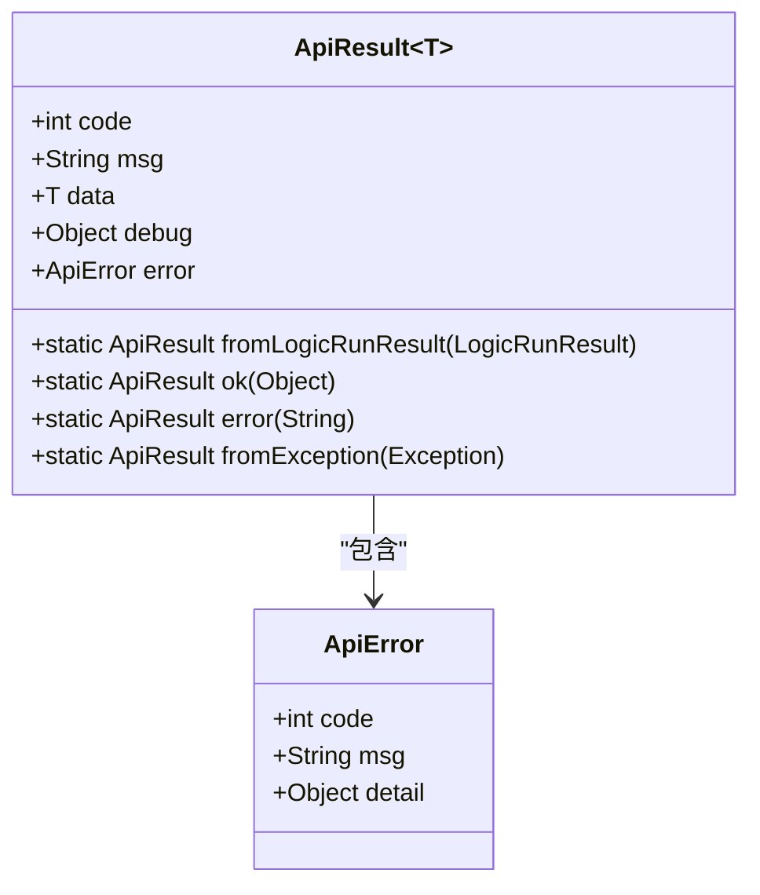

# API参考

<cite>
**本文档中引用的文件**  
- [LogicRuntimeController.java](file://logic-ide/src/main/java/com/aims/logic/ide/controller/LogicRuntimeController.java)
- [ApiResult.java](file://logic-ide/src/main/java/com/aims/logic/ide/controller/dto/ApiResult.java)
- [ApiError.java](file://logic-ide/src/main/java/com/aims/logic/ide/controller/dto/ApiError.java)
- [LogicRunnerService.java](file://logic-runtime/src/main/java/com/aims/logic/runtime/service/LogicRunnerService.java)
- [LogicTreeNode.java](file://logic-runtime/src/main/java/com/aims/logic/runtime/contract/dsl/LogicTreeNode.java)
- [LogicRunResult.java](file://logic-runtime/src/main/java/com/aims/logic/runtime/contract/dto/LogicRunResult.java)
- [LogicLog.java](file://logic-runtime/src/main/java/com/aims/logic/runtime/contract/logger/LogicLog.java)
- [LogicStopModel.java](file://logic-runtime/src/main/java/com/aims/logic/runtime/contract/enums/LogicStopModel.java)
</cite>

## 目录
1. [简介](#简介)
2. [API版本与兼容性](#api版本与兼容性)
3. [标准响应格式](#标准响应格式)
4. [认证与安全](#认证与安全)
5. [端点详情](#端点详情)
6. [客户端实现指南](#客户端实现指南)
7. [开发与测试工具](#开发与测试工具)

## 简介

`logic-solution` 提供了一套RESTful API，用于在运行时动态执行和管理逻辑流程。核心控制器 `LogicRuntimeController` 暴露了多个端点，支持无状态和有状态的逻辑执行、配置获取、环境管理、实例控制和错误恢复。本API文档详细描述了所有可用端点及其使用方法。

**Section sources**
- [LogicRuntimeController.java](file://logic-ide/src/main/java/com/aims/logic/ide/controller/LogicRuntimeController.java#L17-L209)

## API版本与兼容性

### 版本控制策略
所有API端点均通过URL路径进行版本控制，当前版本为 `v1`，路径前缀为 `/api/runtime/logic/v1/`。例如：`/api/runtime/logic/v1/run-api/{id}`。

### 向后兼容性
- **新增功能**：新功能通过添加新的端点或可选参数实现，不会影响现有调用。
- **废弃功能**：在 `LogicRunnerService` 接口中，部分方法（如 `stopBiz`、`runBizByVerifyCode`）已被 `@Deprecated` 标记。这些端点可能存在于旧版本中，但不推荐使用，未来版本将移除。
- **数据结构**：`ApiResult` 和 `ApiError` 的核心字段（`code`, `msg`, `data`, `error`）保证稳定。`debug` 字段为可选调试信息，其内部结构可能随版本变化。
- **行为变更**：重大行为变更（如错误码定义）将伴随主版本号升级（如 v1 -> v2）。

**Section sources**
- [LogicRuntimeController.java](file://logic-ide/src/main/java/com/aims/logic/ide/controller/LogicRuntimeController.java#L17-L209)
- [LogicRunnerService.java](file://logic-runtime/src/main/java/com/aims/logic/runtime/service/LogicRunnerService.java#L12-L287)

## 标准响应格式

所有API响应均封装在 `ApiResult<T>` 类中，确保了统一的响应结构。



**Diagram sources**
- [ApiResult.java](file://logic-ide/src/main/java/com/aims/logic/ide/controller/dto/ApiResult.java#L6-L40)
- [ApiError.java](file://logic-ide/src/main/java/com/aims/logic/ide/controller/dto/ApiError.java#L5-L11)

### 响应字段说明

| 字段 | 类型 | 必填 | 说明 |
| :--- | :--- | :--- | :--- |
| `code` | 整数 | 是 | 响应状态码。`0` 表示成功，非 `0` 表示失败。 |
| `msg` | 字符串 | 是 | 响应消息，描述成功或失败的原因。 |
| `data` | 任意 | 否 | 成功时返回的数据。失败时可能为 `null`。 |
| `debug` | 对象 | 否 | 当请求参数 `debug=true` 时，返回详细的执行日志 `LogicLog`。 |
| `error` | ApiError | 否 | 失败时返回的错误详情对象。 |

### `ApiError` 结构

当 `code` 非零时，`error` 字段会提供更详细的错误信息。

| 字段 | 类型 | 说明 |
| :--- | :--- | :--- |
| `code` | 整数 | 错误码，通常与顶层 `code` 一致。 |
| `msg` | 字符串 | 错误消息，通常为异常的 `cause` 消息。 |
| `detail` | 对象 | 错误的详细信息，通常是异常对象本身。 |

### 成功与失败响应示例

**成功响应示例 (200 OK):**
```json
{
  "code": 0,
  "msg": "操作成功",
  "data": {
    "id": "logic_001",
    "name": "示例逻辑"
  },
  "debug": { /* LogicLog 对象，当 debug=true 时存在 */ }
}
```

**失败响应示例 (500 Internal Server Error):**
```json
{
  "code": 500,
  "msg": "java.lang.NullPointerException",
  "error": {
    "code": 500,
    "msg": "空指针异常",
    "detail": { /* 异常堆栈信息 */ }
  }
}
```

**Section sources**
- [ApiResult.java](file://logic-ide/src/main/java/com/aims/logic/ide/controller/dto/ApiResult.java#L6-L40)
- [ApiError.java](file://logic-ide/src/main/java/com/aims/logic/ide/controller/dto/ApiError.java#L5-L11)

## 认证与安全

当前API设计中未显式包含认证机制（如JWT、API Key）。安全性依赖于以下几点：
1. **网络隔离**：API应部署在受信任的内部网络中，通过防火墙或网关限制外部访问。
2. **环境变量**：敏感配置通过环境变量注入，而非API暴露。
3. **业务逻辑控制**：`runBizByStartCode` 端点使用验证码机制，可作为简单的业务级安全控制。

**Section sources**
- [LogicRuntimeController.java](file://logic-ide/src/main/java/com/aims/logic/ide/controller/LogicRuntimeController.java#L17-L209)

## 端点详情

### 获取逻辑运行时配置

获取指定逻辑ID的完整配置。

- **HTTP方法**: `GET`
- **URL模式**: `/api/runtime/logic/v1/config/{id}`
- **认证**: 无
- **参数**:
  - `id` (路径参数): 逻辑ID。
- **成功响应**:
  - **HTTP状态码**: 200 OK
  - **响应体**: `ApiResult<LogicTreeNode>`
- **错误码**:
  - `500`: 配置读取失败（如文件不存在）。

**Section sources**
- [LogicRuntimeController.java](file://logic-ide/src/main/java/com/aims/logic/ide/controller/LogicRuntimeController.java#L30-L34)

### 无状态执行逻辑 (run-api)

以无状态方式执行指定逻辑，每次调用都是独立的。

- **HTTP方法**: `POST`
- **URL模式**: `/api/runtime/logic/v1/run-api/{id}`
- **认证**: 无
- **参数**:
  - `id` (路径参数): 逻辑ID。
  - `debug` (查询参数, 可选): 布尔值，`true` 时返回 `debug` 字段。
  - `headers` (请求头): 所有请求头将被收集并放入环境变量的 `HEADERS` 字段。
  - `body` (请求体, 可选): 执行逻辑所需的输入参数，JSON格式。
- **成功响应**:
  - **HTTP状态码**: 200 OK
  - **响应体**: `ApiResult`，`data` 字段为逻辑执行结果。
- **错误码**:
  - `500`: 执行过程中发生异常。

**请求示例:**
```http
POST /api/runtime/logic/v1/run-api/logic_001?debug=true
Content-Type: application/json
X-Custom-Header: value

{
  "input": "data"
}
```

**Section sources**
- [LogicRuntimeController.java](file://logic-ide/src/main/java/com/aims/logic/ide/controller/LogicRuntimeController.java#L36-L55)

### 有状态执行逻辑 (run-biz)

以有状态方式执行指定逻辑，维护一个业务实例（`bizId`），可用于长流程或需要状态保持的场景。

- **HTTP方法**: `POST`
- **URL模式**: `/api/runtime/logic/v1/run-biz/{id}/{bizId}`
- **认证**: 无
- **参数**:
  - `id` (路径参数): 逻辑ID。
  - `bizId` (路径参数): 业务实例ID，用于标识和追踪特定的执行实例。
  - `debug` (查询参数, 可选): 布尔值，`true` 时返回 `debug` 字段。
  - `headers` (请求头): 收集到环境变量。
  - `body` (请求体, 可选): 输入参数。
- **成功响应**:
  - **HTTP状态码**: 200 OK
  - **响应体**: `ApiResult`，`data` 字段为逻辑执行结果。
- **错误码**:
  - `500`: 执行过程中发生异常。

**Section sources**
- [LogicRuntimeController.java](file://logic-ide/src/main/java/com/aims/logic/ide/controller/LogicRuntimeController.java#L57-L76)

### 重试失败的业务实例

重新执行一个因异常而停止的业务实例。系统会自动恢复该实例的入参、临时变量和环境变量。

- **HTTP方法**: `POST`
- **URL模式**: `/api/runtime/logic/v1/retry-error-biz/{id}/{bizId}`
- **认证**: 无
- **参数**:
  - `id` (路径参数): 逻辑ID。
  - `bizId` (路径参数): 要重试的业务实例ID。
  - `debug` (查询参数, 可选): 布尔值。
- **成功响应**:
  - **HTTP状态码**: 200 OK
  - **响应体**: `ApiResult`，包含重试执行的结果。
- **错误码**:
  - `500`: 重试失败。

**Section sources**
- [LogicRuntimeController.java](file://logic-ide/src/main/java/com/aims/logic/ide/controller/LogicRuntimeController.java#L106-L115)

### 强制完成业务实例

强制将一个业务实例标记为完成状态。此操作会先调用 `forceStopBiz` 停止实例，然后将其状态置为完成。

- **HTTP方法**: `POST`
- **URL模式**: `/api/runtime/logic/v1/force-complete-biz/{logicId}/{bizId}`
- **认证**: 无
- **参数**:
  - `logicId` (路径参数): 逻辑ID。
  - `bizId` (路径参数): 要强制完成的业务实例ID。
- **成功响应**:
  - **HTTP状态码**: 200 OK
  - **响应体**: `ApiResult`，`data` 字段为受影响的实例数量。
- **错误码**:
  - `500`: 操作失败。

**Section sources**
- [LogicRuntimeController.java](file://logic-ide/src/main/java/com/aims/logic/ide/controller/LogicRuntimeController.java#L117-L124)

### 重置业务实例

将一个业务实例的执行指针重置到指定节点，并更新其局部变量。

- **HTTP方法**: `POST`
- **URL模式**: `/api/runtime/logic/v1/resetBiz/{id}/{bizId}`
- **认证**: 无
- **参数**:
  - `id` (路径参数): 逻辑ID。
  - `bizId` (路径参数): 要重置的业务实例ID。
  - `debug` (查询参数, 可选): 布尔值。
  - `body` (请求体): JSON对象，必须包含 `startNodeId`, `startNodeName`, `varsJson` 字段。
- **成功响应**:
  - **HTTP状态码**: 200 OK
  - **响应体**: `ApiResult`，表示操作成功。
- **错误码**:
  - `500`: 重置失败（如参数缺失）。

**Section sources**
- [LogicRuntimeController.java](file://logic-ide/src/main/java/com/aims/logic/ide/controller/LogicRuntimeController.java#L88-L104)

### 获取运行时环境变量

查看当前加载的环境变量配置。

- **HTTP方法**: `GET`
- **URL模式**: `/api/runtime/env`
- **认证**: 无
- **成功响应**:
  - **HTTP状态码**: 200 OK
  - **响应体**: `ApiResult`，`data` 字段为环境变量的JSON对象。
- **错误码**:
  - `500`: 读取配置文件失败。

**Section sources**
- [LogicRuntimeController.java](file://logic-ide/src/main/java/com/aims/logic/ide/controller/LogicRuntimeController.java#L154-L158)

### 更新运行时环境变量

修改内存中的环境变量。**注意**：此操作不会覆盖配置文件，重启后将从文件重新加载。

- **HTTP方法**: `POST`
- **URL模式**: `/api/runtime/env/set`
- **认证**: 无
- **参数**:
  - `body` (请求体): 包含新环境变量的JSON对象。
- **成功响应**:
  - **HTTP状态码**: 200 OK
  - **响应体**: `ApiResult`，`data` 字段为更新后的完整环境变量。
- **错误码**:
  - `500`: 保存到文件失败。

**Section sources**
- [LogicRuntimeController.java](file://logic-ide/src/main/java/com/aims/logic/ide/controller/LogicRuntimeController.java#L167-L174)

### 获取系统版本

获取 `logic-runtime` 的版本号。

- **HTTP方法**: `GET`
- **URL模式**: `/api/runtime/version`
- **认证**: 无
- **成功响应**:
  - **HTTP状态码**: 200 OK
  - **响应体**: `ApiResult`，`data` 字段为 `{ "version": "x.x.x" }`。
- **错误码**: 无

**Section sources**
- [LogicRuntimeController.java](file://logic-ide/src/main/java/com/aims/logic/ide/controller/LogicRuntimeController.java#L160-L164)

### 清除配置缓存

清除逻辑配置的内存缓存。下次执行时将重新从文件加载。

- **HTTP方法**: `DELETE`
- **URL模式**: `/api/runtime/config/cache/clear`
- **认证**: 无
- **成功响应**:
  - **HTTP状态码**: 200 OK
  - **响应体**: `ApiResult`，表示操作成功。
- **错误码**: 无

**Section sources**
- [LogicRuntimeController.java](file://logic-ide/src/main/java/com/aims/logic/ide/controller/LogicRuntimeController.java#L194-L197)

## 客户端实现指南

### 错误处理策略

1. **检查 `code` 字段**：始终首先检查响应的 `code` 字段。`0` 为成功，非 `0` 为失败。
2. **解析 `error` 对象**：失败时，检查 `error.msg` 获取错误描述，`error.detail` 可用于调试。
3. **重试机制**：对于 `retry-error-biz` 等端点，实现指数退避重试策略。
4. **幂等性**：`run-api` 和 `run-biz` 在相同输入下应产生相同结果，但 `run-biz` 的 `bizId` 应保证唯一性以避免冲突。

### 速率限制

API本身未内置速率限制。客户端应：
- 实施合理的请求频率，避免对服务器造成过大压力。
- 使用 `configCache` 端点获取配置后进行缓存，减少对 `getRuntimeConfig` 的调用。

### 性能优化技巧

1. **使用 `run-api`**：对于短时、无状态的任务，优先使用 `run-api`，避免创建和维护业务实例的开销。
2. **启用 `debug` 参数**：仅在调试时启用 `debug=true`，因为 `LogicLog` 对象可能非常大，影响网络传输和性能。
3. **批量操作**：目前API不支持批量执行。如有需求，可在客户端或通过自定义逻辑实现。
4. **连接池**：使用HTTP客户端连接池（如Apache HttpClient, OkHttp）以提高并发性能。

**Section sources**
- [LogicRuntimeController.java](file://logic-ide/src/main/java/com/aims/logic/ide/controller/LogicRuntimeController.java#L17-L209)
- [LogicRunnerService.java](file://logic-runtime/src/main/java/com/aims/logic/runtime/service/LogicRunnerService.java#L12-L287)

## 开发与测试工具

### 生成API文档

- **Swagger/OpenAPI**: 可通过添加 `springdoc-openapi` 依赖，为 `LogicRuntimeController` 自动生成交互式API文档。
- **手动文档**: 使用此文档作为基础，结合 `readme.md` 中的项目说明进行补充。

### 测试端点

- **Postman / Insomnia**: 手动测试和调试API端点的理想选择。
- **JUnit**: 编写集成测试，使用 `TestRestTemplate` 或 `WebTestClient` 调用API。
- **cURL**: 快速命令行测试。
  ```bash
  curl -X POST http://localhost:8080/api/runtime/logic/v1/run-api/test_logic \
       -H "Content-Type: application/json" \
       -d '{"name": "test"}'
  ```

**Section sources**
- [LogicRuntimeController.java](file://logic-ide/src/main/java/com/aims/logic/ide/controller/LogicRuntimeController.java#L17-L209)