# IDE API

<cite>
**本文档中引用的文件**
- [LogicIdeController.java](file://logic-ide/src/main/java/com/aims/logic/ide/controller/LogicIdeController.java)
- [LogicItemController.java](file://logic-ide/src/main/java/com/aims/logic/ide/controller/LogicItemController.java)
- [LogicLogController.java](file://logic-ide/src/main/java/com/aims/logic/ide/controller/LogicLogController.java)
- [QueryController.java](file://logic-ide/src/main/java/com/aims/logic/ide/controller/QueryController.java)
- [PublishController.java](file://logic-ide/src/main/java/com/aims/logic/ide/controller/PublishController.java)
- [ApiResult.java](file://logic-ide/src/main/java/com/aims/logic/ide/controller/dto/ApiResult.java)
- [ApiError.java](file://logic-ide/src/main/java/com/aims/logic/ide/controller/dto/ApiError.java)
- [DiffRemoteLogicsDto.java](file://logic-ide/src/main/java/com/aims/logic/ide/controller/dto/DiffRemoteLogicsDto.java)
- [ListData.java](file://logic-ide/src/main/java/com/aims/logic/ide/controller/dto/ListData.java)
</cite>

## 目录
1. [简介](#简介)
2. [项目结构](#项目结构)
3. [核心组件](#核心组件)
4. [架构概览](#架构概览)
5. [详细组件分析](#详细组件分析)
6. [依赖分析](#依赖分析)
7. [性能考虑](#性能考虑)
8. [故障排除指南](#故障排除指南)
9. [结论](#结论)

## 简介
本文档详细描述了逻辑IDE服务中暴露的RESTful API接口，涵盖`LogicIdeController`、`LogicItemController`、`LogicLogController`、`QueryController`和`PublishController`五个核心控制器。文档明确了每个端点的HTTP方法、URL路径、请求参数、请求体结构（JSON Schema）、响应格式及可能的错误码。重点说明了流程设计、版本管理、日志查询、发布操作等核心功能的API设计规范。提供了curl调用示例和典型集成场景，如获取逻辑列表、查询节点配置、提交发布请求等。同时包含认证方式、权限控制和分页机制说明。

## 项目结构
逻辑IDE服务采用标准的Spring Boot项目结构，主要包含控制器、DTO、配置和工具类。核心API位于`logic-ide`模块的`controller`包中，通过RESTful接口提供逻辑配置、调试、日志查询和发布功能。

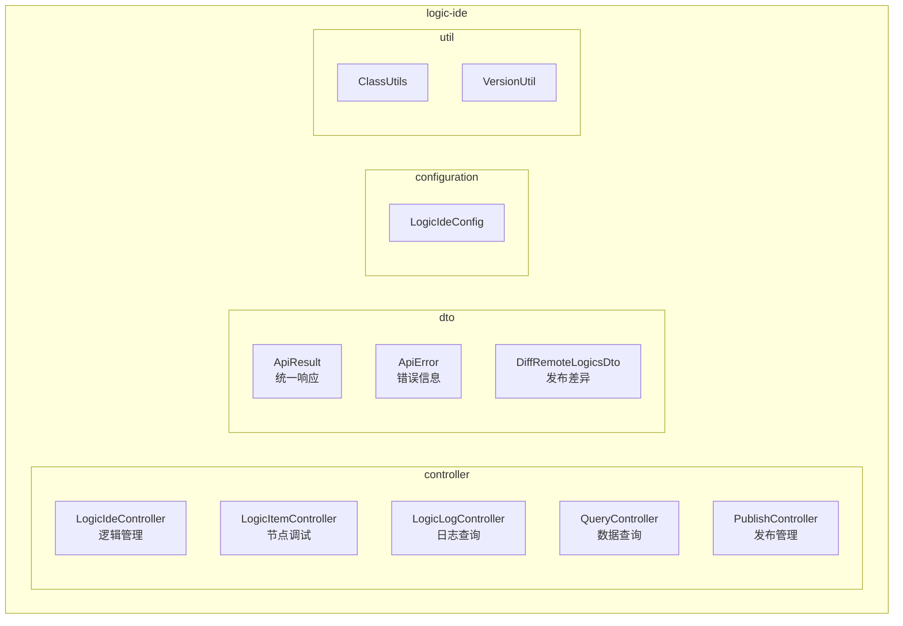

**图示来源**
- [LogicIdeController.java](file://logic-ide/src/main/java/com/aims/logic/ide/controller/LogicIdeController.java)
- [LogicItemController.java](file://logic-ide/src/main/java/com/aims/logic/ide/controller/LogicItemController.java)
- [LogicLogController.java](file://logic-ide/src/main/java/com/aims/logic/ide/controller/LogicLogController.java)
- [QueryController.java](file://logic-ide/src/main/java/com/aims/logic/ide/controller/QueryController.java)
- [PublishController.java](file://logic-ide/src/main/java/com/aims/logic/ide/controller/PublishController.java)

**本节来源**
- [LogicIdeController.java](file://logic-ide/src/main/java/com/aims/logic/ide/controller/LogicIdeController.java#L1-L50)
- [project_structure](file://#L1-L200)

## 核心组件
核心组件包括五个主要控制器，分别负责逻辑管理、节点调试、日志查询、数据查询和发布管理。所有API均返回统一的`ApiResult`格式，包含code、msg、data和debug字段，便于前端处理。

**本节来源**
- [LogicIdeController.java](file://logic-ide/src/main/java/com/aims/logic/ide/controller/LogicIdeController.java#L25-L100)
- [ApiResult.java](file://logic-ide/src/main/java/com/aims/logic/ide/controller/dto/ApiResult.java#L1-L42)

## 架构概览
系统采用分层架构，前端通过REST API与IDE服务交互，IDE服务调用底层SDK服务进行数据持久化和业务逻辑处理。发布功能通过HTTP请求将配置推送到远程运行时环境。

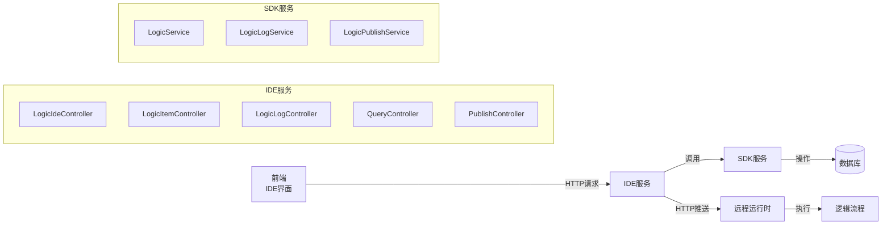

**图示来源**
- [LogicIdeController.java](file://logic-ide/src/main/java/com/aims/logic/ide/controller/LogicIdeController.java#L1-L20)
- [LogicLogController.java](file://logic-ide/src/main/java/com/aims/logic/ide/controller/LogicLogController.java#L1-L15)
- [PublishController.java](file://logic-ide/src/main/java/com/aims/logic/ide/controller/PublishController.java#L1-L15)

## 详细组件分析
对每个核心控制器进行详细分析，包括接口定义、参数说明和使用示例。

### LogicIdeController 分析
负责逻辑流程的增删改查、版本管理和类信息查询。

#### 逻辑管理接口
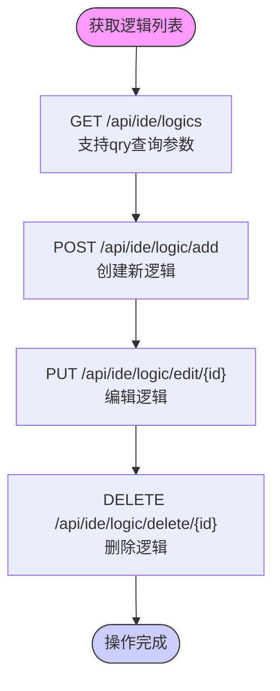

**图示来源**
- [LogicIdeController.java](file://logic-ide/src/main/java/com/aims/logic/ide/controller/LogicIdeController.java#L50-L150)

#### 版本与配置查询
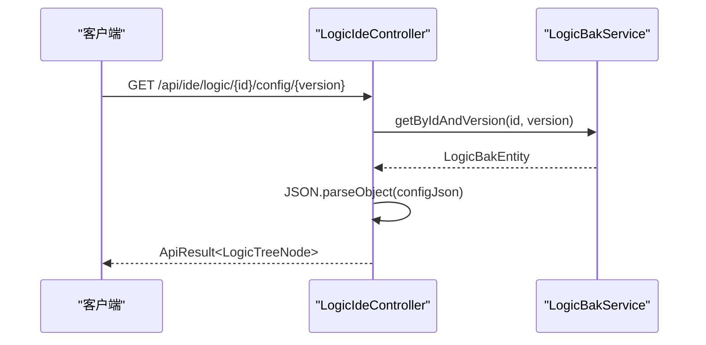

**图示来源**
- [LogicIdeController.java](file://logic-ide/src/main/java/com/aims/logic/ide/controller/LogicIdeController.java#L120-L140)
- [LogicBakService.java](file://logic-sdk/src/main/java/com/aims/logic/sdk/service/LogicBakService.java#L1-L10)

#### Java类与方法查询
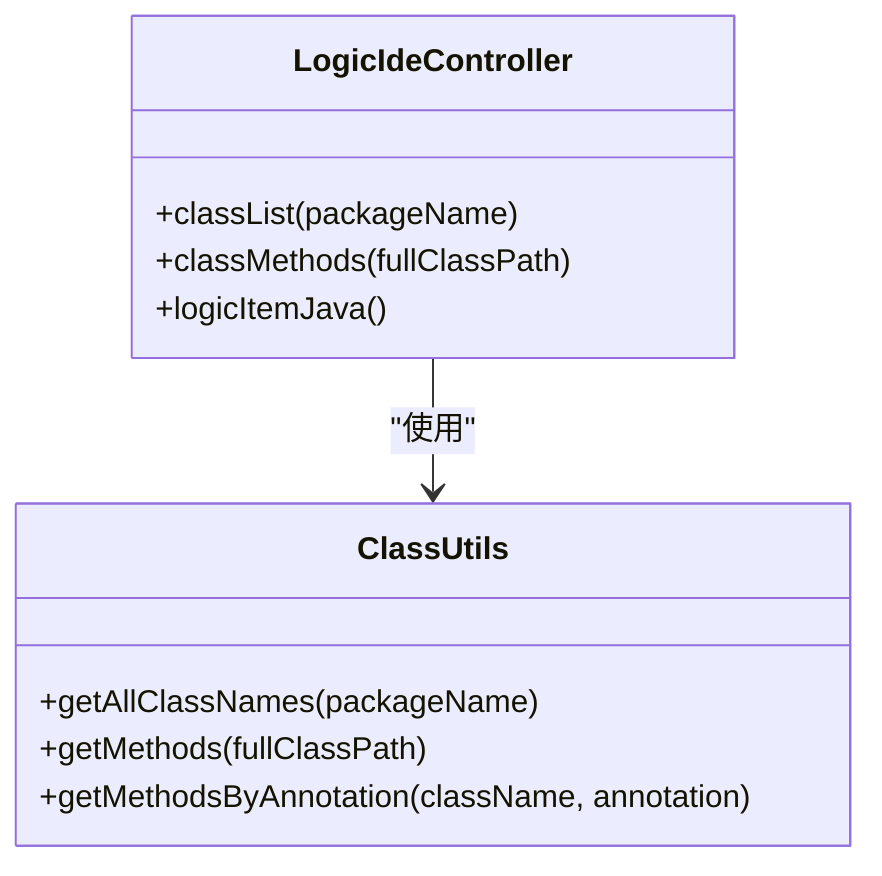

**图示来源**
- [LogicIdeController.java](file://logic-ide/src/main/java/com/aims/logic/ide/controller/LogicIdeController.java#L180-L250)
- [ClassUtils.java](file://logic-ide/src/main/java/com/aims/logic/ide/util/ClassUtils.java#L1-L10)

**本节来源**
- [LogicIdeController.java](file://logic-ide/src/main/java/com/aims/logic/ide/controller/LogicIdeController.java#L1-L392)

### LogicItemController 分析
提供单个逻辑节点的调试功能。

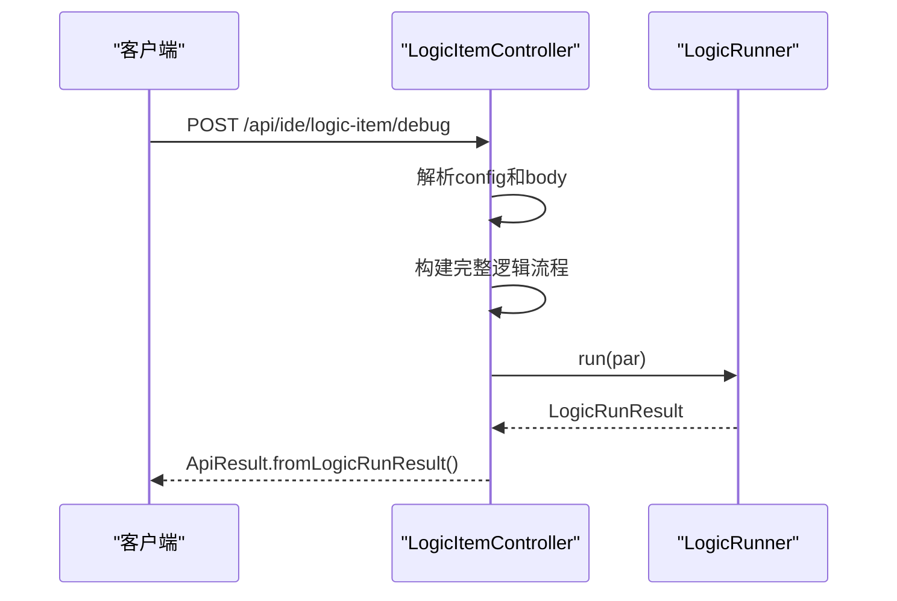

**图示来源**
- [LogicItemController.java](file://logic-ide/src/main/java/com/aims/logic/ide/controller/LogicItemController.java#L1-L46)

**本节来源**
- [LogicItemController.java](file://logic-ide/src/main/java/com/aims/logic/ide/controller/LogicItemController.java#L1-L46)

### LogicLogController 分析
提供逻辑执行日志的查询和管理功能。

#### 日志查询接口
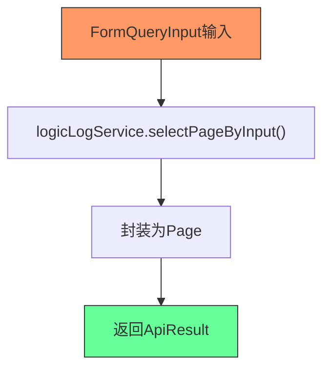

**图示来源**
- [LogicLogController.java](file://logic-ide/src/main/java/com/aims/logic/ide/controller/LogicLogController.java#L20-L30)

#### 日志管理操作
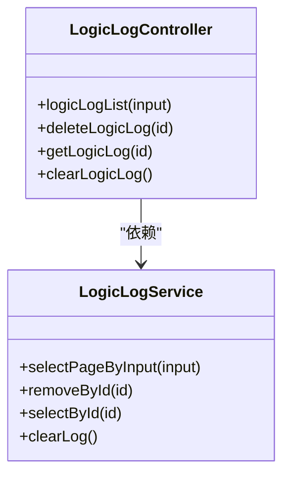

**图示来源**
- [LogicLogController.java](file://logic-ide/src/main/java/com/aims/logic/ide/controller/LogicLogController.java#L1-L45)
- [LogicLogService.java](file://logic-sdk/src/main/java/com/aims/logic/sdk/service/LogicLogService.java#L1-L10)

**本节来源**
- [LogicLogController.java](file://logic-ide/src/main/java/com/aims/logic/ide/controller/LogicLogController.java#L1-L45)

### QueryController 分析
提供基于数据模型的通用查询功能。

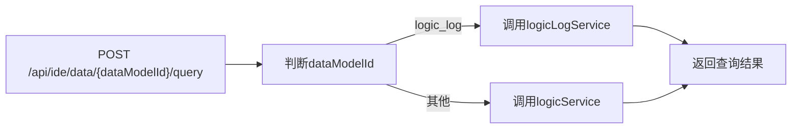

**图示来源**
- [QueryController.java](file://logic-ide/src/main/java/com/aims/logic/ide/controller/QueryController.java#L1-L45)

**本节来源**
- [QueryController.java](file://logic-ide/src/main/java/com/aims/logic/ide/controller/QueryController.java#L1-L45)

### PublishController 分析
负责逻辑配置的发布和版本对比功能。

#### 发布操作流程
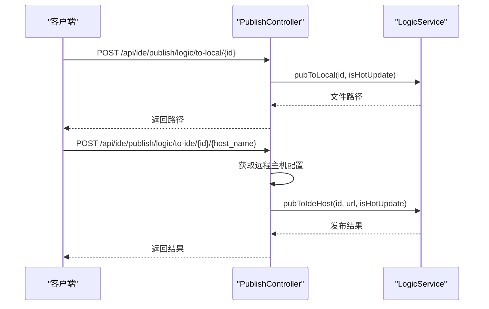

**图示来源**
- [PublishController.java](file://logic-ide/src/main/java/com/aims/logic/ide/controller/PublishController.java#L20-L50)

#### 版本差异对比
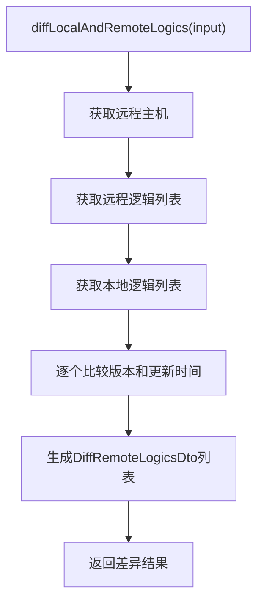

**图示来源**
- [PublishController.java](file://logic-ide/src/main/java/com/aims/logic/ide/controller/PublishController.java#L60-L95)
- [DiffRemoteLogicsDto.java](file://logic-ide/src/main/java/com/aims/logic/ide/controller/dto/DiffRemoteLogicsDto.java#L1-L20)

**本节来源**
- [PublishController.java](file://logic-ide/src/main/java/com/aims/logic/ide/controller/PublishController.java#L1-L95)

## 依赖分析
各控制器通过依赖注入使用SDK提供的服务，实现业务逻辑与数据访问的分离。

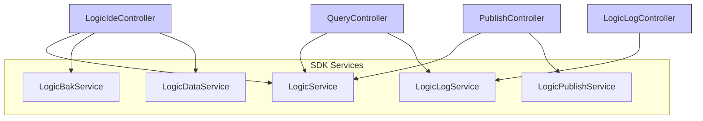

**图示来源**
- [LogicIdeController.java](file://logic-ide/src/main/java/com/aims/logic/ide/controller/LogicIdeController.java#L20-L40)
- [LogicLogController.java](file://logic-ide/src/main/java/com/aims/logic/ide/controller/LogicLogController.java#L10-L15)
- [QueryController.java](file://logic-ide/src/main/java/com/aims/logic/ide/controller/QueryController.java#L10-L15)
- [PublishController.java](file://logic-ide/src/main/java/com/aims/logic/ide/controller/PublishController.java#L10-L15)

**本节来源**
- [LogicIdeController.java](file://logic-ide/src/main/java/com/aims/logic/ide/controller/LogicIdeController.java#L1-L50)
- [LogicLogController.java](file://logic-ide/src/main/java/com/aims/logic/ide/controller/LogicLogController.java#L1-L20)
- [QueryController.java](file://logic-ide/src/main/java/com/aims/logic/ide/controller/QueryController.java#L1-L20)
- [PublishController.java](file://logic-ide/src/main/java/com/aims/logic/ide/controller/PublishController.java#L1-L20)

## 性能考虑
- 所有列表查询接口均支持分页，避免大数据量查询导致性能问题
- 类信息查询使用缓存机制，减少重复扫描
- 发布操作采用异步处理，避免阻塞主线程
- 日志查询支持条件过滤，提高查询效率

## 故障排除指南
常见问题及解决方案：

1. **发布失败**: 检查远程主机配置是否正确，网络是否通畅
2. **类信息无法加载**: 确认`scan-package-names`配置是否包含目标包路径
3. **版本对比异常**: 验证本地和远程环境的时钟同步情况
4. **调试无响应**: 检查逻辑配置是否完整，节点连接是否正确

**本节来源**
- [LogicIdeController.java](file://logic-ide/src/main/java/com/aims/logic/ide/controller/LogicIdeController.java#L300-L350)
- [PublishController.java](file://logic-ide/src/main/java/com/aims/logic/ide/controller/PublishController.java#L80-L90)

## 结论
本文档全面介绍了逻辑IDE服务的API设计，涵盖了从逻辑管理到发布部署的完整生命周期。通过统一的响应格式和清晰的接口设计，为前端集成提供了便利。系统采用模块化设计，各组件职责明确，便于维护和扩展。