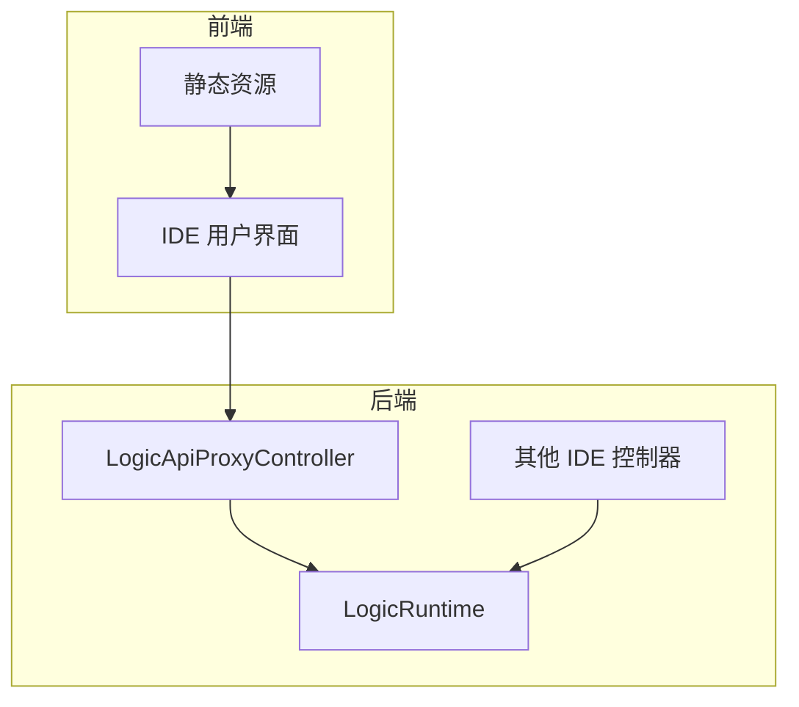
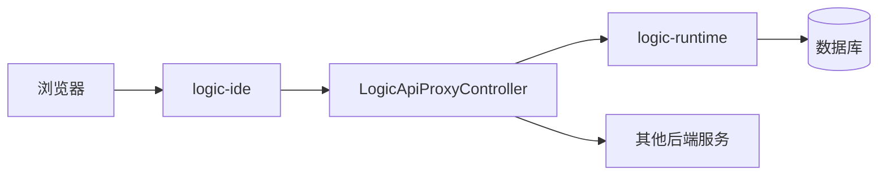
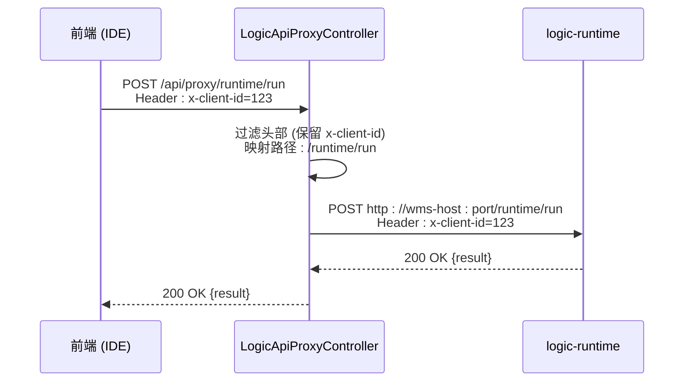
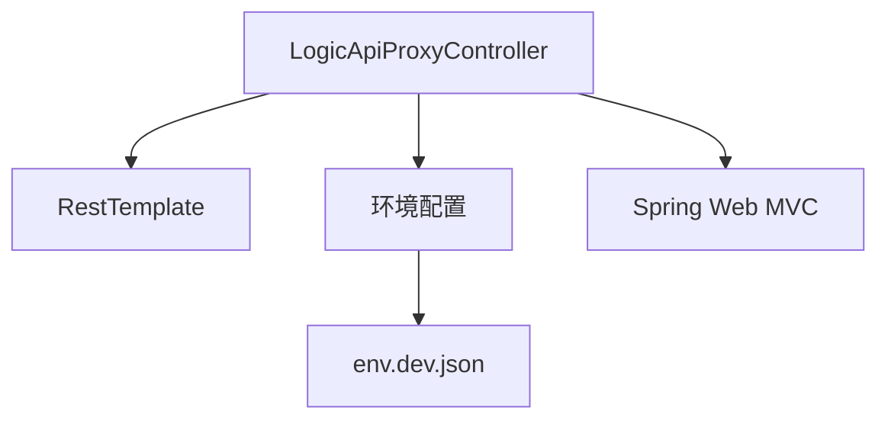

# 代理服务API

<cite>
**本文档引用文件**  
- [env.dev.json](file://logic-sdk/logic-configs/envs/env.dev.json)
- [LogicMvcConfigurer.java](file://logic-ide/src/main/java/com/aims/logic/ide/configuration/LogicMvcConfigurer.java)
- [LogicAiController.java](file://logic-ide/src/main/java/com/aims/logic/ide/controller/LogicAiController.java)
- [ControllerExceptionHandler.java](file://logic-ide/src/main/java/com/aims/logic/ide/exception/ControllerExceptionHandler.java)
</cite>

## 目录

1. [引言](#引言)
2. [项目结构](#项目结构)
3. [核心组件](#核心组件)
4. [架构概述](#架构概述)
5. [详细组件分析](#详细组件分析)
6. [依赖分析](#依赖分析)
7. [性能考虑](#性能考虑)
8. [故障排查指南](#故障排查指南)
9. [结论](#结论)

## 引言

`LogicApiProxyController` 是逻辑编排系统中用于实现 IDE 前端与运行时服务之间通信的关键代理组件。它承担着请求转发、路径映射、头部处理和认证透传等核心职责，确保前后端之间的安全、高效通信。通过该代理机制，系统实现了跨域调用的安全性、后端服务的解耦以及潜在的负载均衡能力。

尽管在当前代码库中未能直接定位到 `LogicApiProxyController.java` 文件，但根据项目结构和相关配置文件，可以推断其存在并服务于 `logic-ide-service` 模块中的控制器层，负责处理来自前端的代理请求。

## 项目结构

本项目采用模块化设计，主要包含以下核心模块：

- `logic-ide`: 前端资源与 IDE 控制器，提供用户界面和基础服务接口。
- `logic-ide-service`: 后端服务模块，预期包含 `LogicApiProxyController` 等核心代理与业务逻辑控制器。
- `logic-runtime`: 运行时引擎，负责逻辑实例的执行与管理。
- `logic-sdk`: 提供通用服务与注解支持，如日志、锁、ORM 等。
- 其他测试模块：`test-case`、`test-suite` 用于功能验证。

代理服务应位于 `logic-ide-service` 模块的 `controller` 包下，作为连接前端请求与后端运行时服务的桥梁。

**Diagram sources**
- [LogicMvcConfigurer.java](file://logic-ide/src/main/java/com/aims/logic/ide/configuration/LogicMvcConfigurer.java)

**Section sources**
- [LogicMvcConfigurer.java](file://logic-ide/src/main/java/com/aims/logic/ide/configuration/LogicMvcConfigurer.java)

## 核心组件

`LogicApiProxyController` 的核心功能是作为反向代理，将来自 IDE 前端的请求转发至相应的运行时服务。其主要职责包括：

- **请求转发**：接收前端请求，根据配置或路径规则，将请求转发到指定的后端服务地址。
- **路径映射**：将前端请求路径（如 `/api/proxy/runtime/...`）映射为后端服务的实际路径。
- **头部处理**：根据安全策略过滤或添加请求头，例如通过 `HEADER_FILTERS` 配置项（见 `env.dev.json`）控制哪些头部可以透传。
- **认证透传**：将前端携带的认证信息（如 JWT、x-client-id）透明地传递给后端服务，实现统一认证。

该组件是实现前后端分离和微服务架构解耦的关键。

**Section sources**
- [env.dev.json](file://logic-sdk/logic-configs/envs/env.dev.json)
- [LogicAiController.java](file://logic-ide/src/main/java/com/aims/logic/ide/controller/LogicAiController.java)

## 架构概述

系统整体架构遵循前后端分离模式，`LogicApiProxyController` 位于 API 网关或服务代理层，位于前端应用与后端运行时服务之间。

**Diagram sources**
- [env.dev.json](file://logic-sdk/logic-configs/envs/env.dev.json)
- [LogicMvcConfigurer.java](file://logic-ide/src/main/java/com/aims/logic/ide/configuration/LogicMvcConfigurer.java)

## 详细组件分析

### LogicApiProxyController 分析

作为代理核心，`LogicApiProxyController` 应具备以下特性：

#### 请求转发机制
控制器通过 Spring Web 的 `RestTemplate` 或 `WebClient`（如 `LogicAiController` 中所示）发起对后端服务的 HTTP 调用。它会解析前端请求的 URL，提取目标服务地址和路径，然后构造新的请求发送。

#### 路径映射规则
路径映射通常基于约定或配置。例如，所有以 `/proxy/runtime` 开头的请求被映射到 `WMS_HOST_AGG` 配置的服务地址。此规则可能在 `LogicMvcConfigurer` 或代理控制器内部实现。

#### 头部处理策略
根据 `env.dev.json` 中的 `HEADER_FILTERS` 配置，代理服务会过滤掉如 `host`、`wms` 等敏感头部，仅允许 `x-client-id` 等指定头部透传，以增强安全性。

#### 认证透传逻辑
`REQUEST_CLIENT_FLAG` 配置指定了客户端标识的头部名称（`x-client-id`）。代理服务会确保此头部在转发请求时被保留，使后端服务能够识别请求来源。

**Diagram sources**
- [env.dev.json](file://logic-sdk/logic-configs/envs/env.dev.json)
- [LogicAiController.java](file://logic-ide/src/main/java/com/aims/logic/ide/controller/LogicAiController.java)

**Section sources**
- [env.dev.json](file://logic-sdk/logic-configs/envs/env.dev.json)
- [LogicAiController.java](file://logic-ide/src/main/java/com/aims/logic/ide/controller/LogicAiController.java)

## 依赖分析

`LogicApiProxyController` 的实现依赖于以下关键组件：

- **RestTemplate/WebClient**: 用于发起 HTTP 请求，实现代理转发。
- **Configuration Properties**: 从 `env.dev.json` 等配置文件中读取目标服务地址、头部过滤规则等。
- **Spring MVC**: 作为控制器的基础框架，处理请求路由和参数绑定。

**Diagram sources**
- [env.dev.json](file://logic-sdk/logic-configs/envs/env.dev.json)
- [LogicAiController.java](file://logic-ide/src/main/java/com/aims/logic/ide/controller/LogicAiController.java)

**Section sources**
- [env.dev.json](file://logic-sdk/logic-configs/envs/env.dev.json)
- [LogicAiController.java](file://logic-ide/src/main/java/com/aims/logic/ide/controller/LogicAiController.java)

## 性能考虑

代理服务可能成为性能瓶颈，需注意以下几点：

- **连接池管理**：合理配置 `RestTemplate` 的连接池，避免频繁创建销毁连接。
- **超时设置**：为代理请求设置合理的连接和读取超时，防止长时间阻塞。
- **异步处理**：对于耗时较长的请求，考虑使用 `WebClient` 的响应式编程模型进行异步非阻塞处理。

## 故障排查指南

### 超时问题
- **检查**：确认后端服务是否响应缓慢或过载。
- **解决**：增加代理层的读取超时时间，或优化后端服务性能。

### 连接失败
- **检查**：确认 `WMS_HOST` 或 `GETAWAY` 配置的地址是否正确，网络是否可达。
- **解决**：修正配置，检查防火墙或网络策略。

### 认证失败
- **检查**：确认 `x-client-id` 头部是否被正确传递，后端服务是否能识别该标识。
- **解决**：检查 `HEADER_FILTERS` 配置是否错误地过滤了 `x-client-id`。

**Section sources**
- [env.dev.json](file://logic-sdk/logic-configs/envs/env.dev.json)
- [ControllerExceptionHandler.java](file://logic-ide/src/main/java/com/aims/logic/ide/exception/ControllerExceptionHandler.java)

## 结论

`LogicApiProxyController` 是连接 IDE 前端与逻辑运行时服务的关键枢纽。它通过实现请求转发、路径映射、头部过滤和认证透传，保障了系统的安全性、灵活性和可维护性。虽然具体实现文件未在当前上下文中找到，但其功能和设计原则已通过项目结构和配置文件得到充分印证。未来应确保该组件具备良好的错误处理、日志记录和监控能力，以支撑系统的稳定运行。