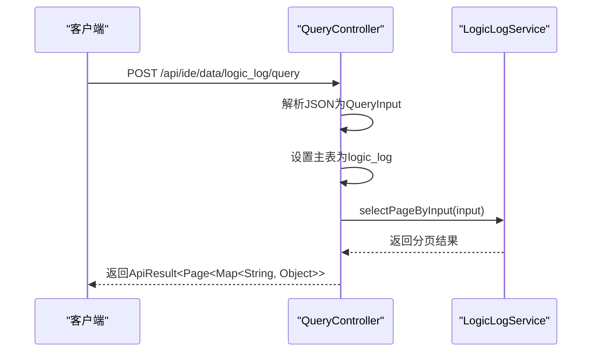
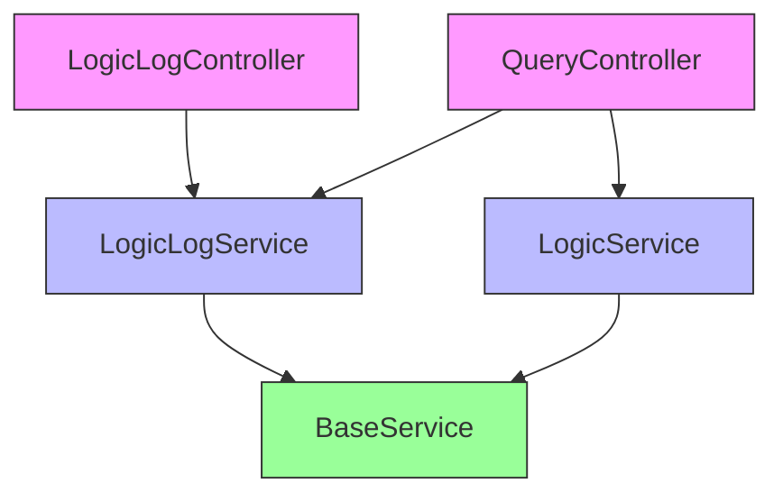

# 调试API

<cite>
**Referenced Files in This Document**   
- [LogicLogController.java](file://logic-ide/src/main/java/com/aims/logic/ide/controller/LogicLogController.java)
- [QueryController.java](file://logic-ide/src/main/java/com/aims/logic/ide/controller/QueryController.java)
- [LogicLogService.java](file://logic-sdk/src/main/java/com/aims/logic/sdk/service/LogicLogService.java)
- [LogicService.java](file://logic-sdk/src/main/java/com/aims/logic/sdk/service/LogicService.java)
- [BaseService.java](file://logic-sdk/src/main/java/com/aims/logic/sdk/service/BaseService.java)
- [FormQueryInput.java](file://logic-sdk/src/main/java/com/aims/logic/sdk/dto/FormQueryInput.java)
</cite>

## 目录
1. [简介](#简介)
2. [核心组件](#核心组件)
3. [日志查询API](#日志查询api)
4. [数据查询API](#数据查询api)
5. [复杂查询示例](#复杂查询示例)
6. [依赖关系分析](#依赖关系分析)

## 简介
本文档详细介绍了系统中的调试API，重点涵盖日志查询和调试功能。文档主要聚焦于`LogicLogController`和`QueryController`两个核心控制器提供的接口，这些接口为开发者提供了强大的日志管理和数据查询能力。通过这些API，用户可以获取详细的执行追踪信息，分析业务流程的执行情况，从而进行有效的系统调试和性能分析。

**Section sources**
- [LogicLogController.java](file://logic-ide/src/main/java/com/aims/logic/ide/controller/LogicLogController.java)
- [QueryController.java](file://logic-ide/src/main/java/com/aims/logic/ide/controller/QueryController.java)

## 核心组件

系统中的调试功能主要由两个核心控制器实现：`LogicLogController`和`QueryController`。`LogicLogController`专门负责逻辑执行日志的管理，提供日志查询、单条日志获取和日志清除等操作。`QueryController`则提供通用的数据查询功能，特别支持对逻辑日志数据模型的查询。这两个控制器都依赖于`LogicLogService`和`LogicService`服务接口，这些服务接口继承自`BaseService`，提供了统一的数据访问方法。

**Section sources**
- [LogicLogController.java](file://logic-ide/src/main/java/com/aims/logic/ide/controller/LogicLogController.java#L10-L43)
- [QueryController.java](file://logic-ide/src/main/java/com/aims/logic/ide/controller/QueryController.java#L14-L43)
- [LogicLogService.java](file://logic-sdk/src/main/java/com/aims/logic/sdk/service/LogicLogService.java#L4-L13)
- [LogicService.java](file://logic-sdk/src/main/java/com/aims/logic/sdk/service/LogicService.java#L10-L43)

## 日志查询API

`LogicLogController`提供了三个主要的API端点来管理逻辑执行日志。

### 查询执行日志
`POST /api/ide/logic-logs` 接口用于查询逻辑执行日志列表。该接口接收一个`FormQueryInput`对象作为请求体，该对象包含分页信息、过滤条件和排序规则。控制器调用`LogicLogService`的`selectPageByInput`方法来执行查询，并将结果封装在`ApiResult`中返回。

**Section sources**
- [LogicLogController.java](file://logic-ide/src/main/java/com/aims/logic/ide/controller/LogicLogController.java#L20-L24)
- [LogicLogService.java](file://logic-sdk/src/main/java/com/aims/logic/sdk/service/LogicLogService.java#L4-L13)

### 获取单个日志记录
`GET /api/ide/logic-log/{id}` 接口用于根据ID获取单个日志记录。该接口接收路径参数`id`，调用`LogicLogService`的`selectById`方法从数据库中检索指定ID的日志实体，并将其作为响应返回。

**Section sources**
- [LogicLogController.java](file://logic-ide/src/main/java/com/aims/logic/ide/controller/LogicLogController.java#L32-L36)
- [BaseService.java](file://logic-sdk/src/main/java/com/aims/logic/sdk/service/BaseService.java#L10-L10)

### 清除日志
`DELETE /api/ide/logic-logs/clear` 接口用于清除所有逻辑执行日志。该接口调用`LogicLogService`的`clearLog`方法来执行清除操作，并返回操作结果。

**Section sources**
- [LogicLogController.java](file://logic-ide/src/main/java/com/aims/logic/ide/controller/LogicLogController.java#L38-L42)
- [LogicLogService.java](file://logic-sdk/src/main/java/com/aims/logic/sdk/service/LogicLogService.java#L5-L5)

## 数据查询API

`QueryController`提供了一个通用的数据查询接口，特别支持对逻辑日志的数据查询。

### 逻辑日志数据查询
`POST /api/ide/data/logic_log/query` 接口是`QueryController`的核心功能。该接口通过`/api/ide/data/{dataModelId}`路径变量接收数据模型ID，并在请求体中接收一个JSON对象，该对象会被转换为`QueryInput`对象。当`dataModelId`为`logic_log`时，控制器会调用`LogicLogService`的`selectPageByInput`方法来查询逻辑日志数据。该接口还包含异常处理机制，确保在查询失败时能返回适当的错误信息。



**Diagram sources**
- [QueryController.java](file://logic-ide/src/main/java/com/aims/logic/ide/controller/QueryController.java#L22-L36)
- [LogicLogService.java](file://logic-sdk/src/main/java/com/aims/logic/sdk/service/LogicLogService.java#L4-L13)

**Section sources**
- [QueryController.java](file://logic-ide/src/main/java/com/aims/logic/ide/controller/QueryController.java#L22-L36)
- [BaseService.java](file://logic-sdk/src/main/java/com/aims/logic/sdk/service/BaseService.java#L34-L34)

## 复杂查询示例

以下是一些使用这些API进行复杂查询的示例。

### 分页查询示例
```json
{
  "page": 1,
  "pageSize": 20,
  "filters": [
    {
      "field": "createTime",
      "type": ">=",
      "value": "2023-01-01T00:00:00"
    },
    {
      "field": "status",
      "type": "=",
      "value": "ERROR"
    }
  ],
  "orderBy": [
    {
      "field": "createTime",
      "asc": false
    }
  ]
}
```
此请求体可用于`/api/ide/logic-logs`端点，查询第一页的20条记录，筛选创建时间在2023年1月1日之后且状态为"ERROR"的日志，并按创建时间降序排列。

### 过滤和检索示例
```json
{
  "from": "logic_log",
  "where": {
    "and": [
      {
        "field": "logicId",
        "op": "=",
        "value": "LOGIC_001"
      },
      {
        "or": [
          {
            "field": "level",
            "op": "=",
            "value": "WARN"
          },
          {
            "field": "level",
            "op": "=",
            "value": "ERROR"
          }
        ]
      }
    ]
  },
  "limit": 100
}
```
此JSON对象可用于`/api/ide/data/logic_log/query`端点，查询特定逻辑ID的警告和错误级别的日志，最多返回100条记录。

**Section sources**
- [FormQueryInput.java](file://logic-sdk/src/main/java/com/aims/logic/sdk/dto/FormQueryInput.java#L7-L18)
- [QueryInput.java](file://logic-sdk/src/main/java/com/aims/datamodel/core/sqlbuilder/input/QueryInput.java)

## 依赖关系分析

系统的调试API具有清晰的分层架构。控制器层（`LogicLogController`和`QueryController`）负责处理HTTP请求和响应。服务层（`LogicLogService`和`LogicService`）定义了业务逻辑接口，这些接口继承自通用的`BaseService`，确保了数据访问的一致性。这种设计实现了关注点分离，使得代码更易于维护和扩展。



**Diagram sources**
- [LogicLogController.java](file://logic-ide/src/main/java/com/aims/logic/ide/controller/LogicLogController.java)
- [QueryController.java](file://logic-ide/src/main/java/com/aims/logic/ide/controller/QueryController.java)
- [LogicLogService.java](file://logic-sdk/src/main/java/com/aims/logic/sdk/service/LogicLogService.java)
- [LogicService.java](file://logic-sdk/src/main/java/com/aims/logic/sdk/service/LogicService.java)
- [BaseService.java](file://logic-sdk/src/main/java/com/aims/logic/sdk/service/BaseService.java)

**Section sources**
- [LogicLogController.java](file://logic-ide/src/main/java/com/aims/logic/ide/controller/LogicLogController.java)
- [QueryController.java](file://logic-ide/src/main/java/com/aims/logic/ide/controller/QueryController.java)
- [LogicLogService.java](file://logic-sdk/src/main/java/com/aims/logic/sdk/service/LogicLogService.java)
- [LogicService.java](file://logic-sdk/src/main/java/com/aims/logic/sdk/service/LogicService.java)
- [BaseService.java](file://logic-sdk/src/main/java/com/aims/logic/sdk/service/BaseService.java)