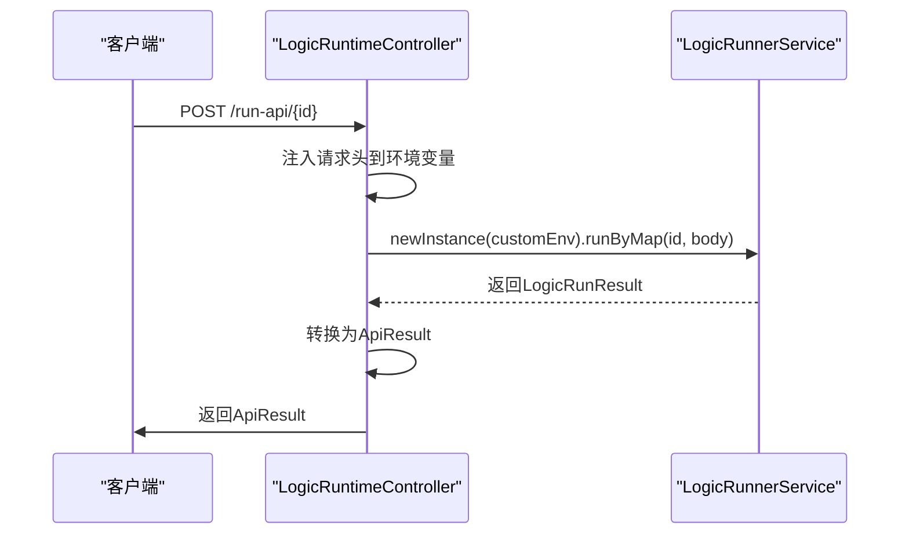
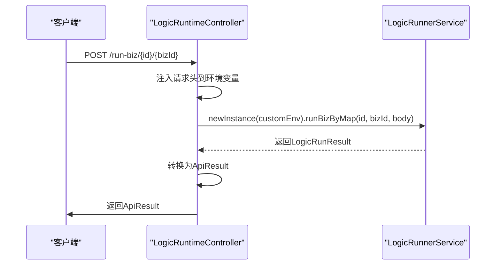
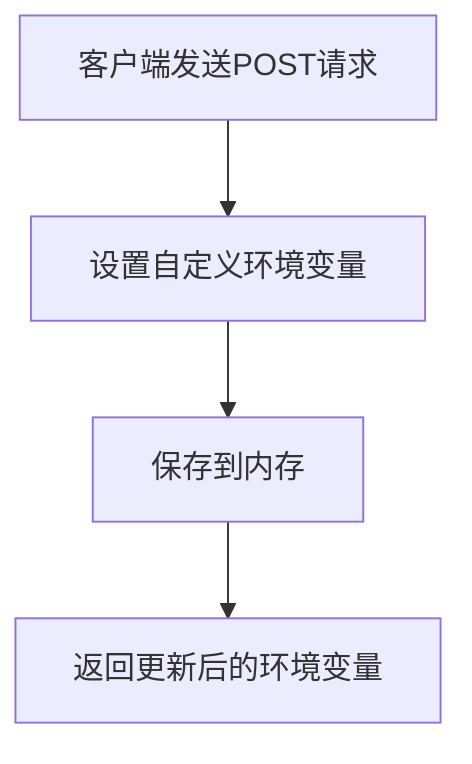

# 运行时API

<cite>
**本文档中引用的文件**  
- [LogicRuntimeController.java](file://logic-ide/src/main/java/com/aims/logic/ide/controller/LogicRuntimeController.java)
- [ApiResult.java](file://logic-ide/src/main/java/com/aims/logic/ide/controller/dto/ApiResult.java)
- [LogicRunnerService.java](file://logic-runtime/src/main/java/com/aims/logic/runtime/service/LogicRunnerService.java)
- [RuntimeUtil.java](file://logic-runtime/src/main/java/com/aims/logic/runtime/util/RuntimeUtil.java)
- [BizLock.java](file://logic-sdk/src/main/java/com/aims/logic/sdk/util/lock/BizLock.java)
- [LogicRunResult.java](file://logic-runtime/src/main/java/com/aims/logic/runtime/contract/dto/LogicRunResult.java)
- [LogicTreeNode.java](file://logic-runtime/src/main/java/com/aims/logic/runtime/contract/dsl/LogicTreeNode.java)
</cite>

## 目录
1. [简介](#简介)
2. [核心执行接口](#核心执行接口)
   - [/run-api/{id}](#run-apiid)
   - [/run-biz/{id}/{bizId}](#run-bizidbizid)
   - [/biz/{id}/{startCode}/{bizId}](#bizidstartcodebizid)
3. [业务管理接口](#业务管理接口)
   - [重试失败业务](#重试失败业务)
   - [强制完成长时间运行的业务](#强制完成长时间运行的业务)
   - [重试超时运行的业务](#重试超时运行的业务)
   - [重置业务执行节点](#重置业务执行节点)
4. [环境与配置管理](#环境与配置管理)
   - [环境变量设置](#环境变量设置)
   - [配置缓存管理](#配置缓存管理)
5. [系统信息与调试](#系统信息与调试)
   - [获取运行时版本](#获取运行时版本)
   - [查看锁信息](#查看锁信息)
   - [停止业务执行](#停止业务执行)
6. [性能考虑与最佳实践](#性能考虑与最佳实践)

## 简介

运行时API提供了对逻辑执行引擎的全面控制能力，允许外部系统通过RESTful接口触发、管理和监控逻辑执行。本API由`LogicRuntimeController`类提供，封装了`LogicRunnerService`的核心功能，支持无状态和有状态的逻辑执行模式。

该API设计用于生产环境中的自动化集成，支持调试模式、环境变量注入、配置热更新等高级功能。所有接口均返回统一的`ApiResult`结构，便于客户端解析和处理。

**Section sources**
- [LogicRuntimeController.java](file://logic-ide/src/main/java/com/aims/logic/ide/controller/LogicRuntimeController.java#L1-L20)

## 核心执行接口

### /run-api/{id}

此端点用于无状态地执行指定ID的逻辑，适用于一次性任务或无需持久化执行上下文的场景。

- **HTTP方法**: POST
- **URL路径**: `/api/runtime/logic/v1/run-api/{id}`
- **请求参数**:
  - `id` (路径参数): 逻辑编号
  - `debug` (查询参数, 可选): 是否启用调试模式，默认为`false`
- **请求头**: 所有请求头将被自动注入到`HEADERS`环境变量中
- **请求体结构**: JSON对象，作为逻辑执行的输入参数
- **响应格式**: `ApiResult`对象
- **错误码**:
  - `500`: 执行异常，详细信息在`error`字段中

当`debug=true`时，响应中会包含完整的执行日志（`debug`字段），可用于问题排查。



**Diagram sources**
- [LogicRuntimeController.java](file://logic-ide/src/main/java/com/aims/logic/ide/controller/LogicRuntimeController.java#L33-L49)
- [LogicRunnerService.java](file://logic-runtime/src/main/java/com/aims/logic/runtime/service/LogicRunnerService.java#L84-L86)

### /run-biz/{id}/{bizId}

此端点用于有状态地执行指定ID的逻辑实例，适用于需要维护业务上下文的长期运行任务。

- **HTTP方法**: POST
- **URL路径**: `/api/runtime/logic/v1/run-biz/{id}/{bizId}`
- **请求参数**:
  - `id` (路径参数): 逻辑编号
  - `bizId` (路径参数): 业务实例编号
  - `debug` (查询参数, 可选): 是否启用调试模式，默认为`false`
- **请求头**: 所有请求头将被自动注入到`HEADERS`环境变量中
- **请求体结构**: JSON对象，作为逻辑执行的输入参数
- **响应格式**: `ApiResult`对象
- **错误码**:
  - `500`: 执行异常

与`/run-api`不同，此接口维护业务实例的状态，允许后续操作如重试、重置等。



**Diagram sources**
- [LogicRuntimeController.java](file://logic-ide/src/main/java/com/aims/logic/ide/controller/LogicRuntimeController.java#L51-L68)
- [LogicRunnerService.java](file://logic-runtime/src/main/java/com/aims/logic/runtime/service/LogicRunnerService.java#L119-L121)

### /biz/{id}/{startCode}/{bizId}

此端点用于通过验证码验证后执行业务逻辑，提供额外的安全层。

- **HTTP方法**: POST
- **URL路径**: `/api/runtime/logic/v1/biz/{id}/{startCode}/{bizId}`
- **请求参数**:
  - `id` (路径参数): 逻辑编号
  - `bizId` (路径参数): 业务实例编号
  - `startCode` (路径参数): 启动验证码
  - `debug` (查询参数, 可选): 是否启用调试模式
- **请求头**: 注入到环境变量
- **请求体结构**: JSON对象
- **响应格式**: `ApiResult`对象

此接口首先验证`startCode`，然后执行指定的业务逻辑。

**Section sources**
- [LogicRuntimeController.java](file://logic-ide/src/main/java/com/aims/logic/ide/controller/LogicRuntimeController.java#L119-L130)
- [LogicRunnerService.java](file://logic-runtime/src/main/java/com/aims/logic/runtime/service/LogicRunnerService.java#L227-L240)

## 业务管理接口

### 重试失败业务

重新执行因异常而失败的业务实例。

- **HTTP方法**: POST
- **URL路径**: `/api/runtime/logic/v1/retry-error-biz/{id}/{bizId}`
- **请求参数**:
  - `id` (路径参数): 逻辑编号
  - `bizId` (路径参数): 业务实例编号
  - `debug` (查询参数, 可选): 是否返回调试信息
- **响应格式**: `ApiResult`对象

系统会自动从实例缓存中读取原始输入参数、临时变量和环境变量进行重试。

**Section sources**
- [LogicRuntimeController.java](file://logic-ide/src/main/java/com/aims/logic/ide/controller/LogicRuntimeController.java#L97-L105)
- [LogicRunnerService.java](file://logic-runtime/src/main/java/com/aims/logic/runtime/service/LogicRunnerService.java#L130-L130)

### 强制完成长时间运行的业务

强制完成指定的长时间运行业务实例。

- **HTTP方法**: POST
- **URL路径**: `/api/runtime/logic/v1/retry-longtime-running-biz`
- **请求参数**:
  - `timeout` (查询参数, 可选): 超时时间（秒），默认30秒
- **响应格式**: `ApiResult`对象

系统会自动识别并重试所有超过指定超时时间的运行中业务。

**Section sources**
- [LogicRuntimeController.java](file://logic-ide/src/main/java/com/aims/logic/ide/controller/LogicRuntimeController.java#L113-L117)
- [LogicRunnerService.java](file://logic-runtime/src/main/java/com/aims/logic/runtime/service/LogicRunnerService.java#L139-L139)

### 强制完成业务实例

强制将指定业务实例标记为完成状态。

- **HTTP方法**: POST
- **URL路径**: `/api/runtime/logic/v1/force-complete-biz/{logicId}/{bizId}`
- **请求参数**:
  - `logicId` (路径参数): 逻辑编号
  - `bizId` (路径参数): 业务实例编号
- **响应格式**: `ApiResult`对象

此操作会同时调用`forceStopBiz`来确保业务完全停止。

**Section sources**
- [LogicRuntimeController.java](file://logic-ide/src/main/java/com/aims/logic/ide/controller/LogicRuntimeController.java#L107-L111)
- [LogicRunnerService.java](file://logic-runtime/src/main/java/com/aims/logic/runtime/service/LogicRunnerService.java#L149-L149)

### 重置业务执行节点

重置业务实例的下一个执行节点和局部变量。

- **HTTP方法**: POST
- **URL路径**: `/api/runtime/logic/v1/resetBiz/{id}/{bizId}`
- **请求参数**:
  - `id` (路径参数): 逻辑编号
  - `bizId` (路径参数): 业务实例编号
  - `debug` (查询参数, 可选): 调试模式
- **请求体结构**:
```json
{
  "startNodeId": "节点ID",
  "startNodeName": "节点名称",
  "varsJson": "局部变量JSON"
}
```
- **响应格式**: `ApiResult`对象

此接口用于在特定条件下重新定向业务流程的执行路径。

**Section sources**
- [LogicRuntimeController.java](file://logic-ide/src/main/java/com/aims/logic/ide/controller/LogicRuntimeController.java#L83-L95)
- [LogicRunnerService.java](file://logic-runtime/src/main/java/com/aims/logic/runtime/service/LogicRunnerService.java#L169-L169)

## 环境与配置管理

### 环境变量设置

动态设置运行时环境变量。

- **HTTP方法**: POST
- **URL路径**: `/api/runtime/env/set`
- **请求体结构**: JSON对象，包含自定义环境变量
- **响应格式**: `ApiResult`对象，返回更新后的环境变量

设置的环境变量不会覆盖配置文件，重启后会重新从文件加载。



**Diagram sources**
- [LogicRuntimeController.java](file://logic-ide/src/main/java/com/aims/logic/ide/controller/LogicRuntimeController.java#L171-L175)
- [RuntimeUtil.java](file://logic-runtime/src/main/java/com/aims/logic/runtime/util/RuntimeUtil.java#L144-L154)

### 配置缓存管理

提供对逻辑配置缓存的全面管理能力。

#### 获取配置缓存

- **HTTP方法**: GET
- **URL路径**: `/api/runtime/config/cache`
- **响应格式**: `ApiResult`对象，包含所有缓存的配置

#### 删除指定缓存

- **HTTP方法**: DELETE
- **URL路径**: `/api/runtime/config/cache/{key}`
- **请求参数**: `key` (路径参数): 缓存键

#### 清空所有缓存

- **HTTP方法**: DELETE
- **URL路径**: `/api/runtime/config/cache/clear`

这些接口支持配置的热更新，修改后立即生效。

**Section sources**
- [LogicRuntimeController.java](file://logic-ide/src/main/java/com/aims/logic/ide/controller/LogicRuntimeController.java#L177-L186)
- [RuntimeUtil.java](file://logic-runtime/src/main/java/com/aims/logic/runtime/util/RuntimeUtil.java#L68-L72)

## 系统信息与调试

### 获取运行时版本

获取当前运行时的版本信息。

- **HTTP方法**: GET
- **URL路径**: `/api/runtime/version`
- **响应格式**: `ApiResult`对象，包含版本号

**Section sources**
- [LogicRuntimeController.java](file://logic-ide/src/main/java/com/aims/logic/ide/controller/LogicRuntimeController.java#L160-L163)
- [VersionUtil.java](file://logic-ide/src/main/java/com/aims/logic/ide/util/VersionUtil.java)

### 查看锁信息

获取当前所有业务锁的键值。

- **HTTP方法**: GET
- **URL路径**: `/api/runtime/lockKeys`
- **响应格式**: `ApiResult`对象，包含锁键列表

此接口用于监控和调试业务并发控制。

**Section sources**
- [LogicRuntimeController.java](file://logic-ide/src/main/java/com/aims/logic/ide/controller/LogicRuntimeController.java#L194-L197)
- [BizLock.java](file://logic-sdk/src/main/java/com/aims/logic/sdk/util/lock/BizLock.java#L21-L21)

### 停止业务执行

标记指定业务为停止状态。

- **HTTP方法**: DELETE
- **URL路径**: `/api/runtime/lockKey/setBizStopping/{key}`
- **请求参数**: `key` (路径参数): 业务锁键
- **响应格式**: `ApiResult`对象

业务会在下一个延时等待节点结束后停止执行。

**Section sources**
- [LogicRuntimeController.java](file://logic-ide/src/main/java/com/aims/logic/ide/controller/LogicRuntimeController.java#L199-L208)
- [BizLock.java](file://logic-sdk/src/main/java/com/aims/logic/sdk/util/lock/BizLock.java#L13-L13)

## 性能考虑与最佳实践

1. **调试模式**: 仅在问题排查时启用`debug=true`，因为完整的执行日志会显著增加响应大小和处理时间。

2. **连接复用**: 对于频繁调用的接口，建议使用HTTP连接池以减少连接建立开销。

3. **批量操作**: 当需要处理多个业务实例时，考虑使用批量接口而非逐个调用。

4. **缓存策略**: 利用配置缓存管理接口实现配置的热更新，避免频繁重启服务。

5. **错误处理**: 实现重试机制处理临时性错误，但要注意避免无限重试导致系统过载。

6. **监控告警**: 结合`/api/runtime/lockKeys`和业务状态查询接口，建立业务执行监控系统。

7. **安全考虑**: `/biz/{id}/{startCode}/{bizId}`接口提供了额外的安全层，建议在生产环境中使用。

8. **资源清理**: 定期调用`clearCompletedInstance`清理已完成的业务实例，避免内存泄漏。

通过合理使用这些API，可以实现对逻辑执行引擎的高效管理和监控，确保系统的稳定运行。

**Section sources**
- [LogicRunnerService.java](file://logic-runtime/src/main/java/com/aims/logic/runtime/service/LogicRunnerService.java)
- [RuntimeUtil.java](file://logic-runtime/src/main/java/com/aims/logic/runtime/util/RuntimeUtil.java)