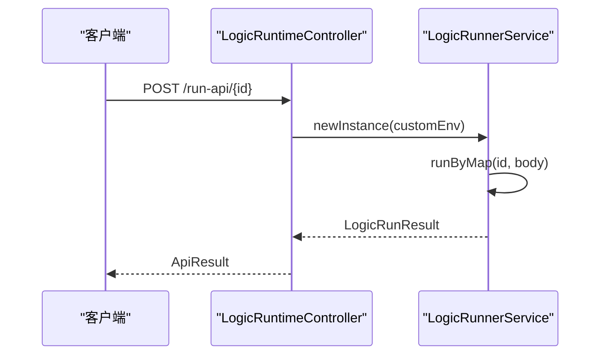
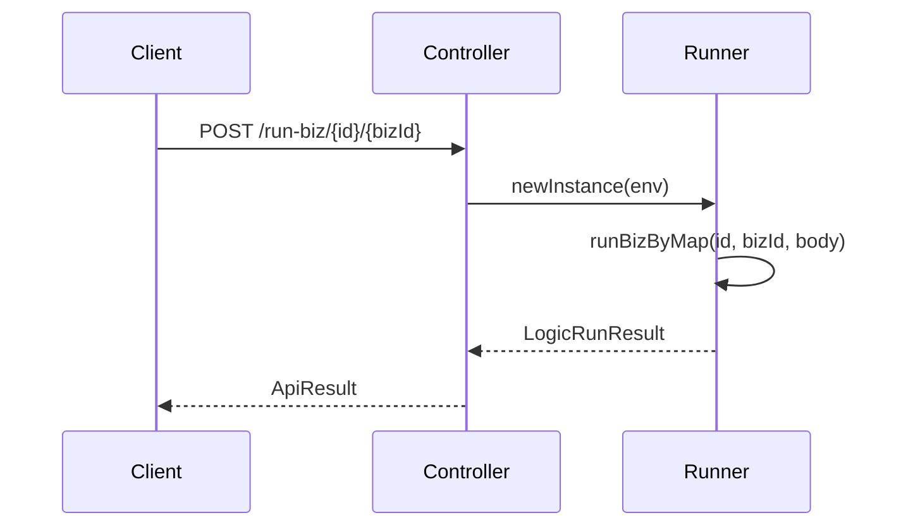
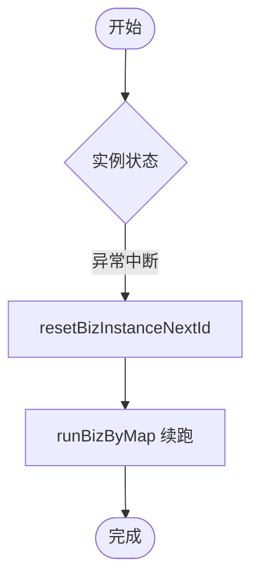

# 运行时API

<cite>
**本文档引用的文件**  
- [LogicRuntimeController.java](file://logic-ide/src/main/java/com/aims/logic/ide/controller/LogicRuntimeController.java)
- [LogicRunnerService.java](file://logic-runtime/src/main/java/com/aims/logic/runtime/service/LogicRunnerService.java)
- [LogicRunner.java](file://logic-runtime/src/main/java/com/aims/logic/runtime/runner/LogicRunner.java)
- [LogicRunResult.java](file://logic-runtime/src/main/java/com/aims/logic/runtime/contract/dto/LogicRunResult.java)
- [ApiResult.java](file://logic-ide/src/main/java/com/aims/logic/ide/controller/dto/ApiResult.java)
- [LogicInstanceDto.java](file://logic-runtime/src/main/java/com/aims/logic/runtime/contract/dto/LogicInstanceDto.java)
- [LogicRunModelEnum.java](file://logic-runtime/src/main/java/com/aims/logic/runtime/contract/dto/LogicRunModelEnum.java)
- [LogicStopModel.java](file://logic-runtime/src/main/java/com/aims/logic/runtime/contract/enums/LogicStopModel.java)
- [RunnerStatusEnum.java](file://logic-runtime/src/main/java/com/aims/logic/runtime/contract/dto/RunnerStatusEnum.java)
</cite>

## 目录
1. [简介](#简介)
2. [核心接口说明](#核心接口说明)
3. [执行模式详解](#执行模式详解)
4. [请求与响应结构](#请求与响应结构)
5. [错误处理策略](#错误处理策略)
6. [性能与并发控制](#性能与并发控制)
7. [实际调用示例](#实际调用示例)
8. [总结](#总结)

## 简介
本文档深入解析 `LogicRuntimeController` 中与逻辑执行相关的核心接口，包括 `/run`、`/debug`、`/stop`、`/resume` 等操作。结合 `LogicRunnerService` 的实现逻辑，详细阐述无状态执行、有状态执行及断点恢复等模式的 API 调用方式。同时提供请求体结构、响应格式、错误处理机制，并给出性能优化建议与实际调用示例。

**Section sources**  
- [LogicRuntimeController.java](file://logic-ide/src/main/java/com/aims/logic/ide/controller/LogicRuntimeController.java#L1-L50)

## 核心接口说明

### 执行逻辑（/run）
- **接口路径**：`POST /api/runtime/logic/v1/run-api/{id}`
- **功能描述**：执行指定逻辑ID的无状态逻辑。
- **参数说明**：
  - `id`：逻辑编号
  - `debug`：是否开启调试模式（可选，默认false）
  - `body`：输入参数（JSON格式）
- **行为逻辑**：通过 `LogicRunnerService.runByMap()` 方法执行，支持传入自定义环境变量（如HEADERS）。



**Diagram sources**  
- [LogicRuntimeController.java](file://logic-ide/src/main/java/com/aims/logic/ide/controller/LogicRuntimeController.java#L33-L49)
- [LogicRunnerService.java](file://logic-runtime/src/main/java/com/aims/logic/runtime/service/LogicRunnerService.java#L68-L75)

### 有状态执行（/run-biz）
- **接口路径**：`POST /api/runtime/logic/v1/run-biz/{id}/{bizId}`
- **功能描述**：以业务ID为上下文执行逻辑，支持状态保持。
- **参数说明**：
  - `id`：逻辑编号
  - `bizId`：业务实例ID
  - `body`：输入参数



**Diagram sources**  
- [LogicRuntimeController.java](file://logic-ide/src/main/java/com/aims/logic/ide/controller/LogicRuntimeController.java#L51-L70)
- [LogicRunnerService.java](file://logic-runtime/src/main/java/com/aims/logic/runtime/service/LogicRunnerService.java#L88-L95)

### 断点恢复执行（/resume）
- **接口路径**：`POST /api/runtime/logic/v1/resetBiz/{id}/{bizId}`
- **功能描述**：重置业务实例的下一个执行节点和局部变量，实现断点续跑。
- **请求体结构**：
```json
{
  "startNodeId": "node_2",
  "startNodeName": "处理节点",
  "varsJson": "{\"tempValue\": 100}"
}
```

**Section sources**  
- [LogicRuntimeController.java](file://logic-ide/src/main/java/com/aims/logic/ide/controller/LogicRuntimeController.java#L83-L105)
- [LogicRunnerService.java](file://logic-runtime/src/main/java/com/aims/logic/runtime/service/LogicRunnerService.java#L138-L147)

### 异常重试（/retry-error-biz）
- **接口路径**：`POST /api/runtime/logic/v1/retry-error-biz/{id}/{bizId}`
- **功能描述**：重试执行失败的业务实例，自动恢复上下文。

**Section sources**  
- [LogicRuntimeController.java](file://logic-ide/src/main/java/com/aims/logic/ide/controller/LogicRuntimeController.java#L96-L105)
- [LogicRunnerService.java](file://logic-runtime/src/main/java/com/aims/logic/runtime/service/LogicRunnerService.java#L120-L127)

### 强制完成（/force-complete-biz）
- **接口路径**：`POST /api/runtime/logic/v1/force-complete-biz/{logicId}/{bizId}`
- **功能描述**：强制标记业务实例为完成状态，内部调用 `forceStopBiz`。

**Section sources**  
- [LogicRuntimeController.java](file://logic-ide/src/main/java/com/aims/logic/ide/controller/LogicRuntimeController.java#L107-L111)
- [LogicRunnerService.java](file://logic-runtime/src/main/java/com/aims/logic/runtime/service/LogicRunnerService.java#L130-L136)

## 执行模式详解

### 无状态执行模式
- **适用场景**：函数式调用，无需保留上下文。
- **API**：`runByMap`
- **特点**：每次调用独立，不依赖历史状态。

### 有状态执行模式
- **适用场景**：业务流程编排，需保持业务上下文。
- **API**：`runBizByMap`
- **特点**：通过 `bizId` 关联执行实例，支持断点恢复。

### 断点恢复机制
通过 `resetBizInstanceNextId` 方法实现：
1. 指定下一执行节点 `nextId`
2. 提供恢复后的局部变量 `varsJson`
3. 重新进入执行流程



**Diagram sources**  
- [LogicRunnerService.java](file://logic-runtime/src/main/java/com/aims/logic/runtime/service/LogicRunnerService.java#L138-L147)
- [LogicRunner.java](file://logic-runtime/src/main/java/com/aims/logic/runtime/runner/LogicRunner.java#L150-L180)

## 请求与响应结构

### 请求体结构
| 字段 | 类型 | 必填 | 说明 |
|------|------|------|------|
| `id` | String | 是 | 逻辑编号 |
| `bizId` | String | 否 | 业务实例ID（有状态时必填） |
| `body` | JSON | 否 | 输入参数对象 |
| `debug` | Boolean | 否 | 是否返回调试日志 |

### 响应数据格式
```json
{
  "code": 0,
  "msg": "success",
  "data": {}, 
  "debug": {
    "logicId": "logic_001",
    "bizId": "biz_001",
    "paramsJson": {},
    "varsJson": {},
    "varsJson_end": {},
    "success": true,
    "over": true,
    "stopModel": "NORMAL"
  }
}
```

#### 核心字段说明
- **`stopModel`**：执行终止模式
  - `NORMAL`：正常结束
  - `MANUAL`：手动停止
  - `ERROR`：异常终止
  - `TIMEOUT`：超时终止
- **`varsJson_end`**：执行结束时的局部变量快照，用于断点恢复。

**Section sources**  
- [ApiResult.java](file://logic-ide/src/main/java/com/aims/logic/ide/controller/dto/ApiResult.java#L1-L41)
- [LogicRunResult.java](file://logic-runtime/src/main/java/com/aims/logic/runtime/contract/dto/LogicRunResult.java#L1-L75)
- [LogicStopModel.java](file://logic-runtime/src/main/java/com/aims/logic/runtime/contract/enums/LogicStopModel.java#L1-L8)

## 错误处理策略

### 统一异常响应结构
```java
public static ApiResult fromException(Exception ex) {
    return new ApiResult()
        .setCode(500)
        .setMsg(ex.getMessage())
        .setError(new ApiError()
            .setCode(500)
            .setMsg(ex.getCause() == null ? ex.getMessage() : ex.getCause().getMessage())
            .setDetail(ex.getCause() != null ? ex.getCause() : ex));
}
```

### 常见错误码
| 错误码 | 含义 | 处理建议 |
|--------|------|----------|
| 500 | 通用服务端错误 | 检查输入参数与逻辑配置 |
| 404 | 未找到逻辑配置 | 确认逻辑ID是否存在 |
| 400 | 参数错误 | 验证JSON格式与必填字段 |

**Section sources**  
- [ApiResult.java](file://logic-ide/src/main/java/com/aims/logic/ide/controller/dto/ApiResult.java#L35-L41)
- [LogicRunner.java](file://logic-runtime/src/main/java/com/aims/logic/runtime/runner/LogicRunner.java#L100-L120)

## 性能与并发控制

### 并发执行建议
- **无状态模式**：可高并发调用 `runByMap`
- **有状态模式**：建议控制 `bizId` 的并发度，避免状态冲突

### 超时配置
- **默认超时**：30秒（可通过 `timeout` 参数调整）
- **长时任务重试**：`retryLongtimeRunningBiz(timeout)` 可扫描并重试超时任务

### 缓存机制
- **配置缓存**：`LogicConfigStoreService` 使用 Caffeine 缓存逻辑配置
- **清除缓存**：
  - `DELETE /api/runtime/config/cache/{key}`：清除指定key
  - `DELETE /api/runtime/config/cache/clear`：清空全部缓存

**Section sources**  
- [LogicRunnerService.java](file://logic-runtime/src/main/java/com/aims/logic/runtime/service/LogicRunnerService.java#L128-L137)
- [LogicRuntimeController.java](file://logic-ide/src/main/java/com/aims/logic/ide/controller/LogicRuntimeController.java#L178-L195)

## 实际调用示例

### 无状态执行
```bash
curl -X POST http://localhost:8080/api/runtime/logic/v1/run-api/logic_001 \
  -H "Content-Type: application/json" \
  -d '{"input": "value"}'
```

### 有状态执行与断点恢复
```bash
# 第一次执行
curl -X POST http://localhost:8080/api/runtime/logic/v1/run-biz/logic_001/biz_001 \
  -d '{"step": 1}'

# 断点恢复
curl -X POST http://localhost:8080/api/runtime/logic/v1/resetBiz/logic_001/biz_001 \
  -d '{
    "startNodeId": "node_3",
    "startNodeName": "恢复节点",
    "varsJson": "{\"recovered\": true}"
  }'
```

### 异常重试
```bash
curl -X POST http://localhost:8080/api/runtime/logic/v1/retry-error-biz/logic_001/biz_001?debug=true
```

**Section sources**  
- [LogicRuntimeController.java](file://logic-ide/src/main/java/com/aims/logic/ide/controller/LogicRuntimeController.java#L33-L130)

## 总结
本文档系统性地解析了 `LogicRuntimeController` 的核心执行接口，涵盖无状态、有状态及断点恢复等多种执行模式。通过 `LogicRunnerService` 提供的丰富API，实现了灵活的逻辑执行控制。建议在实际使用中结合调试模式与日志分析，确保业务流程的稳定运行。