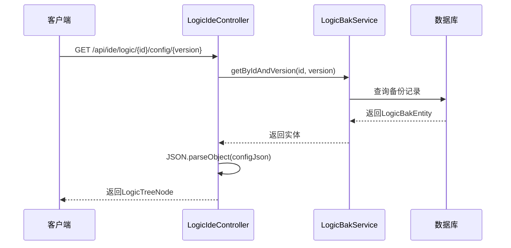
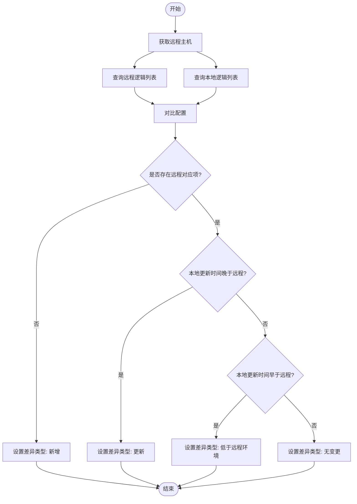

# 配置API

<cite>
**本文档中引用的文件**  
- [LogicIdeController.java](file://logic-ide/src/main/java/com/aims/logic/ide/controller/LogicIdeController.java)
- [PublishController.java](file://logic-ide/src/main/java/com/aims/logic/ide/controller/PublishController.java)
- [DiffRemoteLogicsInput.java](file://logic-ide/src/main/java/com/aims/logic/ide/controller/dto/DiffRemoteLogicsInput.java)
- [DiffRemoteLogicsDto.java](file://logic-ide/src/main/java/com/aims/logic/ide/controller/dto/DiffRemoteLogicsDto.java)
- [LogicService.java](file://logic-sdk/src/main/java/com/aims/logic/sdk/service/LogicService.java)
- [LogicBakService.java](file://logic-sdk/src/main/java/com/aims/logic/sdk/service/LogicBakService.java)
- [LogicEntity.java](file://logic-sdk/src/main/java/com/aims/logic/sdk/entity/LogicEntity.java)
- [LogicTreeNode.java](file://logic-runtime/src/main/java/com/aims/logic/runtime/contract/dsl/LogicTreeNode.java)
</cite>

## 目录
1. [简介](#简介)
2. [逻辑配置管理API](#逻辑配置管理api)
3. [发布相关API](#发布相关api)
4. [配置差异比较API](#配置差异比较api)
5. [请求/响应示例](#请求响应示例)
6. [生命周期管理](#生命周期管理)

## 简介
本文档详细说明了用于管理逻辑配置的API接口，涵盖增删改查、发布及版本对比等核心功能。系统通过`LogicIdeController`和`PublishController`两个控制器提供RESTful接口，支持对逻辑配置的全生命周期管理。主要功能包括逻辑的创建、查询、版本获取、本地与远程发布，以及跨环境配置差异分析。

## 逻辑配置管理API

### 添加逻辑配置
通过POST请求添加新的逻辑配置。

**接口路径**  
`POST /api/ide/logic/add`

**参数说明**  
- 请求体：`LogicEntity`对象，包含id、name、version、module、configJson等字段

**行为说明**  
调用`LogicService.insert()`方法将新逻辑配置持久化到数据库。

**Section sources**  
- [LogicIdeController.java](file://logic-ide/src/main/java/com/aims/logic/ide/controller/LogicIdeController.java#L65-L73)
- [LogicService.java](file://logic-sdk/src/main/java/com/aims/logic/sdk/service/LogicService.java#L10-L12)

### 查询逻辑列表
支持分页查询逻辑配置列表。

**接口路径**  
`POST /api/ide/logics`

**参数说明**  
- 请求体：`FormQueryInput`对象，支持分页、过滤等查询条件

**行为说明**  
调用`LogicService.selectPage()`方法返回分页结果。

**Section sources**  
- [LogicIdeController.java](file://logic-ide/src/main/java/com/aims/logic/ide/controller/LogicIdeController.java#L75-L79)
- [LogicService.java](file://logic-sdk/src/main/java/com/aims/logic/sdk/service/BaseService.java#L10-L15)

### 获取特定版本配置
根据逻辑ID和版本号获取历史配置。

**接口路径**  
`GET /api/ide/logic/{id}/config/{version}`

**参数说明**  
- `id`：逻辑唯一标识
- `version`：配置版本号

**行为说明**  
通过`LogicBakService.getByIdAndVersion()`从备份表中查询指定版本的配置，并解析为`LogicTreeNode`结构返回。



**Diagram sources**  
- [LogicIdeController.java](file://logic-ide/src/main/java/com/aims/logic/ide/controller/LogicIdeController.java#L128-L137)
- [LogicBakService.java](file://logic-sdk/src/main/java/com/aims/logic/sdk/service/LogicBakService.java#L5-L5)
- [LogicTreeNode.java](file://logic-runtime/src/main/java/com/aims/logic/runtime/contract/dsl/LogicTreeNode.java#L1-L55)

**Section sources**  
- [LogicIdeController.java](file://logic-ide/src/main/java/com/aims/logic/ide/controller/LogicIdeController.java#L128-L137)
- [LogicBakService.java](file://logic-sdk/src/main/java/com/aims/logic/sdk/service/LogicBakService.java#L5-L5)

## 发布相关API

### 发布到本地文件
将指定逻辑配置发布到本地文件系统。

**接口路径**  
`POST /api/ide/publish/logic/to-local/{id}`

**参数说明**  
- `id`：逻辑ID
- `isHotUpdate`：是否热更新（可选）

**行为说明**  
调用`LogicService.pubToLocal()`方法将配置写入本地文件。

**Section sources**  
- [PublishController.java](file://logic-ide/src/main/java/com/aims/logic/ide/controller/PublishController.java#L25-L29)
- [LogicService.java](file://logic-sdk/src/main/java/com/aims/logic/sdk/service/LogicService.java#L27-L27)

### 发布到IDE主机
将逻辑配置发布到远程IDE主机。

**接口路径**  
`POST /api/ide/publish/logic/to-ide/{id}/{host_name}`

**参数说明**  
- `id`：逻辑ID
- `host_name`：目标主机名称
- `isHotUpdate`：是否热更新（可选）

**行为说明**  
1. 从运行时环境获取主机配置
2. 调用`LogicService.pubToIdeHost()`发布到指定URL

**Section sources**  
- [PublishController.java](file://logic-ide/src/main/java/com/aims/logic/ide/controller/PublishController.java#L42-L54)
- [LogicService.java](file://logic-sdk/src/main/java/com/aims/logic/sdk/service/LogicService.java#L38-L38)

## 配置差异比较API

### 差异比较机制
比较本地与远程环境的逻辑配置版本差异。

**接口路径**  
`POST /api/ide/published/logics/diff`

**请求体**  
`DiffRemoteLogicsInput`对象：
- `hostName`：远程主机名称
- `queryInput`：查询条件（可选）

**响应体**  
`List<DiffRemoteLogicsDto>`，包含以下字段：
- `id`：逻辑ID
- `name`：逻辑名称
- `localVersion`：本地版本
- `localVersionUpdateTime`：本地更新时间
- `remoteVersion`：远程版本
- `remoteVersionUpdateTime`：远程更新时间
- `diffType`：差异类型（"新增"、"更新"、"低于远程环境"、"无变更"）

**工作流程**  
1. 获取远程主机配置
2. 分别查询本地和远程的逻辑列表
3. 对比每个逻辑的更新时间确定差异状态



**Diagram sources**  
- [PublishController.java](file://logic-ide/src/main/java/com/aims/logic/ide/controller/PublishController.java#L62-L92)
- [DiffRemoteLogicsInput.java](file://logic-ide/src/main/java/com/aims/logic/ide/controller/dto/DiffRemoteLogicsInput.java#L1-L10)
- [DiffRemoteLogicsDto.java](file://logic-ide/src/main/java/com/aims/logic/ide/controller/dto/DiffRemoteLogicsDto.java#L1-L19)

**Section sources**  
- [PublishController.java](file://logic-ide/src/main/java/com/aims/logic/ide/controller/PublishController.java#L62-L92)

## 请求/响应示例

### 添加逻辑请求示例
```json
POST /api/ide/logic/add
Content-Type: application/json

{
  "id": "logic_demo_001",
  "name": "示例逻辑",
  "version": "1.0.0",
  "module": "demo",
  "configJson": "{\"id\":\"logic_demo_001\",\"name\":\"示例逻辑\",\"items\":[]}"
}
```

### 查询版本配置响应示例
```json
GET /api/ide/logic/logic_demo_001/config/1.0.0

{
  "code": 200,
  "data": {
    "id": "logic_demo_001",
    "name": "示例逻辑",
    "version": "1.0.0",
    "items": []
  },
  "msg": "success"
}
```

### 配置差异比较响应示例
```json
POST /api/ide/published/logics/diff

{
  "code": 200,
  "data": [
    {
      "id": "logic_demo_001",
      "name": "示例逻辑",
      "localVersion": "1.0.0",
      "localVersionUpdateTime": "2024-01-01 10:00:00",
      "remoteVersion": "1.1.0",
      "remoteVersionUpdateTime": "2024-01-02 15:30:00",
      "diffType": "低于远程环境"
    }
  ]
}
```

## 生命周期管理
逻辑配置的完整生命周期包括：创建 → 编辑（自动备份）→ 查询 → 发布 → 版本对比。系统通过`LogicService`和`LogicBakService`协同工作，确保每次修改都有历史记录，支持版本回滚和跨环境同步。