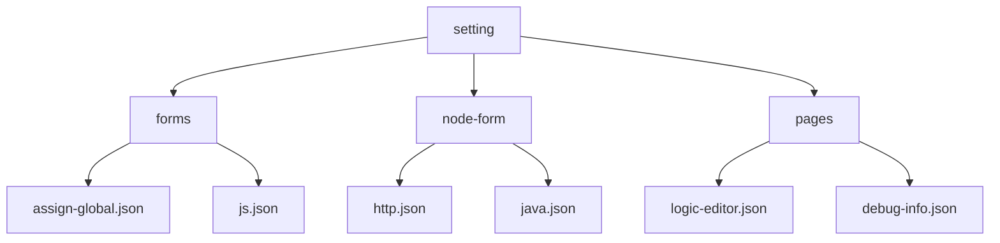
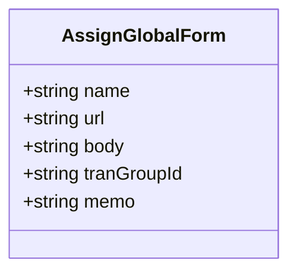
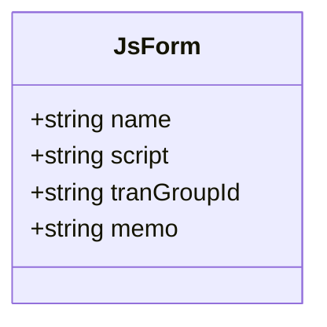
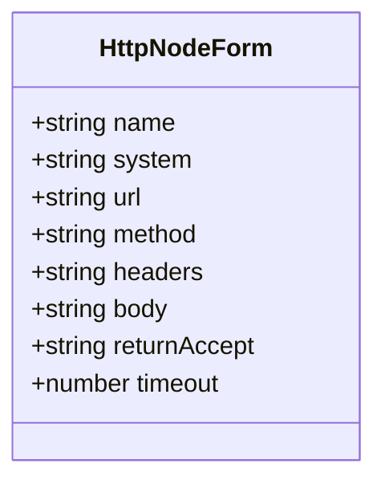
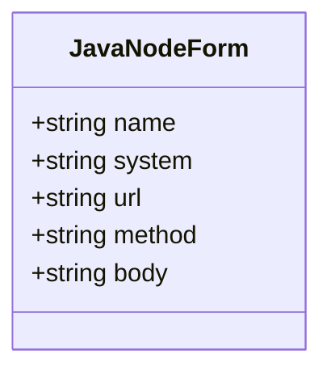
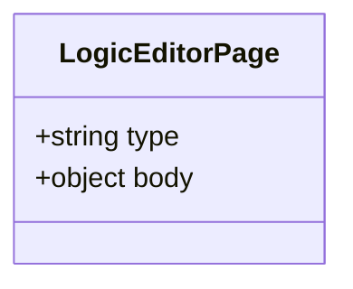
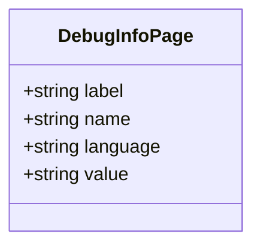
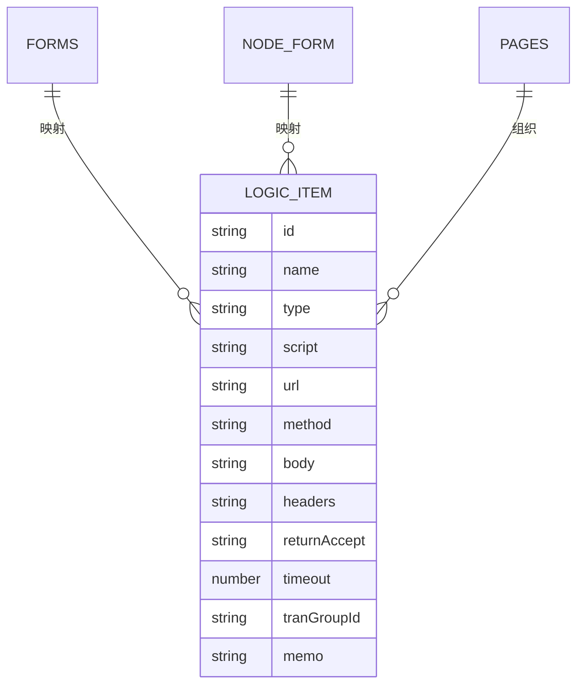

# UI配置管理

<cite>
**Referenced Files in This Document**   
- [assign-global.json](file://logic-ide/src/main/resources/public/setting/forms/assign-global.json)
- [js.json](file://logic-ide/src/main/resources/public/setting/forms/js.json)
- [http.json](file://logic-ide/src/main/resources/public/setting/node-form/http.json)
- [java.json](file://logic-ide/src/main/resources/public/setting/node-form/java.json)
- [logic-editor.json](file://logic-ide/src/main/resources/public/setting/pages/logic-editor.json)
- [debug-info.json](file://logic-ide/src/main/resources/public/setting/pages/debug-info.json)
- [LogicItemTreeNode.java](file://logic-runtime/src/main/java/com/aims/logic/runtime/contract/dsl/LogicItemTreeNode.java)
</cite>

## 目录

1. [介绍](#介绍)
2. [项目结构](#项目结构)
3. [核心组件](#核心组件)
4. [架构概述](#架构概述)
5. [详细组件分析](#详细组件分析)
6. [依赖分析](#依赖分析)
7. [性能考虑](#性能考虑)
8. [故障排除指南](#故障排除指南)
9. [结论](#结论)

## 介绍

本文档系统化阐述了`setting`目录下`forms`、`node-form`和`pages`三个子目录的配置体系。重点分析了这些JSON配置文件如何定义用户界面行为、为不同类型的逻辑节点提供可视化编辑界面，以及如何组织页面层级和功能模块。同时，文档深入探讨了这些配置与后端模型`LogicItemTreeNode`的映射关系，说明了其驱动动态表单渲染的技术实现，并提供了新增节点类型时同步更新配置文件的最佳实践指南。

## 项目结构

`setting`目录下的配置体系分为三个主要子目录：`forms`、`node-form`和`pages`，每个目录承担不同的配置职责。

**Diagram sources**
- [assign-global.json](file://logic-ide/src/main/resources/public/setting/forms/assign-global.json)
- [js.json](file://logic-ide/src/main/resources/public/setting/forms/js.json)
- [http.json](file://logic-ide/src/main/resources/public/setting/node-form/http.json)
- [java.json](file://logic-ide/src/main/resources/public/setting/node-form/java.json)
- [logic-editor.json](file://logic-ide/src/main/resources/public/setting/pages/logic-editor.json)
- [debug-info.json](file://logic-ide/src/main/resources/public/setting/pages/debug-info.json)

**Section sources**
- [logic-ide/src/main/resources/public/setting](file://logic-ide/src/main/resources/public/setting)

## 核心组件

`forms`目录中的JSON文件定义了通用配置项的UI行为，`node-form`目录中的文件为不同类型的逻辑节点提供输入参数的可视化编辑界面，而`pages`目录中的文件则负责组织页面层级和功能模块。

**Section sources**
- [assign-global.json](file://logic-ide/src/main/resources/public/setting/forms/assign-global.json)
- [js.json](file://logic-ide/src/main/resources/public/setting/forms/js.json)
- [http.json](file://logic-ide/src/main/resources/public/setting/node-form/http.json)
- [java.json](file://logic-ide/src/main/resources/public/setting/node-form/java.json)
- [logic-editor.json](file://logic-ide/src/main/resources/public/setting/pages/logic-editor.json)
- [debug-info.json](file://logic-ide/src/main/resources/public/setting/pages/debug-info.json)

## 架构概述

整个UI配置体系通过JSON文件定义界面结构和行为，这些配置与后端模型`LogicItemTreeNode`紧密映射，实现了动态表单渲染和可视化编辑功能。

**Diagram sources**
- [LogicItemTreeNode.java](file://logic-runtime/src/main/java/com/aims/logic/runtime/contract/dsl/LogicItemTreeNode.java)

## 详细组件分析

### forms目录分析

`forms`目录中的JSON文件定义了全局变量赋值、脚本节点等通用配置项的UI行为。

#### assign-global.json分析
该文件定义了全局变量赋值节点的配置界面，包含名称、变量名、值等字段。

**Diagram sources**
- [assign-global.json](file://logic-ide/src/main/resources/public/setting/forms/assign-global.json)

#### js.json分析
该文件定义了JS脚本节点的配置界面，包含名称、JS脚本、事务组编号等字段。

**Diagram sources**
- [js.json](file://logic-ide/src/main/resources/public/setting/forms/js.json)

### node-form目录分析

`node-form`目录中的JSON文件为不同类型的逻辑节点提供输入参数的可视化编辑界面。

#### http.json分析
该文件定义了HTTP节点的配置界面，包含请求URL、请求类型、请求头、body参数等字段。

**Diagram sources**
- [http.json](file://logic-ide/src/main/resources/public/setting/node-form/http.json)

#### java.json分析
该文件定义了Java节点的配置界面，包含完整类路径、方法名、参数等字段。

**Diagram sources**
- [java.json](file://logic-ide/src/main/resources/public/setting/node-form/java.json)

### pages目录分析

`pages`目录中的配置文件组织页面层级和功能模块。

#### logic-editor.json分析
该文件定义了逻辑编辑器页面的结构，包含逻辑编辑器组件。

**Diagram sources**
- [logic-editor.json](file://logic-ide/src/main/resources/public/setting/pages/logic-editor.json)

#### debug-info.json分析
该文件定义了调试信息页面的结构，包含返回值显示、日志跳转链接等组件。

**Diagram sources**
- [debug-info.json](file://logic-ide/src/main/resources/public/setting/pages/debug-info.json)

## 依赖分析

JSON配置文件与后端模型`LogicItemTreeNode`存在明确的映射关系，配置项直接对应模型中的字段。

**Diagram sources**
- [LogicItemTreeNode.java](file://logic-runtime/src/main/java/com/aims/logic/runtime/contract/dsl/LogicItemTreeNode.java)

**Section sources**
- [LogicItemTreeNode.java](file://logic-runtime/src/main/java/com/aims/logic/runtime/contract/dsl/LogicItemTreeNode.java)

## 性能考虑

JSON配置文件的结构设计考虑了性能因素，通过合理的字段划分和类型定义，确保了动态渲染的效率。

## 故障排除指南

当新增节点类型时，需要同步更新`node-form`目录下的配置文件，并确保与`LogicItemTreeNode`模型的字段映射正确。

**Section sources**
- [http.json](file://logic-ide/src/main/resources/public/setting/node-form/http.json)
- [java.json](file://logic-ide/src/main/resources/public/setting/node-form/java.json)

## 结论

`setting`目录下的配置体系通过`forms`、`node-form`和`pages`三个子目录的协同工作，实现了灵活的UI配置和动态表单渲染。这些JSON配置文件与后端模型`LogicItemTreeNode`紧密映射，为不同类型的逻辑节点提供了可视化编辑界面，并有效组织了页面层级和功能模块。新增节点类型时，只需在相应目录下添加配置文件并确保字段映射正确即可。