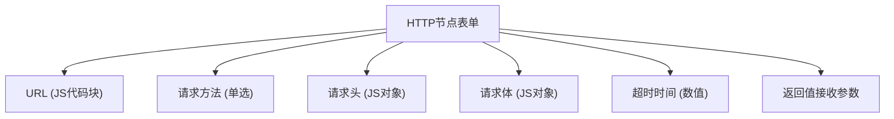
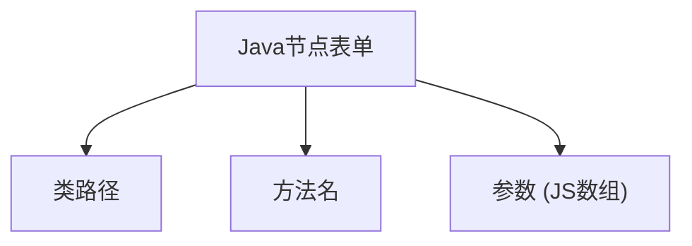
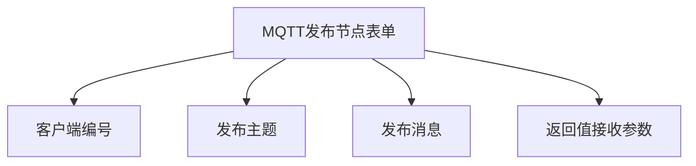
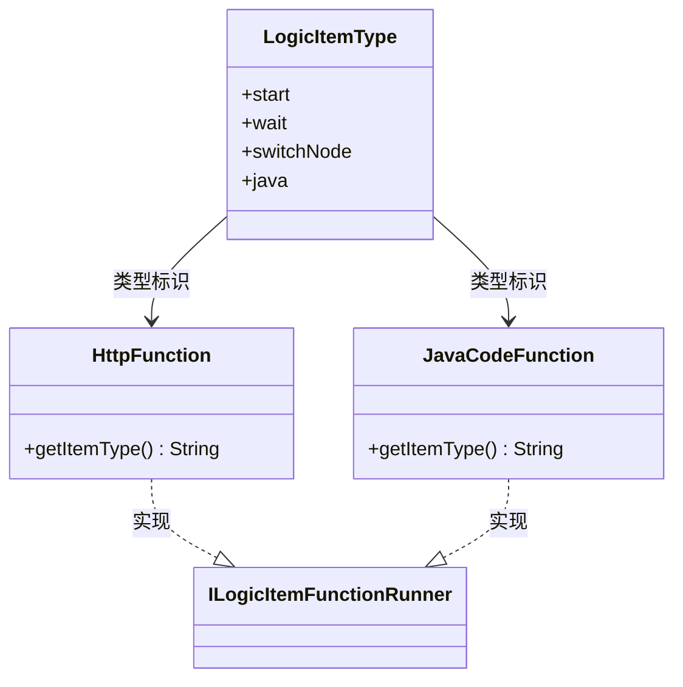
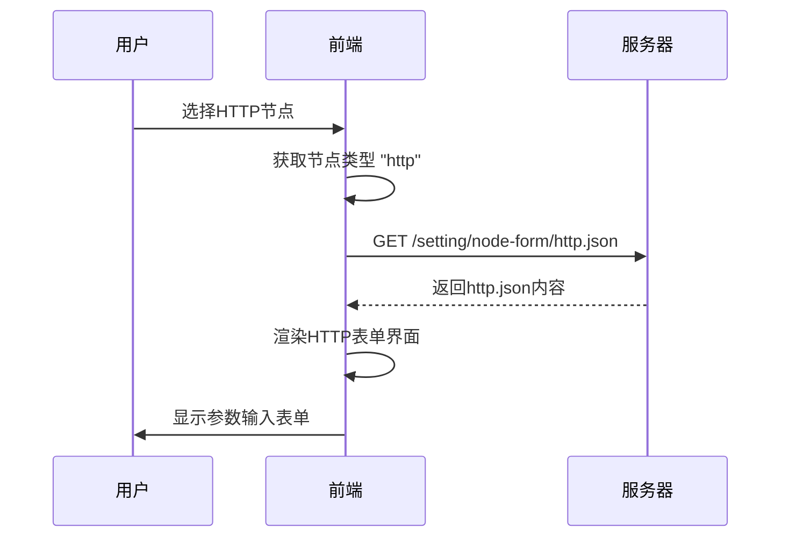

# 节点专用表单配置

<cite>
**本文档引用文件**  
- [http.json](file://logic-ide/src/main/resources/public/setting/node-form/http.json)
- [java.json](file://logic-ide/src/main/resources/public/setting/node-form/java.json)
- [mqtt-pub.json](file://logic-ide/src/main/resources/public/setting/node-form/mqtt-pub.json)
- [LogicItemType.java](file://logic-runtime/src/main/java/com/aims/logic/runtime/contract/enums/LogicItemType.java)
- [HttpFunction.java](file://logic-runtime/src/main/java/com/aims/logic/runtime/runner/functions/impl/HttpFunction.java)
- [JavaCodeFunction.java](file://logic-runtime/src/main/java/com/aims/logic/runtime/runner/functions/impl/JavaCodeFunction.java)
</cite>

## 目录
1. [引言](#引言)
2. [节点专用表单结构与机制](#节点专用表单结构与机制)
3. [核心节点表单配置分析](#核心节点表单配置分析)
   - [HTTP节点表单配置](#http节点表单配置)
   - [Java节点表单配置](#java节点表单配置)
   - [MQTT发布节点表单配置](#mqtt发布节点表单配置)
4. [表单与节点类型的映射关系](#表单与节点类型的映射关系)
5. [前端动态加载机制](#前端动态加载机制)
6. [新节点类型开发流程](#新节点类型开发流程)
7. [结论](#结论)

## 引言
本文档详细说明`node-form`目录中各JSON文件如何为特定逻辑节点类型提供定制化参数输入界面。通过分析`http.json`、`java.json`和`mqtt-pub.json`等配置文件，阐述其字段定义模式、控件类型及与后端执行逻辑的协同机制。同时说明专用表单与`LogicItemType`枚举值的对应关系，以及前端如何根据节点类型动态加载匹配的表单配置，并提供开发新节点类型时的完整协同开发流程。

## 节点专用表单结构与机制

逻辑节点专用表单采用JSON Schema格式定义，位于`logic-ide/src/main/resources/public/setting/node-form/`目录下，每个文件对应一种节点类型。表单配置定义了字段名称、类型、控件类型（widget）、默认值、布局等元信息，前端基于此动态渲染参数输入界面。

表单机制实现了前后端职责分离：前端负责界面渲染与用户交互，后端负责逻辑执行。表单配置作为中间契约，确保用户输入能正确映射到运行时上下文。

**Section sources**
- [http.json](file://logic-ide/src/main/resources/public/setting/node-form/http.json#L1-L86)
- [java.json](file://logic-ide/src/main/resources/public/setting/node-form/java.json#L1-L44)
- [mqtt-pub.json](file://logic-ide/src/main/resources/public/setting/node-form/mqtt-pub.json#L1-L39)

## 核心节点表单配置分析

### HTTP节点表单配置

`http.json`文件为HTTP请求节点提供参数配置界面，其核心字段包括：

- **url**：请求URL，使用`js`控件，支持JavaScript代码块动态生成URL
- **method**：请求方法，使用`radio`控件提供POST、GET、PUT、DELETE选项
- **headers**：请求头，使用`js`控件返回对象
- **body**：请求体参数，使用`js`控件返回对象
- **timeout**：超时时间（毫秒），默认5000ms
- **returnAccept**：指定响应数据赋值目标参数

该配置支持动态参数生成，提升灵活性。

**Diagram sources**
- [http.json](file://logic-ide/src/main/resources/public/setting/node-form/http.json#L1-L86)
- [HttpFunction.java](file://logic-runtime/src/main/java/com/aims/logic/runtime/runner/functions/impl/HttpFunction.java#L22-L117)

**Section sources**
- [http.json](file://logic-ide/src/main/resources/public/setting/node-form/http.json#L1-L86)

### Java节点表单配置

`java.json`文件为Java代码调用节点提供配置界面，核心字段包括：

- **url**：完整类路径，使用文本输入控件
- **method**：方法名，使用文本输入控件
- **body**：参数列表，使用`js`控件返回参数数组

该配置支持通过JavaScript动态生成类路径、方法名和参数，实现灵活调用。

**Diagram sources**
- [java.json](file://logic-ide/src/main/resources/public/setting/node-form/java.json#L1-L44)
- [JavaCodeFunction.java](file://logic-runtime/src/main/java/com/aims/logic/runtime/runner/functions/impl/JavaCodeFunction.java#L21-L180)

**Section sources**
- [java.json](file://logic-ide/src/main/resources/public/setting/node-form/java.json#L1-L44)

### MQTT发布节点表单配置

`mqtt-pub.json`文件为MQTT消息发布节点提供简洁配置界面，字段包括：

- **clientId**：客户端编号，可选
- **topic**：发布主题
- **msg**：发布消息内容
- **return**：返回值接收参数

该表单采用垂直布局，强调字段独立性。

**Diagram sources**
- [mqtt-pub.json](file://logic-ide/src/main/resources/public/setting/node-form/mqtt-pub.json#L1-L39)

**Section sources**
- [mqtt-pub.json](file://logic-ide/src/main/resources/public/setting/node-form/mqtt-pub.json#L1-L39)

## 表单与节点类型的映射关系

专用表单与`LogicItemType`枚举值通过文件名建立直接映射关系。`LogicItemType`定义了逻辑节点的类型标识，如`java`、`http`等，而`node-form`目录下的JSON文件名与这些标识完全匹配。

例如：
- `LogicItemType.java` 对应 `java.json`
- `LogicItemType.http` 对应 `http.json`
- `LogicItemType.mqttPub` 对应 `mqtt-pub.json`

后端执行器通过`getItemType()`方法返回类型标识，前端据此加载同名JSON表单配置。

**Diagram sources**
- [LogicItemType.java](file://logic-runtime/src/main/java/com/aims/logic/runtime/contract/enums/LogicItemType.java#L4-L24)
- [HttpFunction.java](file://logic-runtime/src/main/java/com/aims/logic/runtime/runner/functions/impl/HttpFunction.java#L22-L117)
- [JavaCodeFunction.java](file://logic-runtime/src/main/java/com/aims/logic/runtime/runner/functions/impl/JavaCodeFunction.java#L21-L180)

**Section sources**
- [LogicItemType.java](file://logic-runtime/src/main/java/com/aims/logic/runtime/contract/enums/LogicItemType.java#L4-L24)

## 前端动态加载机制

前端通过节点类型标识动态加载匹配的表单配置。当用户选择特定节点类型时，系统根据`LogicItemType.value`构造请求路径，从`node-form`目录加载对应JSON文件。

加载流程如下：
1. 获取当前节点的`type`属性值
2. 构造`/setting/node-form/{type}.json`请求路径
3. 异步加载JSON配置
4. 使用JSON Schema渲染表单界面
5. 将用户输入绑定到节点DSL对象

该机制实现了表单配置的热插拔，新增节点类型无需修改前端核心逻辑。

**Diagram sources**
- [http.json](file://logic-ide/src/main/resources/public/setting/node-form/http.json#L1-L86)
- [LogicItemType.java](file://logic-runtime/src/main/java/com/aims/logic/runtime/contract/enums/LogicItemType.java#L4-L24)

## 新节点类型开发流程

开发新节点类型需协同前端表单配置与后端执行逻辑：

1. **定义节点类型枚举值**
   - 在`LogicItemType`中添加新类型
   - 设置唯一`value`标识

2. **创建表单配置文件**
   - 在`node-form`目录创建`{type}.json`
   - 定义字段、控件、验证规则

3. **实现后端执行器**
   - 创建类实现`ILogicItemFunctionRunner`
   - 实现`invoke()`方法处理业务逻辑
   - `getItemType()`返回对应类型标识

4. **测试与集成**
   - 验证表单渲染正确性
   - 测试执行器功能完整性
   - 确保数据流端到端贯通

该流程确保了扩展性与一致性，新节点类型可无缝集成到现有系统。

**Section sources**
- [LogicItemType.java](file://logic-runtime/src/main/java/com/aims/logic/runtime/contract/enums/LogicItemType.java#L4-L24)
- [HttpFunction.java](file://logic-runtime/src/main/java/com/aims/logic/runtime/runner/functions/impl/HttpFunction.java#L22-L117)
- [node-form目录](file://logic-ide/src/main/resources/public/setting/node-form/)

## 结论

节点专用表单配置机制通过JSON Schema实现了参数界面的灵活定义与动态加载。`http.json`、`java.json`、`mqtt-pub.json`等文件为特定节点类型提供了定制化输入界面，通过文件名与`LogicItemType`枚举值建立映射关系。前端根据节点类型动态加载匹配的表单配置，后端执行器通过类型标识处理相应逻辑。该设计实现了前后端解耦，支持通过简单配置扩展新节点类型，提升了系统的可维护性与扩展性。