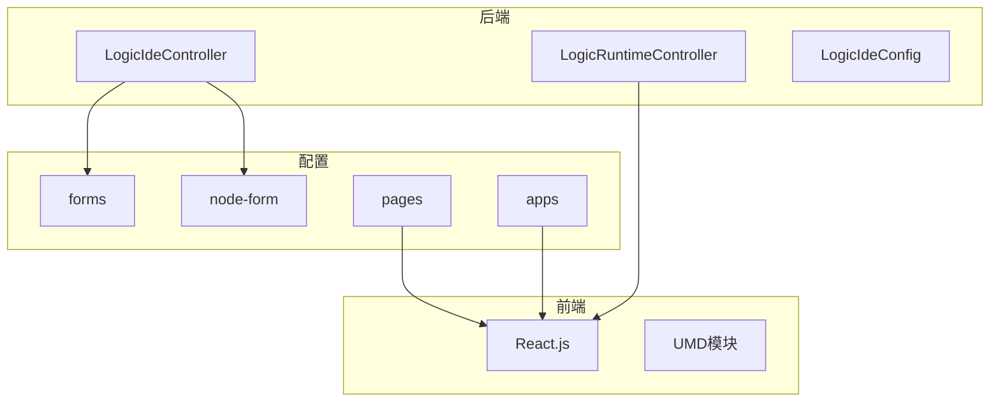
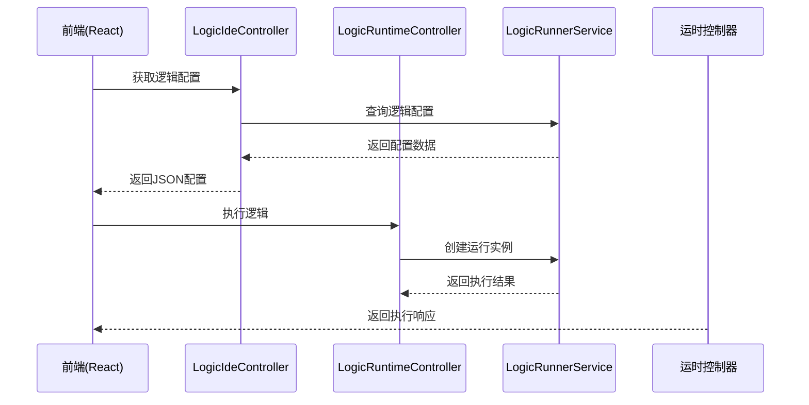
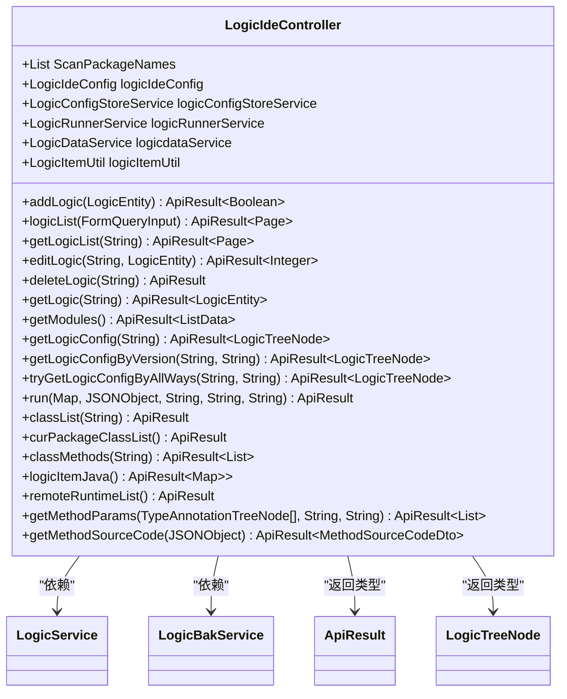
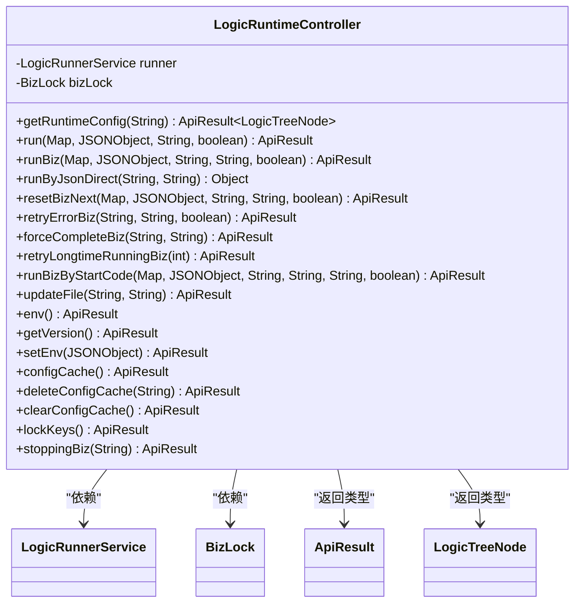
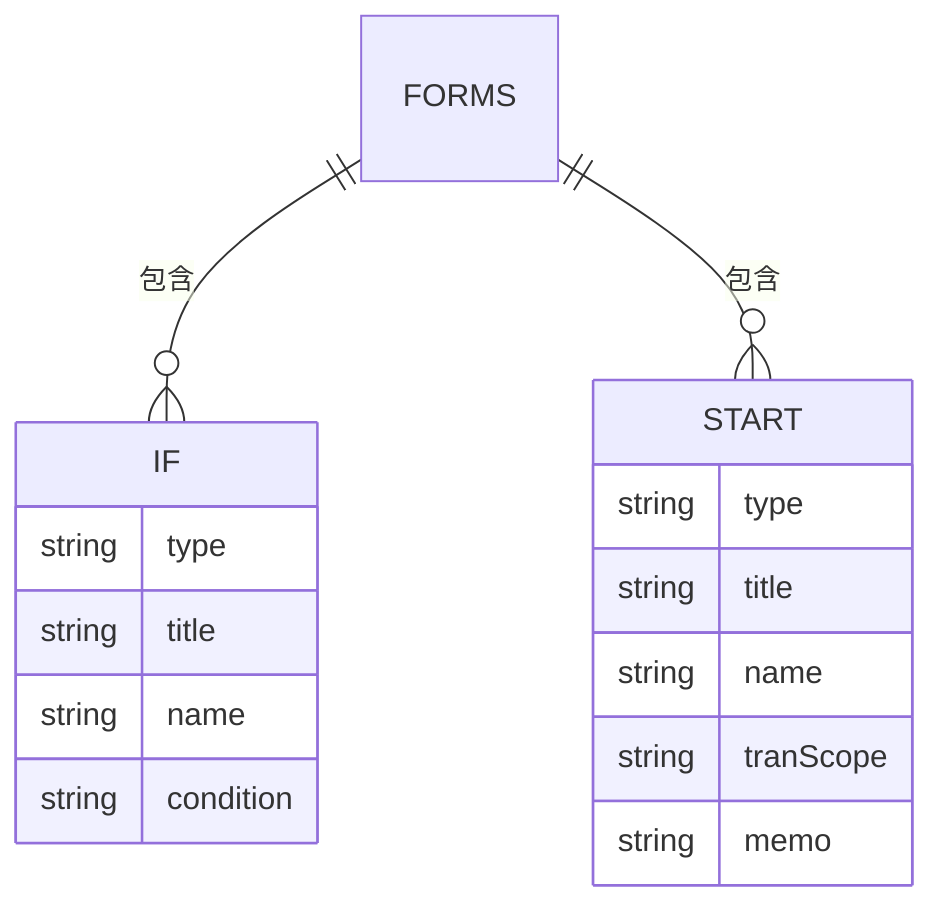
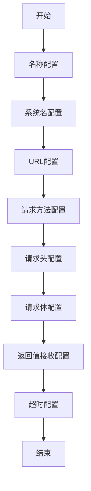
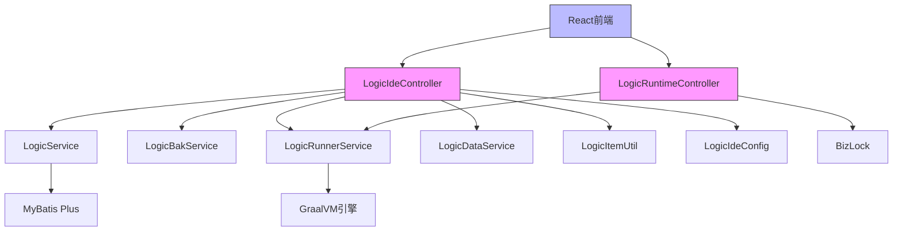

# logic-ide模块

<cite>
**本文档引用的文件**
- [LogicIdeController.java](file://logic-ide/src/main/java/com/aims/logic/ide/controller/LogicIdeController.java)
- [LogicRuntimeController.java](file://logic-ide/src/main/java/com/aims/logic/ide/controller/LogicRuntimeController.java)
- [LogicIdeConfig.java](file://logic-ide/src/main/java/com/aims/logic/ide/configuration/LogicIdeConfig.java)
- [forms/if.json](file://logic-ide/src/main/resources/public/setting/forms/if.json)
- [node-form/http.json](file://logic-ide/src/main/resources/public/setting/node-form/http.json)
- [pages/logic-editor.json](file://logic-ide/src/main/resources/public/setting/pages/logic-editor.json)
- [forms/start.json](file://logic-ide/src/main/resources/public/setting/forms/start.json)
- [node-form/start.json](file://logic-ide/src/main/resources/public/setting/node-form/start.json)
- [apps/index.json](file://logic-ide/src/main/resources/public/setting/apps/index.json)
- [react.development.js](file://logic-ide/src/main/resources/public/js/umd/react.development.js)
- [react-dom.development.js](file://logic-ide/src/main/resources/public/js/umd/react-dom.development.js)
</cite>

## 目录
1. [简介](#简介)
2. [项目结构](#项目结构)
3. [核心组件](#核心组件)
4. [架构概述](#架构概述)
5. [详细组件分析](#详细组件分析)
6. [依赖分析](#依赖分析)
7. [性能考虑](#性能考虑)
8. [故障排除指南](#故障排除指南)
9. [结论](#结论)

## 简介
logic-ide模块是一个基于Web的可视化逻辑编排开发环境，为用户提供图形化界面来设计、调试和管理业务逻辑流程。该模块作为前端应用，通过React.js实现用户界面，结合后端Spring Boot服务提供完整的逻辑编排解决方案。系统支持节点式编程，允许用户通过拖拽和配置的方式构建复杂的业务流程。

## 项目结构
logic-ide模块采用典型的前后端分离架构，后端使用Spring Boot框架，前端基于React.js构建。项目主要包含控制器层、配置文件和静态资源三大部分。

**图表来源**
- [LogicIdeController.java](file://logic-ide/src/main/java/com/aims/logic/ide/controller/LogicIdeController.java)
- [LogicRuntimeController.java](file://logic-ide/src/main/java/com/aims/logic/ide/controller/LogicRuntimeController.java)
- [apps/index.json](file://logic-ide/src/main/resources/public/setting/apps/index.json)

**本节来源**
- [logic-ide/src/main/java/com/aims/logic/ide](file://logic-ide/src/main/java/com/aims/logic/ide)
- [logic-ide/src/main/resources/public/setting](file://logic-ide/src/main/resources/public/setting)

## 核心组件
logic-ide模块的核心组件包括两个主要的控制器：LogicIdeController和LogicRuntimeController。LogicIdeController负责处理IDE相关的操作，如逻辑配置的增删改查、类方法的元数据获取等。LogicRuntimeController则专注于运行时功能，提供逻辑执行、调试和状态管理等接口。这两个控制器共同构成了前端IDE与后端执行引擎之间的桥梁。

**本节来源**
- [LogicIdeController.java](file://logic-ide/src/main/java/com/aims/logic/ide/controller/LogicIdeController.java#L35-L318)
- [LogicRuntimeController.java](file://logic-ide/src/main/java/com/aims/logic/ide/controller/LogicRuntimeController.java#L17-L209)

## 架构概述
logic-ide模块采用分层架构设计，从前端到后端形成了清晰的调用链路。前端React应用通过HTTP API与后端控制器交互，控制器调用服务层处理业务逻辑，最终与运行时环境进行通信。

**图表来源**
- [LogicIdeController.java](file://logic-ide/src/main/java/com/aims/logic/ide/controller/LogicIdeController.java)
- [LogicRuntimeController.java](file://logic-ide/src/main/java/com/aims/logic/ide/controller/LogicRuntimeController.java)
- [LogicRunnerService.java](file://logic-runtime/src/main/java/com/aims/logic/runtime/service/LogicRunnerService.java)

## 详细组件分析

### LogicIdeController分析
LogicIdeController是IDE功能的主要入口，提供了一系列REST API用于管理逻辑配置和获取元数据。

**图表来源**
- [LogicIdeController.java](file://logic-ide/src/main/java/com/aims/logic/ide/controller/LogicIdeController.java#L35-L318)

**本节来源**
- [LogicIdeController.java](file://logic-ide/src/main/java/com/aims/logic/ide/controller/LogicIdeController.java#L35-L318)

### LogicRuntimeController分析
LogicRuntimeController负责处理运行时相关的请求，包括逻辑执行、状态重置和错误处理等功能。

**图表来源**
- [LogicRuntimeController.java](file://logic-ide/src/main/java/com/aims/logic/ide/controller/LogicRuntimeController.java#L17-L209)

**本节来源**
- [LogicRuntimeController.java](file://logic-ide/src/main/java/com/aims/logic/ide/controller/LogicRuntimeController.java#L17-L209)

### 配置文件分析
setting目录下的JSON配置文件定义了IDE的UI行为和节点表单结构，是实现可视化配置的关键。

#### forms配置分析
forms目录中的JSON文件定义了各种节点的配置表单，如if.json定义了条件节点的配置界面。

**图表来源**
- [forms/if.json](file://logic-ide/src/main/resources/public/setting/forms/if.json#L1)
- [forms/start.json](file://logic-ide/src/main/resources/public/setting/forms/start.json#L1)

**本节来源**
- [forms/if.json](file://logic-ide/src/main/resources/public/setting/forms/if.json#L1)
- [forms/start.json](file://logic-ide/src/main/resources/public/setting/forms/start.json#L1)

#### node-form配置分析
node-form目录中的JSON文件定义了节点的属性结构，如http.json定义了HTTP请求节点的配置项。

**图表来源**
- [node-form/http.json](file://logic-ide/src/main/resources/public/setting/node-form/http.json#L1-L86)

**本节来源**
- [node-form/http.json](file://logic-ide/src/main/resources/public/setting/node-form/http.json#L1-L86)

## 依赖分析
logic-ide模块依赖于多个内部组件和服务，形成了复杂的依赖关系网络。

**图表来源**
- [LogicIdeController.java](file://logic-ide/src/main/java/com/aims/logic/ide/controller/LogicIdeController.java)
- [LogicRuntimeController.java](file://logic-ide/src/main/java/com/aims/logic/ide/controller/LogicRuntimeController.java)
- [LogicIdeConfig.java](file://logic-ide/src/main/java/com/aims/logic/ide/configuration/LogicIdeConfig.java)

**本节来源**
- [logic-ide/src/main/java/com/aims/logic/ide/controller](file://logic-ide/src/main/java/com/aims/logic/ide/controller)
- [logic-ide/src/main/java/com/aims/logic/ide/configuration](file://logic-ide/src/main/java/com/aims/logic/ide/configuration)

## 性能考虑
在设计和使用logic-ide模块时，需要考虑以下几个性能方面：首先，频繁的元数据查询可能影响响应速度，建议对类方法元数据进行缓存。其次，大尺寸的逻辑配置文件传输可能增加网络开销，应考虑分页加载或增量更新机制。最后，运行时执行的并发控制需要合理配置，避免资源竞争导致性能下降。

## 故障排除指南
当遇到logic-ide模块的问题时，可以按照以下步骤进行排查：首先检查控制器日志，确认是否有异常抛出；其次验证配置文件的正确性，特别是JSON格式是否有效；然后确认前端与后端的API调用是否匹配，包括URL路径、HTTP方法和参数格式；最后检查依赖服务的状态，确保LogicRunnerService等关键组件正常运行。

**本节来源**
- [LogicIdeController.java](file://logic-ide/src/main/java/com/aims/logic/ide/controller/LogicIdeController.java)
- [LogicRuntimeController.java](file://logic-ide/src/main/java/com/aims/logic/ide/controller/LogicRuntimeController.java)
- [ControllerExceptionHandler.java](file://logic-ide/src/main/java/com/aims/logic/ide/exception/ControllerExceptionHandler.java)

## 结论
logic-ide模块提供了一个功能完整的可视化逻辑编排环境，通过精心设计的前后端架构实现了灵活的业务流程配置。其核心优势在于将复杂的编程逻辑转化为直观的图形化操作，同时保持了足够的扩展性和定制能力。通过合理利用配置文件和API接口，开发者可以轻松扩展IDE功能，满足不同场景的需求。未来可以进一步优化性能表现，增强错误处理机制，提升用户体验。