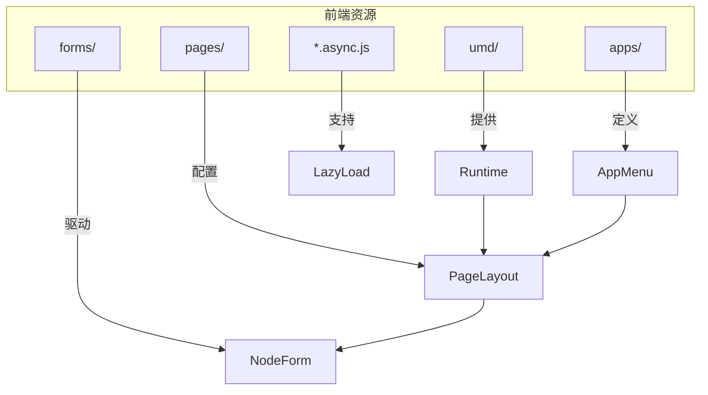
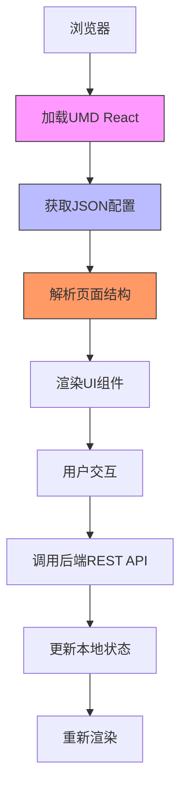
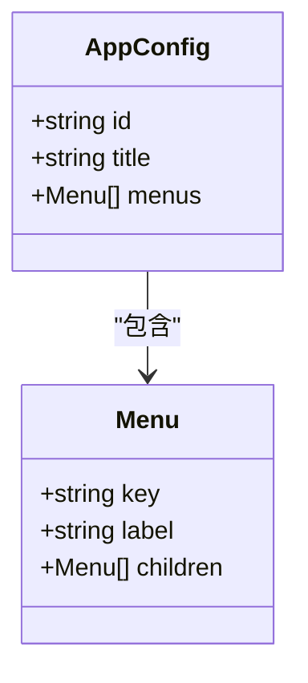
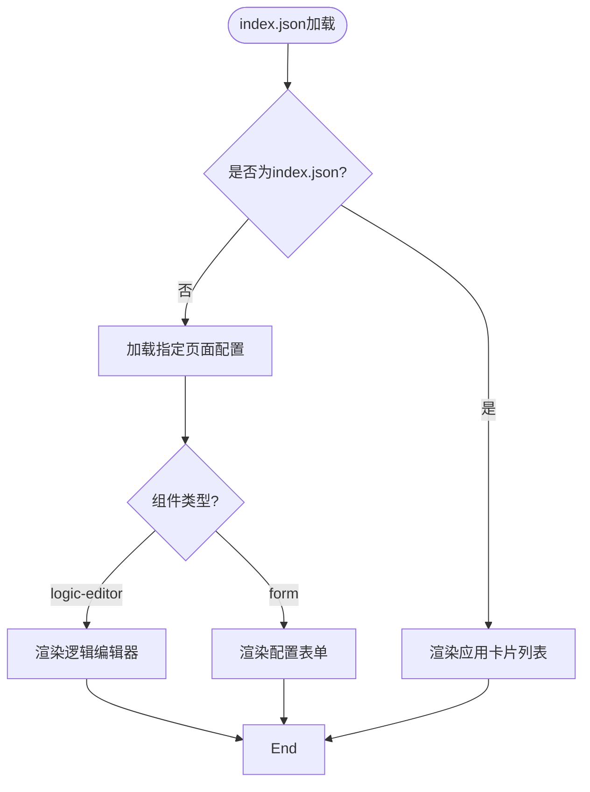
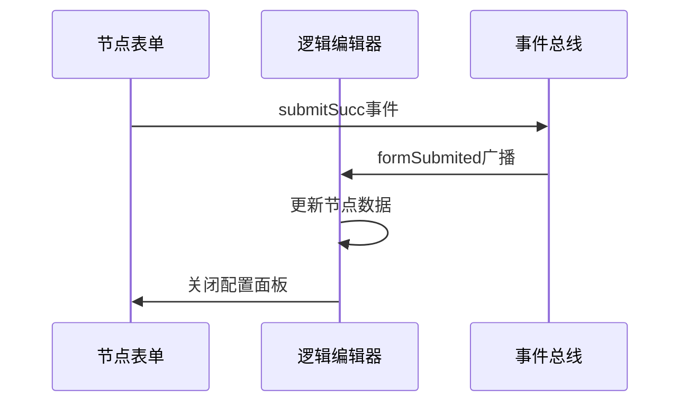

# 前端架构

<cite>
**本文档中引用的文件**  
- [react.development.js](file://logic-ide/src/main/resources/public/js/umd/react.development.js)
- [index.json](file://logic-ide/src/main/resources/public/setting/apps/index.json)
- [mes-gy.json](file://logic-ide/src/main/resources/public/setting/apps/mes-gy.json)
- [xuanwu-factory.json](file://logic-ide/src/main/resources/public/setting/apps/xuanwu-factory.json)
- [index.json](file://logic-ide/src/main/resources/public/setting/pages/index.json)
- [logic-editor.json](file://logic-ide/src/main/resources/public/setting/pages/logic-editor.json)
- [login.json](file://logic-ide/src/main/resources/public/setting/pages/login.json)
- [assign-global.json](file://logic-ide/src/main/resources/public/setting/forms/assign-global.json)
- [assign-local.json](file://logic-ide/src/main/resources/public/setting/forms/assign-local.json)
- [js.json](file://logic-ide/src/main/resources/public/setting/forms/js.json)
- [if.json](file://logic-ide/src/main/resources/public/setting/forms/if.json)
- [start.json](file://logic-ide/src/main/resources/public/setting/forms/start.json)
</cite>

## 目录
1. [简介](#简介)
2. [项目结构](#项目结构)
3. [核心组件](#核心组件)
4. [架构概述](#架构概述)
5. [详细组件分析](#详细组件分析)
6. [依赖分析](#依赖分析)
7. [性能考虑](#性能考虑)
8. [故障排除指南](#故障排除指南)
9. [结论](#结论)

## 简介
本文档详细描述了 `logic-ide` 模块的前端架构设计，重点分析基于 React.js 构建的可视化逻辑编排界面。文档阐述了 UMD 格式 React 库的集成方式及其在无构建环境下快速启动的优势，解释了 `pages` 目录中 `index.json` 等配置文件如何定义页面路由和布局结构，以及 `apps` 目录中的应用元数据配置（如 `mes-gy.json`、`xuanwu-factory.json`）如何支持多租户或场景化部署。同时，结合代码说明前端与后端 REST API 的交互模式，包括状态管理、异步请求处理和错误边界机制，并提供性能优化建议与可扩展点。

## 项目结构

`logic-ide` 模块的前端资源主要位于 `src/main/resources/public` 目录下，采用基于 JSON 配置驱动的低代码架构。核心结构包括：

- `js/umd/`: 存放 UMD 格式的前端库，如 React
- `setting/apps/`: 定义多应用入口及菜单结构
- `setting/pages/`: 定义各页面的布局与组件结构
- `setting/forms/`: 定义表单节点的配置界面
- `.async.js`: 按需加载的异步代码块，支持模块懒加载



**Diagram sources**
- [react.development.js](file://logic-ide/src/main/resources/public/js/umd/react.development.js)
- [index.json](file://logic-ide/src/main/resources/public/setting/apps/index.json)
- [logic-editor.json](file://logic-ide/src/main/resources/public/setting/pages/logic-editor.json)

**Section sources**
- [react.development.js](file://logic-ide/src/main/resources/public/js/umd/react.development.js)
- [apps](file://logic-ide/src/main/resources/public/setting/apps)
- [pages](file://logic-ide/src/main/resources/public/setting/pages)

## 核心组件

前端核心由 UMD 格式的 React 运行时、基于 JSON 的页面配置系统、可视化逻辑编辑器组件和表单驱动的节点配置系统构成。系统通过 `logic-editor` 自定义组件实现拖拽式逻辑流程设计，通过动态表单实现节点属性配置。

**Section sources**
- [react.development.js](file://logic-ide/src/main/resources/public/js/umd/react.development.js)
- [logic-editor.json](file://logic-ide/src/main/resources/public/setting/pages/logic-editor.json)
- [assign-global.json](file://logic-ide/src/main/resources/public/setting/forms/assign-global.json)

## 架构概述

系统采用配置驱动的微前端架构，通过 UMD 模块加载 React 运行时，无需本地构建即可运行。应用入口由 `apps/index.json` 定义，页面结构由 `pages/*.json` 描述，形成“配置即代码”的低代码前端架构。



**Diagram sources**
- [react.development.js](file://logic-ide/src/main/resources/public/js/umd/react.development.js)
- [index.json](file://logic-ide/src/main/resources/public/setting/pages/index.json)
- [login.json](file://logic-ide/src/main/resources/public/setting/pages/login.json)

## 详细组件分析

### 应用配置分析

`apps` 目录下的 JSON 文件定义了不同租户或场景的应用入口和菜单结构。例如 `xuanwu-factory.json` 定义了“业务编排工具”的完整菜单体系，支持版本管理、组件管理等模块化功能，实现多场景部署。



**Diagram sources**
- [xuanwu-factory.json](file://logic-ide/src/main/resources/public/setting/apps/xuanwu-factory.json)
- [mes-gy.json](file://logic-ide/src/main/resources/public/setting/apps/mes-gy.json)

**Section sources**
- [xuanwu-factory.json](file://logic-ide/src/main/resources/public/setting/apps/xuanwu-factory.json)
- [mes-gy.json](file://logic-ide/src/main/resources/public/setting/apps/mes-gy.json)

### 页面路由与布局分析

`pages/index.json` 使用卡片布局展示所有可用应用，通过 `$apps` 数据源动态渲染。`logic-editor.json` 则直接引用 `logic-editor` 自定义组件，实现可视化编排界面的嵌入。



**Diagram sources**
- [index.json](file://logic-ide/src/main/resources/public/setting/pages/index.json)
- [logic-editor.json](file://logic-ide/src/main/resources/public/setting/pages/logic-editor.json)

**Section sources**
- [index.json](file://logic-ide/src/main/resources/public/setting/pages/index.json)
- [logic-editor.json](file://logic-ide/src/main/resources/public/setting/pages/logic-editor.json)

### 节点表单配置分析

各类节点（如 `assign-global`、`js`、`if`）通过独立的 JSON 表单配置定义其属性输入界面，实现配置的可扩展性。所有表单提交后通过 `broadcast` 事件通知编辑器更新节点数据。



**Diagram sources**
- [assign-global.json](file://logic-ide/src/main/resources/public/setting/forms/assign-global.json)
- [js.json](file://logic-ide/src/main/resources/public/setting/forms/js.json)
- [if.json](file://logic-ide/src/main/resources/public/setting/forms/if.json)

**Section sources**
- [assign-global.json](file://logic-ide/src/main/resources/public/setting/forms/assign-global.json)
- [js.json](file://logic-ide/src/main/resources/public/setting/forms/js.json)
- [if.json](file://logic-ide/src/main/resources/public/setting/forms/if.json)

## 依赖分析

前端依赖主要为 UMD 格式的 React 运行时，通过 script 标签直接引入，避免了复杂的构建流程。页面与组件间的依赖通过 JSON 配置声明，由运行时动态解析加载。

```mermaid
dependencyDiagram
React["react.development.js"] --> Runtime
Runtime --> PageSystem
PageSystem --> LogicEditor
PageSystem --> FormSystem
FormSystem --> NodeForms
LogicEditor --> API
FormSystem --> API
style React fill:#e96,stroke:#333
style API fill:#69e,stroke:#333
```

**Diagram sources**
- [react.development.js](file://logic-ide/src/main/resources/public/js/umd/react.development.js)
- [logic-editor.json](file://logic-ide/src/main/resources/public/setting/pages/logic-editor.json)

**Section sources**
- [react.development.js](file://logic-ide/src/main/resources/public/js/umd/react.development.js)
- [pom.xml](file://logic-ide/pom.xml)

## 性能考虑

系统通过异步 JS 文件（`.async.js`）实现组件的懒加载，减少首屏加载时间。状态更新通过 React 的 setState 机制进行，确保 UI 的高效重渲染。建议进一步优化包括：对大型表单启用虚拟滚动、对编辑器操作增加防抖处理、对远程配置启用本地缓存。

## 故障排除指南

常见问题包括配置加载失败、表单提交无响应、节点编辑器不显示等。可通过检查浏览器控制台错误、验证 JSON 配置格式、确认 UMD 资源路径正确性等方式进行排查。错误边界可通过在根组件中实现 `componentDidCatch` 方法进行捕获和处理。

**Section sources**
- [react.development.js](file://logic-ide/src/main/resources/public/js/umd/react.development.js)
- [login.json](file://logic-ide/src/main/resources/public/setting/pages/login.json)

## 结论

`logic-ide` 模块采用基于 UMD React 和 JSON 配置的轻量级前端架构，实现了无需构建的快速部署和高度可配置的可视化逻辑编排能力。通过 `apps` 和 `pages` 目录的配置文件支持多租户和多场景部署，通过表单驱动的节点配置实现灵活扩展。系统具备良好的性能基础和可维护性，适合进一步优化和功能扩展。