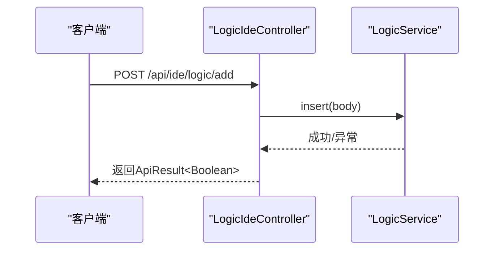
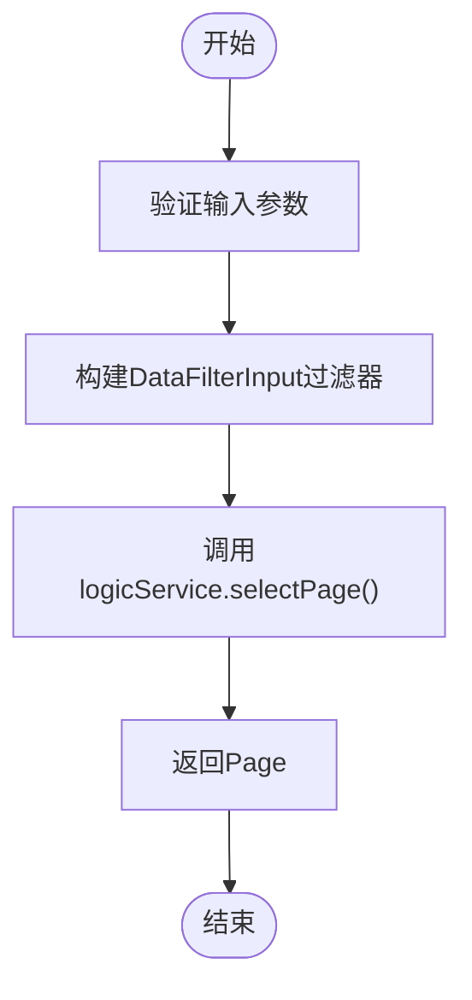
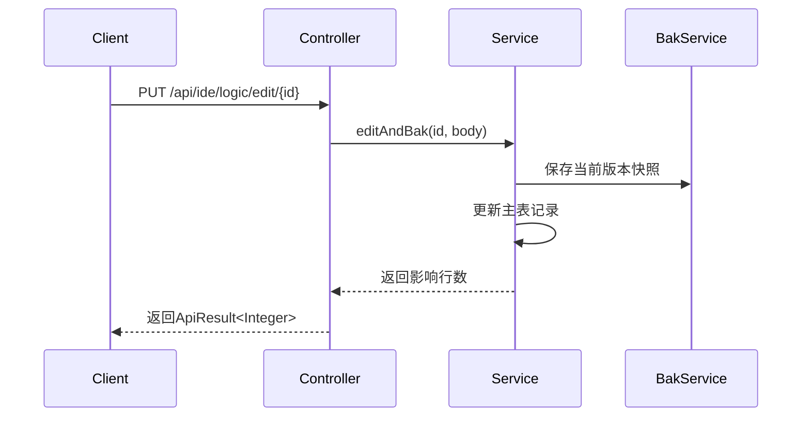
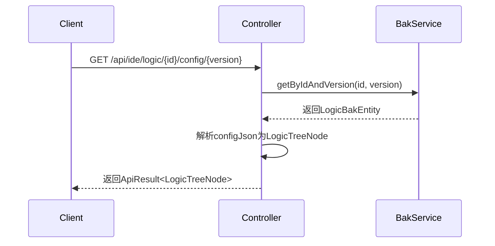
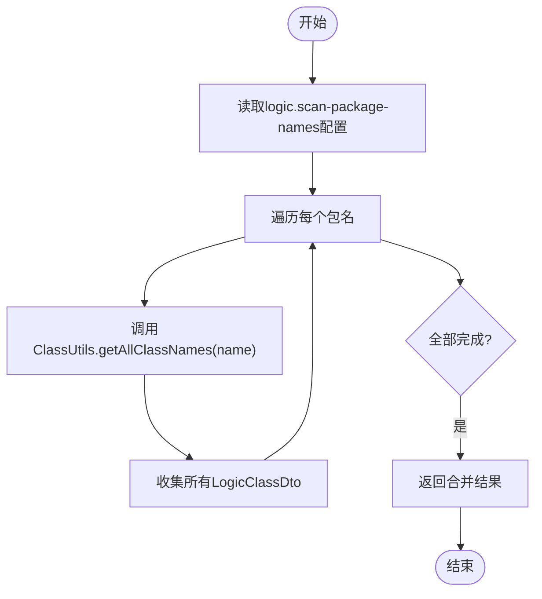
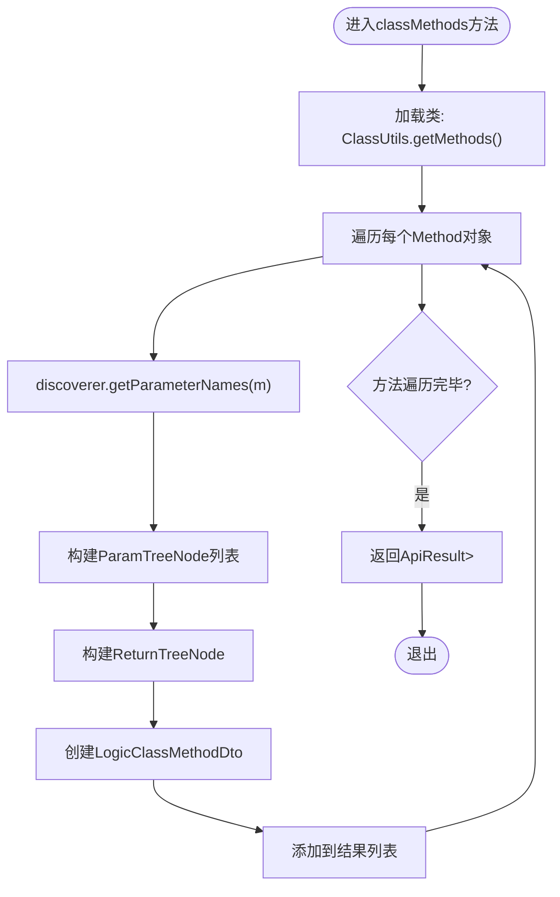

# IDE管理类接口

<cite>
**本文档引用文件**  
- [LogicIdeController.java](file://logic-ide/src/main/java/com/aims/logic/ide/controller/LogicIdeController.java)
- [LogicService.java](file://logic-sdk/src/main/java/com/aims/logic/sdk/service/LogicService.java)
- [LogicBakService.java](file://logic-sdk/src/main/java/com/aims/logic/sdk/service/LogicBakService.java)
- [ClassUtils.java](file://logic-ide/src/main/java/com/aims/logic/ide/util/ClassUtils.java)
- [SourceCodeReader.java](file://logic-ide/src/main/java/com/aims/logic/ide/util/SourceCodeReader.java)
</cite>

## 目录
1. [简介](#简介)
2. [核心功能与接口设计](#核心功能与接口设计)
3. [逻辑配置的增删改查（CRUD）实现机制](#逻辑配置的增删改查crud实现机制)
4. [模块列表与配置获取接口](#模块列表与配置获取接口)
5. [类路径扫描与方法元数据提取技术细节](#类路径扫描与方法元数据提取技术细节)
6. [方法参数名解析机制](#方法参数名解析机制)
7. [实际调用示例](#实际调用示例)
8. [性能优化建议](#性能优化建议)
9. [总结](#总结)

## 简介

`LogicIdeController` 是系统中负责IDE管理功能的核心控制器，提供了一系列RESTful API用于逻辑配置的管理、类路径扫描、方法元数据提取等功能。该控制器通过与 `LogicService` 和 `LogicBakService` 协作，实现了逻辑实体的持久化存储与版本控制，并结合Spring框架的能力完成方法参数名的自动解析。

本文档深入解析其关键接口的设计与实现机制，涵盖从CRUD操作到动态类扫描的技术实现路径。

## 核心功能与接口设计

`LogicIdeController` 提供了以下主要功能接口：

- 逻辑配置的增删改查（CRUD）
- 模块列表获取
- 特定逻辑配置及其历史版本的读取
- Java类路径扫描与方法元数据提取
- 方法源码读取支持

这些接口共同构成了IDE端对业务逻辑进行可视化编辑、调试和部署的基础能力支撑。

**Section sources**
- [LogicIdeController.java](file://logic-ide/src/main/java/com/aims/logic/ide/controller/LogicIdeController.java#L38-L39)

## 逻辑配置的增删改查（CRUD）实现机制

### 新增逻辑配置 `/api/ide/logic/add`

该接口用于新增一个逻辑配置实体。通过 `@PostMapping` 接收 `LogicEntity` 对象作为请求体，调用 `LogicService.insert()` 方法将其持久化至数据库。



**Diagram sources**
- [LogicIdeController.java](file://logic-ide/src/main/java/com/aims/logic/ide/controller/LogicIdeController.java#L65-L73)

### 查询逻辑列表 `/api/ide/logics`

支持两种方式查询逻辑列表：
1. **POST方式**：接收完整的 `FormQueryInput` 查询条件对象，调用 `logicService.selectPage(input)` 分页查询。
2. **GET方式**：支持通过 `qry` 参数模糊匹配ID或名称，构建过滤条件后调用相同服务方法。



**Diagram sources**
- [LogicIdeController.java](file://logic-ide/src/main/java/com/aims/logic/ide/controller/LogicIdeController.java#L75-L79)
- [LogicIdeController.java](file://logic-ide/src/main/java/com/aims/logic/ide/controller/LogicIdeController.java#L81-L91)

### 编辑逻辑配置 `/api/ide/logic/edit/{id}`

该接口实现逻辑配置的更新操作，并自动创建备份版本。核心逻辑调用 `logicService.editAndBak(id, body)`，由服务层完成数据更新与历史版本保存。



**Diagram sources**
- [LogicIdeController.java](file://logic-ide/src/main/java/com/aims/logic/ide/controller/LogicIdeController.java#L93-L97)
- [LogicService.java](file://logic-sdk/src/main/java/com/aims/logic/sdk/service/LogicService.java#L18-L18)

### 删除逻辑配置 `/api/ide/logic/delete/{id}`

通过 `@DeleteMapping` 接收ID路径变量，调用 `logicService.removeById(id)` 实现逻辑删除（或物理删除，取决于实现）。

**Section sources**
- [LogicIdeController.java](file://logic-ide/src/main/java/com/aims/logic/ide/controller/LogicIdeController.java#L99-L103)

## 模块列表与配置获取接口

### 获取模块列表 `/api/ide/modules`

调用 `logicService.getModuleList()` 获取所有可用模块信息，封装为 `ListData` 返回。

**Section sources**
- [LogicIdeController.java](file://logic-ide/src/main/java/com/aims/logic/ide/controller/LogicIdeController.java#L111-L115)
- [LogicService.java](file://logic-sdk/src/main/java/com/aims/logic/sdk/service/LogicService.java#L42-L42)

### 获取逻辑配置 `/api/ide/logic/{id}/config`

根据逻辑ID查询其JSON格式的配置内容，解析为 `LogicTreeNode` 对象结构返回，便于前端构建可视化流程图。

```java
var config = logicEntity.getConfigJson();
var res = JSON.isValid(config) ? JSON.parseObject(config, LogicTreeNode.class) : null;
```

**Section sources**
- [LogicIdeController.java](file://logic-ide/src/main/java/com/aims/logic/ide/controller/LogicIdeController.java#L117-L126)

### 获取指定版本的逻辑配置 `/api/ide/logic/{id}/config/{version}`

通过 `LogicBakService.getByIdAndVersion(id, version)` 查询历史备份记录，实现版本回溯功能。



**Diagram sources**
- [LogicIdeController.java](file://logic-ide/src/main/java/com/aims/logic/ide/controller/LogicIdeController.java#L128-L137)
- [LogicBakService.java](file://logic-sdk/src/main/java/com/aims/logic/sdk/service/LogicBakService.java#L5-L5)

## 类路径扫描与方法元数据提取技术细节

### 类扫描接口 `/api/ide/asset/v1/java/classes`

#### 扫描指定包下的类
```http
GET /api/ide/asset/v1/java/classes/{packageName}
```
调用 `ClassUtils.getAllClassNames(packageName)` 实现指定包名下的类枚举。

#### 扫描配置包下的所有类
```http
GET /api/ide/asset/v1/java/classes
```
读取配置项 `${logic.scan-package-names}`，遍历多个基础包路径，合并结果返回。



**Diagram sources**
- [LogicIdeController.java](file://logic-ide/src/main/java/com/aims/logic/ide/controller/LogicIdeController.java#L178-L182)
- [LogicIdeController.java](file://logic-ide/src/main/java/com/aims/logic/ide/controller/LogicIdeController.java#L184-L196)
- [ClassUtils.java](file://logic-ide/src/main/java/com/aims/logic/ide/util/ClassUtils.java#L253-L288)

### 方法元数据提取 `/api/ide/asset/v1/java/class/{fullClassPath}/methods`

该接口解析指定类中的所有公共方法，提取方法名、参数类型、返回类型及参数名（通过Spring `DefaultParameterNameDiscoverer`）。

处理流程如下：
1. 使用 `ClassUtils.getMethods(fullClassPath)` 获取类的所有方法
2. 遍历每个方法，使用 `discoverer.getParameterNames(m)` 获取参数名数组
3. 结合参数类型构建 `ParamTreeNode` 列表
4. 构建返回值节点 `ReturnTreeNode`
5. 封装为 `LogicClassMethodDto` 返回



**Diagram sources**
- [LogicIdeController.java](file://logic-ide/src/main/java/com/aims/logic/ide/controller/LogicIdeController.java#L200-L228)
- [ClassUtils.java](file://logic-ide/src/main/java/com/aims/logic/ide/util/ClassUtils.java#L109-L112)

## 方法参数名解析机制

系统使用Spring提供的 `DefaultParameterNameDiscoverer` 来获取方法参数的真实名称，而非仅依赖类型信息。

```java
private static final DefaultParameterNameDiscoverer discoverer = new DefaultParameterNameDiscoverer();
```

此机制依赖于编译时保留调试信息（`-parameters` 编译选项），确保 `.class` 文件中包含局部变量表（LocalVariableTable），从而能够正确映射参数索引到参数名。

当调用 `discoverer.getParameterNames(method)` 时，底层会依次尝试：
- `LocalVariableTableParameterNameDiscoverer`：基于字节码的局部变量表
- `StandardReflectionParameterNameDiscoverer`：基于Java 8反射API

若未开启 `-parameters` 编译选项，则返回 `null`，导致无法获取参数名。

**Section sources**
- [LogicIdeController.java](file://logic-ide/src/main/java/com/aims/logic/ide/controller/LogicIdeController.java#L198-L198)

## 实际调用示例

### 获取某个类的所有方法元数据
```http
GET /api/ide/asset/v1/java/class/com.aims.logic.demo.service.UserService/methods
```

响应示例：
```json
{
  "data": [
    {
      "name": "getUserById",
      "parameters": [
        { "name": "userId", "type": "java.lang.String" },
        { "name": "context", "type": "com.aims.logic.runtime.context.LogicContext" }
      ],
      "returnType": { "name": "返回值", "type": "com.aims.logic.demo.model.User" }
    }
  ]
}
```

### 获取指定版本的逻辑配置
```http
GET /api/ide/logic/LG001/config/v20240401_1530
```

## 性能优化建议

在大规模类路径扫描场景下，建议采取以下优化措施：

1. **缓存扫描结果**：对 `getAllClassNames()` 的结果进行缓存（如使用Caffeine），避免重复扫描类路径。
2. **限制扫描范围**：通过配置精确指定需要扫描的包路径，避免全量扫描。
3. **异步初始化**：在应用启动时异步预加载常用类列表，减少首次请求延迟。
4. **分页支持**：对于返回结果较大的接口，增加分页参数支持，避免一次性返回过多数据。
5. **启用-parameters编译**：确保编译时添加 `-parameters` 参数，保障参数名解析成功率。

## 总结

`LogicIdeController` 作为IDE功能的核心入口，通过整合 `LogicService` 与 `LogicBakService` 实现了逻辑配置的完整生命周期管理，并借助Spring的反射工具链实现了方法元数据的动态提取。其设计充分考虑了可维护性与扩展性，为前端提供了强大的元数据支撑能力。

未来可进一步增强类扫描性能、支持更多语言特性（如泛型参数解析）、并引入更智能的缓存策略以提升整体响应效率。