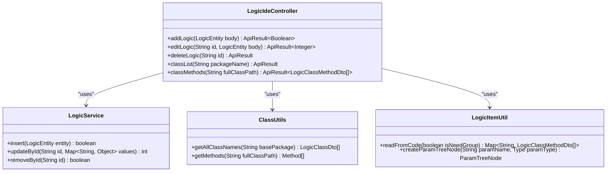
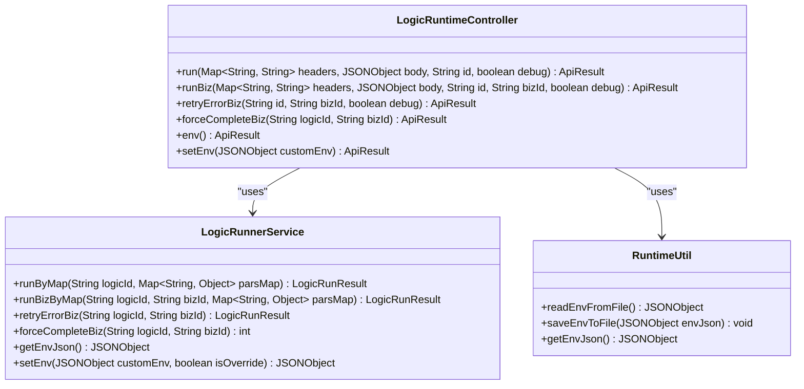
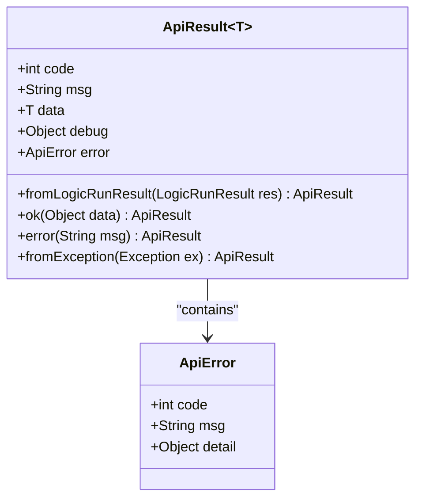

# 控制器接口

<cite>
**本文档中引用的文件**   
- [LogicIdeController.java](file://logic-ide/src/main/java/com/aims/logic/ide/controller/LogicIdeController.java)
- [LogicRuntimeController.java](file://logic-ide/src/main/java/com/aims/logic/ide/controller/LogicRuntimeController.java)
- [ApiResult.java](file://logic-ide/src/main/java/com/aims/logic/ide/controller/dto/ApiResult.java)
- [LogicService.java](file://logic-sdk/src/main/java/com/aims/logic/sdk/service/LogicService.java)
- [LogicRunnerService.java](file://logic-runtime/src/main/java/com/aims/logic/runtime/service/LogicRunnerService.java)
- [RuntimeUtil.java](file://logic-runtime/src/main/java/com/aims/logic/runtime/util/RuntimeUtil.java)
- [ClassUtils.java](file://logic-ide/src/main/java/com/aims/logic/ide/util/ClassUtils.java)
- [LogicItemUtil.java](file://logic-ide/src/main/java/com/aims/logic/ide/util/LogicItemUtil.java)
</cite>

## 目录
1. [引言](#引言)
2. [核心控制器职责划分](#核心控制器职责划分)
3. [LogicIdeController 详细分析](#logicidecontroller-详细分析)
4. [LogicRuntimeController 详细分析](#logicruntimecontroller-详细分析)
5. [统一响应结构 ApiResult](#统一响应结构-apiresult)
6. [请求处理流程与参数绑定](#请求处理流程与参数绑定)
7. [接口调用示例](#接口调用示例)
8. [高并发场景下的潜在问题与应对策略](#高并发场景下的潜在问题与应对策略)
9. [结论](#结论)

## 引言
本文档深入解析 `LogicIdeController` 和 `LogicRuntimeController` 两个核心控制器的职责划分与实现细节。`LogicIdeController` 主要负责逻辑配置的增删改查（CRUD）、类扫描、方法元数据提取等开发期功能，而 `LogicRuntimeController` 则专注于运行时逻辑执行、业务实例控制、环境变量管理及调试支持。文档将结合具体端点说明请求处理流程、参数绑定机制和安全考虑，并讨论高并发场景下的潜在问题与应对策略。

## 核心控制器职责划分
`LogicIdeController` 和 `LogicRuntimeController` 在系统中扮演着不同的角色，分别服务于开发期和运行期。

- **LogicIdeController**：作为开发期控制器，提供逻辑配置的管理接口，包括增删改查、版本管理、类扫描和方法元数据提取等功能。它还支持远程运行时列表的获取，便于开发人员在IDE中进行配置和调试。
- **LogicRuntimeController**：作为运行期控制器，提供逻辑执行的接口，支持无状态和有状态的逻辑运行、业务实例的重试和强制完成、环境变量的动态修改以及配置缓存的管理。它还提供了调试支持，允许在运行时查看和修改环境变量。

这种职责划分确保了开发期和运行期的功能分离，提高了系统的可维护性和安全性。

**Section sources**
- [LogicIdeController.java](file://logic-ide/src/main/java/com/aims/logic/ide/controller/LogicIdeController.java)
- [LogicRuntimeController.java](file://logic-ide/src/main/java/com/aims/logic/ide/controller/LogicRuntimeController.java)

## LogicIdeController 详细分析
`LogicIdeController` 提供了丰富的开发期功能，主要包括逻辑配置的增删改查、类扫描、方法元数据提取等。

### 逻辑配置的增删改查
`LogicIdeController` 提供了标准的CRUD接口，用于管理逻辑配置。例如，`addLogic` 方法用于添加新的逻辑配置，`editLogic` 方法用于编辑现有逻辑配置，`deleteLogic` 方法用于删除逻辑配置。这些方法通过 `LogicService` 与数据库交互，确保数据的一致性和完整性。

### 类扫描与方法元数据提取
`LogicIdeController` 还提供了类扫描和方法元数据提取功能。`classList` 方法用于获取指定包下的所有类，`classMethods` 方法用于获取指定类的所有方法及其参数和返回值的元数据。这些功能依赖于 `ClassUtils` 和 `LogicItemUtil` 工具类，通过反射和字节码分析技术实现。



**Diagram sources **
- [LogicIdeController.java](file://logic-ide/src/main/java/com/aims/logic/ide/controller/LogicIdeController.java)
- [LogicService.java](file://logic-sdk/src/main/java/com/aims/logic/sdk/service/LogicService.java)
- [ClassUtils.java](file://logic-ide/src/main/java/com/aims/logic/ide/util/ClassUtils.java)
- [LogicItemUtil.java](file://logic-ide/src/main/java/com/aims/logic/ide/util/LogicItemUtil.java)

**Section sources**
- [LogicIdeController.java](file://logic-ide/src/main/java/com/aims/logic/ide/controller/LogicIdeController.java)
- [LogicService.java](file://logic-sdk/src/main/java/com/aims/logic/sdk/service/LogicService.java)
- [ClassUtils.java](file://logic-ide/src/main/java/com/aims/logic/ide/util/ClassUtils.java)
- [LogicItemUtil.java](file://logic-ide/src/main/java/com/aims/logic/ide/util/LogicItemUtil.java)

## LogicRuntimeController 详细分析
`LogicRuntimeController` 提供了运行时逻辑执行的核心功能，包括逻辑运行、业务实例控制、环境变量管理等。

### 逻辑运行
`LogicRuntimeController` 提供了 `run` 和 `runBiz` 方法，用于执行无状态和有状态的逻辑。`run` 方法通过 `LogicRunnerService` 创建一个新的逻辑运行器，并执行指定的逻辑配置。`runBiz` 方法则支持有状态的逻辑执行，允许在业务实例中保持状态信息。

### 业务实例控制
`LogicRuntimeController` 还提供了业务实例的控制功能，如 `retryErrorBiz` 方法用于重试发生异常的业务实例，`forceCompleteBiz` 方法用于强制完成业务实例。这些功能通过 `LogicRunnerService` 实现，确保业务实例的可靠性和一致性。

### 环境变量管理
`LogicRuntimeController` 提供了环境变量的动态管理功能。`env` 方法用于查看当前的环境变量配置，`setEnv` 方法用于修改内存中的环境变量。这些功能通过 `RuntimeUtil` 工具类实现，支持在运行时动态调整环境变量，而无需重启服务。



**Diagram sources **
- [LogicRuntimeController.java](file://logic-ide/src/main/java/com/aims/logic/ide/controller/LogicRuntimeController.java)
- [LogicRunnerService.java](file://logic-runtime/src/main/java/com/aims/logic/runtime/service/LogicRunnerService.java)
- [RuntimeUtil.java](file://logic-runtime/src/main/java/com/aims/logic/runtime/util/RuntimeUtil.java)

**Section sources**
- [LogicRuntimeController.java](file://logic-ide/src/main/java/com/aims/logic/ide/controller/LogicRuntimeController.java)
- [LogicRunnerService.java](file://logic-runtime/src/main/java/com/aims/logic/runtime/service/LogicRunnerService.java)
- [RuntimeUtil.java](file://logic-runtime/src/main/java/com/aims/logic/runtime/util/RuntimeUtil.java)

## 统一响应结构 ApiResult
`ApiResult` 是系统中统一的响应结构，用于封装API调用的结果。它包含状态码、消息、数据、调试信息和错误信息等字段，确保了API响应的一致性和可读性。

### 设计原理
`ApiResult` 的设计遵循了RESTful API的最佳实践，通过 `code` 字段表示请求的状态，`msg` 字段提供简要的描述，`data` 字段包含实际的返回数据，`debug` 字段用于调试信息，`error` 字段用于详细的错误信息。这种设计使得客户端可以方便地解析和处理API响应。

### 异常传播
`ApiResult` 还支持异常的传播。当API调用发生异常时，`fromException` 方法会将异常信息封装到 `ApiResult` 中，确保异常信息能够传递到客户端。这有助于客户端快速定位和解决问题。



**Diagram sources **
- [ApiResult.java](file://logic-ide/src/main/java/com/aims/logic/ide/controller/dto/ApiResult.java)

**Section sources**
- [ApiResult.java](file://logic-ide/src/main/java/com/aims/logic/ide/controller/dto/ApiResult.java)

## 请求处理流程与参数绑定
### 请求处理流程
以 `/api/ide/logic/add` 和 `/api/runtime/logic/v1/run-api/{id}` 为例，说明请求处理流程。

- **/api/ide/logic/add**：客户端发送POST请求，携带逻辑配置的JSON数据。`LogicIdeController` 接收到请求后，调用 `LogicService` 的 `insert` 方法将逻辑配置保存到数据库。如果保存成功，返回 `ApiResult` 对象，`data` 字段为 `true`；如果发生异常，捕获异常并返回 `ApiResult` 对象，`error` 字段包含异常信息。
- **/api/runtime/logic/v1/run-api/{id}**：客户端发送POST请求，携带请求头、请求体和逻辑ID。`LogicRuntimeController` 接收到请求后，调用 `LogicRunnerService` 的 `runByMap` 方法执行逻辑。如果执行成功，返回 `ApiResult` 对象，`data` 字段包含执行结果；如果发生异常，捕获异常并返回 `ApiResult` 对象，`error` 字段包含异常信息。

### 参数绑定机制
Spring MVC 提供了强大的参数绑定机制，支持从请求头、请求体、路径变量和查询参数中提取数据。例如，`@RequestHeader` 注解用于绑定请求头，`@RequestBody` 注解用于绑定请求体，`@PathVariable` 注解用于绑定路径变量，`@RequestParam` 注解用于绑定查询参数。这些注解使得参数绑定变得简单和直观。

### 安全考虑
在处理请求时，需要考虑安全性。例如，对输入数据进行校验，防止SQL注入和XSS攻击；对敏感操作进行权限验证，确保只有授权用户才能执行；对异常信息进行脱敏处理，防止泄露敏感信息。

**Section sources**
- [LogicIdeController.java](file://logic-ide/src/main/java/com/aims/logic/ide/controller/LogicIdeController.java)
- [LogicRuntimeController.java](file://logic-ide/src/main/java/com/aims/logic/ide/controller/LogicRuntimeController.java)

## 接口调用示例
### 添加逻辑配置
```http
POST /api/ide/logic/add
Content-Type: application/json

{
  "id": "logic-001",
  "name": "测试逻辑",
  "module": "test",
  "configJson": "{\"nodes\":[{\"id\":\"start\",\"type\":\"start\"}]}"
}
```

### 执行逻辑
```http
POST /api/runtime/logic/v1/run-api/logic-001
Content-Type: application/json
X-Header: value

{
  "input": "test"
}
```

## 高并发场景下的潜在问题与应对策略
### 潜在问题
在高并发场景下，可能会遇到以下问题：
- **数据库连接池耗尽**：大量并发请求可能导致数据库连接池耗尽，影响系统性能。
- **缓存击穿**：热点数据的缓存失效，导致大量请求直接访问数据库，造成数据库压力过大。
- **锁竞争**：多个请求同时访问同一资源，导致锁竞争，影响系统吞吐量。

### 应对策略
- **数据库连接池优化**：增加数据库连接池的大小，合理配置连接池参数，如最大连接数、最小连接数、连接超时时间等。
- **缓存策略优化**：使用分布式缓存，如Redis，提高缓存的可用性和性能；设置合理的缓存过期时间，避免缓存击穿。
- **锁优化**：使用乐观锁或分布式锁，减少锁竞争；合理设计业务逻辑，避免长时间持有锁。

**Section sources**
- [LogicIdeController.java](file://logic-ide/src/main/java/com/aims/logic/ide/controller/LogicIdeController.java)
- [LogicRuntimeController.java](file://logic-ide/src/main/java/com/aims/logic/ide/controller/LogicRuntimeController.java)

## 结论
`LogicIdeController` 和 `LogicRuntimeController` 通过明确的职责划分，分别服务于开发期和运行期，确保了系统的可维护性和安全性。`ApiResult` 统一响应结构的设计，提高了API响应的一致性和可读性。通过合理的请求处理流程和参数绑定机制，确保了系统的稳定性和可靠性。在高并发场景下，通过优化数据库连接池、缓存策略和锁机制，可以有效应对潜在问题，提高系统的性能和可用性。