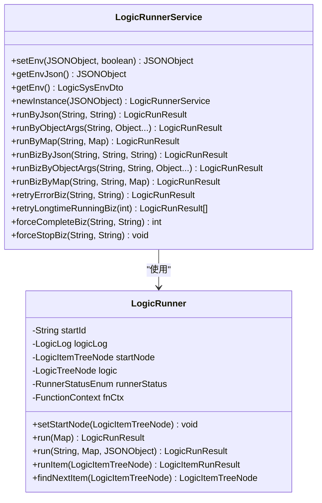
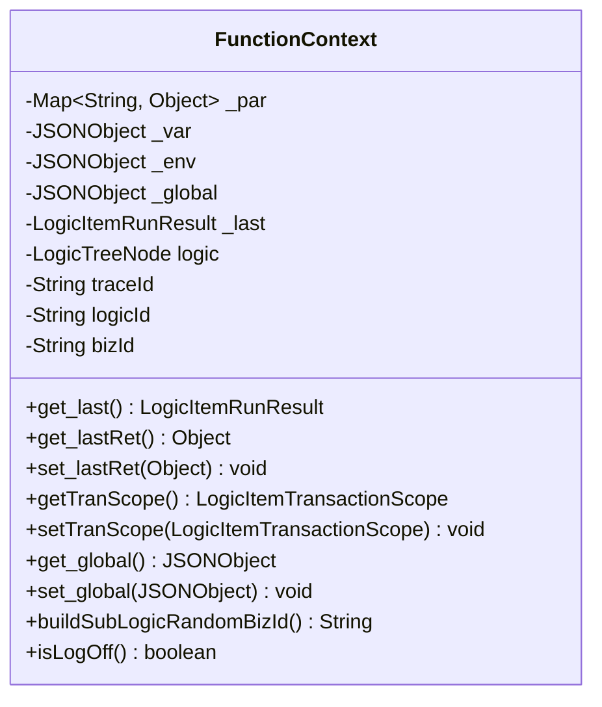
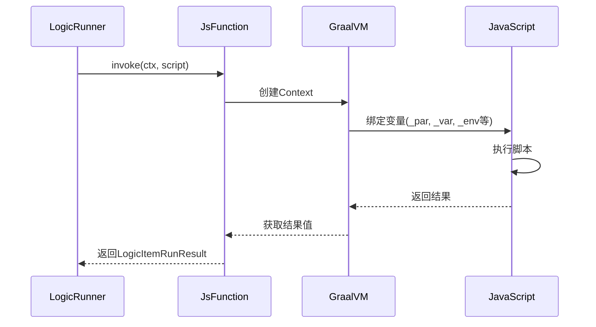
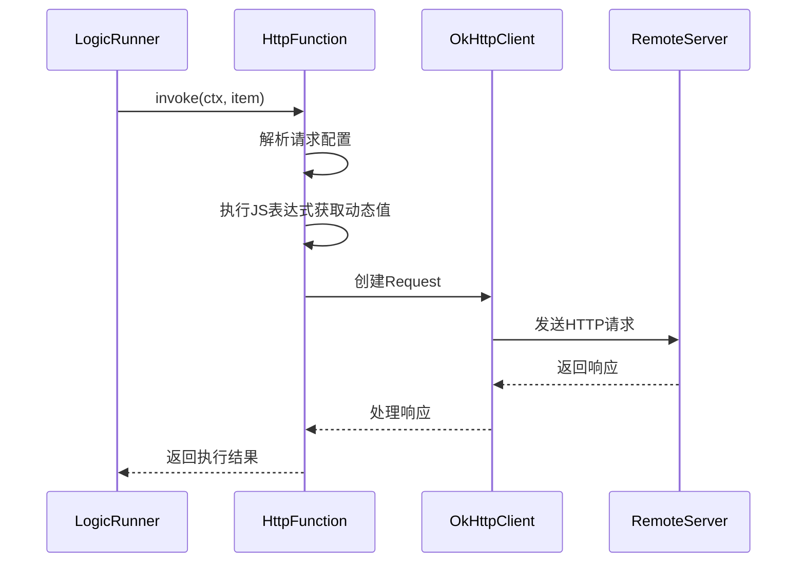
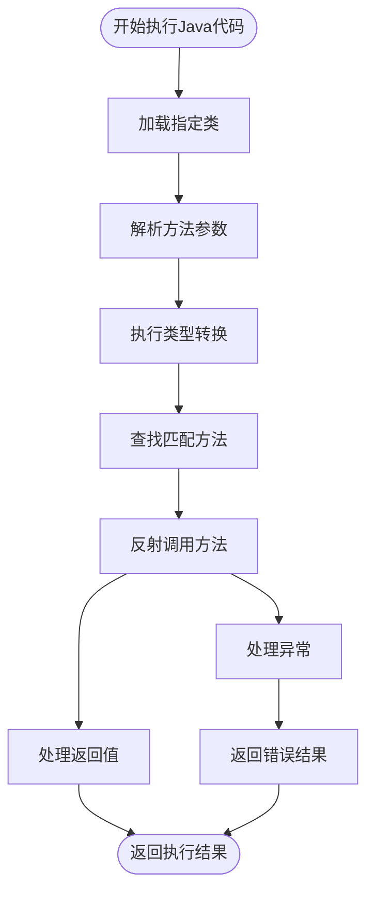
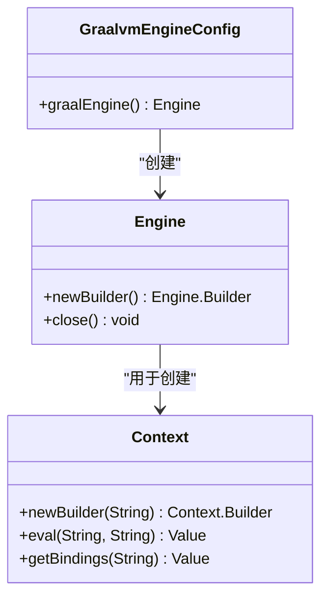
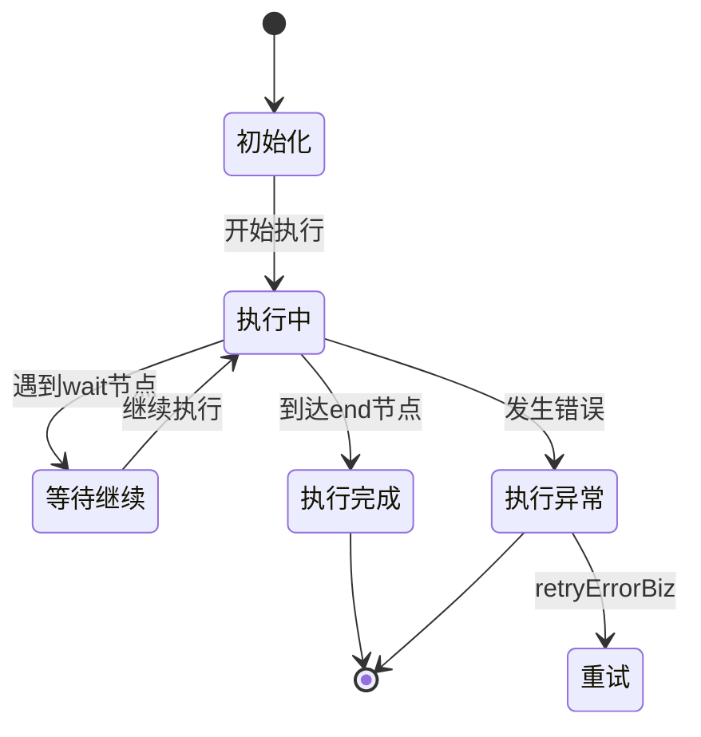
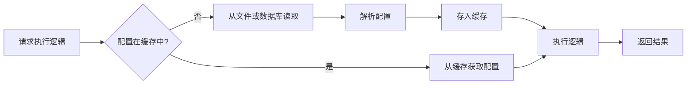
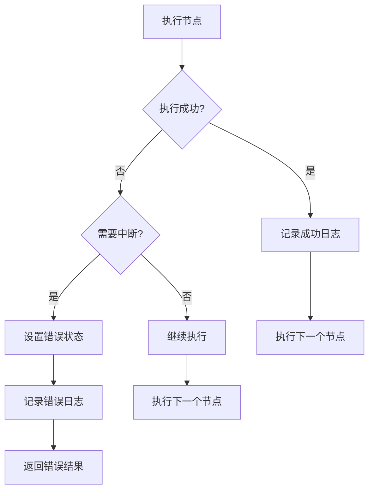

# logic-runtime模块

<cite>
**本文档引用的文件**   
- [LogicRunnerService.java](file://logic-runtime/src/main/java/com/aims/logic/runtime/service/LogicRunnerService.java)
- [GraalvmEngineConfig.java](file://logic-runtime/src/main/java/com/aims/logic/runtime/configuration/GraalvmEngineConfig.java)
- [LogicRunner.java](file://logic-runtime/src/main/java/com/aims/logic/runtime/runner/LogicRunner.java)
- [FunctionContext.java](file://logic-runtime/src/main/java/com/aims/logic/runtime/runner/FunctionContext.java)
- [JsFunction.java](file://logic-runtime/src/main/java/com/aims/logic/runtime/runner/functions/impl/JsFunction.java)
- [HttpFunction.java](file://logic-runtime/src/main/java/com/aims/logic/runtime/runner/functions/impl/HttpFunction.java)
- [JavaCodeFunction.java](file://logic-runtime/src/main/java/com/aims/logic/runtime/runner/functions/impl/JavaCodeFunction.java)
</cite>

## 目录
1. [简介](#简介)
2. [核心执行引擎](#核心执行引擎)
3. [执行上下文管理](#执行上下文管理)
4. [具体函数实现](#具体函数实现)
5. [GraalVM引擎配置](#graalvm引擎配置)
6. [状态持久化机制](#状态持久化机制)
7. [性能优化策略](#性能优化策略)
8. [执行监控与异常处理](#执行监控与异常处理)
9. [最佳实践](#最佳实践)

## 简介
logic-runtime模块是逻辑执行引擎的核心组件，负责解析和执行通过可视化编排定义的业务逻辑。该模块提供了灵活的函数执行能力，支持JavaScript、HTTP调用和Java代码等多种执行方式。通过GraalVM引擎实现高性能的脚本执行，并提供了完善的执行上下文管理和状态持久化机制。

**Section sources**
- [LogicRunnerService.java](file://logic-runtime/src/main/java/com/aims/logic/runtime/service/LogicRunnerService.java#L12-L287)

## 核心执行引擎

logic-runtime模块的核心是LogicRunnerService，作为主要入口点，它提供了执行逻辑的各种方法。该服务支持无状态和有状态两种执行模式，能够处理JSON字符串、对象数组和Map等多种参数形式。

LogicRunnerService通过LogicRunner类来实际执行逻辑流程。LogicRunner负责初始化执行环境、管理执行状态和协调各个节点的执行。执行流程从开始节点启动，根据节点类型和配置依次执行，直到达到结束节点或遇到错误。

**Diagram sources **
- [LogicRunnerService.java](file://logic-runtime/src/main/java/com/aims/logic/runtime/service/LogicRunnerService.java#L12-L287)
- [LogicRunner.java](file://logic-runtime/src/main/java/com/aims/logic/runtime/runner/LogicRunner.java#L26-L289)

**Section sources**
- [LogicRunnerService.java](file://logic-runtime/src/main/java/com/aims/logic/runtime/service/LogicRunnerService.java#L12-L287)
- [LogicRunner.java](file://logic-runtime/src/main/java/com/aims/logic/runtime/runner/LogicRunner.java#L26-L289)

## 执行上下文管理

执行上下文由FunctionContext类管理，它封装了执行过程中所需的所有变量和状态。FunctionContext提供了对参数(_par)、局部变量(_var)、环境变量(_env)和全局变量(_global)的访问和操作。

上下文管理的关键特性包括：
- **参数管理**：通过_set_par_方法设置和获取执行参数
- **变量管理**：通过_set_var_方法管理局部变量，支持在执行过程中动态修改
- **环境变量**：通过_set_env_方法配置执行环境，影响执行行为
- **全局变量**：通过_set_global_方法管理跨逻辑调用的共享数据

**Diagram sources **
- [FunctionContext.java](file://logic-runtime/src/main/java/com/aims/logic/runtime/runner/FunctionContext.java#L14-L103)

**Section sources**
- [FunctionContext.java](file://logic-runtime/src/main/java/com/aims/logic/runtime/runner/FunctionContext.java#L14-L103)

## 具体函数实现

### JsFunction
JsFunction类负责执行JavaScript代码，它利用GraalVM引擎提供高性能的脚本执行能力。该实现将执行上下文中的变量注入到JavaScript环境中，使得脚本可以直接访问参数、局部变量和环境变量。

执行过程包括：
1. 创建GraalVM Context并配置JavaScript引擎
2. 将FunctionContext中的变量绑定到JavaScript上下文
3. 包装脚本代码为函数并执行
4. 处理执行结果和异常

**Diagram sources **
- [JsFunction.java](file://logic-runtime/src/main/java/com/aims/logic/runtime/runner/functions/impl/JsFunction.java#L19-L146)

### HttpFunction
HttpFunction类用于执行HTTP请求，支持GET、POST等常见HTTP方法。它允许在请求中动态配置URL、请求头、请求体和超时时间。

关键特性：
- 支持通过JavaScript表达式动态生成请求参数
- 自动处理JSON请求和响应
- 支持相对URL，自动补全宿主服务地址
- 完善的错误处理机制

**Diagram sources **
- [HttpFunction.java](file://logic-runtime/src/main/java/com/aims/logic/runtime/runner/functions/impl/HttpFunction.java#L22-L117)

### JavaCodeFunction
JavaCodeFunction类用于执行Java代码，支持调用指定类的方法。它通过反射机制实现动态方法调用，并支持复杂的参数类型转换。

执行流程：
1. 加载指定的Java类
2. 解析方法参数声明和实际参数
3. 执行类型转换和参数匹配
4. 通过反射调用目标方法
5. 处理返回值和异常

**Diagram sources **
- [JavaCodeFunction.java](file://logic-runtime/src/main/java/com/aims/logic/runtime/runner/functions/impl/JavaCodeFunction.java#L21-L180)

**Section sources**
- [JsFunction.java](file://logic-runtime/src/main/java/com/aims/logic/runtime/runner/functions/impl/JsFunction.java#L19-L146)
- [HttpFunction.java](file://logic-runtime/src/main/java/com/aims/logic/runtime/runner/functions/impl/HttpFunction.java#L22-L117)
- [JavaCodeFunction.java](file://logic-runtime/src/main/java/com/aims/logic/runtime/runner/functions/impl/JavaCodeFunction.java#L21-L180)

## GraalVM引擎配置

GraalvmEngineConfig类负责配置和管理GraalVM引擎实例。通过Spring的@Bean注解，创建一个共享的Engine实例，该实例在整个应用生命周期内复用，提高性能。

配置要点：
- 使用Engine.newBuilder()创建引擎构建器
- 设置"engine.WarnInterpreterOnly"选项为false，禁用解释器警告
- 配置destroyMethod为"close"，确保应用关闭时正确释放资源

**Diagram sources **
- [GraalvmEngineConfig.java](file://logic-runtime/src/main/java/com/aims/logic/runtime/configuration/GraalvmEngineConfig.java#L6-L14)

**Section sources**
- [GraalvmEngineConfig.java](file://logic-runtime/src/main/java/com/aims/logic/runtime/configuration/GraalvmEngineConfig.java#L6-L14)

## 状态持久化机制

logic-runtime模块通过多种机制实现执行状态的持久化和恢复：

1. **局部变量持久化**：在执行过程中，局部变量(_var)的状态会被持续更新和保存
2. **业务实例管理**：对于有状态执行，通过bizId标识业务实例，支持重试和继续执行
3. **执行日志**：记录每个节点的执行详情，包括输入、输出和执行时间
4. **缓存机制**：使用Caffeine缓存逻辑配置，提高重复执行的性能

状态管理的关键方法包括：
- retryErrorBiz：重试存在异常的业务实例
- resetBizInstanceNextId：重置实例的待执行节点
- updateBizInstanceParams：更新业务实例的入参
- forceStopBiz：强制停止业务实例

**Section sources**
- [LogicRunnerService.java](file://logic-runtime/src/main/java/com/aims/logic/runtime/service/LogicRunnerService.java#L12-L287)
- [LogicRunner.java](file://logic-runtime/src/main/java/com/aims/logic/runtime/runner/LogicRunner.java#L26-L289)

## 性能优化策略

### 脚本编译缓存
通过共享的GraalVM引擎实例，实现脚本编译结果的缓存。相同的JavaScript代码在多次执行时不需要重复编译，显著提高执行性能。

### 并发执行
支持并发执行多个逻辑实例，通过bizId进行隔离。在测试用例中展示了使用线程池并发执行的示例，确保在高并发场景下的性能表现。

### 配置缓存
使用Caffeine缓存逻辑配置，避免重复读取和解析配置文件。缓存策略可以根据访问频率自动调整，确保常用配置的快速访问。

**Section sources**
- [LogicRunnerService.java](file://logic-runtime/src/main/java/com/aims/logic/runtime/service/LogicRunnerService.java#L12-L287)
- [CaffeineCacheConfig.java](file://logic-runtime/src/main/java/com/aims/logic/runtime/configuration/CaffeineCacheConfig.java#L6-L22)

## 执行监控与异常处理

### 执行状态监控
LogicRunnerService提供了多种方法来监控执行状态：
- queryUncompletedBiz：查询未完成的业务实例
- queryLongtimeRunningBiz：查询超时运行的业务
- clearLog：清除所有日志
- clearCompletedInstance：清除已完成的实例

### 异常处理机制
完善的异常处理策略包括：
- **错误重试**：提供retryErrorBiz方法重试失败的业务
- **超时处理**：支持配置执行超时，防止长时间运行
- **强制停止**：通过forceStopBiz方法强制停止执行
- **异常分类**：区分业务异常和技术异常，采取不同的处理策略

**Section sources**
- [LogicRunnerService.java](file://logic-runtime/src/main/java/com/aims/logic/runtime/service/LogicRunnerService.java#L12-L287)

## 最佳实践

### GraalVM引擎交互
1. **复用引擎实例**：通过依赖注入获取共享的Engine实例，避免创建过多引擎
2. **资源管理**：使用try-with-resources确保Context正确关闭
3. **安全性**：限制JavaScript代码的执行权限，避免安全风险
4. **性能监控**：监控脚本执行时间，及时发现性能瓶颈

### 执行模式选择
- **无状态执行**：适用于简单的、独立的逻辑处理
- **有状态执行**：适用于需要维护业务状态的复杂流程
- **并发执行**：在高吞吐量场景下使用线程池并发处理

### 错误处理建议
1. **预定义错误码**：为常见错误定义标准错误码
2. **详细日志**：记录足够的上下文信息，便于问题排查
3. **优雅降级**：在关键路径上实现降级策略
4. **监控告警**：集成监控系统，及时发现和响应异常

**Section sources**
- [LogicRunnerService.java](file://logic-runtime/src/main/java/com/aims/logic/runtime/service/LogicRunnerService.java#L12-L287)
- [JsFunction.java](file://logic-runtime/src/main/java/com/aims/logic/runtime/runner/functions/impl/JsFunction.java#L19-L146)
- [GraalvmEngineConfig.java](file://logic-runtime/src/main/java/com/aims/logic/runtime/configuration/GraalvmEngineConfig.java#L6-L14)