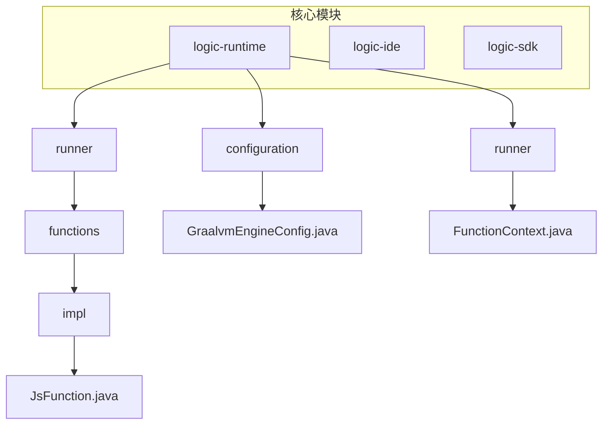
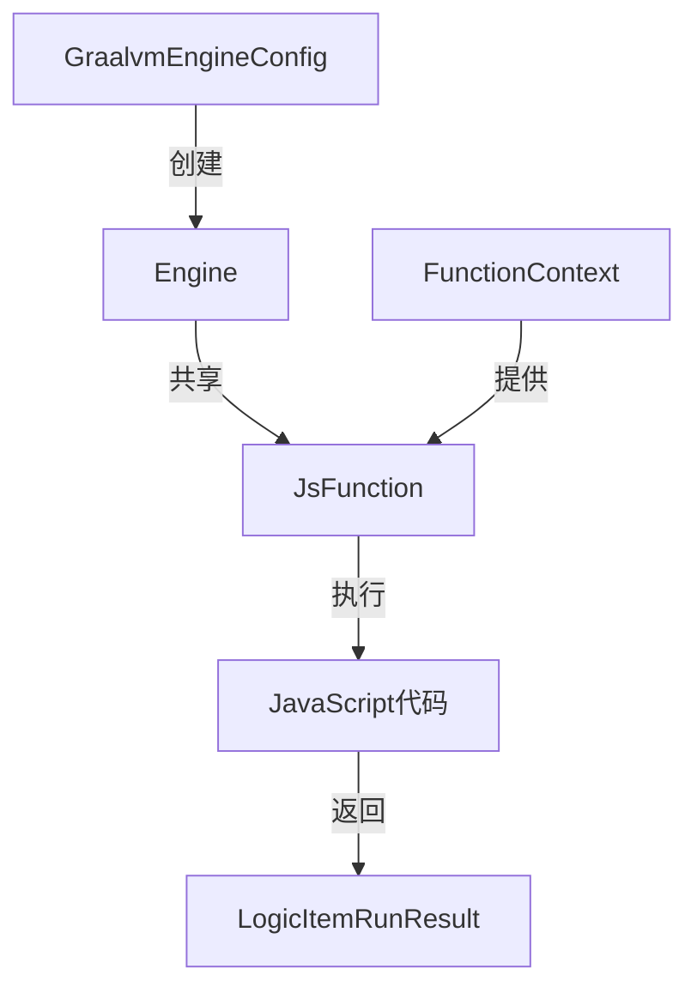
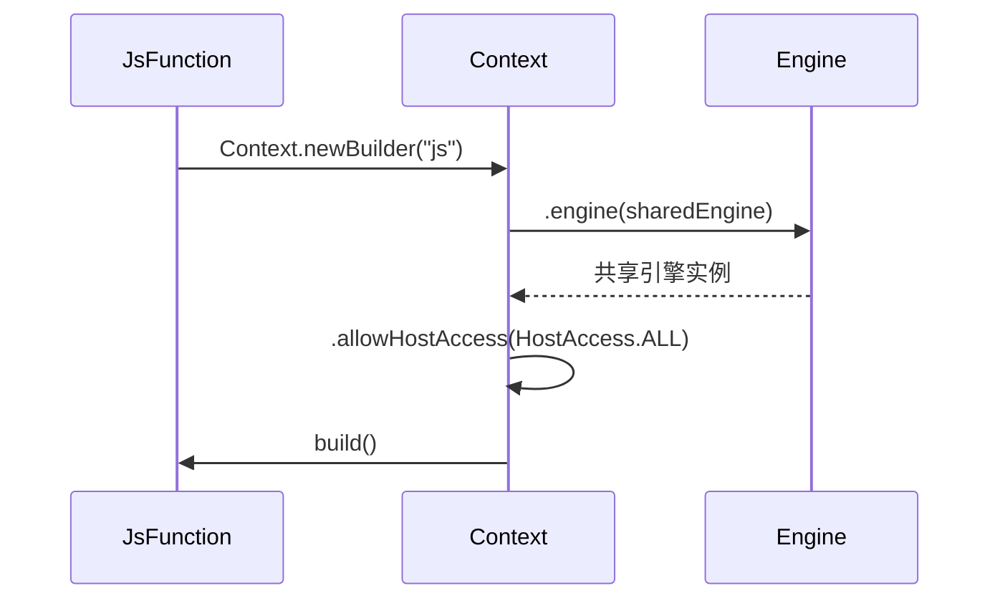
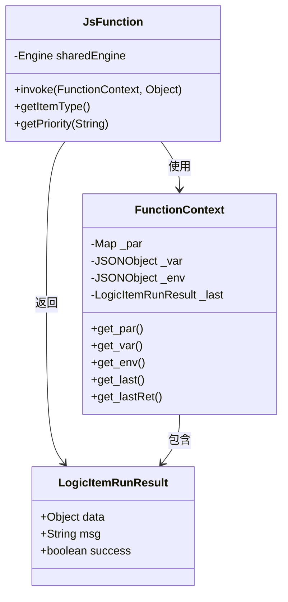
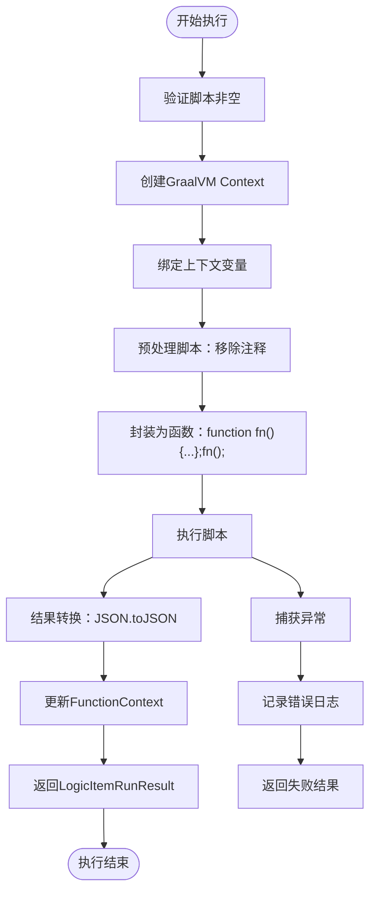
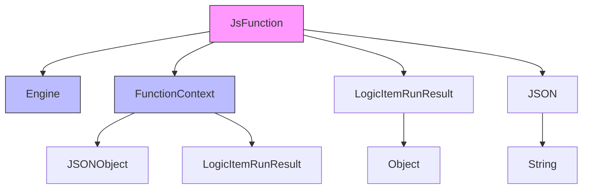

# JavaScript函数实现

<cite>
**本文档引用文件**  
- [JsFunction.java](file://logic-runtime/src/main/java/com/aims/logic/runtime/runner/functions/impl/JsFunction.java)
- [GraalvmEngineConfig.java](file://logic-runtime/src/main/java/com/aims/logic/runtime/configuration/GraalvmEngineConfig.java)
- [FunctionContext.java](file://logic-runtime/src/main/java/com/aims/logic/runtime/runner/FunctionContext.java)
- [ILogicItemFunctionRunner.java](file://logic-runtime/src/main/java/com/aims/logic/runtime/runner/functions/ILogicItemFunctionRunner.java)
- [LogicItemRunResult.java](file://logic-runtime/src/main/java/com/aims/logic/runtime/contract/dto/LogicItemRunResult.java)
</cite>

## 目录
1. [简介](#简介)
2. [项目结构](#项目结构)
3. [核心组件](#核心组件)
4. [架构概述](#架构概述)
5. [详细组件分析](#详细组件分析)
6. [依赖分析](#依赖分析)
7. [性能考虑](#性能考虑)
8. [故障排除指南](#故障排除指南)
9. [结论](#结论)

## 简介
本文档详细说明了`JsFunction`类如何利用GraalVM引擎执行JavaScript代码。重点分析其通过`Context.newBuilder`创建JS执行上下文的过程，以及如何将执行上下文中的`_var`、`_env`、`_par`等变量绑定到GraalVM环境中。文档还描述了代码中使用`JSON.toJSON`进行数据转换以确保线程安全的机制，分析了`invoke`方法中对脚本的预处理（移除注释）和函数封装执行的实现方式，说明了执行异常时的错误捕获和日志记录策略，并提供了在实际业务场景中使用JS函数的最佳实践示例。

## 项目结构
本项目采用模块化设计，主要包含`logic-runtime`、`logic-ide`、`logic-sdk`等核心模块。其中`logic-runtime`模块负责逻辑执行核心功能，特别是JavaScript函数的执行。`JsFunction`类位于`logic-runtime`模块的`runner/functions/impl`包中，是JavaScript节点执行的核心实现。

**Diagram sources**
- [JsFunction.java](file://logic-runtime/src/main/java/com/aims/logic/runtime/runner/functions/impl/JsFunction.java)
- [GraalvmEngineConfig.java](file://logic-runtime/src/main/java/com/aims/logic/runtime/configuration/GraalvmEngineConfig.java)
- [FunctionContext.java](file://logic-runtime/src/main/java/com/aims/logic/runtime/runner/FunctionContext.java)

**Section sources**
- [JsFunction.java](file://logic-runtime/src/main/java/com/aims/logic/runtime/runner/functions/impl/JsFunction.java)
- [GraalvmEngineConfig.java](file://logic-runtime/src/main/java/com/aims/logic/runtime/configuration/GraalvmEngineConfig.java)

## 核心组件
`JsFunction`是JavaScript执行的核心组件，实现了`ILogicItemFunctionRunner`接口，负责在GraalVM引擎中执行JavaScript代码。该组件通过依赖注入获取共享的`Engine`实例，确保在应用生命周期内复用GraalVM引擎，提高执行效率。

**Section sources**
- [JsFunction.java](file://logic-runtime/src/main/java/com/aims/logic/runtime/runner/functions/impl/JsFunction.java#L23-L27)
- [ILogicItemFunctionRunner.java](file://logic-runtime/src/main/java/com/aims/logic/runtime/runner/functions/ILogicItemFunctionRunner.java)

## 架构概述
系统采用GraalVM作为JavaScript执行引擎，通过Spring框架管理组件生命周期。`GraalvmEngineConfig`配置类创建并管理共享的`Engine`实例，`JsFunction`通过构造函数注入该实例。执行时，`JsFunction`为每次调用创建独立的`Context`，确保执行隔离性。

**Diagram sources**
- [GraalvmEngineConfig.java](file://logic-runtime/src/main/java/com/aims/logic/runtime/configuration/GraalvmEngineConfig.java#L10-L15)
- [JsFunction.java](file://logic-runtime/src/main/java/com/aims/logic/runtime/runner/functions/impl/JsFunction.java#L25-L27)

## 详细组件分析

### JsFunction分析
`JsFunction`类是JavaScript执行的核心实现，负责管理GraalVM上下文的创建、变量绑定、脚本执行和结果处理。

#### 执行上下文创建

**Diagram sources**
- [JsFunction.java](file://logic-runtime/src/main/java/com/aims/logic/runtime/runner/functions/impl/JsFunction.java#L37-L39)

#### 变量绑定机制
`JsFunction`通过`context.getBindings("js")`获取JavaScript上下文的绑定对象，并将`FunctionContext`中的关键变量绑定到GraalVM环境中。特别地，`_par`、`_last`、`_lastRet`等变量通过`JSON.toJSON`进行序列化，确保复杂对象的正确传递和线程安全性。

**Diagram sources**
- [JsFunction.java](file://logic-runtime/src/main/java/com/aims/logic/runtime/runner/functions/impl/JsFunction.java#L42-L50)
- [FunctionContext.java](file://logic-runtime/src/main/java/com/aims/logic/runtime/runner/FunctionContext.java)
- [LogicItemRunResult.java](file://logic-runtime/src/main/java/com/aims/logic/runtime/contract/dto/LogicItemRunResult.java)

#### 脚本执行流程

**Diagram sources**
- [JsFunction.java](file://logic-runtime/src/main/java/com/aims/logic/runtime/runner/functions/impl/JsFunction.java#L42-L85)

**Section sources**
- [JsFunction.java](file://logic-runtime/src/main/java/com/aims/logic/runtime/runner/functions/impl/JsFunction.java#L29-L85)

## 依赖分析
`JsFunction`组件依赖于多个核心类和接口，形成了清晰的依赖关系链。

**Diagram sources**
- [JsFunction.java](file://logic-runtime/src/main/java/com/aims/logic/runtime/runner/functions/impl/JsFunction.java)
- [FunctionContext.java](file://logic-runtime/src/main/java/com/aims/logic/runtime/runner/FunctionContext.java)
- [LogicItemRunResult.java](file://logic-runtime/src/main/java/com/aims/logic/runtime/contract/dto/LogicItemRunResult.java)

**Section sources**
- [JsFunction.java](file://logic-runtime/src/main/java/com/aims/logic/runtime/runner/functions/impl/JsFunction.java)
- [FunctionContext.java](file://logic-runtime/src/main/java/com/aims/logic/runtime/runner/FunctionContext.java)
- [LogicItemRunResult.java](file://logic-runtime/src/main/java/com/aims/logic/runtime/contract/dto/LogicItemRunResult.java)

## 性能考虑
`JsFunction`的设计充分考虑了性能因素。通过在`GraalvmEngineConfig`中配置共享的`Engine`实例，避免了每次执行都创建新的GraalVM引擎，显著提高了执行效率。同时，使用`JSON.toJSON`进行数据转换虽然增加了序列化开销，但确保了线程安全性和对象的正确传递，避免了潜在的内存泄漏和并发问题。

## 故障排除指南
当JavaScript执行出现异常时，系统会捕获异常并记录详细的错误日志。错误日志包含逻辑ID、业务ID和错误消息，便于定位问题。开发者应检查脚本语法、变量引用和上下文状态，确保脚本的正确性。

**Section sources**
- [JsFunction.java](file://logic-runtime/src/main/java/com/aims/logic/runtime/runner/functions/impl/JsFunction.java#L77-L85)

## 结论
`JsFunction`通过GraalVM引擎实现了高效、安全的JavaScript代码执行。其设计充分利用了GraalVM的Polyglot特性，通过共享引擎实例提高性能，通过JSON序列化确保线程安全，通过完善的错误处理机制保障系统稳定性。该实现为业务逻辑的动态执行提供了强大支持，是系统核心功能的重要组成部分。