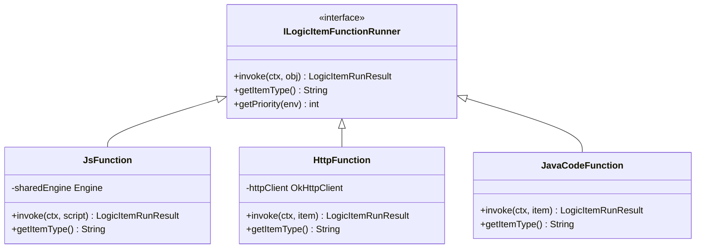
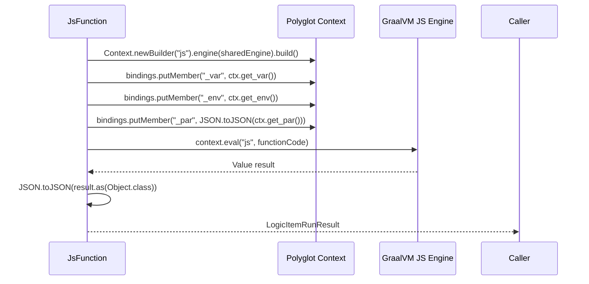
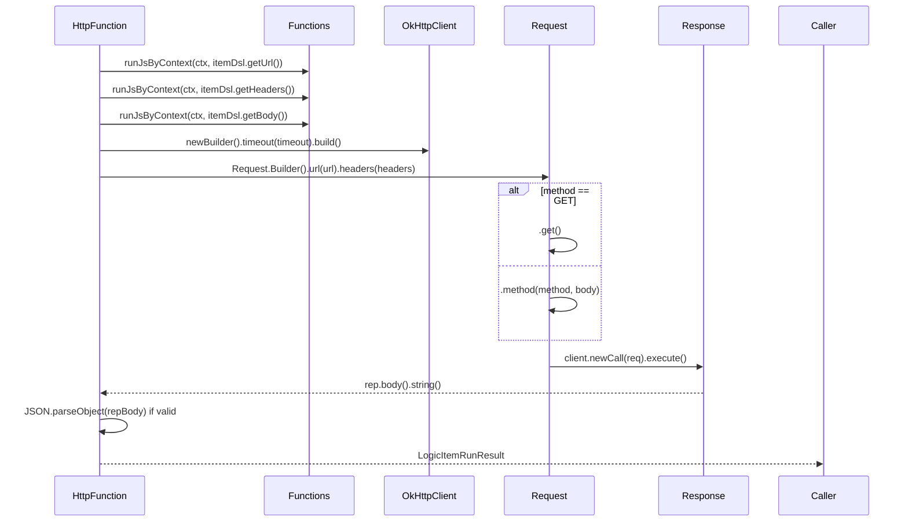
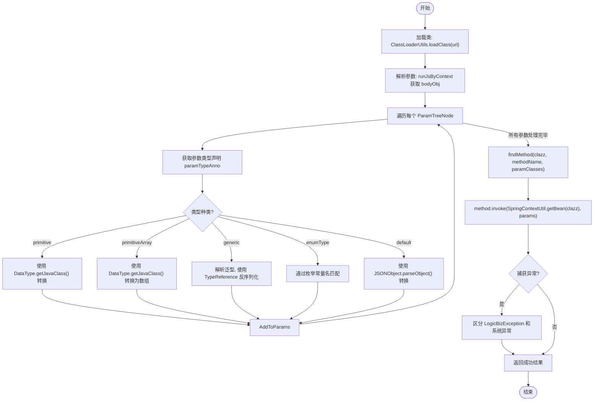

# 函数实现

<cite>
**本文档中引用的文件**  
- [JsFunction.java](file://logic-runtime/src/main/java/com/aims/logic/runtime/runner/functions/impl/JsFunction.java)
- [HttpFunction.java](file://logic-runtime/src/main/java/com/aims/logic/runtime/runner/functions/impl/HttpFunction.java)
- [JavaCodeFunction.java](file://logic-runtime/src/main/java/com/aims/logic/runtime/runner/functions/impl/JavaCodeFunction.java)
- [GraalvmEngineConfig.java](file://logic-runtime/src/main/java/com/aims/logic/runtime/configuration/GraalvmEngineConfig.java)
- [LogicAppConfig.java](file://logic-runtime/src/main/java/com/aims/logic/runtime/env/LogicAppConfig.java)
- [FunctionContext.java](file://logic-runtime/src/main/java/com/aims/logic/runtime/runner/FunctionContext.java)
- [ILogicItemFunctionRunner.java](file://logic-runtime/src/main/java/com/aims/logic/runtime/runner/functions/ILogicItemFunctionRunner.java)
- [LogicItemRunResult.java](file://logic-runtime/src/main/java/com/aims/logic/runtime/contract/dto/LogicItemRunResult.java)
- [LogicItemTreeNode.java](file://logic-runtime/src/main/java/com/aims/logic/runtime/contract/dsl/LogicItemTreeNode.java)
- [RuntimeUtil.java](file://logic-runtime/src/main/java/com/aims/logic/runtime/util/RuntimeUtil.java)
- [Functions.java](file://logic-runtime/src/main/java/com/aims/logic/runtime/runner/Functions.java)
- [SpringContextUtil.java](file://logic-runtime/src/main/java/com/aims/logic/runtime/util/SpringContextUtil.java)
- [ClassLoaderUtils.java](file://logic-runtime/src/main/java/com/aims/logic/runtime/util/ClassLoaderUtils.java)
- [ClassWrapper.java](file://logic-runtime/src/main/java/com/aims/logic/runtime/util/ClassWrapper.java)
- [LogicBizException.java](file://logic-runtime/src/main/java/com/aims/logic/runtime/LogicBizException.java)
</cite>

## 目录
1. [引言](#引言)
2. [核心函数实现概述](#核心函数实现概述)
3. [JsFunction 实现详解](#jsfunction-实现详解)
4. [HttpFunction 实现详解](#httpfunction-实现详解)
5. [JavaCodeFunction 实现详解](#javacodefunction-实现详解)
6. [自定义函数扩展最佳实践](#自定义函数扩展最佳实践)
7. [结论](#结论)

## 引言
本文档详细描述了 `JsFunction`、`HttpFunction` 和 `JavaCodeFunction` 三种核心函数的具体实现机制。重点分析了它们如何分别利用 GraalVM 引擎、OkHttpClient 和 Java 反射技术来执行动态逻辑。文档还提供了关于如何实现自定义函数扩展的最佳实践建议，帮助开发者深入理解系统架构并进行二次开发。

## 核心函数实现概述

系统通过 `ILogicItemFunctionRunner` 接口统一管理各类函数的执行逻辑，每种函数类型通过 `getItemType()` 方法标识其类型，并通过 `invoke(FunctionContext ctx, Object obj)` 方法执行具体业务。`FunctionContext` 提供了执行上下文环境，包含变量、环境、业务ID等共享状态。

**图示来源**  
- [ILogicItemFunctionRunner.java](file://logic-runtime/src/main/java/com/aims/logic/runtime/runner/functions/ILogicItemFunctionRunner.java#L1-L27)
- [JsFunction.java](file://logic-runtime/src/main/java/com/aims/logic/runtime/runner/functions/impl/JsFunction.java#L19-L146)
- [HttpFunction.java](file://logic-runtime/src/main/java/com/aims/logic/runtime/runner/functions/impl/HttpFunction.java#L22-L117)
- [JavaCodeFunction.java](file://logic-runtime/src/main/java/com/aims/logic/runtime/runner/functions/impl/JavaCodeFunction.java#L21-L180)

**本节来源**  
- [ILogicItemFunctionRunner.java](file://logic-runtime/src/main/java/com/aims/logic/runtime/runner/functions/ILogicItemFunctionRunner.java#L1-L27)
- [FunctionContext.java](file://logic-runtime/src/main/java/com/aims/logic/runtime/runner/FunctionContext.java#L1-L104)

## JsFunction 实现详解

`JsFunction` 利用 GraalVM 的 Polyglot API 执行 JavaScript 代码。它通过依赖注入获取共享的 `Engine` 实例，确保多个上下文间可以高效复用编译资源。

在执行时，`JsFunction` 创建一个新的 `Context`，并将当前 `FunctionContext` 中的关键数据（如 `_var`、`_env`、`_par` 等）通过 `bindings.putMember()` 方法绑定到 JavaScript 的全局作用域中。所有传入对象都通过 `JSON.toJSON()` 进行序列化，以确保跨语言边界的数据可访问性和线程安全性。

执行的脚本会被包装在一个立即执行函数 `function fn(){ %s };fn();` 中，防止变量污染全局作用域。执行结果通过 `Value.as(Object.class)` 转换为 Java 对象，并再次通过 JSON 序列化/反序列化确保返回值的线程安全。

GraalVM 引擎由 `GraalvmEngineConfig` 配置类通过 Spring Bean 管理，设置了 `engine.WarnInterpreterOnly=false` 以关闭解释模式警告。

**图示来源**  
- [JsFunction.java](file://logic-runtime/src/main/java/com/aims/logic/runtime/runner/functions/impl/JsFunction.java#L19-L146)
- [GraalvmEngineConfig.java](file://logic-runtime/src/main/java/com/aims/logic/runtime/configuration/GraalvmEngineConfig.java#L1-L16)
- [FunctionContext.java](file://logic-runtime/src/main/java/com/aims/logic/runtime/runner/FunctionContext.java#L1-L104)

**本节来源**  
- [JsFunction.java](file://logic-runtime/src/main/java/com/aims/logic/runtime/runner/functions/impl/JsFunction.java#L19-L146)
- [GraalvmEngineConfig.java](file://logic-runtime/src/main/java/com/aims/logic/runtime/configuration/GraalvmEngineConfig.java#L1-L16)

## HttpFunction 实现详解

`HttpFunction` 使用 OkHttp 客户端发起 HTTP 请求。它首先通过 `Functions.runJsByContext()` 执行上下文中的 JavaScript 表达式，动态解析请求的 URL、Headers 和 Body。

在构建请求时，`HttpFunction` 会根据配置的 `timeout` 创建一个独立的 `OkHttpClient` 实例，设置连接、读取和写入超时时间。自定义 Headers 被解析为 `Map<String, String>` 并转换为 OkHttp 的 `Headers` 对象。请求体（Body）默认为 JSON 格式，若未指定 `content-type`，则自动添加 `application/json`。

对于 GET 请求，使用 `.get()` 方法；对于其他方法（POST、PUT 等），则创建 `RequestBody` 并使用 `.method()` 指定。请求执行后，响应体被读取为字符串，若内容为有效 JSON，则解析为 `JSONObject`，否则保留原始字符串。

**图示来源**  
- [HttpFunction.java](file://logic-runtime/src/main/java/com/aims/logic/runtime/runner/functions/impl/HttpFunction.java#L22-L117)
- [Functions.java](file://logic-runtime/src/main/java/com/aims/logic/runtime/runner/Functions.java#L1-L52)
- [LogicItemTreeNode.java](file://logic-runtime/src/main/java/com/aims/logic/runtime/contract/dsl/LogicItemTreeNode.java#L1-L175)
- [RuntimeUtil.java](file://logic-runtime/src/main/java/com/aims/logic/runtime/util/RuntimeUtil.java#L1-L174)

**本节来源**  
- [HttpFunction.java](file://logic-runtime/src/main/java/com/aims/logic/runtime/runner/functions/impl/HttpFunction.java#L22-L117)
- [Functions.java](file://logic-runtime/src/main/java/com/aims/logic/runtime/runner/Functions.java#L1-L52)

## JavaCodeFunction 实现详解

`JavaCodeFunction` 通过 Java 反射机制调用指定类的方法。其实现核心在于参数的类型匹配与转换。

执行流程如下：
1.  **类加载**：使用 `ClassLoaderUtils.loadClass()` 根据 `itemDsl.getUrl()` 加载目标类。
2.  **参数解析**：通过 `Functions.runJsByContext()` 执行脚本获取参数对象，并根据 `ParamTreeNode` 中的类型声明（`TypeAnnotationTreeNode`）进行类型转换。
3.  **类型转换**：`ClassWrapper` 工具类用于解析泛型信息。对于 `List<T>`、`Map<K,V>` 等复杂类型，使用 `TypeReference` 进行反序列化。基本类型和数组则通过 `DataType.getJavaClass()` 获取对应 `Class` 对象。
4.  **方法调用**：使用 `findMethod()` 通过方法名和参数类型数组查找 `Method` 对象，并通过 `method.invoke()` 执行。目标对象通过 `SpringContextUtil.getBean(clazz)` 从 Spring 容器中获取，确保依赖注入。
5.  **异常处理**：捕获 `InvocationTargetException`，区分业务异常（`LogicBizException` 或配置的异常类）和系统异常。业务异常不会中断流程，而系统异常会设置 `needInterrupt=true`。

**图示来源**  
- [JavaCodeFunction.java](file://logic-runtime/src/main/java/com/aims/logic/runtime/runner/functions/impl/JavaCodeFunction.java#L21-L180)
- [ClassLoaderUtils.java](file://logic-runtime/src/main/java/com/aims/logic/runtime/util/ClassLoaderUtils.java#L1-L239)
- [ClassWrapper.java](file://logic-runtime/src/main/java/com/aims/logic/runtime/util/ClassWrapper.java#L1-L158)
- [SpringContextUtil.java](file://logic-runtime/src/main/java/com/aims/logic/runtime/util/SpringContextUtil.java#L1-L55)
- [LogicBizException.java](file://logic-runtime/src/main/java/com/aims/logic/runtime/LogicBizException.java#L1-L7)

**本节来源**  
- [JavaCodeFunction.java](file://logic-runtime/src/main/java/com/aims/logic/runtime/runner/functions/impl/JavaCodeFunction.java#L21-L180)
- [ClassLoaderUtils.java](file://logic-runtime/src/main/java/com/aims/logic/runtime/util/ClassLoaderUtils.java#L1-L239)
- [ClassWrapper.java](file://logic-runtime/src/main/java/com/aims/logic/runtime/util/ClassWrapper.java#L1-L158)
- [SpringContextUtil.java](file://logic-runtime/src/main/java/com/aims/logic/runtime/util/SpringContextUtil.java#L1-L55)

## 自定义函数扩展最佳实践

要实现自定义函数扩展，应遵循以下最佳实践：

1.  **实现接口**：创建一个新类并实现 `ILogicItemFunctionRunner` 接口。
2.  **Spring 管理**：使用 `@Service` 注解将类注册为 Spring Bean，确保其能被自动发现和注入。
3.  **唯一类型标识**：在 `getItemType()` 方法中返回一个全局唯一的字符串（如 `"custom-db"`），避免与现有类型冲突。
4.  **优先级控制**：`getPriority()` 方法可用于在多个同类型实现中选择优先级更高的一个。数值越大优先级越高。
5.  **依赖注入**：充分利用 Spring 的依赖注入功能，注入所需的客户端、服务或配置。
6.  **上下文使用**：通过 `FunctionContext` 访问共享的变量、环境和业务状态，保持与系统其他部分的一致性。
7.  **错误处理**：在 `invoke` 方法中进行完善的异常捕获，使用 `LogicItemRunResult` 的 `setSuccess(false)`、`setMsg()` 和 `setNeedInterrupt()` 方法清晰地报告错误。
8.  **日志记录**：使用 `@Slf4j` 注解和 `log` 对象记录关键执行步骤和错误信息，便于调试和监控。
9.  **资源管理**：对于需要管理的资源（如网络连接、文件句柄），考虑实现 `@PreDestroy` 方法进行清理。
10. **配置化**：将可变参数（如超时时间、重试次数）通过 `LogicAppConfig` 等配置类注入，提高灵活性。

**本节来源**  
- [ILogicItemFunctionRunner.java](file://logic-runtime/src/main/java/com/aims/logic/runtime/runner/functions/ILogicItemFunctionRunner.java#L1-L27)
- [LogicAppConfig.java](file://logic-runtime/src/main/java/com/aims/logic/runtime/env/LogicAppConfig.java#L1-L21)
- [FunctionContext.java](file://logic-runtime/src/main/java/com/aims/logic/runtime/runner/FunctionContext.java#L1-L104)
- [LogicItemRunResult.java](file://logic-runtime/src/main/java/com/aims/logic/runtime/contract/dto/LogicItemRunResult.java#L1-L48)

## 结论

本文档深入剖析了 `JsFunction`、`HttpFunction` 和 `JavaCodeFunction` 三种核心函数的实现机制。`JsFunction` 通过 GraalVM 实现了高性能的 JavaScript 执行，并通过上下文绑定实现了与 Java 环境的无缝集成。`HttpFunction` 基于 OkHttp 构建了灵活可靠的 HTTP 客户端，支持动态配置和超时控制。`JavaCodeFunction` 则利用反射和类型转换技术，实现了对任意 Spring Bean 方法的安全调用。这些设计共同构成了一个强大、灵活且可扩展的函数执行框架，为系统的动态逻辑处理能力提供了坚实基础。