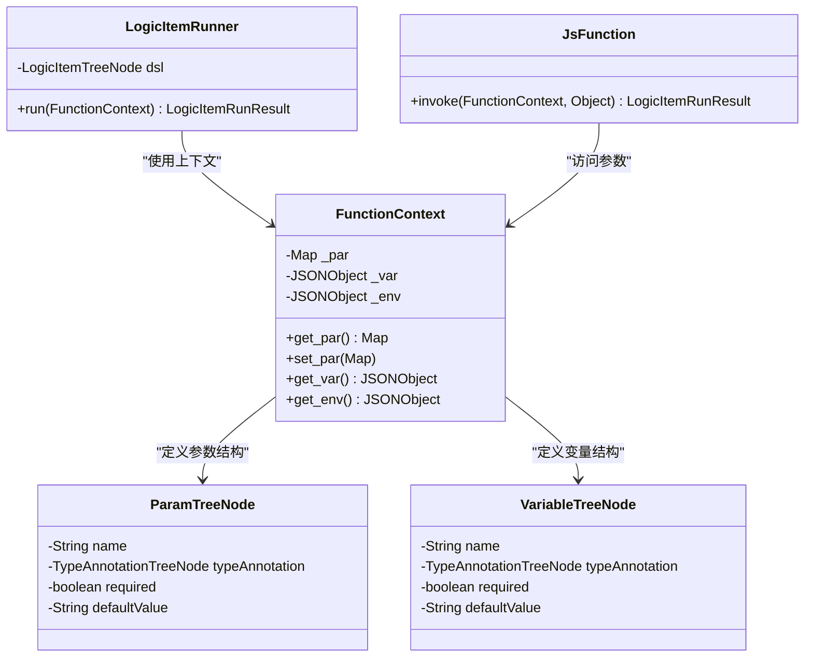
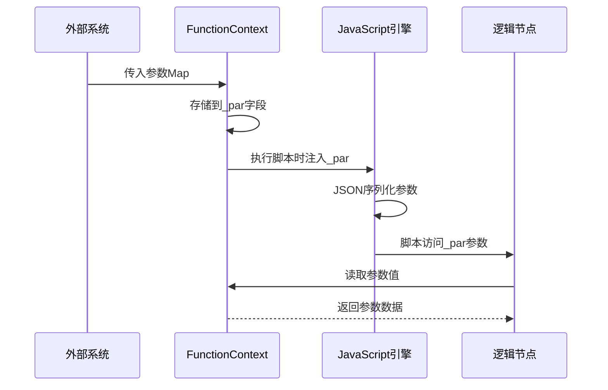
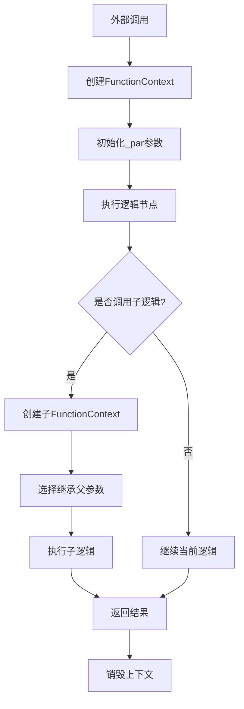
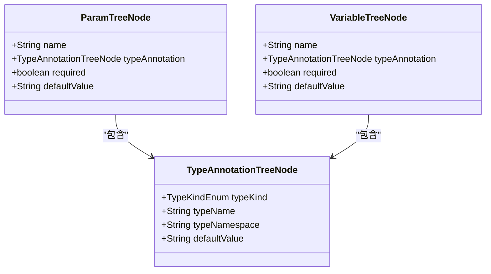
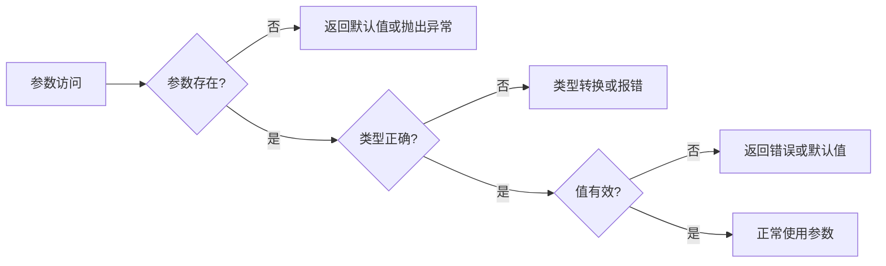

# 参数上下文管理

<cite>
**Referenced Files in This Document**   
- [FunctionContext.java](file://logic-runtime/src/main/java/com/aims/logic/runtime/runner/FunctionContext.java)
- [JsFunction.java](file://logic-runtime/src/main/java/com/aims/logic/runtime/runner/functions/impl/JsFunction.java)
- [SubLogicFunction.java](file://logic-sdk/src/main/java/com/aims/logic/sdk/functions/SubLogicFunction.java)
- [ParamTreeNode.java](file://logic-runtime/src/main/java/com/aims/logic/runtime/contract/dsl/ParamTreeNode.java)
- [VariableTreeNode.java](file://logic-runtime/src/main/java/com/aims/logic/runtime/contract/dsl/VariableTreeNode.java)
- [LogicItemRunner.java](file://logic-runtime/src/main/java/com/aims/logic/runtime/runner/LogicItemRunner.java)
- [Functions.java](file://logic-runtime/src/main/java/com/aims/logic/runtime/runner/Functions.java)
</cite>

## 目录
1. [引言](#引言)
2. [核心组件](#核心组件)
3. [参数存储机制](#参数存储机制)
4. [作用域规则](#作用域规则)
5. [参数与变量的区别](#参数与变量的区别)
6. [类型转换与数据验证](#类型转换与数据验证)
7. [自定义函数中的参数使用](#自定义函数中的参数使用)
8. [常见错误与解决方案](#常见错误与解决方案)
9. [结论](#结论)

## 引言
在逻辑执行引擎中，参数上下文管理是确保数据在不同逻辑节点间正确传递和访问的核心机制。`FunctionContext`类作为执行上下文的容器，通过`_par`字段专门管理输入参数，为整个逻辑流程提供了稳定的数据传递基础。本文档详细阐述了参数上下文的设计原理和实现细节，帮助开发者深入理解参数管理机制。

## 核心组件

`FunctionContext`类是参数上下文管理的核心，其`_par`字段采用`Map<String, Object>`数据结构存储输入参数，实现了灵活的键值对映射。该类不仅管理参数，还统一维护了变量(`_var`)、环境变量(`_env`)等其他上下文数据，构成了完整的执行环境。

**Diagram sources**
- [FunctionContext.java](file://logic-runtime/src/main/java/com/aims/logic/runtime/runner/FunctionContext.java#L17-L18)
- [ParamTreeNode.java](file://logic-runtime/src/main/java/com/aims/logic/runtime/contract/dsl/ParamTreeNode.java#L12-L33)
- [VariableTreeNode.java](file://logic-runtime/src/main/java/com/aims/logic/runtime/contract/dsl/VariableTreeNode.java#L4-L9)
- [LogicItemRunner.java](file://logic-runtime/src/main/java/com/aims/logic/runtime/runner/LogicItemRunner.java#L10-L12)
- [JsFunction.java](file://logic-runtime/src/main/java/com/aims/logic/runtime/runner/functions/impl/JsFunction.java#L25-L27)

**Section sources**
- [FunctionContext.java](file://logic-runtime/src/main/java/com/aims/logic/runtime/runner/FunctionContext.java#L14-L103)

## 参数存储机制

输入参数通过`_par`字段在执行上下文中进行存储，该字段被设计为一个哈希映射，支持任意类型的值存储。参数的生命周期与`FunctionContext`实例绑定，从外部传入后，可在整个逻辑执行流程中被各个节点访问。

参数的传入通常发生在逻辑调用的入口点，通过`FunctionContext`的构造或设置方法完成。在JavaScript函数执行时，参数会被序列化为JSON格式并注入到脚本执行环境中，确保跨语言调用的兼容性。

**Diagram sources**
- [FunctionContext.java](file://logic-runtime/src/main/java/com/aims/logic/runtime/runner/FunctionContext.java#L17)
- [JsFunction.java](file://logic-runtime/src/main/java/com/aims/logic/runtime/runner/functions/impl/JsFunction.java#L45-L50)

**Section sources**
- [FunctionContext.java](file://logic-runtime/src/main/java/com/aims/logic/runtime/runner/FunctionContext.java#L17-L18)
- [JsFunction.java](file://logic-runtime/src/main/java/com/aims/logic/runtime/runner/functions/impl/JsFunction.java#L42-L59)

## 作用域规则

参数的作用域遵循严格的传递规则，主要体现在以下几个方面：

1. **入口作用域**：参数在逻辑调用入口处定义，构成最外层的作用域。
2. **继承作用域**：子逻辑调用时，父逻辑的参数可通过上下文传递给子逻辑。
3. **隔离作用域**：不同逻辑实例间的参数相互隔离，避免数据污染。

在子逻辑调用场景中，`SubLogicFunction`会创建新的`FunctionContext`实例，可以选择性地继承父上下文的参数，实现了作用域的可控传递。

**Diagram sources**
- [SubLogicFunction.java](file://logic-sdk/src/main/java/com/aims/logic/sdk/functions/SubLogicFunction.java#L63-L74)
- [FunctionContext.java](file://logic-runtime/src/main/java/com/aims/logic/runtime/runner/FunctionContext.java#L17)

**Section sources**
- [SubLogicFunction.java](file://logic-sdk/src/main/java/com/aims/logic/sdk/functions/SubLogicFunction.java#L50-L133)

## 参数与变量的区别

尽管参数和变量都存储在`FunctionContext`中，但它们在用途和管理上存在本质区别：

| 特性 | 参数(_par) | 变量(_var) |
|------|-----------|-----------|
| **来源** | 外部传入 | 内部生成 |
| **作用域** | 调用时确定 | 运行时动态 |
| **生命周期** | 与上下文同生共死 | 可动态创建销毁 |
| **数据结构** | Map<String, Object> | JSONObject |
| **主要用途** | 输入数据传递 | 中间状态存储 |

参数主要用于接收外部输入，而变量则用于存储逻辑执行过程中的中间状态。这种分离设计确保了输入数据的稳定性和内部状态的灵活性。

**Section sources**
- [FunctionContext.java](file://logic-runtime/src/main/java/com/aims/logic/runtime/runner/FunctionContext.java#L17-L18)

## 类型转换与数据验证

在参数传递过程中，系统会自动进行必要的类型转换。当参数从Java上下文传递到JavaScript引擎时，会通过JSON序列化实现跨语言类型转换。对于复杂对象，系统会递归处理其属性。

数据验证主要通过`ParamTreeNode`结构定义的元数据来实现，包括：
- **类型注解**：通过`typeAnnotation`字段定义参数类型
- **必填性**：通过`required`字段标识是否必需
- **默认值**：通过`defaultValue`字段提供默认值

**Diagram sources**
- [ParamTreeNode.java](file://logic-runtime/src/main/java/com/aims/logic/runtime/contract/dsl/ParamTreeNode.java#L12-L33)
- [VariableTreeNode.java](file://logic-runtime/src/main/java/com/aims/logic/runtime/contract/dsl/VariableTreeNode.java#L4-L9)

**Section sources**
- [ParamTreeNode.java](file://logic-runtime/src/main/java/com/aims/logic/runtime/contract/dsl/ParamTreeNode.java#L12-L33)

## 自定义函数中的参数使用

在自定义函数中安全读取和使用输入参数的最佳实践包括：

1. **空值检查**：始终检查参数是否存在和是否为null
2. **类型验证**：在使用前验证参数类型
3. **边界检查**：对数值参数进行范围验证
4. **异常处理**：妥善处理参数相关的异常

通过`FunctionContext`提供的`get_par()`方法可以安全地访问参数，建议使用泛型转换确保类型安全。

**Section sources**
- [FunctionContext.java](file://logic-runtime/src/main/java/com/aims/logic/runtime/runner/FunctionContext.java#L17)
- [Functions.java](file://logic-runtime/src/main/java/com/aims/logic/runtime/runner/Functions.java#L25-L30)

## 常见错误与解决方案

### 常见参数处理错误

1. **空指针异常**：未检查参数是否存在
2. **类型转换异常**：期望的类型与实际类型不符
3. **数据丢失**：在跨语言调用时未正确序列化
4. **作用域混乱**：错误地修改了共享参数

### 解决方案

- **防御性编程**：在访问参数前进行完整性检查
- **使用辅助方法**：通过`Functions.runJsByContext()`等封装方法降低风险
- **日志记录**：在关键节点记录参数状态便于调试
- **单元测试**：为参数处理逻辑编写充分的测试用例

**Diagram sources**
- [Functions.java](file://logic-runtime/src/main/java/com/aims/logic/runtime/runner/Functions.java#L25-L30)
- [LogicItemRunner.java](file://logic-runtime/src/main/java/com/aims/logic/runtime/runner/LogicItemRunner.java#L30-L85)

**Section sources**
- [Functions.java](file://logic-runtime/src/main/java/com/aims/logic/runtime/runner/Functions.java#L25-L52)
- [LogicItemRunner.java](file://logic-runtime/src/main/java/com/aims/logic/runtime/runner/LogicItemRunner.java#L30-L85)

## 结论
`FunctionContext`中的`_par`字段设计体现了参数上下文管理的核心思想：通过清晰的职责分离、严格的作用域控制和安全的数据访问机制，确保了逻辑执行过程中参数传递的可靠性和稳定性。理解这一机制对于开发高效、可靠的逻辑应用至关重要。