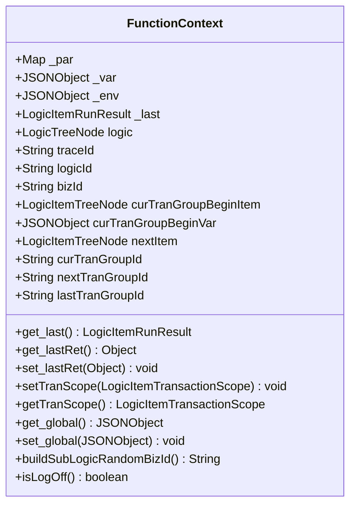
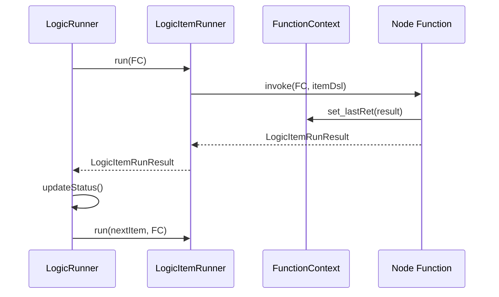
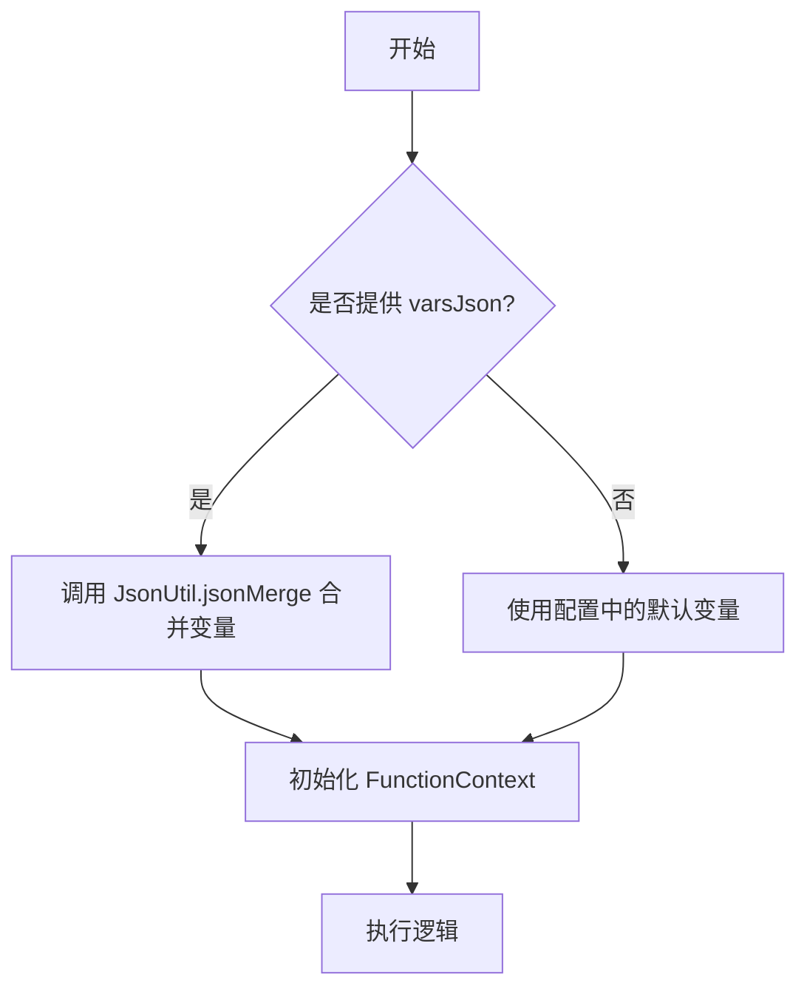
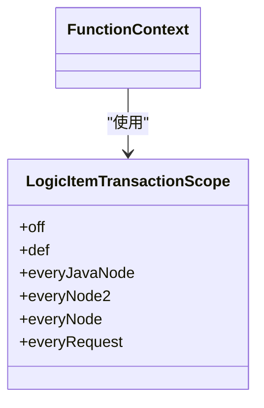
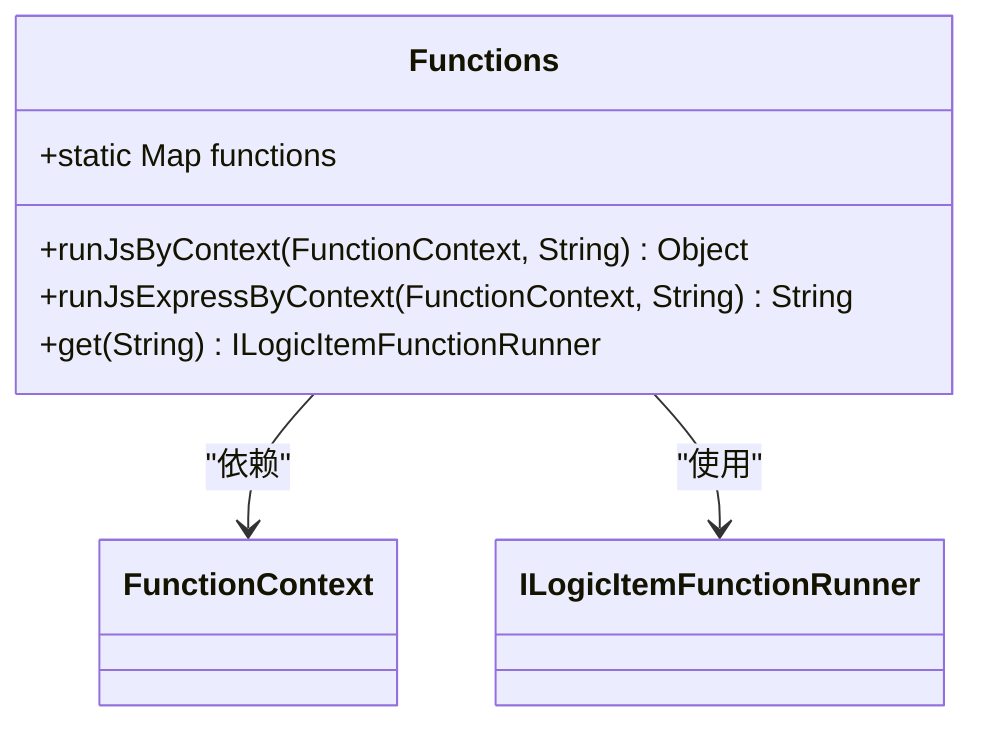

# 执行上下文管理

<cite>
**Referenced Files in This Document**   
- [FunctionContext.java](file://logic-runtime/src/main/java/com/aims/logic/runtime/runner/FunctionContext.java)
- [LogicRunner.java](file://logic-runtime/src/main/java/com/aims/logic/runtime/runner/LogicRunner.java)
- [LogicItemRunner.java](file://logic-runtime/src/main/java/com/aims/logic/runtime/runner/LogicItemRunner.java)
- [Functions.java](file://logic-runtime/src/main/java/com/aims/logic/runtime/runner/Functions.java)
- [JsFunction.java](file://logic-runtime/src/main/java/com/aims/logic/runtime/runner/functions/impl/JsFunction.java)
- [LogicItemTransactionScope.java](file://logic-runtime/src/main/java/com/aims/logic/runtime/contract/enums/LogicItemTransactionScope.java)
- [LogicItemRunResult.java](file://logic-runtime/src/main/java/com/aims/logic/runtime/contract/dto/LogicItemRunResult.java)
- [LogicItemTreeNode.java](file://logic-runtime/src/main/java/com/aims/logic/runtime/contract/dsl/LogicItemTreeNode.java)
</cite>

## 目录
1. [引言](#引言)
2. [核心组件](#核心组件)
3. [作用域与生命周期](#作用域与生命周期)
4. [数据传递与共享机制](#数据传递与共享机制)
5. [变量持久化与状态恢复](#变量持久化与状态恢复)
6. [事务作用域管理](#事务作用域管理)
7. [自定义函数中的上下文安全访问](#自定义函数中的上下文安全访问)
8. [执行流程与上下文流转](#执行流程与上下文流转)
9. [结论](#结论)

## 引言
执行上下文是逻辑运行时系统的核心概念，它为逻辑节点的执行提供了统一的环境和数据容器。`FunctionContext`类作为执行上下文的具体实现，封装了逻辑执行所需的所有状态信息，包括参数、变量、环境配置以及事务状态等。本文档将深入分析`FunctionContext`的设计与实现，详细阐述其在逻辑执行过程中的作用机制。

## 核心组件

`FunctionContext`类是执行上下文的核心实现，它通过一系列私有字段来管理不同作用域的数据和执行状态。该类提供了丰富的getter和setter方法，以及专门的业务逻辑方法来操作这些数据。

**Section sources**
- [FunctionContext.java](file://logic-runtime/src/main/java/com/aims/logic/runtime/runner/FunctionContext.java#L14-L103)

## 作用域与生命周期

### 核心变量作用域

`FunctionContext`定义了多个核心变量，它们分别代表不同的数据作用域：

- **_par**: 一个`Map<String, Object>`类型的字段，用于存储传入的参数。这些参数通常在逻辑执行开始时由外部系统提供，其生命周期与单次逻辑执行实例绑定。
- **_var**: 一个`JSONObject`类型的字段，用于存储局部变量。这些变量在逻辑执行过程中被创建和修改，其作用域限于当前逻辑实例。
- **_env**: 一个`JSONObject`类型的字段，用于存储环境变量。这些变量通常包含系统配置、认证信息等全局性数据，其生命周期可能跨越多个逻辑执行实例。
- **_global**: 通过`get_global()`和`set_global()`方法访问的全局变量对象，存储在`_var`内部的`__global`键下。这提供了一种跨逻辑实例共享数据的机制。



**Diagram sources**
- [FunctionContext.java](file://logic-runtime/src/main/java/com/aims/logic/runtime/runner/FunctionContext.java#L14-L103)

**Section sources**
- [FunctionContext.java](file://logic-runtime/src/main/java/com/aims/logic/runtime/runner/FunctionContext.java#L14-L103)

## 数据传递与共享机制

执行上下文在不同节点之间的传递是通过`LogicRunner`和`LogicItemRunner`组件协同完成的。`LogicRunner`负责管理整个逻辑的执行流程，而`LogicItemRunner`则负责单个节点的执行。

当一个节点执行完毕后，其产生的结果会通过`FunctionContext`的`set_lastRet()`方法存储。这个结果随后可以被后续节点通过`get_lastRet()`方法获取，从而实现数据的链式传递。



**Diagram sources**
- [LogicRunner.java](file://logic-runtime/src/main/java/com/aims/logic/runtime/runner/LogicRunner.java#L238-L249)
- [LogicItemRunner.java](file://logic-runtime/src/main/java/com/aims/logic/runtime/runner/LogicItemRunner.java#L18-L90)
- [FunctionContext.java](file://logic-runtime/src/main/java/com/aims/logic/runtime/runner/FunctionContext.java#L70-L88)

**Section sources**
- [LogicRunner.java](file://logic-runtime/src/main/java/com/aims/logic/runtime/runner/LogicRunner.java#L238-L249)
- [LogicItemRunner.java](file://logic-runtime/src/main/java/com/aims/logic/runtime/runner/LogicItemRunner.java#L18-L90)

## 变量持久化与状态恢复

`FunctionContext`支持通过外部传入的`varsJson`参数来实现状态恢复。在`LogicRunner`的构造函数中，可以将之前执行时保存的局部变量状态重新加载到上下文中，从而实现逻辑的断点续执行。



**Diagram sources**
- [LogicRunner.java](file://logic-runtime/src/main/java/com/aims/logic/runtime/runner/LogicRunner.java#L52-L61)
- [LogicRunner.java](file://logic-runtime/src/main/java/com/aims/logic/runtime/runner/LogicRunner.java#L70-L90)

**Section sources**
- [LogicRunner.java](file://logic-runtime/src/main/java/com/aims/logic/runtime/runner/LogicRunner.java#L52-L61)

## 事务作用域管理

### 事务相关属性

`FunctionContext`通过以下属性来管理事务状态：

- **curTranGroupBeginItem**: 记录当前事务组开始时的节点，用于在事务回滚时恢复到正确的执行点。
- **curTranGroupBeginVar**: 记录当前事务组开始时的变量状态，用于在事务回滚时恢复变量。
- **curTranGroupId, nextTranGroupId, lastTranGroupId**: 用于跟踪当前、下一个和上一个事务组的ID，实现事务组的边界管理。

### 事务作用域配置

通过`setTranScope()`和`getTranScope()`方法，可以设置和获取当前的事务作用域。事务作用域的配置存储在`_var`对象的`__tranScope`键下。



**Diagram sources**
- [FunctionContext.java](file://logic-runtime/src/main/java/com/aims/logic/runtime/runner/FunctionContext.java#L80-L88)
- [LogicItemTransactionScope.java](file://logic-runtime/src/main/java/com/aims/logic/runtime/contract/enums/LogicItemTransactionScope.java#L5-L27)

**Section sources**
- [FunctionContext.java](file://logic-runtime/src/main/java/com/aims/logic/runtime/runner/FunctionContext.java#L80-L88)
- [LogicItemTransactionScope.java](file://logic-runtime/src/main/java/com/aims/logic/runtime/contract/enums/LogicItemTransactionScope.java#L5-L27)

## 自定义函数中的上下文安全访问

在自定义函数中，应通过`Functions`工具类提供的`runJsByContext()`和`runJsExpressByContext()`方法来安全地访问和修改上下文数据。这些方法封装了对`FunctionContext`的访问，确保了线程安全和数据一致性。



**Diagram sources**
- [Functions.java](file://logic-runtime/src/main/java/com/aims/logic/runtime/runner/Functions.java#L12-L51)
- [JsFunction.java](file://logic-runtime/src/main/java/com/aims/logic/runtime/runner/functions/impl/JsFunction.java#L29-L85)

**Section sources**
- [Functions.java](file://logic-runtime/src/main/java/com/aims/logic/runtime/runner/Functions.java#L25-L45)

## 执行流程与上下文流转

`LogicRunner`是管理执行流程的核心组件。它持有一个`FunctionContext`实例，并在执行过程中将其传递给各个`LogicItemRunner`。执行流程从`startNode`开始，通过`findNextItem()`方法确定下一个执行节点，直到所有节点执行完毕或遇到终止条件。

```mermaid
flowchart TD
A[LogicRunner.run()] --> B[设置 startNode]
B --> C[初始化 FunctionContext]
C --> D[执行当前节点 runItem()]
D --> E[更新状态 updateStatus()]
E --> F{是否继续?}
F --> |是| G[查找下一个节点 findNextItem()]
G --> D
F --> |否| H[返回执行结果]
```

**Diagram sources**
- [LogicRunner.java](file://logic-runtime/src/main/java/com/aims/logic/runtime/runner/LogicRunner.java#L210-L234)
- [LogicRunner.java](file://logic-runtime/src/main/java/com/aims/logic/runtime/runner/LogicRunner.java#L238-L249)
- [LogicRunner.java](file://logic-runtime/src/main/java/com/aims/logic/runtime/runner/LogicRunner.java#L251-L271)

**Section sources**
- [LogicRunner.java](file://logic-runtime/src/main/java/com/aims/logic/runtime/runner/LogicRunner.java#L210-L234)

## 结论
`FunctionContext`类通过精心设计的数据结构和方法，为逻辑执行提供了一个强大而灵活的上下文管理机制。它不仅支持多作用域的数据管理，还实现了事务控制、状态恢复和安全访问等高级功能。理解`FunctionContext`的工作原理对于开发高效、可靠的逻辑应用至关重要。