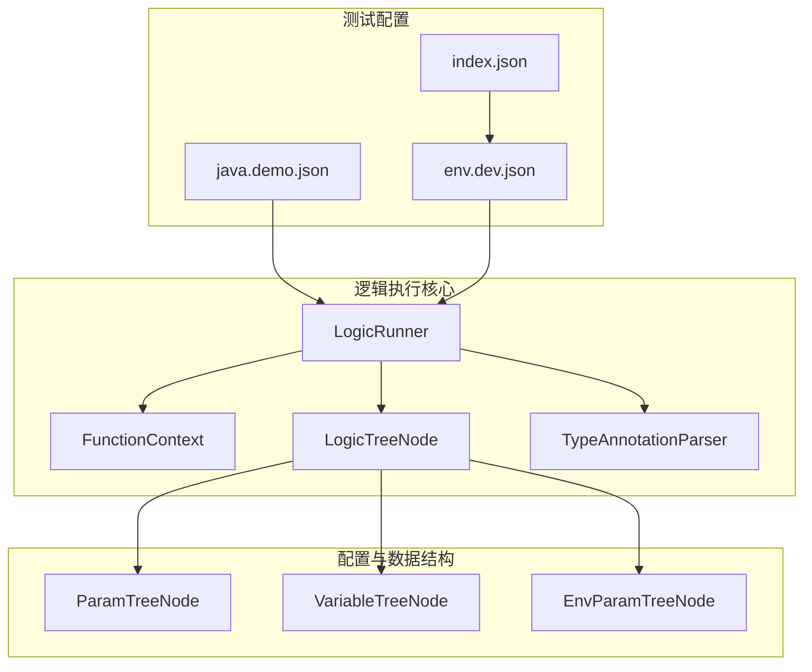
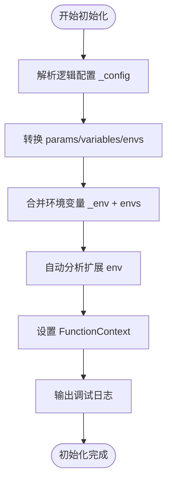
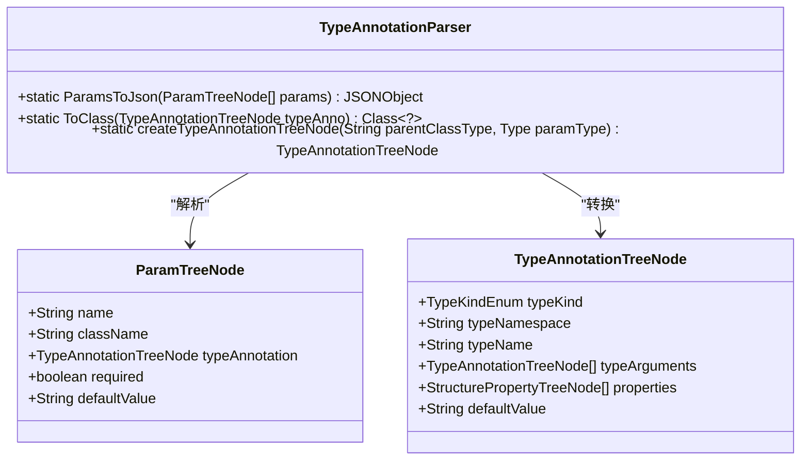
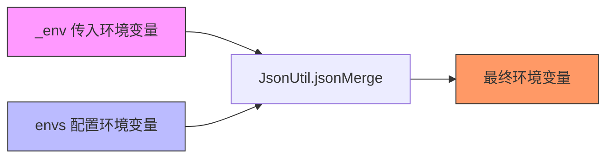
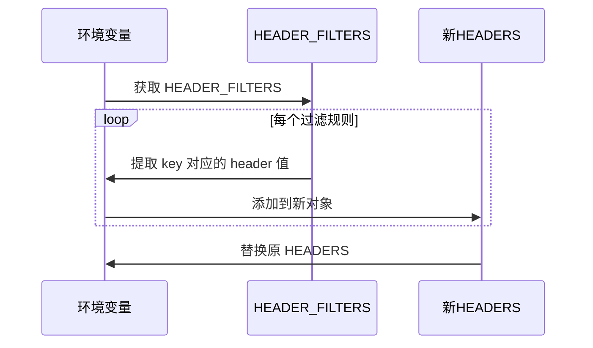

# 执行初始化流程

<cite>
**本文档中引用的文件**  
- [LogicRunner.java](file://logic-runtime/src/main/java/com/aims/logic/runtime/runner/LogicRunner.java)
- [TypeAnnotationParser.java](file://logic-runtime/src/main/java/com/aims/logic/runtime/contract/parser/TypeAnnotationParser.java)
- [LogicTreeNode.java](file://logic-runtime/src/main/java/com/aims/logic/runtime/contract/dsl/LogicTreeNode.java)
- [ParamTreeNode.java](file://logic-runtime/src/main/java/com/aims/logic/runtime/contract/dsl/ParamTreeNode.java)
- [VariableTreeNode.java](file://logic-runtime/src/main/java/com/aims/logic/runtime/contract/dsl/VariableTreeNode.java)
- [EnvParamTreeNode.java](file://logic-runtime/src/main/java/com/aims/logic/runtime/contract/dsl/EnvParamTreeNode.java)
- [java.demo.json](file://logic-sdk/logic-configs/logics/java.demo.json)
- [env.dev.json](file://test-suite/test-case-configs/envs/env.dev.json)
- [index.json](file://test-suite/test-case-configs/envs/index.json)
</cite>

## 目录
1. [项目结构](#项目结构)  
2. [核心组件](#核心组件)  
3. [初始化流程解析](#初始化流程解析)  
4. [类型注解与参数转换机制](#类型注解与参数转换机制)  
5. [环境变量合并与优先级策略](#环境变量合并与优先级策略)  
6. [JWT Token自动解析与HEADER_FILTERS过滤机制](#jwt-token自动解析与header_filters过滤机制)  
7. [日志输出与调试信息格式](#日志输出与调试信息格式)

## 项目结构

本项目为逻辑执行引擎，主要包含以下模块：

- `logic-ide`：逻辑开发环境，提供可视化编辑与调试功能
- `logic-runtime`：逻辑运行时核心，负责逻辑的解析与执行
- `logic-sdk`：逻辑开发工具包，包含配置与示例
- `test-suite`：测试用例与环境配置

重点关注 `logic-runtime` 模块中的 `LogicRunner` 类，它是逻辑执行的核心入口。



**图示来源**  
- [LogicRunner.java](file://logic-runtime/src/main/java/com/aims/logic/runtime/runner/LogicRunner.java#L26-L289)
- [LogicTreeNode.java](file://logic-runtime/src/main/java/com/aims/logic/runtime/contract/dsl/LogicTreeNode.java#L1-L56)
- [java.demo.json](file://logic-sdk/logic-configs/logics/java.demo.json#L1-L1332)

## 核心组件

`LogicRunner` 是逻辑执行的核心类，负责初始化逻辑配置、解析参数、执行逻辑节点并管理运行时上下文。

其主要职责包括：
- 解析逻辑配置 JSON 并转换为 Java 对象
- 处理参数、变量、环境变量的声明与默认值
- 支持 JWT Token 自动解析
- 实现 HEADER_FILTERS 请求头过滤
- 管理执行状态与日志输出

**本节来源**  
- [LogicRunner.java](file://logic-runtime/src/main/java/com/aims/logic/runtime/runner/LogicRunner.java#L26-L289)

## 初始化流程解析

`LogicRunner` 的初始化通过 `init` 方法完成，接收逻辑配置 `_config`、环境变量 `_env` 和业务 ID `bizId`。

### 初始化步骤

1. **配置解析**：将 `_config` JSON 转换为 `LogicTreeNode` 对象
2. **参数转换**：使用 `TypeAnnotationParser.ParamsToJson` 将 `params`、`variables`、`envs` 转换为 JSON 对象
3. **环境变量合并**：将传入的 `_env` 与配置中声明的 `envs` 合并，优先级为：传入环境变量 > 配置环境变量
4. **自动分析扩展**：调用 `autoAnalyzeAndAppendEnv` 处理 JWT Token 解析与 HEADER_FILTERS 过滤
5. **上下文设置**：将解析后的参数、变量、环境变量设置到 `FunctionContext` 中
6. **日志记录**：输出初始化调试信息



**图示来源**  
- [LogicRunner.java](file://logic-runtime/src/main/java/com/aims/logic/runtime/runner/LogicRunner.java#L78-L108)

## 类型注解与参数转换机制

### TypeAnnotationParser 解析机制

`TypeAnnotationParser` 负责将类型注解树节点（`TypeAnnotationTreeNode`）转换为 JSON 对象，支持多种数据类型：

- **基本类型**：string, number, boolean, null
- **复杂类型**：object, array, date, function
- **默认值处理**：根据 `defaultValue` 字符串解析为对应类型的值

#### 类型映射规则

| 类型名 | JSON 类型 | 解析方式 |
|--------|----------|---------|
| string | string | 直接赋值 |
| number | number | `Float.parseFloat` |
| boolean | boolean | `Boolean.parseBoolean` |
| object | object | `JSONObject.parse` |
| array | array | `JSONArray.parseArray` |
| null | null | 直接赋值为 null |



**图示来源**  
- [TypeAnnotationParser.java](file://logic-runtime/src/main/java/com/aims/logic/runtime/contract/parser/TypeAnnotationParser.java#L15-L205)
- [ParamTreeNode.java](file://logic-runtime/src/main/java/com/aims/logic/runtime/contract/dsl/ParamTreeNode.java#L1-L35)

## 环境变量合并与优先级策略

### 合并逻辑

环境变量的合并通过 `JsonUtil.jsonMerge(_env, envJson)` 实现，其中：
- `_env`：外部传入的环境变量（优先级高）
- `envJson`：逻辑配置中声明的环境变量（优先级低）

合并策略为**浅合并**，即 `_env` 中的同名字段会覆盖 `envJson` 中的值。

### 示例配置

`env.dev.json` 配置：
```json
{
  "NODE_ENV": "dev",
  "LOGIC_CONFIG_MODEL": "offline",
  "DEFAULT_TRAN_SCOPE": "everyJavaNode"
}
```

若传入 `_env` 包含 `"NODE_ENV": "test"`，则最终 `NODE_ENV` 值为 `"test"`。



**图示来源**  
- [LogicRunner.java](file://logic-runtime/src/main/java/com/aims/logic/runtime/runner/LogicRunner.java#L83-L84)
- [env.dev.json](file://test-suite/test-case-configs/envs/env.dev.json#L1-L1)

## JWT Token自动解析与HEADER_FILTERS过滤机制

### JWT Token 解析

当 `HEADERS` 中包含 `authorization` 字段时，自动解析 JWT Token 的 payload 部分，并合并到 `JWT` 环境变量中。

#### 解析流程

1. 提取 `authorization` 头部
2. 按 `.` 分割，取第二段（payload）
3. Base64 解码并解析为 `JSONObject`
4. 与现有 `JWT` 对象合并

```java
// 伪代码示意
String jwtToken = headers.getString("authorization");
String[] parts = jwtToken.split("\\.");
String payload = new String(Base64.getDecoder().decode(parts[1]));
JSONObject tokenInfo = JSON.parseObject(payload);
envJson.put("JWT", JsonUtil.jsonMerge(existingJWT, tokenInfo));
```

### HEADER_FILTERS 过滤

`HEADER_FILTERS` 用于指定需要保留的请求头字段，格式为数组，每个元素包含 `key` 字段。

#### 过滤流程

1. 获取 `HEADER_FILTERS` 数组
2. 遍历过滤规则，提取指定 `key` 的头部值
3. 构建新的 `HEADERS` 对象，仅包含过滤后的字段



**图示来源**  
- [LogicRunner.java](file://logic-runtime/src/main/java/com/aims/logic/runtime/runner/LogicRunner.java#L110-L137)

## 日志输出与调试信息格式

### 初始化日志

`init` 方法在执行过程中输出详细的调试信息，便于排查问题：

```log
INFO  init-[逻辑ID]bizId:业务ID
DEBUG [逻辑ID]参数声明：_par:{...}
DEBUG [逻辑ID]局部变量声明：_var:{...}
DEBUG [逻辑ID]环境变量声明：_env:{...}
ERROR [逻辑ID]解析JWT token失败: 错误信息
```

### 日志字段说明

| 字段 | 说明 |
|------|------|
| `bizId` | 业务实例唯一标识 |
| `_par` | 参数对象（来自 params 声明） |
| `_var` | 局部变量对象（来自 variables 声明） |
| `_env` | 环境变量对象（合并后） |

日志级别控制通过 `logicLog.setLogOff(fnCtx.isLogOff())` 实现，支持动态关闭日志输出。

**本节来源**  
- [LogicRunner.java](file://logic-runtime/src/main/java/com/aims/logic/runtime/runner/LogicRunner.java#L104-L108)