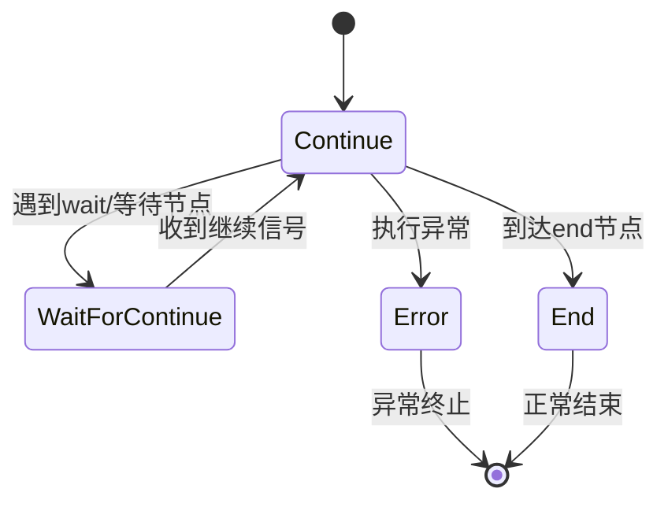
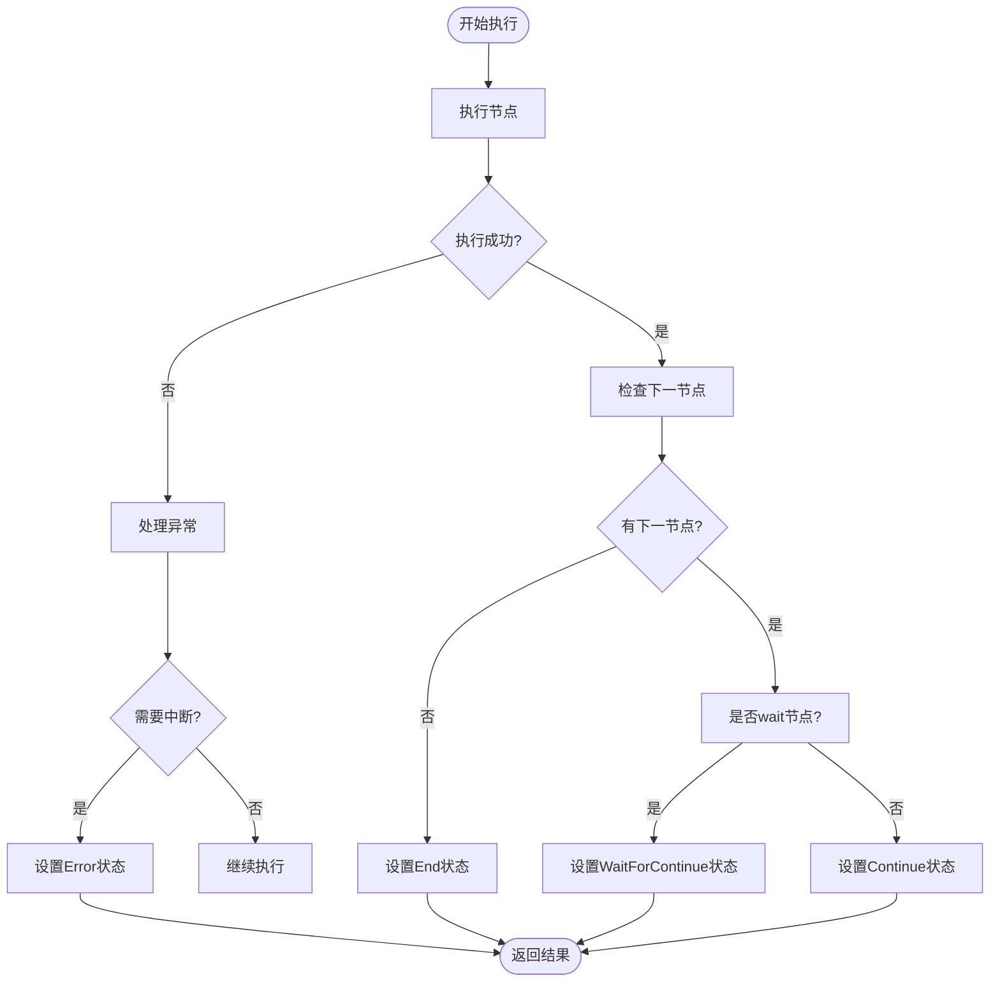
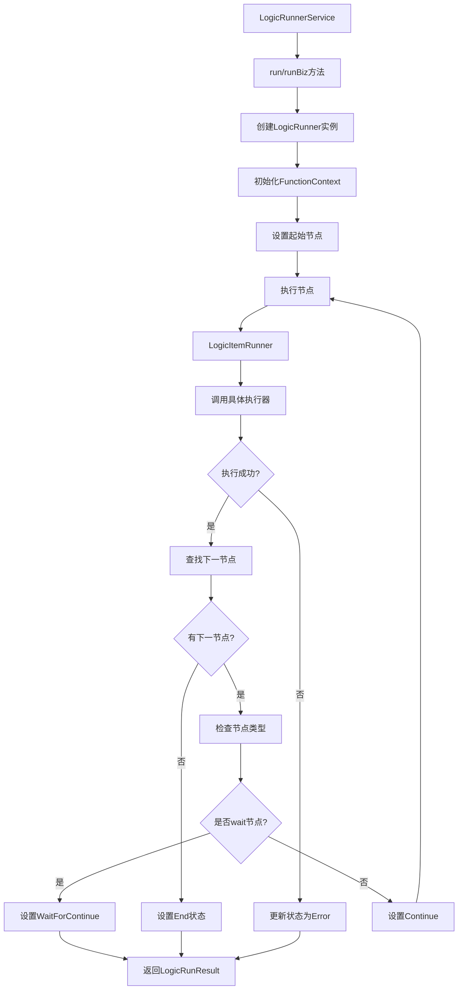

# 核心执行流程

<cite>
**本文档引用的文件**  
- [LogicRunnerService.java](file://logic-runtime/src/main/java/com/aims/logic/runtime/service/LogicRunnerService.java)
- [LogicRunner.java](file://logic-runtime/src/main/java/com/aims/logic/runtime/runner/LogicRunner.java)
- [LogicItemRunner.java](file://logic-runtime/src/main/java/com/aims/logic/runtime/runner/LogicItemRunner.java)
- [FunctionContext.java](file://logic-runtime/src/main/java/com/aims/logic/runtime/runner/FunctionContext.java)
- [LogicRunResult.java](file://logic-runtime/src/main/java/com/aims/logic/runtime/contract/dto/LogicRunResult.java)
- [RunnerStatusEnum.java](file://logic-runtime/src/main/java/com/aims/logic/runtime/contract/dto/RunnerStatusEnum.java)
- [ILogicItemFunctionRunner.java](file://logic-runtime/src/main/java/com/aims/logic/runtime/runner/functions/ILogicItemFunctionRunner.java)
- [LogicBizException.java](file://logic-runtime/src/main/java/com/aims/logic/runtime/LogicBizException.java)
</cite>

## 目录
1. [引言](#引言)
2. [核心组件与执行入口](#核心组件与执行入口)
3. [执行生命周期管理](#执行生命周期管理)
4. [run与runBiz方法对比](#run与runbiz方法对比)
5. [执行状态管理机制](#执行状态管理机制)
6. [异常与超时处理机制](#异常与超时处理机制)
7. [流程图示](#流程图示)
8. [结论](#结论)

## 引言
本文档详细描述了逻辑执行引擎的核心执行流程，重点分析`LogicRunnerService`作为主要入口点的作用，以及`LogicRunner`如何管理整个执行生命周期。涵盖从初始化、参数处理、节点调度到结果返回的完整流程，并深入解析执行状态转换、异常恢复机制等关键设计。

## 核心组件与执行入口

`LogicRunnerService`是逻辑执行的核心服务接口，提供多种执行入口方法，支持无状态和有状态执行模式。该服务通过`LogicRunner`实现具体的执行逻辑，`LogicRunner`负责解析逻辑配置、管理上下文状态并驱动节点执行。

`FunctionContext`类作为执行上下文容器，保存了参数、局部变量、环境变量、事务状态等关键信息，贯穿整个执行过程。

**本节来源**  
- [LogicRunnerService.java](file://logic-runtime/src/main/java/com/aims/logic/runtime/service/LogicRunnerService.java#L1-L288)
- [LogicRunner.java](file://logic-runtime/src/main/java/com/aims/logic/runtime/runner/LogicRunner.java#L1-L290)
- [FunctionContext.java](file://logic-runtime/src/main/java/com/aims/logic/runtime/runner/FunctionContext.java#L1-L104)

## 执行生命周期管理

逻辑执行的生命周期始于`LogicRunner`的初始化，通过`init`方法加载逻辑配置、解析参数、变量和环境变量。执行过程由`run`方法驱动，其核心流程如下：

1. **设置起始节点**：根据传入的节点ID或默认`start`节点确定执行起点
2. **初始化上下文**：将输入参数和局部变量注入`FunctionContext`
3. **节点执行循环**：调用`runItem`执行当前节点，然后通过`findNextItem`查找下一节点
4. **状态更新**：根据执行结果和节点类型更新`RunnerStatusEnum`
5. **循环判断**：若状态为`Continue`，继续执行下一节点，否则终止
6. **结果封装**：将执行日志和最终结果封装为`LogicRunResult`返回

执行过程中，`LogicItemRunner`负责具体节点的执行，通过`Functions.get(itemType).invoke()`调用对应类型的执行器。

**本节来源**  
- [LogicRunner.java](file://logic-runtime/src/main/java/com/aims/logic/runtime/runner/LogicRunner.java#L150-L250)
- [LogicItemRunner.java](file://logic-runtime/src/main/java/com/aims/logic/runtime/runner/LogicItemRunner.java#L1-L92)
- [FunctionContext.java](file://logic-runtime/src/main/java/com/aims/logic/runtime/runner/FunctionContext.java#L1-L104)

## run与runBiz方法对比

| 特性 | run方法系列 | runBiz方法系列 |
|------|------------|---------------|
| **状态管理** | 无状态执行，每次调用独立 | 有状态执行，通过bizId关联业务实例 |
| **适用场景** | 简单、幂等的逻辑调用 | 需要状态保持的复杂业务流程 |
| **参数处理** | 接收JSON字符串、对象数组或Map | 同左，但与特定bizId绑定 |
| **执行结果** | 返回即时执行结果 | 可支持中断-继续模式 |
| **生命周期** | 单次完整执行 | 可跨多次调用完成 |
| **典型用例** | 数据查询、简单计算 | 多步骤审批、长时间运行任务 |

`runBiz`系列方法支持`waitForContinue`节点，允许业务流程在特定节点暂停，等待外部事件触发后继续执行。

**本节来源**  
- [LogicRunnerService.java](file://logic-runtime/src/main/java/com/aims/logic/runtime/service/LogicRunnerService.java#L100-L180)

## 执行状态管理机制

执行状态由`RunnerStatusEnum`枚举定义，包含四种状态：

**状态转换逻辑**：
- **Continue**：默认状态，表示可继续执行下一节点
- **End**：到达`end`节点或无下一节点时设置
- **Error**：节点执行失败且需要中断时设置
- **WaitForContinue**：遇到`waitForContinue`或`start`节点时设置

状态更新由`updateStatus`方法完成，该方法根据当前节点执行结果和下一节点类型决定最终状态。

**本节来源**  
- [RunnerStatusEnum.java](file://logic-runtime/src/main/java/com/aims/logic/runtime/contract/dto/RunnerStatusEnum.java#L1-L8)
- [LogicRunner.java](file://logic-runtime/src/main/java/com/aims/logic/runtime/runner/LogicRunner.java#L252-L275)

## 异常与超时处理机制

系统提供完善的异常处理和恢复机制：

### 异常处理
- **retryErrorBiz**：重试存在异常的业务实例，自动恢复执行上下文（参数、变量、环境）
- **forceStopBiz**：强制停止指定业务实例
- **forceCompleteBiz**：强制完成业务实例（内部调用强制停止）

### 超时处理
- **retryLongtimeRunningBiz**：重试超时运行的业务，基于指定超时时间（秒）查询并恢复
- **queryLongtimeRunningBiz**：查询超时运行的业务实例（已弃用）

异常处理流程：
1. 捕获`LogicBizException`等业务异常
2. 记录错误日志到`LogicLog`
3. 设置执行状态为`Error`
4. 可通过重试机制恢复执行

**本节来源**  
- [LogicRunnerService.java](file://logic-runtime/src/main/java/com/aims/logic/runtime/service/LogicRunnerService.java#L182-L240)
- [LogicBizException.java](file://logic-runtime/src/main/java/com/aims/logic/runtime/LogicBizException.java#L1-L7)
- [LogicRunner.java](file://logic-runtime/src/main/java/com/aims/logic/runtime/runner/LogicRunner.java#L252-L275)

## 流程图示

**图示来源**  
- [LogicRunnerService.java](file://logic-runtime/src/main/java/com/aims/logic/runtime/service/LogicRunnerService.java#L1-L288)
- [LogicRunner.java](file://logic-runtime/src/main/java/com/aims/logic/runtime/runner/LogicRunner.java#L1-L290)
- [LogicItemRunner.java](file://logic-runtime/src/main/java/com/aims/logic/runtime/runner/LogicItemRunner.java#L1-L92)

## 结论
`LogicRunnerService`作为核心执行入口，通过`LogicRunner`实现了完整的执行生命周期管理。系统支持无状态和有状态两种执行模式，提供了灵活的参数处理、精确的节点调度和完善的执行状态管理。异常处理机制确保了系统的健壮性，而超时重试功能则增强了长时间运行任务的可靠性。整体设计体现了高内聚、低耦合的特点，为复杂业务逻辑的执行提供了稳定可靠的基础。