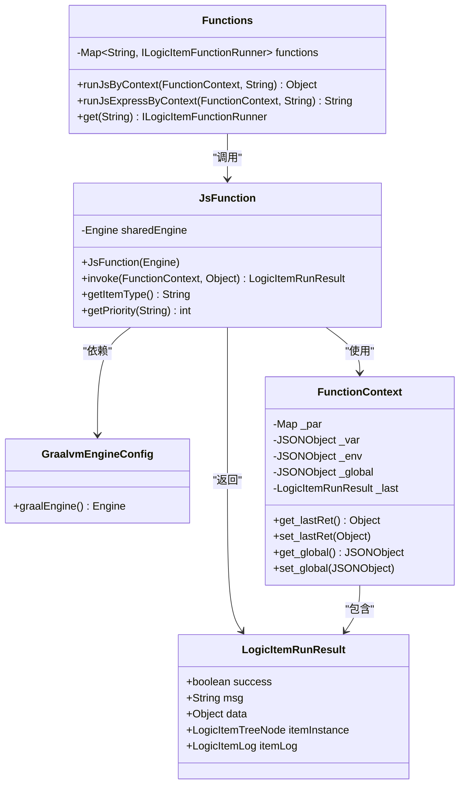
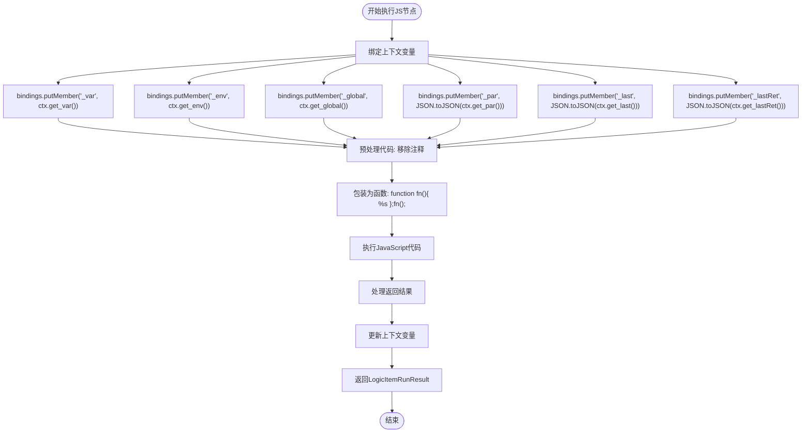
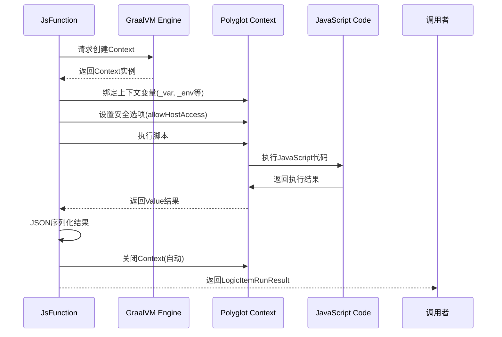

# JS节点执行

<cite>
**Referenced Files in This Document**   
- [JsFunction.java](file://logic-runtime/src/main/java/com/aims/logic/runtime/runner/functions/impl/JsFunction.java)
- [GraalvmEngineConfig.java](file://logic-runtime/src/main/java/com/aims/logic/runtime/configuration/GraalvmEngineConfig.java)
- [FunctionContext.java](file://logic-runtime/src/main/java/com/aims/logic/runtime/runner/FunctionContext.java)
- [LogicItemRunResult.java](file://logic-runtime/src/main/java/com/aims/logic/runtime/contract/dto/LogicItemRunResult.java)
- [Functions.java](file://logic-runtime/src/main/java/com/aims/logic/runtime/runner/Functions.java)
</cite>

## 目录
1. [简介](#简介)
2. [核心组件](#核心组件)
3. [JS执行架构](#js执行架构)
4. [上下文变量绑定机制](#上下文变量绑定机制)
5. [安全性与线程隔离](#安全性与线程隔离)
6. [返回值处理与异常捕获](#返回值处理与异常捕获)
7. [典型使用场景](#典型使用场景)
8. [性能优化建议](#性能优化建议)

## 简介
本文档详细介绍了基于GraalVM引擎的JS节点执行机制，重点阐述了`JsFunction`类的实现原理。系统通过GraalVM Polyglot API实现了JavaScript代码的安全执行，支持上下文变量的动态绑定和线程隔离。文档涵盖了从引擎配置、上下文管理到异常处理的完整执行流程，并提供了性能优化的最佳实践。

## 核心组件

`JsFunction`类是JS节点执行的核心实现，作为`ILogicItemFunctionRunner`接口的具体实现，负责JavaScript代码的解析和执行。该类通过依赖注入获取共享的GraalVM引擎实例，确保了资源的高效利用。执行过程中，系统会创建独立的Polyglot Context来保证线程安全，并通过JSON序列化机制实现Java对象与JavaScript对象之间的安全转换。

**Section sources**
- [JsFunction.java](file://logic-runtime/src/main/java/com/aims/logic/runtime/runner/functions/impl/JsFunction.java#L19-L146)
- [GraalvmEngineConfig.java](file://logic-runtime/src/main/java/com/aims/logic/runtime/configuration/GraalvmEngineConfig.java#L1-L15)

## JS执行架构

**Diagram sources**
- [JsFunction.java](file://logic-runtime/src/main/java/com/aims/logic/runtime/runner/functions/impl/JsFunction.java#L19-L146)
- [GraalvmEngineConfig.java](file://logic-runtime/src/main/java/com/aims/logic/runtime/configuration/GraalvmEngineConfig.java#L1-L15)
- [FunctionContext.java](file://logic-runtime/src/main/java/com/aims/logic/runtime/runner/FunctionContext.java#L14-L103)
- [LogicItemRunResult.java](file://logic-runtime/src/main/java/com/aims/logic/runtime/contract/dto/LogicItemRunResult.java#L8-L47)
- [Functions.java](file://logic-runtime/src/main/java/com/aims/logic/runtime/runner/Functions.java#L12-L51)

## 上下文变量绑定机制

系统通过`FunctionContext`类提供了一套完整的上下文变量管理体系，支持多种预定义变量的绑定：

- `_var`: 本地变量存储，用于保存当前逻辑流程中的临时数据
- `_env`: 环境变量，包含系统配置和运行时环境信息
- `_global`: 全局变量，通过`__global`字段在`_var`中维护，实现跨节点的数据共享
- `_par`: 参数对象，存储传入的业务参数
- `_last`: 上一个节点的执行结果对象
- `_lastRet`: 上一个节点的返回数据

在执行JavaScript代码前，系统会将这些上下文变量通过`context.getBindings("js")`方法绑定到GraalVM的JavaScript上下文中，使得脚本可以直接访问和操作这些变量。

**Diagram sources**
- [JsFunction.java](file://logic-runtime/src/main/java/com/aims/logic/runtime/runner/functions/impl/JsFunction.java#L29-L85)
- [FunctionContext.java](file://logic-runtime/src/main/java/com/aims/logic/runtime/runner/FunctionContext.java#L14-L103)

**Section sources**
- [JsFunction.java](file://logic-runtime/src/main/java/com/aims/logic/runtime/runner/functions/impl/JsFunction.java#L29-L85)
- [FunctionContext.java](file://logic-runtime/src/main/java/com/aims/logic/runtime/runner/FunctionContext.java#L14-L103)

## 安全性与线程隔离

系统通过多重机制确保JS代码执行的安全性和线程隔离：

1. **引擎共享与Context隔离**: 通过`GraalvmEngineConfig`配置的共享`Engine`实例，多个JS执行可以共享编译资源，但每个执行都创建独立的`Context`实例，确保线程安全。

2. **主机访问控制**: 在创建`Context`时，通过`.allowHostAccess(HostAccess.ALL)`明确允许主机访问，同时依赖GraalVM的安全沙箱机制限制潜在的危险操作。

3. **JSON序列化隔离**: 所有传递给JavaScript上下文的对象都通过`JSON.toJSON()`进行序列化，避免直接暴露Java对象引用，防止意外的内存泄漏或状态污染。

4. **自动资源管理**: 使用try-with-resources语法确保`Context`在执行完成后自动关闭，及时释放相关资源。

**Diagram sources**
- [JsFunction.java](file://logic-runtime/src/main/java/com/aims/logic/runtime/runner/functions/impl/JsFunction.java#L29-L85)
- [GraalvmEngineConfig.java](file://logic-runtime/src/main/java/com/aims/logic/runtime/configuration/GraalvmEngineConfig.java#L1-L15)

## 返回值处理与异常捕获

系统采用统一的返回值处理和异常捕获机制：

- **成功执行**: 将JavaScript执行结果通过`JSON.toJSON()`转换为Java对象，封装在`LogicItemRunResult`中返回，`success`字段设为`true`。

- **异常处理**: 捕获执行过程中的所有异常，记录详细的错误日志，设置`success`为`false`，并将异常信息存入`msg`字段。系统不会抛出异常，而是通过返回值的状态码进行错误传递。

- **结果更新**: 执行完成后，系统会更新上下文中的`_var`、`_env`等变量，确保后续节点可以访问到最新的状态。

**Section sources**
- [JsFunction.java](file://logic-runtime/src/main/java/com/aims/logic/runtime/runner/functions/impl/JsFunction.java#L29-L85)
- [LogicItemRunResult.java](file://logic-runtime/src/main/java/com/aims/logic/runtime/contract/dto/LogicItemRunResult.java#L8-L47)

## 典型使用场景

JS节点支持多种典型的业务场景：

1. **数据转换**: 将输入数据进行格式转换或计算处理
2. **条件判断**: 执行复杂的条件逻辑，决定流程走向
3. **变量赋值**: 动态设置或修改上下文变量
4. **数据验证**: 对输入数据进行校验和清洗

通过`Functions.runJsByContext()`和`Functions.runJsExpressByContext()`等工具方法，其他组件也可以方便地调用JS执行功能。

**Section sources**
- [Functions.java](file://logic-runtime/src/main/java/com/aims/logic/runtime/runner/Functions.java#L12-L51)
- [JsFunction.java](file://logic-runtime/src/main/java/com/aims/logic/runtime/runner/functions/impl/JsFunction.java#L29-L85)

## 性能优化建议

1. **引擎共享**: 通过Spring Bean管理的`Engine`实例实现全局共享，避免重复创建昂贵的编译资源。

2. **Context复用**: 虽然当前实现中每个执行都创建新的`Context`，但在高并发场景下可以考虑实现`Context`池化。

3. **代码缓存**: 对于频繁执行的相同脚本，可以考虑缓存编译后的`Value`对象。

4. **资源监控**: 监控GraalVM引擎的内存使用情况，及时发现潜在的内存泄漏问题。

5. **异步执行**: 对于耗时较长的JS执行，可以考虑异步化处理，避免阻塞主线程。

**Section sources**
- [GraalvmEngineConfig.java](file://logic-runtime/src/main/java/com/aims/logic/runtime/configuration/GraalvmEngineConfig.java#L1-L15)
- [JsFunction.java](file://logic-runtime/src/main/java/com/aims/logic/runtime/runner/functions/impl/JsFunction.java#L29-L85)