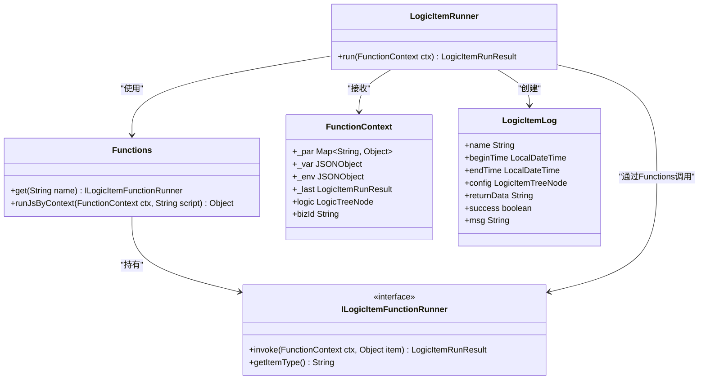
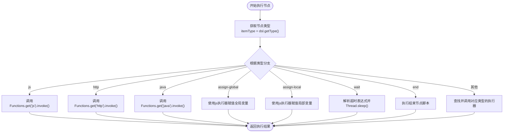
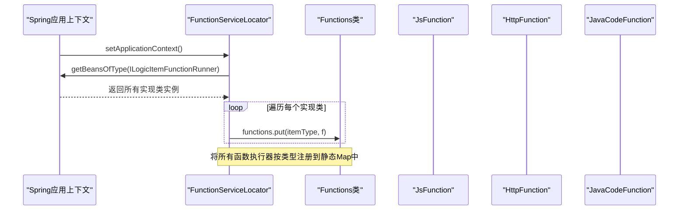
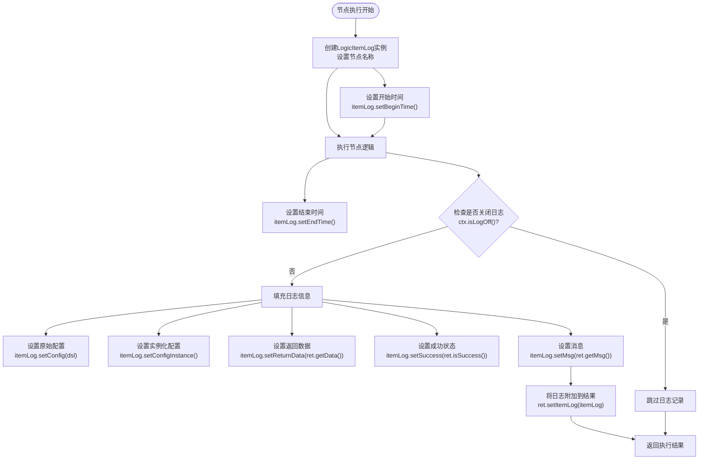
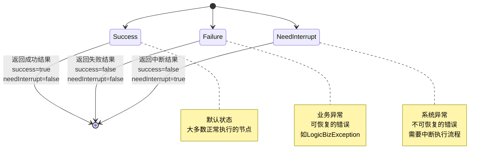
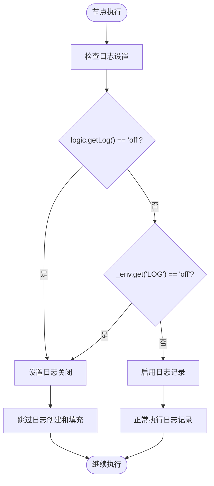

# 节点执行机制

<cite>
**Referenced Files in This Document**   
- [LogicItemRunner.java](file://logic-runtime/src/main/java/com/aims/logic/runtime/runner/LogicItemRunner.java)
- [LogicItemLog.java](file://logic-runtime/src/main/java/com/aims/logic/runtime/contract/logger/LogicItemLog.java)
- [Functions.java](file://logic-runtime/src/main/java/com/aims/logic/runtime/runner/Functions.java)
- [FunctionContext.java](file://logic-runtime/src/main/java/com/aims/logic/runtime/runner/FunctionContext.java)
- [FunctionServiceLocator.java](file://logic-runtime/src/main/java/com/aims/logic/runtime/runner/FunctionServiceLocator.java)
- [JsFunction.java](file://logic-runtime/src/main/java/com/aims/logic/runtime/runner/functions/impl/JsFunction.java)
- [HttpFunction.java](file://logic-runtime/src/main/java/com/aims/logic/runtime/runner/functions/impl/HttpFunction.java)
- [JavaCodeFunction.java](file://logic-runtime/src/main/java/com/aims/logic/runtime/runner/functions/impl/JavaCodeFunction.java)
- [SwitchFunction.java](file://logic-runtime/src/main/java/com/aims/logic/runtime/runner/functions/impl/SwitchFunction.java)
</cite>

## 目录
1. [简介](#简介)
2. [核心组件](#核心组件)
3. [执行调度机制](#执行调度机制)
4. [执行日志记录](#执行日志记录)
5. [执行结果处理](#执行结果处理)
6. [上下文数据访问](#上下文数据访问)
7. [性能优化策略](#性能优化策略)
8. [结论](#结论)

## 简介
本文档详细阐述了逻辑引擎中节点执行机制的实现原理，重点分析了`LogicItemRunner`类如何根据不同的节点类型（如js、http、java等）调度相应的函数执行器。文档还深入探讨了执行日志记录机制、节点执行结果的处理流程、上下文数据的访问方式以及关键的性能优化策略。

## 核心组件

节点执行机制的核心由多个关键组件构成，它们协同工作以实现灵活的节点执行能力。

**Section sources**
- [LogicItemRunner.java](file://logic-runtime/src/main/java/com/aims/logic/runtime/runner/LogicItemRunner.java#L10-L91)
- [Functions.java](file://logic-runtime/src/main/java/com/aims/logic/runtime/runner/Functions.java#L12-L51)
- [FunctionContext.java](file://logic-runtime/src/main/java/com/aims/logic/runtime/runner/FunctionContext.java#L14-L103)

### 组件关系图


**Diagram sources**
- [LogicItemRunner.java](file://logic-runtime/src/main/java/com/aims/logic/runtime/runner/LogicItemRunner.java#L10-L91)
- [Functions.java](file://logic-runtime/src/main/java/com/aims/logic/runtime/runner/Functions.java#L12-L51)
- [FunctionContext.java](file://logic-runtime/src/main/java/com/aims/logic/runtime/runner/FunctionContext.java#L14-L103)
- [LogicItemLog.java](file://logic-runtime/src/main/java/com/aims/logic/runtime/contract/logger/LogicItemLog.java#L11-L52)

## 执行调度机制

节点执行的调度机制是整个逻辑引擎的核心，它决定了如何根据节点类型选择并执行相应的功能。

### 调度流程


**Diagram sources**
- [LogicItemRunner.java](file://logic-runtime/src/main/java/com/aims/logic/runtime/runner/LogicItemRunner.java#L35-L70)

### 函数执行器注册机制
系统通过`FunctionServiceLocator`组件在应用启动时自动扫描并注册所有实现了`ILogicItemFunctionRunner`接口的Bean。



**Diagram sources**
- [FunctionServiceLocator.java](file://logic-runtime/src/main/java/com/aims/logic/runtime/runner/FunctionServiceLocator.java#L10-L31)
- [Functions.java](file://logic-runtime/src/main/java/com/aims/logic/runtime/runner/Functions.java#L12-L13)

**Section sources**
- [FunctionServiceLocator.java](file://logic-runtime/src/main/java/com/aims/logic/runtime/runner/FunctionServiceLocator.java#L10-L31)
- [Functions.java](file://logic-runtime/src/main/java/com/aims/logic/runtime/runner/Functions.java#L12-L13)

## 执行日志记录

执行日志记录机制用于捕获每个节点的执行详情，为调试和审计提供重要信息。

### 日志创建与填充流程


**Diagram sources**
- [LogicItemRunner.java](file://logic-runtime/src/main/java/com/aims/logic/runtime/runner/LogicItemRunner.java#L72-L90)
- [LogicItemLog.java](file://logic-runtime/src/main/java/com/aims/logic/runtime/contract/logger/LogicItemLog.java#L11-L52)

**Section sources**
- [LogicItemRunner.java](file://logic-runtime/src/main/java/com/aims/logic/runtime/runner/LogicItemRunner.java#L72-L90)
- [LogicItemLog.java](file://logic-runtime/src/main/java/com/aims/logic/runtime/contract/logger/LogicItemLog.java#L11-L52)

## 执行结果处理

节点执行结果的处理流程区分了成功、失败和需要中断等不同情况，确保了逻辑执行的健壮性。

### 结果处理状态机


**Diagram sources**
- [LogicItemRunResult.java](file://logic-runtime/src/main/java/com/aims/logic/runtime/contract/dto/LogicItemRunResult.java#L8-L47)
- [JavaCodeFunction.java](file://logic-runtime/src/main/java/com/aims/logic/runtime/runner/functions/impl/JavaCodeFunction.java#L100-L150)

**Section sources**
- [LogicItemRunResult.java](file://logic-runtime/src/main/java/com/aims/logic/runtime/contract/dto/LogicItemRunResult.java#L8-L47)
- [JavaCodeFunction.java](file://logic-runtime/src/main/java/com/aims/logic/runtime/runner/functions/impl/JavaCodeFunction.java#L100-L150)

## 上下文数据访问

`FunctionContext`类提供了对执行上下文数据的访问，支持多种数据域的隔离与共享。

### 上下文数据结构
```mermaid
erDiagram
FUNCTION_CONTEXT {
map _par
json _var
json _env
object _lastRet
string logicId
string bizId
string traceId
}
GLOBAL_VARIABLES {
json __global
}
TRANSACTION_SCOPE {
string __tranScope
object curTranGroupBeginItem
json curTranGroupBeginVar
}
FUNCTION_CONTEXT ||--o{ GLOBAL_VARIABLES : "包含"
FUNCTION_CONTEXT ||--o{ TRANSACTION_SCOPE : "包含"
class FUNCTION_CONTEXT "FunctionContext"
class GLOBAL_VARIABLES "__global变量域"
class TRANSACTION_SCOPE "事务相关数据"
```

**Diagram sources**
- [FunctionContext.java](file://logic-runtime/src/main/java/com/aims/logic/runtime/runner/FunctionContext.java#L14-L103)

**Section sources**
- [FunctionContext.java](file://logic-runtime/src/main/java/com/aims/logic/runtime/runner/FunctionContext.java#L14-L103)

## 性能优化策略

系统实施了多项性能优化策略，以确保在高负载和复杂逻辑下的稳定运行。

### 日志记录优化
系统通过`isLogOff()`方法判断是否关闭日志记录，以防止在循环逻辑或大数据处理时导致内存溢出。



**Diagram sources**
- [FunctionContext.java](file://logic-runtime/src/main/java/com/aims/logic/runtime/runner/FunctionContext.java#L96-L103)
- [LogicItemRunner.java](file://logic-runtime/src/main/java/com/aims/logic/runtime/runner/LogicItemRunner.java#L72-L75)

**Section sources**
- [FunctionContext.java](file://logic-runtime/src/main/java/com/aims/logic/runtime/runner/FunctionContext.java#L96-L103)
- [LogicItemRunner.java](file://logic-runtime/src/main/java/com/aims/logic/runtime/runner/LogicItemRunner.java#L72-L75)

## 结论
本文档全面分析了逻辑引擎的节点执行机制，涵盖了从调度、日志记录、结果处理到上下文管理和性能优化的各个方面。`LogicItemRunner`作为核心调度器，通过`Functions`静态Map高效地分发到各种类型的函数执行器。日志记录机制提供了详尽的执行追踪，同时通过可配置的日志开关避免了潜在的内存问题。整个系统设计体现了高内聚、低耦合的原则，为复杂业务逻辑的执行提供了稳定可靠的基础。