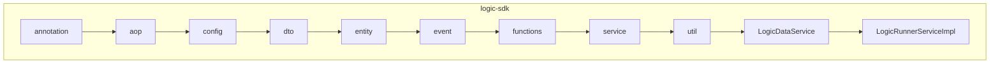
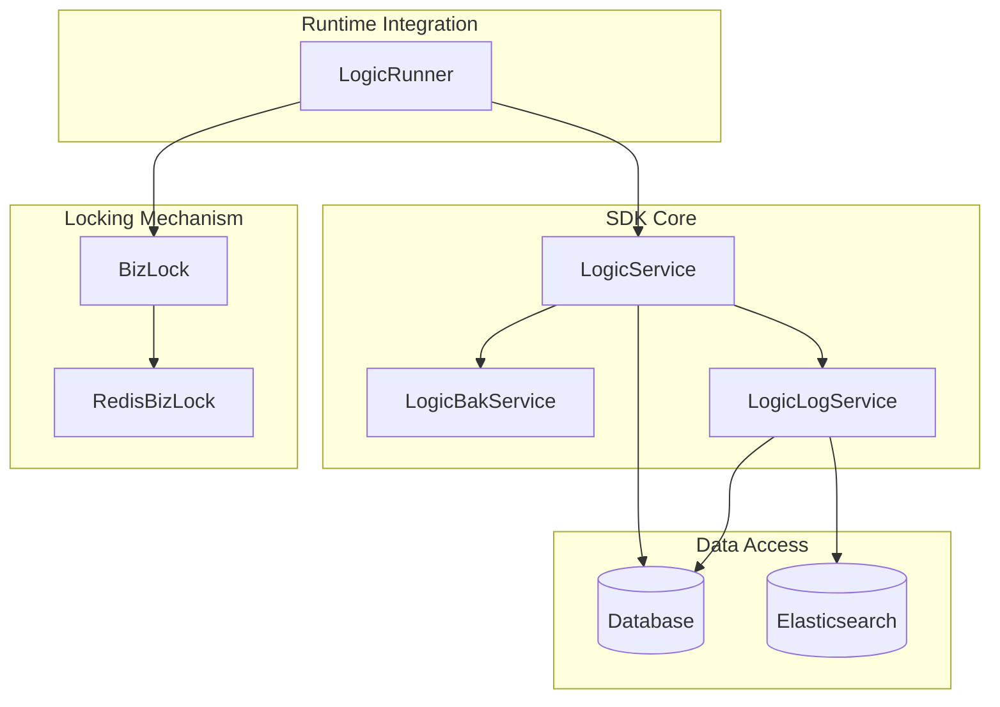
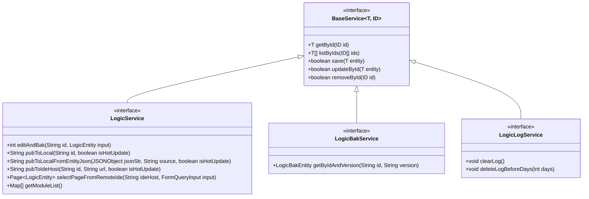
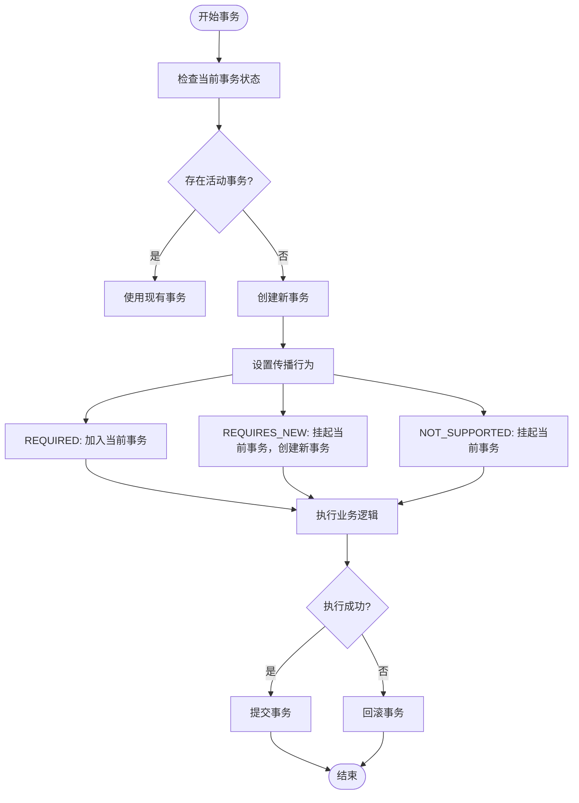
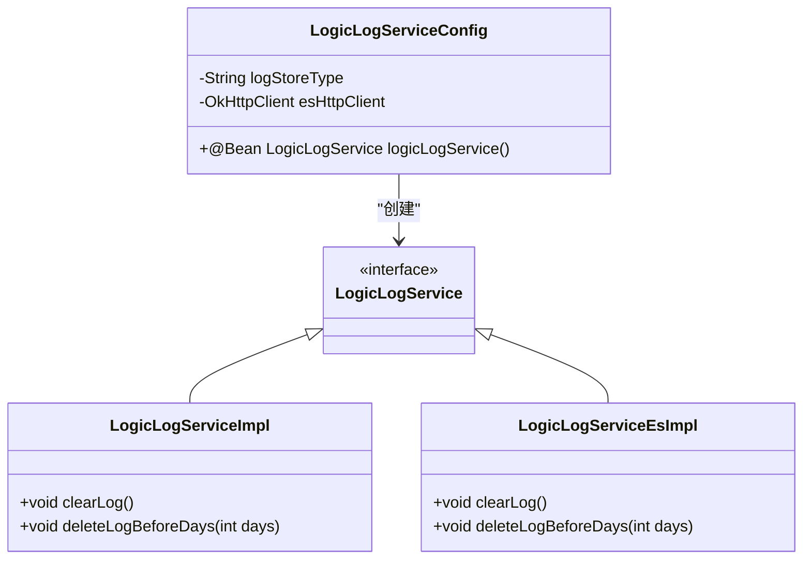
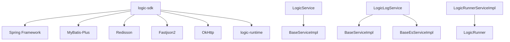

# logic-sdk模块

<cite>
**本文档中引用的文件**
- [LogicService.java](file://logic-sdk/src/main/java/com/aims/logic/sdk/service/LogicService.java)
- [LogicBakService.java](file://logic-sdk/src/main/java/com/aims/logic/sdk/service/LogicBakService.java)
- [LogicLogService.java](file://logic-sdk/src/main/java/com/aims/logic/sdk/service/LogicLogService.java)
- [BizLock.java](file://logic-sdk/src/main/java/com/aims/logic/sdk/util/lock/BizLock.java)
- [RedisBizLock.java](file://logic-sdk/src/main/java/com/aims/logic/sdk/util/lock/RedisBizLock.java)
- [TransactionalUtils.java](file://logic-sdk/src/main/java/com/aims/logic/sdk/util/TransactionalUtils.java)
- [LogicLogServiceConfig.java](file://logic-sdk/src/main/java/com/aims/logic/sdk/config/LogicLogServiceConfig.java)
- [LogicRunner.java](file://logic-runtime/src/main/java/com/aims/logic/runtime/runner/LogicRunner.java)
- [BaseServiceImpl.java](file://logic-sdk/src/main/java/com/aims/logic/sdk/service/impl/BaseServiceImpl.java)
- [BaseEsServiceImpl.java](file://logic-sdk/src/main/java/com/aims/logic/sdk/service/impl/BaseEsServiceImpl.java)
</cite>

## 目录
1. [简介](#简介)
2. [项目结构](#项目结构)
3. [核心组件](#核心组件)
4. [架构概述](#架构概述)
5. [详细组件分析](#详细组件分析)
6. [依赖分析](#依赖分析)
7. [性能考虑](#性能考虑)
8. [故障排除指南](#故障排除指南)
9. [结论](#结论)

## 简介
本文件旨在为`logic-sdk`模块提供全面的技术文档，重点介绍其服务层和数据访问功能。文档详细描述了`LogicService`、`LogicBakService`和`LogicLogService`等核心服务的设计与职责，深入解析基于`BizLock`的分布式锁机制及其在业务场景中的应用。同时，文档还解释了数据访问模式和事务管理策略，分析了服务层如何与`logic-runtime`模块集成以提供高级功能，并讨论了Elasticsearch和数据库作为日志存储选项的实现差异。最后，文档提供了关于如何使用SDK进行二次开发和集成的指导，包括最佳实践和常见陷阱。

## 项目结构
`logic-sdk`模块是整个逻辑处理系统的核心组件之一，主要负责业务逻辑的封装、数据持久化、日志管理以及与运行时环境的交互。该模块采用典型的分层架构设计，包含实体层（entity）、服务层（service）、数据传输对象（dto）、工具类（util）等标准组件。



**图示来源**
- [LogicService.java](file://logic-sdk/src/main/java/com/aims/logic/sdk/service/LogicService.java)
- [LogicBakService.java](file://logic-sdk/src/main/java/com/aims/logic/sdk/service/LogicBakService.java)
- [LogicLogService.java](file://logic-sdk/src/main/java/com/aims/logic/sdk/service/LogicLogService.java)

**本节来源**
- [logic-sdk](file://logic-sdk)

## 核心组件
`logic-sdk`模块的核心组件主要包括三大服务：`LogicService`用于管理逻辑实体的生命周期和发布流程；`LogicBakService`负责逻辑配置的版本备份与恢复；`LogicLogService`则专注于日志的存储与清理。这些服务共同构成了SDK的功能基础，支持上层应用对业务逻辑的高效管理和运维。

**本节来源**
- [LogicService.java](file://logic-sdk/src/main/java/com/aims/logic/sdk/service/LogicService.java)
- [LogicBakService.java](file://logic-sdk/src/main/java/com/aims/logic/sdk/service/LogicBakService.java)
- [LogicLogService.java](file://logic-sdk/src/main/java/com/aims/logic/sdk/service/LogicLogService.java)

## 架构概述
`logic-sdk`模块采用面向接口编程的设计原则，所有服务均通过接口定义契约，具体实现位于`impl`包下。模块通过Spring框架进行依赖注入和生命周期管理，并利用AOP技术实现横切关注点的分离。数据访问基于MyBatis-Plus框架，支持灵活的查询和分页功能。日志存储支持多种后端，包括关系型数据库和Elasticsearch，通过配置动态切换。



**图示来源**
- [LogicService.java](file://logic-sdk/src/main/java/com/aims/logic/sdk/service/LogicService.java)
- [LogicLogService.java](file://logic-sdk/src/main/java/com/aims/logic/sdk/service/LogicLogService.java)
- [BizLock.java](file://logic-sdk/src/main/java/com/aims/logic/sdk/util/lock/BizLock.java)
- [LogicRunner.java](file://logic-runtime/src/main/java/com/aims/logic/runtime/runner/LogicRunner.java)

## 详细组件分析

### 服务层设计与职责
`logic-sdk`的服务层遵循统一的接口规范，所有服务继承自`BaseService<T, ID>`泛型接口，确保了API的一致性和可扩展性。每个服务专注于特定领域的业务逻辑处理，如`LogicService`处理逻辑实体的增删改查及发布流程，`LogicBakService`管理逻辑配置的历史版本，`LogicLogService`负责日志的写入与清理。

#### 服务接口定义


**图示来源**
- [LogicService.java](file://logic-sdk/src/main/java/com/aims/logic/sdk/service/LogicService.java)
- [LogicBakService.java](file://logic-sdk/src/main/java/com/aims/logic/sdk/service/LogicBakService.java)
- [LogicLogService.java](file://logic-sdk/src/main/java/com/aims/logic/sdk/service/LogicLogService.java)

**本节来源**
- [LogicService.java](file://logic-sdk/src/main/java/com/aims/logic/sdk/service/LogicService.java)
- [LogicBakService.java](file://logic-sdk/src/main/java/com/aims/logic/sdk/service/LogicBakService.java)
- [LogicLogService.java](file://logic-sdk/src/main/java/com/aims/logic/sdk/service/LogicLogService.java)

### 分布式锁机制
`BizLock`接口定义了业务级分布式锁的核心操作，包括加锁、解锁、检查锁状态等。`RedisBizLock`是其实现之一，基于Redisson客户端提供可靠的分布式锁服务。该机制在业务执行过程中防止并发冲突，确保同一业务实例在同一时间只能被一个节点执行。

#### 分布式锁实现
```mermaid
sequenceDiagram
participant Client
participant BizLock
participant Redisson
Client->>BizLock : spinLock(key)
BizLock->>Redisson : tryLock(0, expire, SECONDS)
loop 重试机制
alt 获取成功
Redisson-->>BizLock : true
BizLock-->>Client : true
break
else 获取失败
BizLock->>BizLock : retryCount++
BizLock->>BizLock : sleep(waitTime)
end
end
alt 超时
BizLock-->>Client : false
end
```

**图示来源**
- [BizLock.java](file://logic-sdk/src/main/java/com/aims/logic/sdk/util/lock/BizLock.java)
- [RedisBizLock.java](file://logic-sdk/src/main/java/com/aims/logic/sdk/util/lock/RedisBizLock.java)

**本节来源**
- [BizLock.java](file://logic-sdk/src/main/java/com/aims/logic/sdk/util/lock/BizLock.java)
- [RedisBizLock.java](file://logic-sdk/src/main/java/com/aims/logic/sdk/util/lock/RedisBizLock.java)

### 数据访问模式与事务管理
数据访问层通过`BaseServiceImpl`和`BaseEsServiceImpl`分别支持数据库和Elasticsearch两种存储方式。事务管理由`TransactionalUtils`工具类提供，支持`REQUIRED`、`REQUIRES_NEW`和`NOT_SUPPORTED`三种传播行为，确保复杂业务场景下的数据一致性。

#### 事务管理策略


**图示来源**
- [TransactionalUtils.java](file://logic-sdk/src/main/java/com/aims/logic/sdk/util/TransactionalUtils.java)

**本节来源**
- [TransactionalUtils.java](file://logic-sdk/src/main/java/com/aims/logic/sdk/util/TransactionalUtils.java)

### 与logic-runtime模块集成
`LogicRunnerServiceImpl`作为`logic-sdk`与`logic-runtime`之间的桥梁，负责调用`LogicRunner`执行具体的业务逻辑。通过`FunctionContext`传递执行上下文，实现参数、变量、环境的隔离与共享。集成过程中，SDK负责前置校验、锁管理、事务控制，而Runtime专注于逻辑节点的逐个执行。

**本节来源**
- [LogicRunner.java](file://logic-runtime/src/main/java/com/aims/logic/runtime/runner/LogicRunner.java)
- [LogicRunnerServiceImpl.java](file://logic-sdk/src/main/java/com/aims/logic/sdk/LogicRunnerServiceImpl.java)

### 日志存储实现差异
日志存储支持数据库和Elasticsearch两种模式，通过`LogicLogServiceConfig`中的`logStoreType`配置项动态选择。数据库模式适用于结构化查询和事务一致性要求高的场景，而Elasticsearch模式更适合大规模日志检索和分析。

#### 日志服务配置


**图示来源**
- [LogicLogServiceConfig.java](file://logic-sdk/src/main/java/com/aims/logic/sdk/config/LogicLogServiceConfig.java)

**本节来源**
- [LogicLogServiceConfig.java](file://logic-sdk/src/main/java/com/aims/logic/sdk/config/LogicLogServiceConfig.java)

## 依赖分析
`logic-sdk`模块依赖于多个外部组件，包括Spring Framework、MyBatis-Plus、Redisson、Fastjson2、OkHttp等。内部组件之间通过清晰的接口边界进行通信，降低了耦合度。服务层依赖于实体层和工具层，而控制器层依赖于服务层，形成稳定的依赖方向。



**图示来源**
- [pom.xml](file://logic-sdk/pom.xml)
- [LogicService.java](file://logic-sdk/src/main/java/com/aims/logic/sdk/service/LogicService.java)
- [LogicRunner.java](file://logic-runtime/src/main/java/com/aims/logic/runtime/runner/LogicRunner.java)

**本节来源**
- [pom.xml](file://logic-sdk/pom.xml)

## 性能考虑
在高并发场景下，`RedisBizLock`的自旋锁机制可能带来一定的性能开销，建议合理配置重试次数和等待时间。日志写入操作应尽量异步化，避免阻塞主业务流程。对于频繁查询的逻辑配置，可引入本地缓存（如Caffeine）减少数据库压力。

## 故障排除指南
常见问题包括分布式锁获取超时、事务回滚异常、日志写入失败等。排查时应首先检查Redis连接是否正常，其次确认事务传播行为是否符合预期，最后验证日志服务配置是否正确。启用详细的日志输出有助于快速定位问题根源。

**本节来源**
- [RedisBizLock.java](file://logic-sdk/src/main/java/com/aims/logic/sdk/util/lock/RedisBizLock.java)
- [TransactionalUtils.java](file://logic-sdk/src/main/java/com/aims/logic/sdk/util/TransactionalUtils.java)
- [LogicLogServiceConfig.java](file://logic-sdk/src/main/java/com/aims/logic/sdk/config/LogicLogServiceConfig.java)

## 结论
`logic-sdk`模块通过清晰的分层设计和模块化架构，提供了强大而灵活的业务逻辑管理能力。其核心服务、分布式锁机制、事务管理策略和多存储支持使其能够适应各种复杂的业务场景。开发者在进行二次开发时，应遵循既定的接口规范和最佳实践，确保系统的稳定性和可维护性。