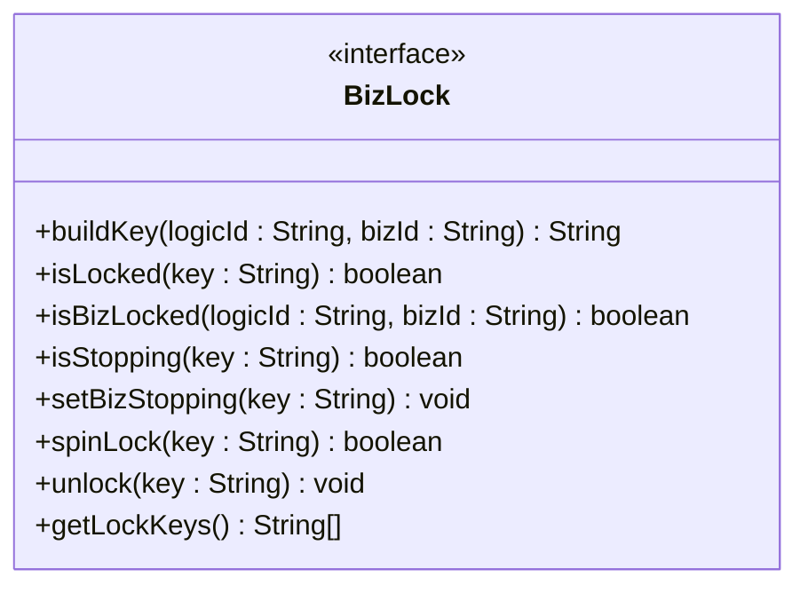
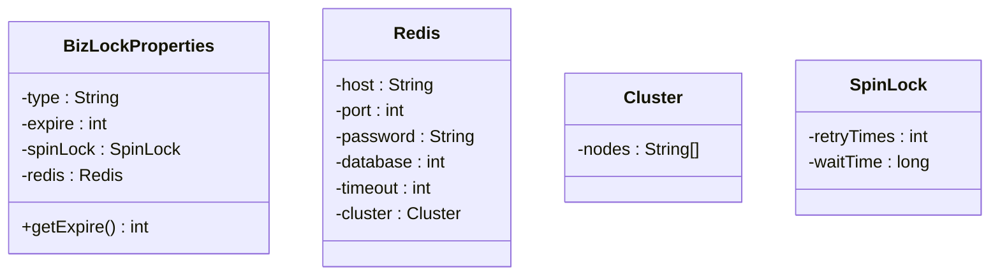
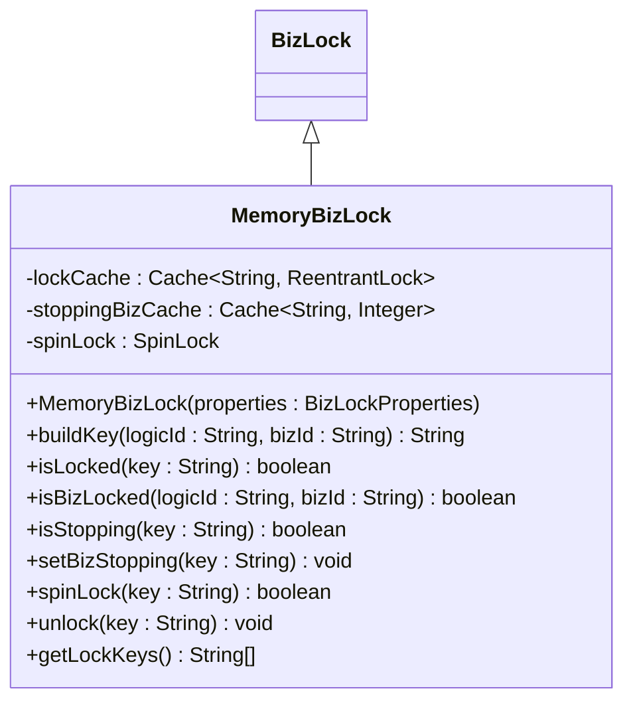
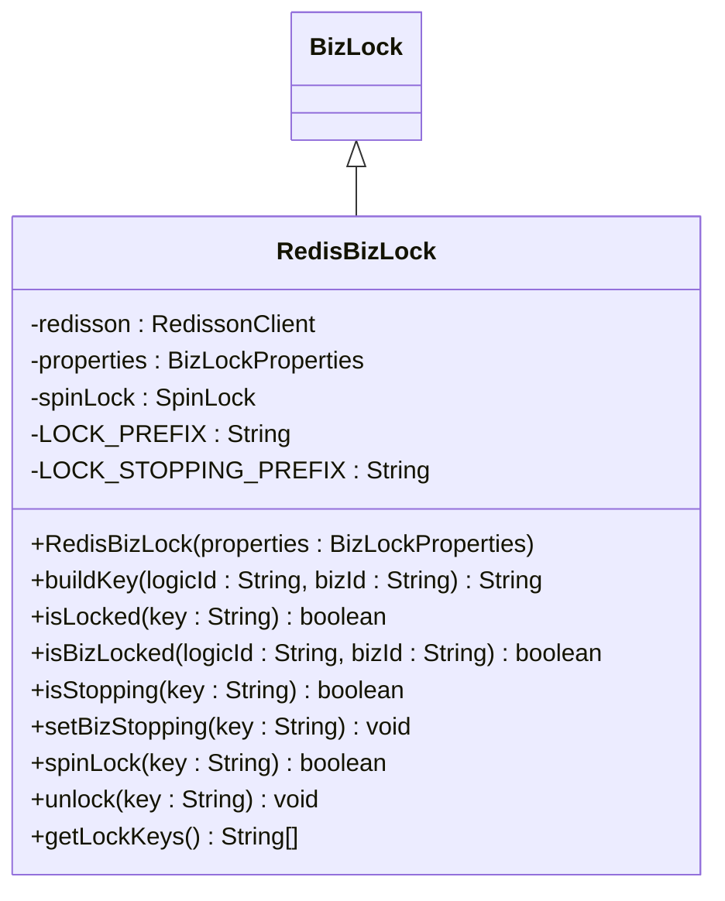
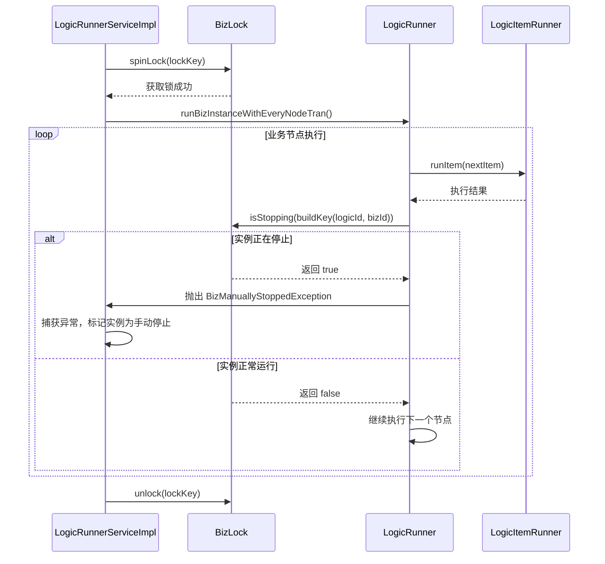

# 分布式锁机制

<cite>
**本文档引用的文件**   
- [BizLock.java](file://logic-sdk/src/main/java/com/aims/logic/sdk/util/lock/BizLock.java)
- [MemoryBizLock.java](file://logic-sdk/src/main/java/com/aims/logic/sdk/util/lock/MemoryBizLock.java)
- [RedisBizLock.java](file://logic-sdk/src/main/java/com/aims/logic/sdk/util/lock/RedisBizLock.java)
- [BizLockProperties.java](file://logic-sdk/src/main/java/com/aims/logic/sdk/util/lock/BizLockProperties.java)
- [LogicRunnerServiceImpl.java](file://logic-sdk/src/main/java/com/aims/logic/sdk/LogicRunnerServiceImpl.java)
- [LogicRunner.java](file://logic-runtime/src/main/java/com/aims/logic/runtime/runner/LogicRunner.java)
- [LogicItemRunner.java](file://logic-runtime/src/main/java/com/aims/logic/runtime/runner/LogicItemRunner.java)
- [LogicItemType.java](file://logic-runtime/src/main/java/com/aims/logic/runtime/contract/enums/LogicItemType.java)
- [LogicStopModel.java](file://logic-runtime/src/main/java/com/aims/logic/runtime/contract/enums/LogicStopModel.java)
- [BizManuallyStoppedException.java](file://logic-runtime/src/main/java/com/aims/logic/runtime/exception/BizManuallyStoppedException.java)
</cite>

## 目录
1. [引言](#引言)
2. [核心接口与配置](#核心接口与配置)
3. [两种实现方式对比](#两种实现方式对比)
4. [核心方法工作原理](#核心方法工作原理)
5. [优雅停止机制](#优雅停止机制)
6. [实际调用与应用实例](#实际调用与应用实例)
7. [最佳实践指导](#最佳实践指导)
8. [总结](#总结)

## 引言
在分布式系统中，确保业务实例的并发安全是保障数据一致性和系统稳定性的关键。本文档详细阐述基于 `BizLock` 接口的分布式锁机制设计，分析 `MemoryBizLock` 和 `RedisBizLock` 两种实现方式的适用场景与技术差异，解释 `buildKey`、`isLocked`、`spinLock` 等核心方法的工作原理及其在业务执行过程中的协调作用。同时，说明 `setBizStopping` 如何支持逻辑实例的优雅停止，并结合 `LogicRunnerServiceImpl` 中的实际调用，展示锁机制在防止并发冲突、保障状态一致性方面的应用实例。最后，提供锁超时配置、死锁预防和监控诊断的最佳实践指导。

## 核心接口与配置

### BizLock 接口定义
`BizLock` 接口是分布式锁机制的核心契约，定义了所有锁操作的统一方法。该接口位于 `logic-sdk` 模块中，为上层业务逻辑提供了与具体锁实现解耦的能力。



**接口方法说明：**
- `buildKey`: 根据逻辑ID和业务ID构建唯一的锁键。
- `isLocked`: 检查指定键的锁是否已被获取。
- `isBizLocked`: 检查指定逻辑和业务实例是否已被锁定。
- `isStopping`: 检查指定业务实例是否处于停止状态。
- `setBizStopping`: 标记指定业务实例为停止状态。
- `spinLock`: 尝试通过自旋方式获取锁。
- `unlock`: 释放指定键的锁。
- `getLockKeys`: 获取所有当前持有的锁键。

**接口来源**
- [BizLock.java](file://logic-sdk/src/main/java/com/aims/logic/sdk/util/lock/BizLock.java#L4-L22)

### 锁配置属性
`BizLockProperties` 类定义了分布式锁的配置属性，支持通过 `application.yml` 文件进行灵活配置。



**配置项说明：**
- `type`: 锁类型，可选 `MEMORY` 或 `REDIS`，默认为 `MEMORY`。
- `expire`: 锁的过期时间（秒），默认120秒。
- `spinLock.retryTimes`: 自旋锁重试次数，默认0次（即不重试）。
- `spinLock.waitTime`: 自旋锁等待时间（毫秒），默认0毫秒。
- `redis.host`: Redis服务器主机地址。
- `redis.port`: Redis服务器端口。
- `redis.password`: Redis密码。
- `redis.database`: Redis数据库索引。
- `redis.cluster.nodes`: Redis集群节点列表。

**配置来源**
- [BizLockProperties.java](file://logic-sdk/src/main/java/com/aims/logic/sdk/util/lock/BizLockProperties.java#L6-L43)

## 两种实现方式对比

### MemoryBizLock (内存锁)
`MemoryBizLock` 使用本地内存中的 `Caffeine` 缓存来实现锁机制，适用于单机部署或对性能要求极高且能容忍单点故障的场景。



**技术特点：**
- **性能极高**：基于本地内存操作，无网络开销。
- **简单轻量**：依赖 `Caffeine` 缓存库，实现简洁。
- **单点故障**：锁状态存储在单个JVM中，服务重启或宕机将丢失锁状态。
- **适用场景**：开发测试环境、单机部署应用、对延迟极其敏感的内部服务。

**实现来源**
- [MemoryBizLock.java](file://logic-sdk/src/main/java/com/aims/logic/sdk/util/lock/MemoryBizLock.java#L14-L114)

### RedisBizLock (Redis锁)
`RedisBizLock` 基于 `Redisson` 客户端实现，利用Redis的分布式特性，适用于多节点部署、需要高可用和强一致性的生产环境。



**技术特点：**
- **高可用性**：锁状态存储在Redis集群中，避免单点故障。
- **强一致性**：Redis的原子操作保证了锁的互斥性。
- **网络开销**：每次锁操作都需要与Redis进行网络通信。
- **适用场景**：生产环境、多节点集群部署、需要严格保证数据一致性的关键业务。

**实现来源**
- [RedisBizLock.java](file://logic-sdk/src/main/java/com/aims/logic/sdk/util/lock/RedisBizLock.java#L14-L162)

### 对比总结
| 特性 | MemoryBizLock | RedisBizLock |
| :--- | :--- | :--- |
| **部署要求** | 单机 | 分布式（需Redis） |
| **性能** | 极高（本地内存） | 高（网络延迟） |
| **可靠性** | 低（JVM重启丢失） | 高（Redis持久化） |
| **一致性** | 弱（单节点） | 强（分布式） |
| **复杂度** | 低 | 中（依赖外部服务） |
| **适用场景** | 开发测试、内部服务 | 生产环境、关键业务 |

## 核心方法工作原理

### buildKey 方法
`buildKey` 方法负责将逻辑ID和业务ID组合成一个全局唯一的锁键。这是所有锁操作的基础，确保了不同业务实例之间的隔离性。

```java
@Override
public String buildKey(String logicId, String bizId) {
    return logicId + ":" + bizId;
}
```

该方法在 `MemoryBizLock` 和 `RedisBizLock` 中的实现完全相同，通过简单的字符串拼接生成唯一键。此键将作为后续所有锁操作的标识。

**方法来源**
- [MemoryBizLock.java](file://logic-sdk/src/main/java/com/aims/logic/sdk/util/lock/MemoryBizLock.java#L31-L33)
- [RedisBizLock.java](file://logic-sdk/src/main/java/com/aims/logic/sdk/util/lock/RedisBizLock.java#L43-L45)

### isLocked 与 isBizLocked 方法
`isLocked` 方法检查指定键的锁是否已被获取。`isBizLocked` 是其便捷方法，直接接受逻辑ID和业务ID。

```mermaid
flowchart TD
A[调用 isBizLocked(logicId, bizId)] --> B[调用 buildKey(logicId, bizId)]
B --> C[生成唯一键 key]
C --> D[调用 isLocked(key)]
D --> E[返回锁状态]
```

在 `MemoryBizLock` 中，`isLocked` 通过检查 `Caffeine` 缓存的 `asMap()` 是否包含该键来判断。在 `RedisBizLock` 中，则通过 `Redisson` 的 `RLock.isLocked()` 方法查询Redis中的锁状态。

**方法来源**
- [MemoryBizLock.java](file://logic-sdk/src/main/java/com/aims/logic/sdk/util/lock/MemoryBizLock.java#L35-L37)
- [RedisBizLock.java](file://logic-sdk/src/main/java/com/aims/logic/sdk/util/lock/RedisBizLock.java#L47-L50)

### spinLock 方法
`spinLock` 方法是获取锁的核心逻辑，采用自旋重试机制，根据配置的重试次数和等待时间进行循环尝试。

```mermaid
flowchart TD
A[调用 spinLock(key)] --> B[初始化 retryCount = 0]
B --> C{retryCount <= 配置的重试次数?}
C --> |是| D[尝试获取锁]
D --> E{获取成功?}
E --> |是| F[返回 true]
E --> |否| G[retryCount++]
G --> H[等待 waitTime 毫秒]
H --> C
C --> |否| I[记录获取锁超时]
I --> J[返回 false]
```

**工作流程：**
1. 根据配置的 `retryTimes` 和 `waitTime` 进行循环。
2. 在每次循环中尝试获取锁（`ReentrantLock.tryLock()` 或 `RLock.tryLock()`）。
3. 如果获取成功，立即返回 `true`。
4. 如果获取失败，等待 `waitTime` 毫秒后重试。
5. 如果达到最大重试次数仍未获取成功，则记录错误并返回 `false`。

此方法确保了在高并发场景下，请求能够以可控的方式等待资源，避免了无限阻塞。

**方法来源**
- [MemoryBizLock.java](file://logic-sdk/src/main/java/com/aims/logic/sdk/util/lock/MemoryBizLock.java#L54-L87)
- [RedisBizLock.java](file://logic-sdk/src/main/java/com/aims/logic/sdk/util/lock/RedisBizLock.java#L86-L117)

### unlock 方法
`unlock` 方法负责安全地释放锁，并清理相关状态。

```mermaid
flowchart TD
A[调用 unlock(key)] --> B[获取锁对象]
B --> C{锁对象存在?}
C --> |是| D[从缓存/Redis中移除锁键]
D --> E[调用 lock.unlock()]
E --> F[记录解锁成功]
C --> |否| G[记录解锁错误]
```

在 `MemoryBizLock` 中，`unlock` 会从 `lockCache` 和 `stoppingBizCache` 中移除对应的键，并调用 `ReentrantLock.unlock()`。在 `RedisBizLock` 中，会先检查锁是否由当前线程持有，然后解锁并异步删除Redis中的锁键和停止标记键，以避免竞争条件。

**方法来源**
- [MemoryBizLock.java](file://logic-sdk/src/main/java/com/aims/logic/sdk/util/lock/MemoryBizLock.java#L90-L113)
- [RedisBizLock.java](file://logic-sdk/src/main/java/com/aims/logic/sdk/util/lock/RedisBizLock.java#L119-L157)

## 优雅停止机制

### setBizStopping 方法
`setBizStopping` 方法用于标记一个正在运行的业务实例为“停止中”状态，这是实现优雅停止的关键。

```java
@Override
public void setBizStopping(String key) {
    if (isLocked(key))
        stoppingBizCache.put(key, 0);
    else
        throw new RuntimeException("指定的实例不在运行中，无法停止。");
}
```

该方法首先检查目标实例是否已被锁定（即正在运行），只有在运行状态下的实例才能被标记为停止。在 `MemoryBizLock` 中，这通过向 `stoppingBizCache` 缓存中插入一个键值对来实现；在 `RedisBizLock` 中，则通过向Redis中设置一个带有前缀的键来实现。

**方法来源**
- [MemoryBizLock.java](file://logic-sdk/src/main/java/com/aims/logic/sdk/util/lock/MemoryBizLock.java#L47-L51)
- [RedisBizLock.java](file://logic-sdk/src/main/java/com/aims/logic/sdk/util/lock/RedisBizLock.java#L78-L82)

### 业务执行中的协调
在 `LogicRunnerServiceImpl` 的业务执行流程中，`isStopping` 方法被周期性地检查，以响应停止请求。



**协调流程：**
1. 业务开始执行前，通过 `spinLock` 获取分布式锁。
2. 在执行循环中，每当遇到 `wait` 类型的节点时，会调用 `bizLock.isStopping()` 检查停止标记。
3. 如果 `isStopping` 返回 `true`，则抛出 `BizManuallyStoppedException` 异常。
4. 上层逻辑捕获该异常，将实例状态标记为 `MANUAL`（手动停止），并终止执行。
5. 无论正常结束还是异常终止，最后都会调用 `unlock` 释放锁。

这种设计确保了业务实例可以在一个安全的检查点（如等待节点）被优雅地停止，避免了在关键操作中被强制中断导致的数据不一致。

**协调来源**
- [LogicRunnerServiceImpl.java](file://logic-sdk/src/main/java/com/aims/logic/sdk/LogicRunnerServiceImpl.java#L590-L655)
- [LogicRunnerServiceImpl.java](file://logic-sdk/src/main/java/com/aims/logic/sdk/LogicRunnerServiceImpl.java#L523-L580)

## 实际调用与应用实例

### 防止并发冲突
在 `LogicRunnerServiceImpl.runBizByMap` 方法中，分布式锁被用来防止同一个业务实例被并发执行。

```java
@Override
public LogicRunResult runBizByMap(String logicId, String bizId, Map<String, Object> parsMap, String traceId, String logicLogId, JSONObject globalVars) {
    String lockKey = bizLock.buildKey(logicId, bizId);
    TransactionStatus transactionStatus = null;
    if (bizLock.spinLock(lockKey)) {
        try {
            // ... 执行业务逻辑 ...
            return runBiz(logicId, bizId, parsMap, traceId, logicLogId, globalVars);
        } catch (Exception e) {
            // ... 异常处理 ...
            throw new RuntimeException(e);
        } finally {
            bizLock.unlock(lockKey);
        }
    } else {
        return new LogicRunResult().setSuccess(false).setMsg("获取锁失败");
    }
}
```

**应用说明：**
- **场景**：当多个请求试图同时执行同一个 `logicId` 和 `bizId` 的业务时。
- **作用**：`spinLock` 确保只有一个请求能成功获取锁并执行，其他请求将因获取锁失败而立即返回错误，从而避免了并发执行导致的状态混乱。

**调用来源**
- [LogicRunnerServiceImpl.java](file://logic-sdk/src/main/java/com/aims/logic/sdk/LogicRunnerServiceImpl.java#L241-L274)

### 保障状态一致性
在 `LogicRunnerServiceImpl.retryErrorBiz` 方法中，锁机制确保了重试操作的原子性。

```java
@Override
public LogicRunResult retryErrorBiz(String logicId, String bizId) {
    String lockKey = bizLock.buildKey(logicId, bizId);
    try {
        bizLock.spinLock(lockKey);
        log.info("[{}]bizId:{}-retryError get lock key:{}", logicId, bizId, lockKey);
        return runBiz(logicId, bizId, parsJson, UUID.randomUUID().toString(), traceId, null);
    } catch (Exception e) {
        log.error("[{}]bizId:{}-retryError catch逻辑异常:{}", logicId, bizId, e.getMessage());
        throw new RuntimeException(e);
    } finally {
        bizLock.unlock(lockKey);
    }
}
```

**应用说明：**
- **场景**：当一个业务实例执行失败后，需要从失败点重新执行。
- **作用**：在重试前获取锁，确保在重试过程中没有其他操作（如新的执行或停止）干扰，保证了重试操作的原子性和状态的一致性。

**调用来源**
- [LogicRunnerServiceImpl.java](file://logic-sdk/src/main/java/com/aims/logic/sdk/LogicRunnerServiceImpl.java#L768-L805)

## 最佳实践指导

### 锁超时配置
合理的锁超时配置是防止死锁的关键。
- **原则**：`expire` 时间应略大于业务执行的最长时间。
- **建议**：初始设置为120秒，根据实际业务耗时进行调整。
- **监控**：监控 `获取锁超时` 日志，频繁出现说明超时时间过短或系统负载过高。

### 死锁预防
- **避免长事务**：尽量减少持有锁的时间，将耗时操作移出锁的保护范围。
- **使用自旋锁**：通过配置 `spinLock.retryTimes` 和 `waitTime`，让请求以可控的方式等待，而不是无限阻塞。
- **幂等设计**：确保业务逻辑是幂等的，即使因网络问题导致锁释放失败，重复执行也不会产生副作用。

### 监控与诊断
- **日志监控**：重点关注 `获取锁成功`、`获取锁超时`、`unlock error` 等日志。
- **锁状态查询**：利用 `getLockKeys()` 方法，可以实时查询系统中所有被持有的锁，用于诊断和排查问题。
- **性能监控**：对于 `RedisBizLock`，监控Redis的性能指标（如延迟、CPU使用率），确保锁服务的稳定性。

## 总结
本文档详细阐述了基于 `BizLock` 接口的分布式锁机制。`MemoryBizLock` 和 `RedisBizLock` 提供了两种不同级别的实现，分别适用于不同的部署环境和可靠性要求。核心方法如 `buildKey`、`spinLock` 和 `unlock` 共同协作，确保了业务实例的并发安全。通过 `setBizStopping` 和 `isStopping` 机制，实现了业务实例的优雅停止。在 `LogicRunnerServiceImpl` 中的实际应用证明，该锁机制能有效防止并发冲突并保障状态一致性。遵循锁超时、死锁预防和监控诊断的最佳实践，可以确保该机制在生产环境中稳定可靠地运行。