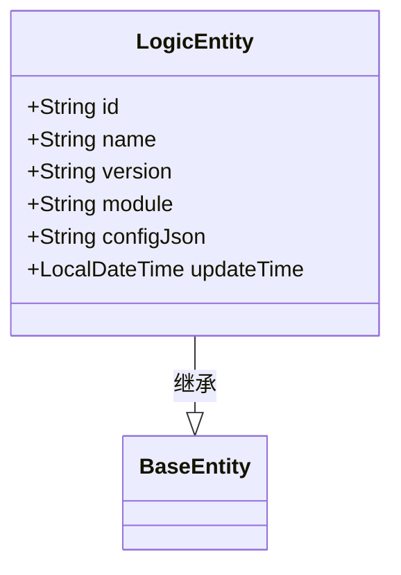
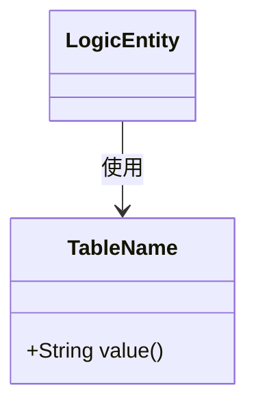
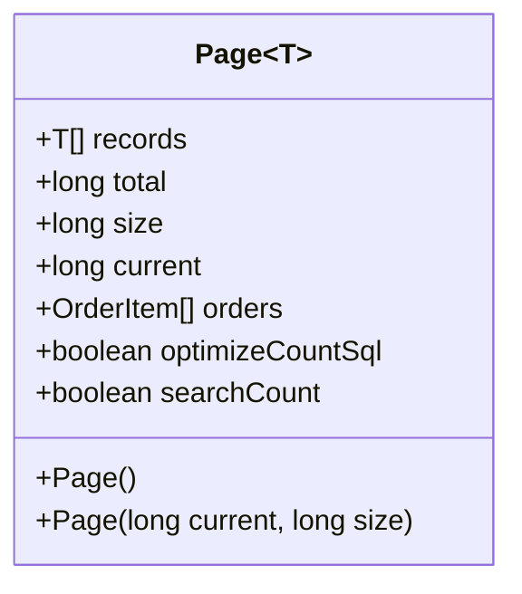
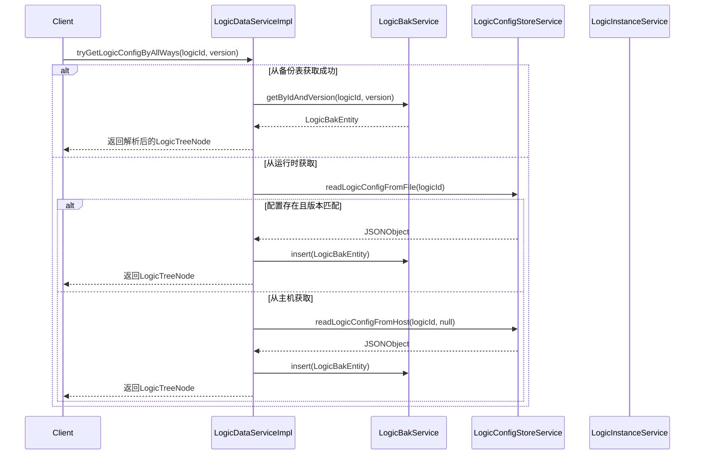

# 数据访问与实体模型

<cite>
**本文档中引用的文件**  
- [LogicEntity.java](file://logic-sdk/src/main/java/com/aims/logic/sdk/entity/LogicEntity.java)
- [FormQueryInput.java](file://logic-sdk/src/main/java/com/aims/logic/sdk/dto/FormQueryInput.java)
- [Page.java](file://logic-sdk/src/main/java/com/aims/logic/sdk/dto/Page.java)
- [LogicDataServiceImpl.java](file://logic-sdk/src/main/java/com/aims/logic/sdk/service/impl/LogicDataServiceImpl.java)
- [TableName.java](file://logic-sdk/src/main/java/com/aims/logic/sdk/annotation/TableName.java)
- [TableId.java](file://logic-sdk/src/main/java/com/aims/logic/sdk/annotation/TableId.java)
- [LogicDataService.java](file://logic-sdk/src/main/java/com/aims/logic/sdk/LogicDataService.java)
- [LogicInstanceService.java](file://logic-sdk/src/main/java/com/aims/logic/sdk/service/LogicInstanceService.java)
- [LogicConfigStoreService.java](file://logic-runtime/src/main/java/com/aims/logic/runtime/store/LogicConfigStoreService.java)
- [BizLock.java](file://logic-sdk/src/main/java/com/aims/logic/sdk/util/lock/BizLock.java)
</cite>

## 目录
1. [引言](#引言)  
2. [核心实体类分析](#核心实体类分析)  
3. [数据传输对象（DTO）详解](#数据传输对象dto详解)  
4. [数据访问服务实现](#数据访问服务实现)  
5. [自定义查询方法开发指南](#自定义查询方法开发指南)  
6. [实体关系与数据验证](#实体关系与数据验证)  
7. [性能优化建议](#性能优化建议)  
8. [结论](#结论)

## 引言
本文档旨在全面解析逻辑编排系统中的数据访问层设计与实现。重点分析核心实体类 `LogicEntity` 的字段定义与注解使用，阐述 `FormQueryInput` 和 `Page` 等 DTO 在分页查询中的作用，深入探讨 `LogicDataServiceImpl` 的数据查询、过滤与转换逻辑，并提供扩展数据访问功能的开发指南。

## 核心实体类分析

`LogicEntity` 是系统中的核心实体类，用于映射数据库中的 `logic` 表。该类继承自 `BaseEntity`，并使用 Lombok 注解简化代码。

### 字段定义与数据库映射

| 字段名 | 类型 | 注解 | 数据库列名 | 说明 |
|--------|------|------|------------|------|
| id | String | `@TableId(type = IdType.ASSIGN_ID)` | id | 主键，使用雪花算法生成唯一ID |
| name | String | 无 | name | 逻辑名称 |
| version | String | 无 | version | 版本号 |
| module | String | 无 | module | 所属模块 |
| configJson | String | `@TableField("configJson")` | configJson | 逻辑配置的JSON字符串 |
| updateTime | LocalDateTime | `@TableField("updateTime")`, `@JsonFormat` | updateTime | 更新时间，格式化为 "yyyy-MM-dd HH:mm:ss" |



**Diagram sources**
- [LogicEntity.java](file://logic-sdk/src/main/java/com/aims/logic/sdk/entity/LogicEntity.java#L12-L26)

### 注解解析

#### @TableName
该注解用于指定实体类对应的数据库表名。在 `LogicEntity` 类上使用 `@TableName("logic")`，表示该类映射到名为 `logic` 的数据库表。



**Diagram sources**
- [TableName.java](file://logic-sdk/src/main/java/com/aims/logic/sdk/annotation/TableName.java#L7-L11)

#### @TableId
该注解用于标识主键字段。`type = IdType.ASSIGN_ID` 表示使用雪花算法自动生成分布式唯一ID，避免了数据库自增主键的性能瓶颈和分布式环境下的冲突。

```mermaid
classDiagram
class TableId {
+IdType type() default IdType.NOT_SET
}
LogicEntity : : id --> TableId : 使用
```

**Diagram sources**
- [TableId.java](file://logic-sdk/src/main/java/com/aims/logic/sdk/annotation/TableId.java#L7-L11)

**Section sources**
- [LogicEntity.java](file://logic-sdk/src/main/java/com/aims/logic/sdk/entity/LogicEntity.java#L12-L26)
- [TableName.java](file://logic-sdk/src/main/java/com/aims/logic/sdk/annotation/TableName.java#L7-L11)
- [TableId.java](file://logic-sdk/src/main/java/com/aims/logic/sdk/annotation/TableId.java#L7-L11)

## 数据传输对象（DTO）详解

### FormQueryInput：查询条件封装

`FormQueryInput` 类用于封装前端传递的复杂查询条件，支持多字段过滤、排序和分页。

| 字段 | 类型 | 说明 |
|------|------|------|
| ids | List<String> | 按ID列表查询 |
| filters | List<DataFilterInput> | 条件过滤列表，默认为“或”关系，可通过type指定“与”查询 |
| orderBy | List<OrderByInput> | 排序规则列表 |
| page | int | 当前页码，默认为1 |
| pageSize | int | 每页大小， 默认为10 |

该对象作为查询接口的统一输入参数，极大地提高了接口的灵活性和复用性。

**Section sources**
- [FormQueryInput.java](file://logic-sdk/src/main/java/com/aims/logic/sdk/dto/FormQueryInput.java#L7-L18)

### Page：分页结果封装

`Page<T>` 是一个泛型类，用于封装分页查询的结果。

| 字段 | 类型 | 说明 |
|------|------|------|
| records | List<T> | 当前页的数据记录 |
| total | long | 总记录数 |
| size | long | 每页大小 |
| current | long | 当前页码 |
| orders | List<OrderItem> | 排序信息 |
| optimizeCountSql | boolean | 是否优化COUNT查询 |
| searchCount | boolean | 是否进行COUNT查询 |

该类提供了两个构造函数：无参构造函数和带 `current` 与 `size` 参数的构造函数，方便在不同场景下创建分页对象。



**Diagram sources**
- [Page.java](file://logic-sdk/src/main/java/com/aims/logic/sdk/dto/Page.java#L6-L23)

**Section sources**
- [Page.java](file://logic-sdk/src/main/java/com/aims/logic/sdk/dto/Page.java#L6-L23)

## 数据访问服务实现

`LogicDataServiceImpl` 是 `LogicDataService` 接口的具体实现，负责处理与业务实例相关的数据访问逻辑。

### 核心功能与实现逻辑

#### 1. 业务实例分页查询 (queryBiz)

该方法实现了根据创建时间范围、业务ID列表进行分页查询的功能。其核心逻辑如下：
1. 动态构建SQL查询条件。
2. 使用 `JdbcTemplate` 执行查询，获取分页数据。
3. 单独执行COUNT查询以获取总记录数。
4. 将结果封装到 `Page<LogicInstanceEntity>` 对象中返回。

此实现直接使用原生SQL，提供了对复杂查询条件的最大灵活性。

#### 2. 未完成业务查询 (queryUncompletedBizExclude)

该方法查询处于未完成状态的业务实例。其特点是：
- 支持多条件筛选（创建时间、运行状态、成功状态、最大重试次数、排除逻辑ID）。
- 调用 `LogicInstanceService` 获取基础数据。
- 将 `LogicInstanceEntity` 转换为 `UnCompletedBizDto`，并在转换过程中集成 `BizLock` 服务，检查业务是否被锁定，实现了数据聚合。

#### 3. 逻辑配置获取 (tryGetLogicConfigByAllWays)

该方法体现了系统“多源获取、优先备份、自动归档”的设计理念：
1. **优先从备份表查询**：确保能获取到指定版本的精确配置。
2. **其次从运行时配置获取**：从文件或主机读取当前运行的配置。
3. **自动归档**：一旦从运行时成功获取到匹配版本的配置，立即调用 `LogicBakService` 将其插入备份表，保证未来查询的效率和一致性。



**Diagram sources**
- [LogicDataServiceImpl.java](file://logic-sdk/src/main/java/com/aims/logic/sdk/service/impl/LogicDataServiceImpl.java#L23-L163)
- [LogicBakService.java](file://logic-sdk/src/main/java/com/aims/logic/sdk/service/LogicBakService.java#L4-L6)
- [LogicConfigStoreService.java](file://logic-runtime/src/main/java/com/aims/logic/runtime/store/LogicConfigStoreService.java#L12-L65)

### 与MyBatis-Plus的集成

尽管 `LogicDataServiceImpl` 主要使用 `JdbcTemplate` 进行数据操作，但整个数据访问层的设计与MyBatis-Plus的理念深度集成：
- **注解驱动**：通过 `@TableName` 和 `@TableId` 等自定义注解，实现了实体与数据库的映射，这与MyBatis-Plus的核心思想一致。
- **通用Service**：`BaseService` 接口为所有实体提供了CRUD的通用方法，减少了重复代码。
- **条件构造**：`FormQueryInput` 的设计思想类似于MyBatis-Plus的 `QueryWrapper`，将查询条件对象化。

**Section sources**
- [LogicDataServiceImpl.java](file://logic-sdk/src/main/java/com/aims/logic/sdk/service/impl/LogicDataServiceImpl.java#L23-L163)
- [LogicDataService.java](file://logic-sdk/src/main/java/com/aims/logic/sdk/LogicDataService.java#L14-L100)

## 自定义查询方法开发指南

要扩展数据访问功能，开发者可以遵循以下步骤：

1. **在 `LogicDataService` 接口定义新方法**：
   ```java
   Page<CustomResult> customQuery(CustomQueryInput input);
   ```

2. **在 `LogicDataServiceImpl` 中实现该方法**：
   - 优先考虑复用现有的 `LogicInstanceService` 或 `BaseService`。
   - 对于复杂查询，使用 `JdbcTemplate` 构建原生SQL。
   - 注意数据转换和聚合。

3. **创建必要的DTO**：
   - `CustomQueryInput` 用于封装查询条件。
   - `CustomResult` 用于封装返回结果。

4. **考虑性能**：
   - 为新查询涉及的字段添加数据库索引。
   - 如果查询频繁且数据量大，考虑引入缓存机制。

## 实体关系与数据验证

### 实体间关系

系统中的核心实体通过业务逻辑紧密关联：
- `LogicEntity` 代表一个逻辑编排的定义。
- `LogicInstanceEntity` 代表 `LogicEntity` 的一次具体执行实例。
- `LogicBakEntity` 用于存储 `LogicEntity` 的历史版本。
- `LogicLogEntity` 记录 `LogicInstanceEntity` 的执行日志。

这种设计实现了逻辑定义、实例化执行、版本管理和日志追踪的分离。

### 数据验证规则

虽然在提供的代码片段中未直接体现，但基于设计可以推断出关键的数据验证规则：
- **主键唯一性**：`@TableId` 确保了 `id` 字段的全局唯一。
- **必填字段**：`LogicEntity` 的 `id`, `name`, `version` 等字段在业务逻辑中应为必填。
- **时间格式**：`updateTime` 字段通过 `@JsonFormat` 注解确保了序列化和反序列化的格式统一。
- **业务状态一致性**：在 `LogicDataServiceImpl` 中，对 `isRunning`, `isSuccess` 等状态的查询逻辑保证了数据的一致性。

## 性能优化建议

1. **SQL优化**：
   - `queryBiz` 方法中的动态SQL拼接存在SQL注入风险，建议使用 `PreparedStatement` 的参数化查询。
   - COUNT查询可以考虑使用近似值或缓存来提升性能。

2. **索引优化**：
   - 为 `logic_instance` 表的 `createTime`, `bizId`, `logicId`, `isRunning`, `success` 等常用查询字段建立复合索引。

3. **缓存策略**：
   - `tryGetLogicConfigByAllWays` 方法已经利用了备份表作为缓存，可以进一步引入Redis等内存缓存，减少数据库访问。

4. **连接池配置**：
   - 确保 `JdbcTemplate` 使用的数据库连接池（如HikariCP）配置合理，以应对高并发场景。

## 结论

本文档深入解析了系统的数据访问层。`LogicEntity` 及其相关注解实现了实体与数据库的灵活映射；`FormQueryInput` 和 `Page` 提供了强大的分页查询能力；`LogicDataServiceImpl` 通过组合多种数据源和直接SQL操作，实现了复杂的数据访问逻辑。该设计在灵活性、性能和可维护性之间取得了良好的平衡，为系统的稳定运行提供了坚实的数据基础。