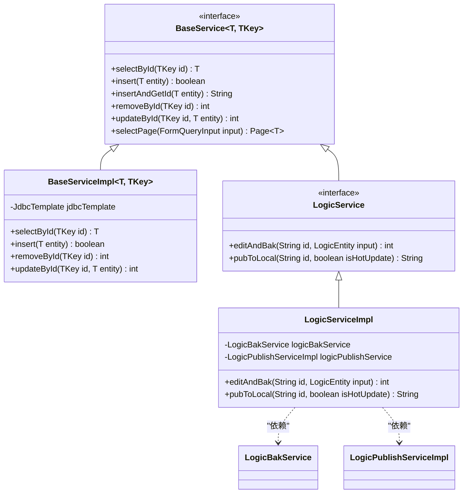
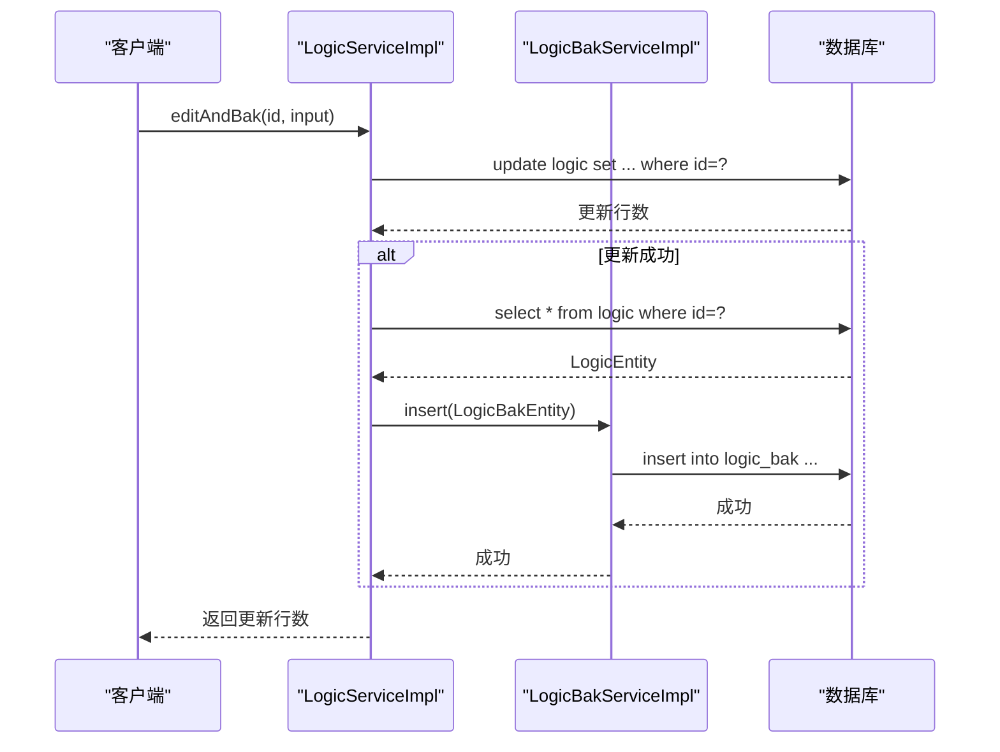
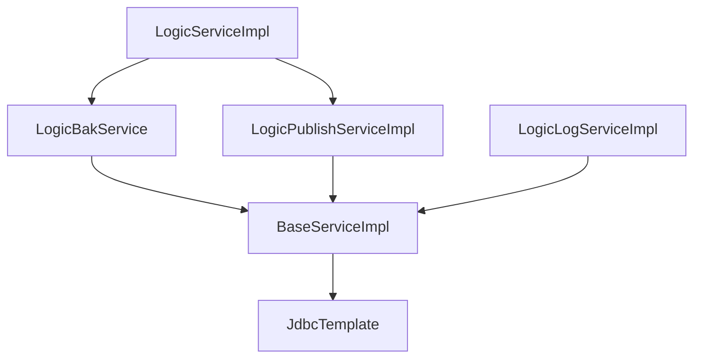

# 服务层设计

<cite>
**本文档中引用的文件**  
- [LogicService.java](file://logic-sdk/src/main/java/com/aims/logic/sdk/service/LogicService.java)
- [LogicBakService.java](file://logic-sdk/src/main/java/com/aims/logic/sdk/service/LogicBakService.java)
- [LogicLogService.java](file://logic-sdk/src/main/java/com/aims/logic/sdk/service/LogicLogService.java)
- [BaseService.java](file://logic-sdk/src/main/java/com/aims/logic/sdk/service/BaseService.java)
- [LogicServiceImpl.java](file://logic-sdk/src/main/java/com/aims/logic/sdk/service/impl/LogicServiceImpl.java)
- [LogicBakServiceImpl.java](file://logic-sdk/src/main/java/com/aims/logic/sdk/service/impl/LogicBakServiceImpl.java)
- [LogicLogServiceImpl.java](file://logic-sdk/src/main/java/com/aims/logic/sdk/service/impl/LogicLogServiceImpl.java)
- [LogicEntity.java](file://logic-sdk/src/main/java/com/aims/logic/sdk/entity/LogicEntity.java)
- [LogicBakEntity.java](file://logic-sdk/src/main/java/com/aims/logic/sdk/entity/LogicBakEntity.java)
- [LogicLogEntity.java](file://logic-sdk/src/main/java/com/aims/logic/sdk/entity/LogicLogEntity.java)
- [RuntimeUtil.java](file://logic-runtime/src/main/java/com/aims/logic/runtime/util/RuntimeUtil.java)
- [LogicPublishServiceImpl.java](file://logic-sdk/src/main/java/com/aims/logic/sdk/service/impl/LogicPublishServiceImpl.java)
</cite>

## 目录
1. [引言](#引言)
2. [核心服务接口设计](#核心服务接口设计)
3. [BaseService 基础服务抽象](#baseservice-基础服务抽象)
4. [关键操作实现路径](#关键操作实现路径)
5. [服务调用最佳实践](#服务调用最佳实践)
6. [异常处理与依赖关系](#异常处理与依赖关系)
7. [结论](#结论)

## 引言
`logic-sdk` 的服务层是整个逻辑配置系统的核心业务处理单元，负责逻辑实体的增删改查、版本备份、发布部署与日志管理。本文档深入分析 `LogicService`、`LogicBakService` 和 `LogicLogService` 等核心接口的设计原理与实现机制，阐明其职责划分与协作关系，为开发者提供清晰的调用指导与系统理解。

## 核心服务接口设计

### LogicService 接口
`LogicService` 是逻辑配置管理的主服务接口，继承自 `BaseService<LogicEntity, String>`，定义了逻辑实体的核心业务操作。

**业务语义与方法说明**：
- `editAndBak(String id, LogicEntity input)`：编辑指定ID的逻辑配置，并在更新前自动创建一个备份快照。此方法确保了变更的可追溯性。
- `pubToLocal(String id, boolean isHotUpdate)`：将指定ID的逻辑配置发布到本地运行时环境。`isHotUpdate` 参数控制是否进行热更新。
- `pubToLocalFromEntityJson(JSONObject jsonStr, String source, boolean isHotUpdate)`：从JSON字符串形式的逻辑实体数据发布到本地，主要用于远程同步场景。`source` 参数标识发布来源。
- `pubToIdeHost(String id, String url, boolean isHotUpdate)`：将逻辑配置发布到指定的远程IDE主机，实现跨环境部署。
- `selectPageFromRemoteIde(String ideHost, FormQueryInput input)`：从远程IDE主机查询逻辑配置列表，支持分页和条件过滤。
- `getModuleList()`：获取系统中所有已使用的模块（module）列表，用于前端下拉选择。

**Section sources**
- [LogicService.java](file://logic-sdk/src/main/java/com/aims/logic/sdk/service/LogicService.java#L10-L43)

### LogicBakService 接口
`LogicBakService` 专注于逻辑配置的版本备份管理，继承自 `BaseService<LogicBakEntity, String>`。

**业务语义与方法说明**：
- `getByIdAndVersion(String id, String version)`：根据逻辑ID和版本号查询特定的备份记录。该方法用于恢复历史版本或查看变更差异。

**Section sources**
- [LogicBakService.java](file://logic-sdk/src/main/java/com/aims/logic/sdk/service/LogicBakService.java#L4-L6)

### LogicLogService 接口
`LogicLogService` 负责逻辑运行日志的清理与维护，继承自 `BaseService<LogicLogEntity, String>`。

**业务语义与方法说明**：
- `clearLog()`：清空所有逻辑日志记录，通常用于系统维护。
- `deleteLogBeforeDays(int days)`：删除指定天数前的日志记录，实现日志的定期归档与清理。

**Section sources**
- [LogicLogService.java](file://logic-sdk/src/main/java/com/aims/logic/sdk/service/LogicLogService.java#L4-L13)

## BaseService 基础服务抽象

### 作用与职责
`BaseService<T, TKey>` 是一个泛型接口，为所有具体的服务实现提供了统一的CRUD（创建、读取、更新、删除）操作契约。它定义了数据访问的通用方法，实现了代码的复用和接口的一致性。

### 通用CRUD方法实现机制
`BaseService` 的具体实现由 `BaseServiceImpl<T, TKey>` 提供。该类通过依赖 `JdbcTemplate` 直接操作数据库，其核心机制如下：
- **泛型实体处理**：利用反射和泛型信息，将Java对象映射到数据库表和字段。
- **SQL构建**：基于实体的注解（如 `@TableName`, `@TableField`）动态构建SQL语句。
- **方法实现**：所有通用方法（如 `selectById`, `insert`, `updateById`, `removeById` 等）均在 `BaseServiceImpl` 中完成，子类无需重复实现。

**Diagram sources**
- [BaseService.java](file://logic-sdk/src/main/java/com/aims/logic/sdk/service/BaseService.java#L9-L37)
- [LogicService.java](file://logic-sdk/src/main/java/com/aims/logic/sdk/service/LogicService.java#L10-L43)
- [LogicServiceImpl.java](file://logic-sdk/src/main/java/com/aims/logic/sdk/service/impl/LogicServiceImpl.java#L1-L219)

## 关键操作实现路径

### 发布操作 (pubToLocal)
`pubToLocal` 方法的实现路径如下：
1.  调用 `selectById(id)` 从数据库加载完整的 `LogicEntity`。
2.  使用 `RuntimeUtil.saveLogicConfigToFile(id, config, isHotUpdate)` 将配置JSON保存到本地文件系统。
3.  构造 `LogicPublishedEntity` 对象，记录发布信息（如逻辑ID、名称、版本、发布时间、目标地址）。
4.  调用 `logicPublishService.insert(publishedEntity)` 将发布记录存入数据库。
5.  返回配置文件的保存路径。

**Section sources**
- [LogicServiceImpl.java](file://logic-sdk/src/main/java/com/aims/logic/sdk/service/impl/LogicServiceImpl.java#L75-L97)

### 备份操作 (editAndBak)
`editAndBak` 方法的实现路径如下：
1.  构建包含更新字段的 `valuesMap`（如 `updateTime`, `name`, `configJson` 等）。
2.  调用 `this.updateById(id, valuesMap)` 更新主表 `logic` 中的记录。
3.  如果更新成功（`uptRows > 0`），则调用 `selectById(id)` 获取更新后的完整实体。
4.  将该完整实体的数据复制到一个新的 `LogicBakEntity` 对象中。
5.  调用 `logicBakService.insert(bak)` 将备份记录插入 `logic_bak` 表。

**Section sources**
- [LogicServiceImpl.java](file://logic-sdk/src/main/java/com/aims/logic/sdk/service/impl/LogicServiceImpl.java#L48-L73)

### 日志清理操作 (clearLog)
`clearLog` 方法的实现路径如下：
1.  在 `LogicLogServiceImpl` 中直接执行SQL语句 `truncate logic_log`。
2.  该操作会高效地清空 `logic_log` 表中的所有数据。

**Diagram sources**
- [LogicServiceImpl.java](file://logic-sdk/src/main/java/com/aims/logic/sdk/service/impl/LogicServiceImpl.java#L48-L73)
- [LogicBakServiceImpl.java](file://logic-sdk/src/main/java/com/aims/logic/sdk/service/impl/LogicBakServiceImpl.java#L1-L26)

## 服务调用最佳实践

1.  **依赖注入**：在Spring环境中，应通过 `@Autowired` 注解注入 `LogicService` 等接口，而非直接实例化实现类。
2.  **事务管理**：`editAndBak` 操作涉及主表更新和备份表插入，应确保这两个操作在同一个数据库事务中，以保证数据一致性。虽然当前代码未显式声明，但应由调用方或通过AOP进行事务控制。
3.  **错误处理**：调用 `pubToIdeHost` 等网络操作时，需捕获 `RuntimeException`，并根据错误信息进行重试或告警。
4.  **参数校验**：在调用 `pubToLocal` 前，应确保 `id` 参数有效，避免因查询不到实体而抛出异常。

## 异常处理与依赖关系

### 异常处理策略
- **业务异常**：对于预期的业务错误（如“未找到逻辑”），方法会抛出带有明确描述的 `RuntimeException`。
- **系统异常**：对于数据库连接失败、网络IO异常等，代码捕获底层异常（如 `IOException`），并包装成 `RuntimeException` 抛出，便于上层统一处理。
- **日志记录**：关键操作（如备份失败、网络请求异常）均使用 `log.error()` 记录详细错误信息，便于问题排查。

### 服务间依赖关系
- `LogicServiceImpl` 依赖 `LogicBakService` 和 `LogicPublishServiceImpl`，以完成备份和发布记录的持久化。
- `LogicLogServiceImpl` 和 `LogicBakServiceImpl` 均依赖 `BaseServiceImpl`，继承其通用的数据库操作能力。
- `BaseServiceImpl` 依赖Spring的 `JdbcTemplate` 进行底层数据库交互。

**Diagram sources**
- [LogicServiceImpl.java](file://logic-sdk/src/main/java/com/aims/logic/sdk/service/impl/LogicServiceImpl.java#L1-L219)
- [LogicBakServiceImpl.java](file://logic-sdk/src/main/java/com/aims/logic/sdk/service/impl/LogicBakServiceImpl.java#L1-L26)
- [LogicLogServiceImpl.java](file://logic-sdk/src/main/java/com/aims/logic/sdk/service/impl/LogicLogServiceImpl.java#L1-L21)

## 结论
`logic-sdk` 的服务层通过清晰的接口划分和继承机制，实现了高内聚、低耦合的设计。`BaseService` 提供了强大的基础CRUD能力，而 `LogicService`、`LogicBakService` 等接口则专注于各自的业务领域。关键操作如发布和备份的实现路径清晰可靠，通过组合多个原子操作并依赖底层服务，完成了复杂的业务流程。开发者在使用时应遵循最佳实践，注意事务和异常处理，以确保系统的稳定运行。