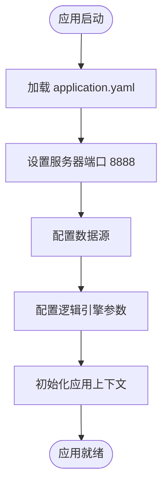

# test-suite模块

<cite>
**本文档引用的文件**
- [TestSuiteApplication.java](file://test-suite/src/main/java/com/aims/logic/testsuite/TestSuiteApplication.java)
- [application.yaml](file://test-suite/src/main/resources/application.yaml)
- [application-dev.yaml](file://test-suite/src/main/resources/application-dev.yaml)
- [TestRun.java](file://test-suite/src/test/java/com/aims/logic/testsuite/TestRun.java)
- [TestSuitApplicationTests.java](file://test-suite/src/test/java/com/aims/logic/testsuite/TestSuitApplicationTests.java)
- [TestEntity.java](file://test-suite/src/main/java/com/aims/logic/testsuite/demo/entity/TestEntity.java)
- [TestMapper.java](file://test-suite/src/main/java/com/aims/logic/testsuite/demo/mapper/TestMapper.java)
- [TestInput.java](file://test-suite/src/main/java/com/aims/logic/testsuite/demo/dto/TestInput.java)
- [ThrowException.java](file://test-suite/src/main/java/com/aims/logic/testsuite/demo/cases/ThrowException.java)
- [LogicRunnerEventHandler.java](file://test-suite/src/main/java/com/aims/logic/testsuite/demo/event/LogicRunnerEventHandler.java)
</cite>

## 目录
1. [简介](#简介)
2. [项目结构](#项目结构)
3. [核心组件](#核心组件)
4. [架构概述](#架构概述)
5. [详细组件分析](#详细组件分析)
6. [依赖分析](#依赖分析)
7. [性能考量](#性能考量)
8. [故障排除指南](#故障排除指南)
9. [结论](#结论)

## 简介
test-suite模块是逻辑引擎系统中的核心测试套件，旨在提供一个完整的示例和测试框架，用于验证系统的核心功能。该模块不仅作为集成测试和性能基准测试的工具，还作为开发者的参考实现，展示了最佳实践和典型使用模式。通过丰富的测试用例和清晰的配置结构，test-suite帮助开发者快速理解系统行为，并确保新功能的稳定性和可靠性。

## 项目结构

test-suite模块遵循标准的Spring Boot项目结构，包含主应用代码、资源配置和测试代码三个主要部分。

**Diagram sources**
- [TestSuiteApplication.java](file://test-suite/src/main/java/com/aims/logic/testsuite/TestSuiteApplication.java)
- [application.yaml](file://test-suite/src/main/resources/application.yaml)
- [TestRun.java](file://test-suite/src/test/java/com/aims/logic/testsuite/TestRun.java)

**Section sources**
- [TestSuiteApplication.java](file://test-suite/src/main/java/com/aims/logic/testsuite/TestSuiteApplication.java)
- [application.yaml](file://test-suite/src/main/resources/application.yaml)
- [TestRun.java](file://test-suite/src/test/java/com/aims/logic/testsuite/TestRun.java)

## 核心组件

test-suite模块的核心组件包括TestSuiteApplication主类、配置文件和测试用例。TestSuiteApplication作为应用的入口点，负责初始化Spring上下文和MyBatis映射器。配置文件定义了不同环境下的数据库连接、日志存储和其他运行时参数。测试用例则验证了核心功能的正确性，包括事务处理、并发控制和异常处理等。

**Section sources**
- [TestSuiteApplication.java](file://test-suite/src/main/java/com/aims/logic/testsuite/TestSuiteApplication.java)
- [application.yaml](file://test-suite/src/main/resources/application.yaml)
- [TestRun.java](file://test-suite/src/test/java/com/aims/logic/testsuite/TestRun.java)

## 架构概述

test-suite模块采用分层架构设计，包括应用层、服务层、数据访问层和持久层。应用层由TestSuiteApplication类构成，负责启动和配置整个应用。服务层通过LogicRunnerService与逻辑引擎交互，执行业务逻辑。数据访问层使用MyBatis进行数据库操作，而持久层则依赖于MySQL数据库存储测试数据。

**Diagram sources**
- [TestSuiteApplication.java](file://test-suite/src/main/java/com/aims/logic/testsuite/TestSuiteApplication.java)
- [TestMapper.java](file://test-suite/src/main/java/com/aims/logic/testsuite/demo/mapper/TestMapper.java)

## 详细组件分析

### TestSuiteApplication 分析

TestSuiteApplication是test-suite模块的主类，使用@SpringBootApplication注解启用Spring Boot的自动配置功能，并通过scanBasePackages指定基础包扫描路径。@MapperScan注解用于注册MyBatis映射器，使Spring能够管理数据访问对象。

**Diagram sources**
- [TestSuiteApplication.java](file://test-suite/src/main/java/com/aims/logic/testsuite/TestSuiteApplication.java)

**Section sources**
- [TestSuiteApplication.java](file://test-suite/src/main/java/com/aims/logic/testsuite/TestSuiteApplication.java)

### 配置文件分析

application.yaml文件定义了test-suite模块的全局配置，包括服务器端口、数据源信息、逻辑引擎日志配置和测试用例目录等。不同的环境配置文件（如application-dev.yaml）允许在不同环境中灵活调整设置。

**Diagram sources**
- [application.yaml](file://test-suite/src/main/resources/application.yaml)
- [application-dev.yaml](file://test-suite/src/main/resources/application-dev.yaml)

**Section sources**
- [application.yaml](file://test-suite/src/main/resources/application.yaml)
- [application-dev.yaml](file://test-suite/src/main/resources/application-dev.yaml)

### 测试用例分析

TestRun类是一个典型的JUnit测试用例，演示了如何使用LogicRunnerService执行逻辑运行。该测试通过JSON输入参数调用特定的逻辑ID，验证系统的响应行为。

**Diagram sources**
- [TestRun.java](file://test-suite/src/test/java/com/aims/logic/testsuite/TestRun.java)
- [TestSuiteApplication.java](file://test-suite/src/main/java/com/aims/logic/testsuite/TestSuiteApplication.java)

**Section sources**
- [TestRun.java](file://test-suite/src/test/java/com/aims/logic/testsuite/TestRun.java)

## 依赖分析

test-suite模块依赖于多个外部组件和内部服务，形成了复杂的依赖网络。

**Diagram sources**
- [TestSuiteApplication.java](file://test-suite/src/main/java/com/aims/logic/testsuite/TestSuiteApplication.java)
- [ThrowException.java](file://test-suite/src/main/java/com/aims/logic/testsuite/demo/cases/ThrowException.java)
- [LogicRunnerEventHandler.java](file://test-suite/src/main/java/com/aims/logic/testsuite/demo/event/LogicRunnerEventHandler.java)

**Section sources**
- [TestSuiteApplication.java](file://test-suite/src/main/java/com/aims/logic/testsuite/TestSuiteApplication.java)
- [ThrowException.java](file://test-suite/src/main/java/com/aims/logic/testsuite/demo/cases/ThrowException.java)
- [LogicRunnerEventHandler.java](file://test-suite/src/main/java/com/aims/logic/testsuite/demo/event/LogicRunnerEventHandler.java)

## 性能考量

test-suite模块包含多个性能测试用例，如TestConcurrency和TestAutoIdConcurrency，用于评估系统在高并发场景下的表现。TestSuitApplicationTests中的testBatchTran方法演示了如何使用线程池模拟批量事务处理，测量系统吞吐量和响应时间。

**Diagram sources**
- [TestSuitApplicationTests.java](file://test-suite/src/test/java/com/aims/logic/testsuite/TestSuitApplicationTests.java)

**Section sources**
- [TestSuitApplicationTests.java](file://test-suite/src/test/java/com/aims/logic/testsuite/TestSuitApplicationTests.java)

## 故障排除指南

当test-suite模块出现问题时，可以按照以下步骤进行排查：

1. 检查application.yaml中的数据库连接配置是否正确
2. 确认MySQL服务正在运行且可访问
3. 验证Elasticsearch连接信息（如果启用）
4. 查看日志输出，特别是LogicRunnerEventHandler中的事件回调信息
5. 检查自定义异常处理逻辑是否按预期工作

**Section sources**
- [application.yaml](file://test-suite/src/main/resources/application.yaml)
- [LogicRunnerEventHandler.java](file://test-suite/src/main/java/com/aims/logic/testsuite/demo/event/LogicRunnerEventHandler.java)
- [CustomException.java](file://test-suite/src/main/java/com/aims/logic/testsuite/demo/exception/CustomException.java)

## 结论

test-suite模块不仅是逻辑引擎系统的测试工具，更是一个完整的参考实现。它展示了如何正确配置和使用系统的核心功能，包括事务处理、并发控制、异常管理和事件监听。通过丰富的测试用例和清晰的配置结构，该模块为开发者提供了宝贵的实践指导，确保新功能的稳定性和可靠性。建议所有新功能开发都以test-suite中的模式为参考，并添加相应的测试用例以保证代码质量。