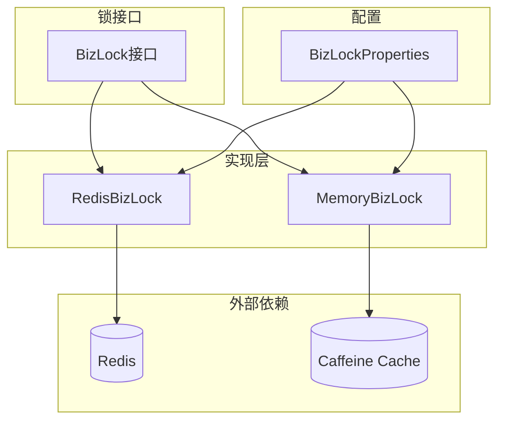
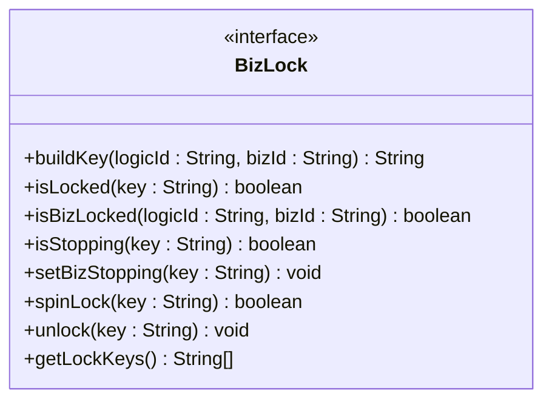
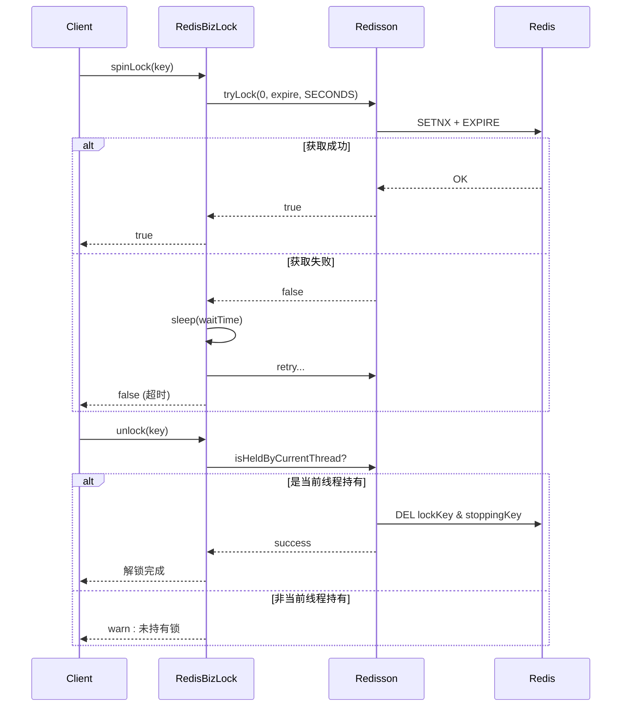
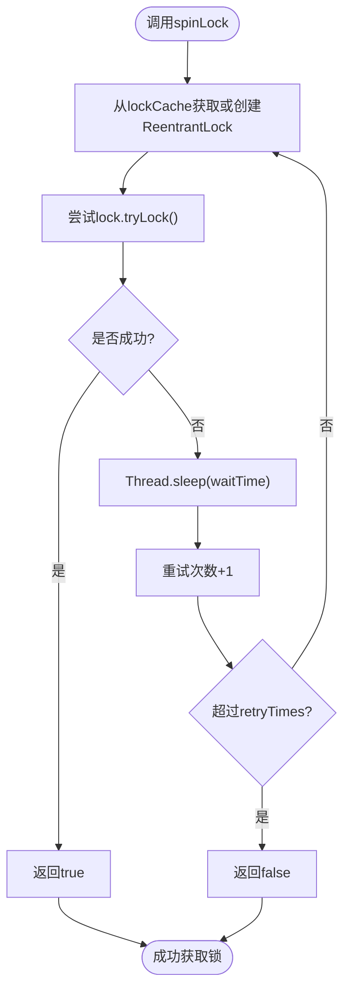
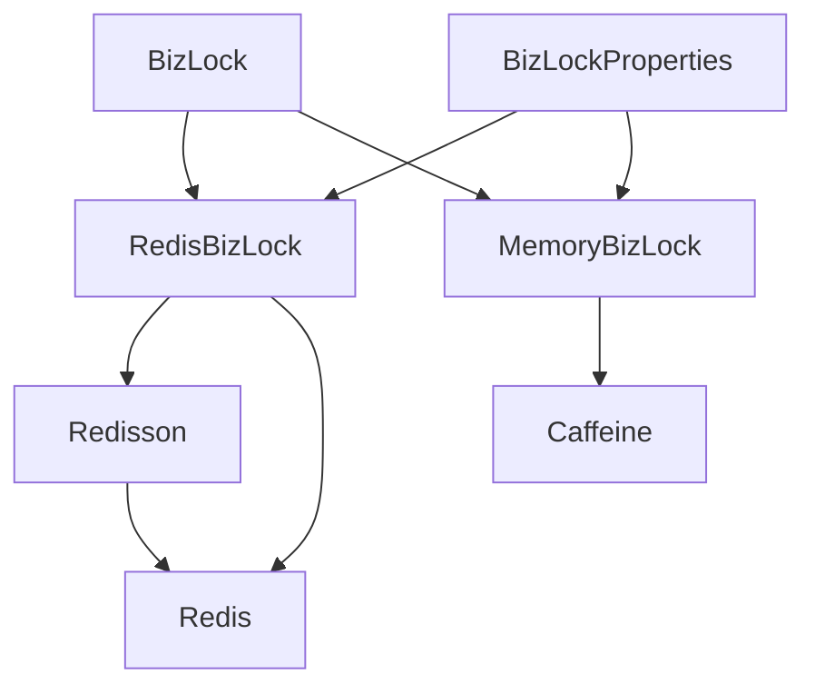

# 分布式锁扩展

<cite>
**本文档引用文件**  
- [BizLock.java](file://logic-sdk/src/main/java/com/aims/logic/sdk/util/lock/BizLock.java)
- [RedisBizLock.java](file://logic-sdk/src/main/java/com/aims/logic/sdk/util/lock/RedisBizLock.java)
- [MemoryBizLock.java](file://logic-sdk/src/main/java/com/aims/logic/sdk/util/lock/MemoryBizLock.java)
- [BizLockProperties.java](file://logic-sdk/src/main/java/com/aims/logic/sdk/util/lock/BizLockProperties.java)
- [application.yaml](file://test-suite/src/main/resources/application.yaml)
</cite>

## 目录
1. [简介](#简介)
2. [核心组件](#核心组件)
3. [架构概述](#架构概述)
4. [详细组件分析](#详细组件分析)
5. [依赖分析](#依赖分析)
6. [性能考虑](#性能考虑)
7. [最佳实践与使用建议](#最佳实践与使用建议)
8. [结论](#结论)

## 简介
本文档详细说明基于 `RedisBizLock` 实现的分布式业务锁机制，确保在多实例部署环境下业务操作的原子性。涵盖 `BizLock` 注解的使用方式、Redis 连接配置、锁超时与自动释放策略，并对比 `MemoryBizLock` 与 `RedisBizLock` 的适用场景。同时提供高并发下的锁竞争处理、锁粒度控制、死锁预防及性能监控等最佳实践。

## 核心组件

本系统中分布式锁的核心接口为 `BizLock`，其具体实现包括 `RedisBizLock`（基于 Redis）和 `MemoryBizLock`（基于内存缓存 Caffeine）。通过 `BizLockProperties` 配置类实现灵活的锁类型切换与参数定制。

**Section sources**
- [BizLock.java](file://logic-sdk/src/main/java/com/aims/logic/sdk/util/lock/BizLock.java)
- [RedisBizLock.java](file://logic-sdk/src/main/java/com/aims/logic/sdk/util/lock/RedisBizLock.java)
- [MemoryBizLock.java](file://logic-sdk/src/main/java/com/aims/logic/sdk/util/lock/MemoryBizLock.java)
- [BizLockProperties.java](file://logic-sdk/src/main/java/com/aims/logic/sdk/util/lock/BizLockProperties.java)

## 架构概述



**Diagram sources**
- [BizLock.java](file://logic-sdk/src/main/java/com/aims/logic/sdk/util/lock/BizLock.java)
- [RedisBizLock.java](file://logic-sdk/src/main/java/com/aims/logic/sdk/util/lock/RedisBizLock.java)
- [MemoryBizLock.java](file://logic-sdk/src/main/java/com/aims/logic/sdk/util/lock/MemoryBizLock.java)
- [BizLockProperties.java](file://logic-sdk/src/main/java/com/aims/logic/sdk/util/lock/BizLockProperties.java)

## 详细组件分析

### BizLock 接口分析

`BizLock` 是分布式业务锁的核心接口，定义了锁的通用行为，包括构建键、判断是否加锁、自旋获取锁、解锁及获取所有锁键等功能。



**Diagram sources**
- [BizLock.java](file://logic-sdk/src/main/java/com/aims/logic/sdk/util/lock/BizLock.java)

### RedisBizLock 实现分析

`RedisBizLock` 基于 Redisson 客户端实现分布式锁，支持单机与集群模式，利用 Redis 的原子性保证跨实例操作的互斥性。



**Diagram sources**
- [RedisBizLock.java](file://logic-sdk/src/main/java/com/aims/logic/sdk/util/lock/RedisBizLock.java)

### MemoryBizLock 实现分析

`MemoryBizLock` 使用 Caffeine 缓存结合 `ReentrantLock` 实现本地内存锁，适用于单节点部署或测试环境。



**Diagram sources**
- [MemoryBizLock.java](file://logic-sdk/src/main/java/com/aims/logic/sdk/util/lock/MemoryBizLock.java)

## 依赖分析



**Diagram sources**
- [BizLock.java](file://logic-sdk/src/main/java/com/aims/logic/sdk/util/lock/BizLock.java)
- [RedisBizLock.java](file://logic-sdk/src/main/java/com/aims/logic/sdk/util/lock/RedisBizLock.java)
- [MemoryBizLock.java](file://logic-sdk/src/main/java/com/aims/logic/sdk/util/lock/MemoryBizLock.java)
- [BizLockProperties.java](file://logic-sdk/src/main/java/com/aims/logic/sdk/util/lock/BizLockProperties.java)

**Section sources**
- [BizLock.java](file://logic-sdk/src/main/java/com/aims/logic/sdk/util/lock/BizLock.java)
- [RedisBizLock.java](file://logic-sdk/src/main/java/com/aims/logic/sdk/util/lock/RedisBizLock.java)
- [MemoryBizLock.java](file://logic-sdk/src/main/java/com/aims/logic/sdk/util/lock/MemoryBizLock.java)
- [BizLockProperties.java](file://logic-sdk/src/main/java/com/aims/logic/sdk/util/lock/BizLockProperties.java)

## 性能考虑

- **Redis 模式**：适用于多实例部署，具备强一致性，但存在网络延迟开销。建议合理设置 `expire` 时间避免死锁。
- **内存模式**：无网络开销，性能极高，但仅限单节点使用，不适用于分布式场景。
- **自旋锁配置**：通过 `spinLock.retryTimes` 和 `spinLock.waitTime` 控制重试行为，避免过度消耗 CPU。
- **锁释放优化**：`RedisBizLock` 中采用异步删除锁键，减少主线程阻塞时间。

**Section sources**
- [RedisBizLock.java](file://logic-sdk/src/main/java/com/aims/logic/sdk/util/lock/RedisBizLock.java)
- [MemoryBizLock.java](file://logic-sdk/src/main/java/com/aims/logic/sdk/util/lock/MemoryBizLock.java)
- [BizLockProperties.java](file://logic-sdk/src/main/java/com/aims/logic/sdk/util/lock/BizLockProperties.java)

## 最佳实践与使用建议

### 配置示例（application.yaml）

```yaml
logic:
  biz-lock:
    type: redis  # 可选 memory 或 redis
    expire: 120  # 锁过期时间，秒
    spin-lock:
      retry-times: 3
      wait-time: 100
    redis:
      host: 192.168.53.205
      port: 6379
      database: 1
      password: aims1@034
```

### 使用代码片段

```java
@Autowired
private BizLock bizLock;

public void executeBusiness(String logicId, String bizId) {
    String key = bizLock.buildKey(logicId, bizId);
    
    if (!bizLock.spinLock(key)) {
        throw new RuntimeException("无法获取业务锁，操作被拒绝");
    }
    
    try {
        // 执行业务逻辑
        doBusiness();
    } finally {
        bizLock.unlock(key);
    }
}
```

### 场景对比

| 特性 | RedisBizLock | MemoryBizLock |
|------|---------------|----------------|
| 分布式支持 | ✅ | ❌ |
| 数据一致性 | 强一致 | 本地一致 |
| 性能 | 中等（网络开销） | 高 |
| 容错性 | 高（Redis持久化） | 低（进程重启丢失） |
| 适用场景 | 生产环境多实例 | 单机测试/开发 |

### 死锁预防

- 所有锁操作必须置于 `try-finally` 块中，确保最终释放。
- 设置合理的 `expire` 时间，防止因异常导致锁永久占用。
- 提供 `getLockKeys()` 接口用于监控和诊断当前所有活跃锁。

### 锁粒度控制

建议以 `logicId:bizId` 作为锁键，精确控制到具体业务实例，避免粗粒度锁影响并发性能。

### 性能监控

可通过 `getLockKeys()` 方法定期采集当前持有锁的数量与分布，结合日志分析锁竞争热点。

## 结论

`RedisBizLock` 提供了可靠的分布式业务锁实现，结合 `BizLockProperties` 可灵活切换内存或 Redis 模式。在高并发生产环境中推荐使用 Redis 模式，并合理配置超时与重试参数。同时应遵循最佳实践，确保锁的正确获取与释放，预防死锁并优化系统性能。