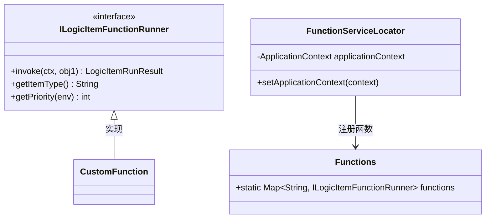
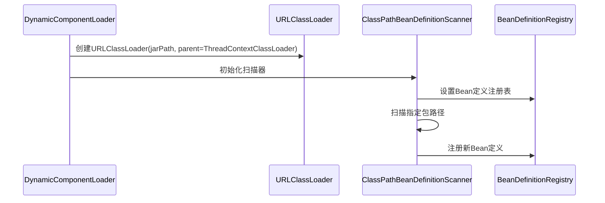
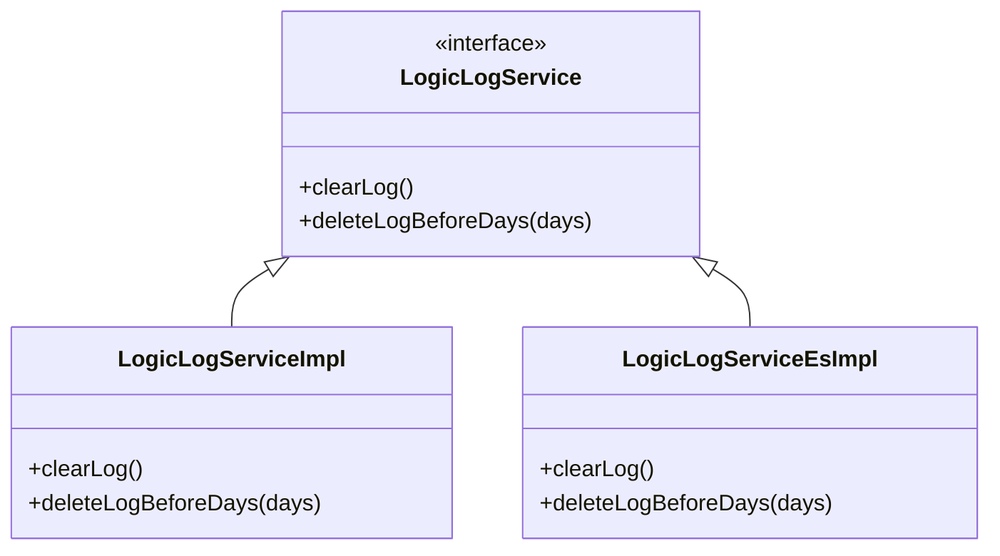
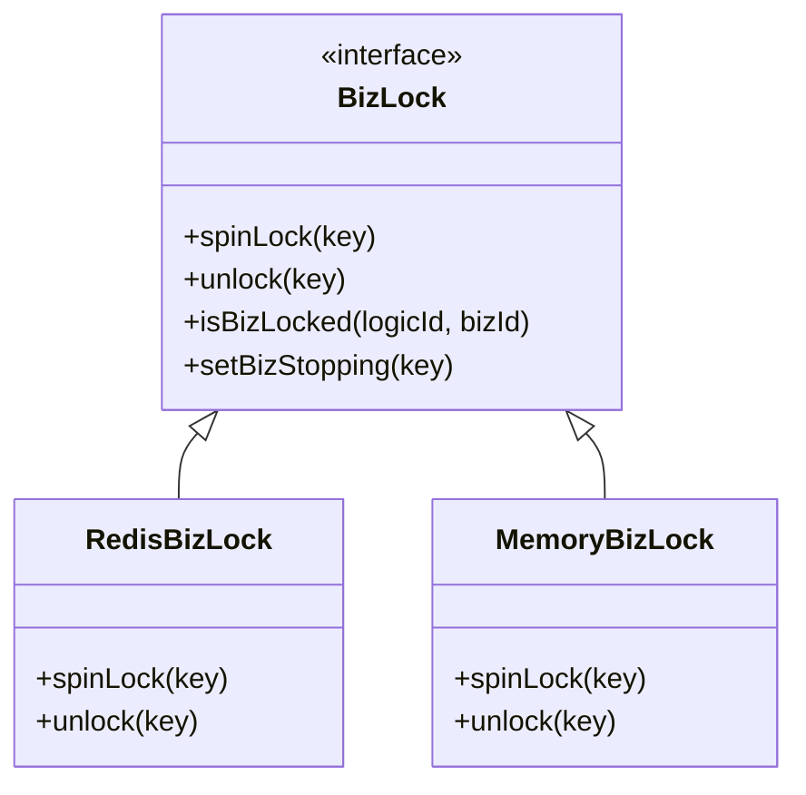
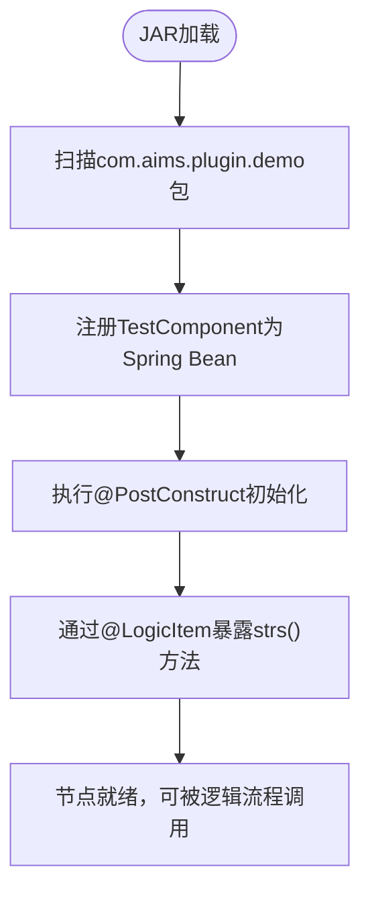

# 扩展开发

<cite>
**本文档引用的文件**  
- [TestComponent.java](file://test-case/test-case/src/main/java/com/aims/plugin/demo/TestComponent.java)
- [ILogicItemFunctionRunner.java](file://logic-runtime/src/main/java/com/aims/logic/runtime/runner/functions/ILogicItemFunctionRunner.java)
- [FunctionServiceLocator.java](file://logic-runtime/src/main/java/com/aims/logic/runtime/runner/FunctionServiceLocator.java)
- [DynamicComponentLoader.java](file://logic-ide-service/src/main/java/com/aims/logic/service/classLoader/DynamicComponentLoader.java)
- [LogicLogService.java](file://logic-sdk/src/main/java/com/aims/logic/sdk/service/LogicLogService.java)
- [LogicLogServiceImpl.java](file://logic-sdk/src/main/java/com/aims/logic/sdk/service/impl/LogicLogServiceImpl.java)
- [LogicLogServiceEsImpl.java](file://logic-sdk/src/main/java/com/aims/logic/sdk/service/impl/es/LogicLogServiceEsImpl.java)
- [RedisBizLock.java](file://logic-sdk/src/main/java/com/aims/logic/sdk/util/lock/RedisBizLock.java)
- [MemoryBizLock.java](file://logic-sdk/src/main/java/com/aims/logic/sdk/util/lock/MemoryBizLock.java)
</cite>

## 目录
1. [简介](#简介)
2. [自定义节点开发流程](#自定义节点开发流程)
3. [动态加载外部JAR插件](#动态加载外部jar插件)
4. [扩展日志存储后端](#扩展日志存储后端)
5. [分布式业务锁实现](#分布式业务锁实现)
6. [测试用例解析：TestComponent](#测试用例解析testcomponent)
7. [总结](#总结)

## 简介
本文档旨在指导开发者如何对 `logic-solution` 项目进行功能扩展。重点涵盖自定义逻辑节点的开发、外部JAR插件的动态加载、日志存储后端的可插拔设计以及分布式业务锁的实现机制。通过分析 `test-case` 模块中的 `TestComponent` 示例，全面展示从接口实现到配置注册的完整流程，帮助开发者构建可复用、可扩展的功能组件。

## 自定义节点开发流程

在 `logic-solution` 中，所有可执行的逻辑节点均需实现 `ILogicItemFunctionRunner` 接口，并通过 `FunctionServiceLocator` 注册至全局函数服务定位器中。该机制支持基于优先级的节点覆盖，允许开发者自定义行为以替代默认实现。

核心步骤如下：
1. 实现 `ILogicItemFunctionRunner` 接口
2. 重写 `invoke` 方法定义执行逻辑
3. 提供唯一的节点类型标识（`getItemType`）
4. 设置加载优先级（`getPriority`），数值越大优先级越高



**Diagram sources**
- [ILogicItemFunctionRunner.java](file://logic-runtime/src/main/java/com/aims/logic/runtime/runner/functions/ILogicItemFunctionRunner.java#L8-L25)
- [FunctionServiceLocator.java](file://logic-runtime/src/main/java/com/aims/logic/runtime/runner/FunctionServiceLocator.java#L12-L30)

**Section sources**
- [ILogicItemFunctionRunner.java](file://logic-runtime/src/main/java/com/aims/logic/runtime/runner/functions/ILogicItemFunctionRunner.java#L8-L25)
- [FunctionServiceLocator.java](file://logic-runtime/src/main/java/com/aims/logic/runtime/runner/FunctionServiceLocator.java#L12-L30)

## 动态加载外部JAR插件

系统通过 `DynamicComponentLoader` 支持运行时动态加载外部 JAR 插件，实现功能的热插拔。该类利用 Spring 的 `ClassPathBeanDefinitionScanner` 扫描指定包路径下的组件并注册为 Spring Bean，确保与主应用上下文无缝集成。

关键特性：
- 使用当前线程上下文类加载器作为父加载器，保证类可见性
- 支持扫描指定包（如 `com.aims.plugin.demo`）下的所有组件
- 动态注册 Bean 到主应用上下文，避免覆盖已有 Bean



**Diagram sources**
- [DynamicComponentLoader.java](file://logic-ide-service/src/main/java/com/aims/logic/service/classLoader/DynamicComponentLoader.java#L13-L42)

**Section sources**
- [DynamicComponentLoader.java](file://logic-ide-service/src/main/java/com/aims/logic/service/classLoader/DynamicComponentLoader.java#L13-L42)

## 扩展日志存储后端

`logic-solution` 提供了灵活的日志存储后端扩展机制，支持数据库（Database）、Elasticsearch 和内存（Memory）三种模式。通过 SPI + 条件化配置的方式实现运行时自动装配。

### 支持的存储后端
| 存储类型 | 实现类 | 配置条件 |
|--------|-------|---------|
| 数据库 | LogicLogServiceImpl | `@ConditionalOnLogicLogService("db")` |
| Elasticsearch | LogicLogServiceEsImpl | 配置ES连接信息 |
| 内存 | （默认） | 无特定条件 |

### 核心接口
```java
public interface LogicLogService extends BaseService<LogicLogEntity, String> {
    void clearLog();
    void deleteLogBeforeDays(int days);
}
```

### 实现机制
- `LogicLogServiceImpl`：基于 JDBC 直接操作数据库表 `logic_log`
- `LogicLogServiceEsImpl`：通过 OkHttp 调用 Elasticsearch REST API 进行索引管理与数据写入
- 配置驱动自动选择实现类，无需手动编码切换



**Diagram sources**
- [LogicLogService.java](file://logic-sdk/src/main/java/com/aims/logic/sdk/service/LogicLogService.java#L4-L13)
- [LogicLogServiceImpl.java](file://logic-sdk/src/main/java/com/aims/logic/sdk/service/impl/LogicLogServiceImpl.java#L1-L22)
- [LogicLogServiceEsImpl.java](file://logic-sdk/src/main/java/com/aims/logic/sdk/service/impl/es/LogicLogServiceEsImpl.java#L1-L243)

**Section sources**
- [LogicLogService.java](file://logic-sdk/src/main/java/com/aims/logic/sdk/service/LogicLogService.java#L4-L13)
- [LogicLogServiceImpl.java](file://logic-sdk/src/main/java/com/aims/logic/sdk/service/impl/LogicLogServiceImpl.java#L1-L22)
- [LogicLogServiceEsImpl.java](file://logic-sdk/src/main/java/com/aims/logic/sdk/service/impl/es/LogicLogServiceEsImpl.java#L1-L243)

## 分布式业务锁实现

系统通过 `RedisBizLock` 和 `MemoryBizLock` 提供两种分布式业务锁实现，支持在集群和单机环境下保证业务实例的唯一执行。

### 核心功能
- `spinLock(key)`：自旋获取锁，支持重试次数与等待间隔配置
- `unlock(key)`：安全释放锁，包含资源清理逻辑
- `isBizLocked(logicId, bizId)`：检查业务是否已被锁定
- `setBizStopping(key)`：标记业务为“停止中”状态，防止重复操作

### Redis 实现（Redisson）
- 使用 `RLock` 实现可重入锁
- 锁键格式：`biz_lock:{logicId}:{bizId}`
- 停止标记键：`biz_stopping:{logicId}:{bizId}`
- 支持单机与集群模式配置

### 内存实现（Caffeine）
- 基于 `ReentrantLock` + `Caffeine Cache` 实现本地锁
- 默认过期时间 60 分钟（可配置）
- 适用于单节点部署场景



**Diagram sources**
- [RedisBizLock.java](file://logic-sdk/src/main/java/com/aims/logic/sdk/util/lock/RedisBizLock.java#L14-L162)
- [MemoryBizLock.java](file://logic-sdk/src/main/java/com/aims/logic/sdk/util/lock/MemoryBizLock.java#L1-L114)

**Section sources**
- [RedisBizLock.java](file://logic-sdk/src/main/java/com/aims/logic/sdk/util/lock/RedisBizLock.java#L14-L162)
- [MemoryBizLock.java](file://logic-sdk/src/main/java/com/aims/logic/sdk/util/lock/MemoryBizLock.java#L1-L114)

## 测试用例解析：TestComponent

`TestComponent` 是 `test-case` 模块中提供的一个典型扩展组件示例，展示了如何通过注解和 Spring 组件机制实现自定义逻辑节点。

### 功能说明
- 使用 `@Component` 注解声明为 Spring Bean
- `@PostConstruct` 方法在加载时输出提示信息
- `@LogicItem(name = "测试同名方法2")` 注解将 `strs()` 方法暴露为可执行逻辑项
- 包含多个重载方法（`ints`, `dates`），展示参数类型处理能力

### 注册流程
1. JAR 被 `DynamicComponentLoader` 加载
2. `ClassPathBeanDefinitionScanner` 扫描 `com.aims.plugin.demo` 包
3. `TestComponent` 被注册为 Spring Bean
4. `@LogicItem` 注解的方法被逻辑引擎识别并纳入可执行节点列表



**Diagram sources**
- [TestComponent.java](file://test-case/test-case/src/main/java/com/aims/plugin/demo/TestComponent.java#L1-L35)

**Section sources**
- [TestComponent.java](file://test-case/test-case/src/main/java/com/aims/plugin/demo/TestComponent.java#L1-L35)

## 总结
`logic-solution` 提供了一套完整的可扩展架构，支持开发者通过标准接口和注解机制轻松实现功能扩展。通过 `ILogicItemFunctionRunner` 接口可开发自定义节点，`DynamicComponentLoader` 支持热插拔式插件加载，日志后端通过条件化配置实现多存储支持，而 `RedisBizLock` 则保障了分布式环境下的业务一致性。结合 `TestComponent` 示例，开发者可快速掌握组件开发与集成的完整流程，构建高内聚、低耦合的可复用功能模块。