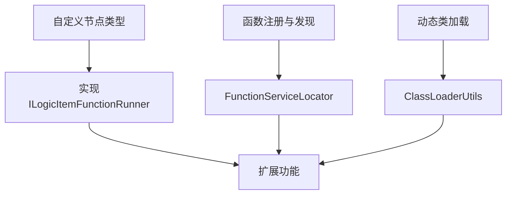
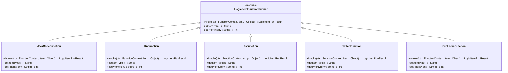
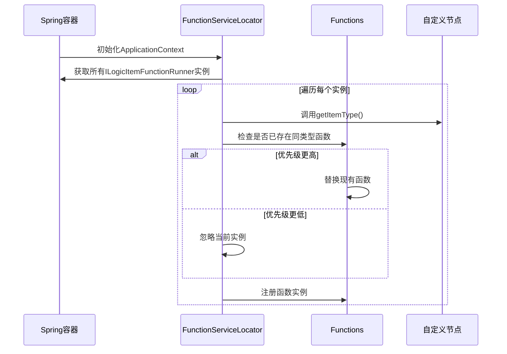
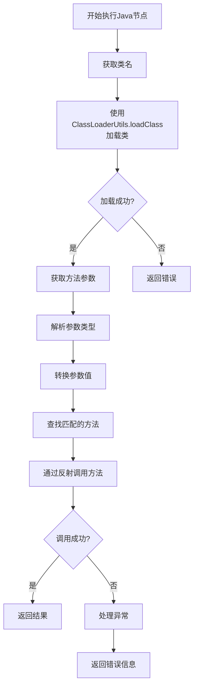
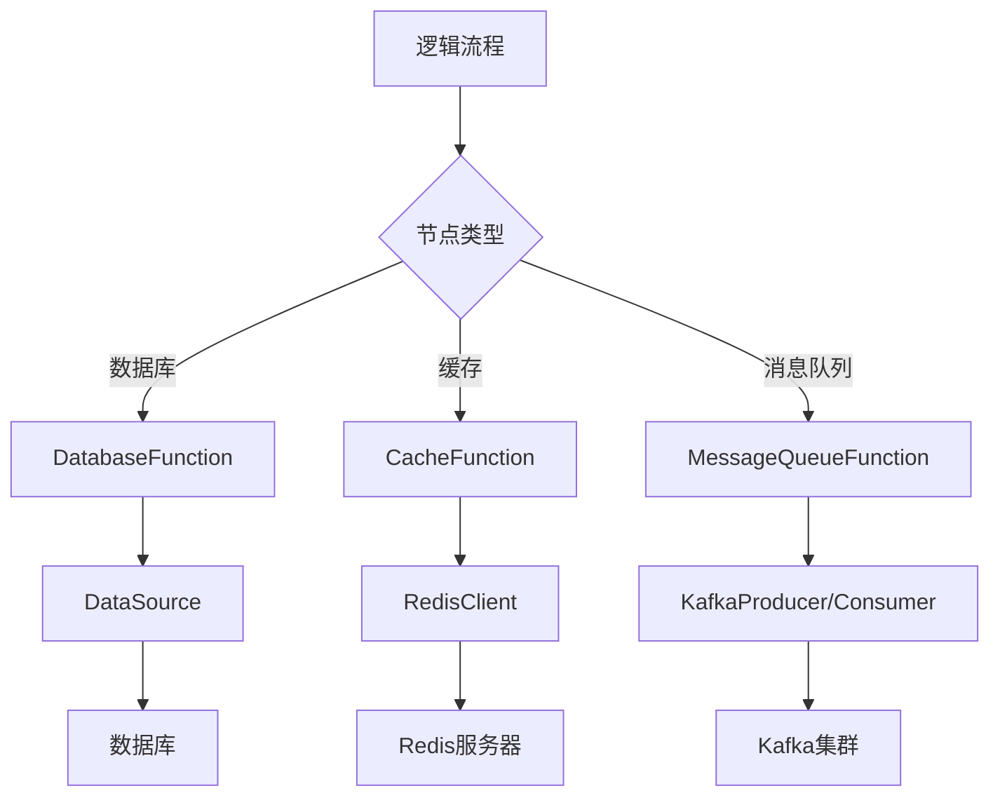

# 扩展开发

<cite>
**本文档中引用的文件**  
- [ILogicItemFunctionRunner.java](file://logic-runtime/src/main/java/com/aims/logic/runtime/runner/functions/ILogicItemFunctionRunner.java)
- [FunctionServiceLocator.java](file://logic-runtime/src/main/java/com/aims/logic/runtime/runner/FunctionServiceLocator.java)
- [ClassLoaderUtils.java](file://logic-runtime/src/main/java/com/aims/logic/runtime/util/ClassLoaderUtils.java)
- [JavaCodeFunction.java](file://logic-runtime/src/main/java/com/aims/logic/runtime/runner/functions/impl/JavaCodeFunction.java)
- [HttpFunction.java](file://logic-runtime/src/main/java/com/aims/logic/runtime/runner/functions/impl/HttpFunction.java)
- [JsFunction.java](file://logic-runtime/src/main/java/com/aims/logic/runtime/runner/functions/impl/JsFunction.java)
- [SwitchFunction.java](file://logic-runtime/src/main/java/com/aims/logic/runtime/runner/functions/impl/SwitchFunction.java)
- [SubLogicFunction.java](file://logic-sdk/src/main/java/com/aims/logic/sdk/functions/SubLogicFunction.java)
- [Functions.java](file://logic-runtime/src/main/java/com/aims/logic/runtime/runner/Functions.java)
</cite>

## 目录
1. [简介](#简介)
2. [核心扩展机制](#核心扩展机制)
3. [自定义节点类型实现](#自定义节点类型实现)
4. [函数注册与发现机制](#函数注册与发现机制)
5. [动态类加载机制](#动态类加载机制)
6. [自定义插件开发示例](#自定义插件开发示例)
7. [外部系统集成指南](#外部系统集成指南)
8. [安全与性能考量](#安全与性能考量)
9. [测试与调试最佳实践](#测试与调试最佳实践)
10. [结论](#结论)

## 简介
本文档旨在为开发者提供关于如何扩展和自定义logic-solution功能的全面指导。重点介绍通过`ILogicItemFunctionRunner`接口实现自定义节点类型的方法，详细说明`FunctionServiceLocator`在函数注册和发现中的作用，以及`ClassLoaderUtils`在动态类加载中的机制。同时提供完整的自定义插件开发示例、外部系统集成指南、安全与性能考量，以及测试和调试的最佳实践。

## 核心扩展机制

logic-solution的核心扩展机制基于插件化架构，允许开发者通过实现特定接口来扩展系统功能。主要扩展点包括自定义节点类型、函数注册与发现、动态类加载等。这些机制共同构成了一个灵活、可扩展的平台，支持各种业务场景的定制化需求。



**图示来源**
- [ILogicItemFunctionRunner.java](file://logic-runtime/src/main/java/com/aims/logic/runtime/runner/functions/ILogicItemFunctionRunner.java)
- [FunctionServiceLocator.java](file://logic-runtime/src/main/java/com/aims/logic/runtime/runner/FunctionServiceLocator.java)
- [ClassLoaderUtils.java](file://logic-runtime/src/main/java/com/aims/logic/runtime/util/ClassLoaderUtils.java)

## 自定义节点类型实现

### ILogicItemFunctionRunner接口

`ILogicItemFunctionRunner`接口是实现自定义节点类型的核心。所有自定义节点必须实现此接口，以定义其行为和特性。

```java
public interface ILogicItemFunctionRunner {
    LogicItemRunResult invoke(FunctionContext ctx, Object obj1);
    String getItemType();
    int getPriority(String env);
}
```

该接口包含三个关键方法：
- `invoke`: 执行节点逻辑的核心方法
- `getItemType`: 返回节点类型标识
- `getPriority`: 返回加载优先级，用于覆盖默认实现



**图示来源**
- [ILogicItemFunctionRunner.java](file://logic-runtime/src/main/java/com/aims/logic/runtime/runner/functions/ILogicItemFunctionRunner.java)
- [JavaCodeFunction.java](file://logic-runtime/src/main/java/com/aims/logic/runtime/runner/functions/impl/JavaCodeFunction.java)
- [HttpFunction.java](file://logic-runtime/src/main/java/com/aims/logic/runtime/runner/functions/impl/HttpFunction.java)
- [JsFunction.java](file://logic-runtime/src/main/java/com/aims/logic/runtime/runner/functions/impl/JsFunction.java)
- [SwitchFunction.java](file://logic-runtime/src/main/java/com/aims/logic/runtime/runner/functions/impl/SwitchFunction.java)
- [SubLogicFunction.java](file://logic-sdk/src/main/java/com/aims/logic/sdk/functions/SubLogicFunction.java)

### 自定义节点开发步骤

1. 创建新的Java类，实现`ILogicItemFunctionRunner`接口
2. 实现`invoke`方法，定义节点执行逻辑
3. 实现`getItemType`方法，返回唯一的节点类型标识
4. 实现`getPriority`方法，设置加载优先级
5. 使用`@Service`注解将类注册为Spring Bean

**代码来源**
- [ILogicItemFunctionRunner.java](file://logic-runtime/src/main/java/com/aims/logic/runtime/runner/functions/ILogicItemFunctionRunner.java)

## 函数注册与发现机制

### FunctionServiceLocator的作用

`FunctionServiceLocator`是函数注册与发现的核心组件，负责自动加载实现了`ILogicItemFunctionRunner`接口的类，并将其注册到全局函数映射中。

```java
@Component
public class FunctionServiceLocator implements ApplicationContextAware {
    @Override
    public void setApplicationContext(ApplicationContext applicationContext) throws BeansException {
        var list = applicationContext.getBeansOfType(ILogicItemFunctionRunner.class);
        for (ILogicItemFunctionRunner f : list.values()) {
            var itemType = f.getItemType();
            var func = Functions.get(itemType);
            if (func != null) {
                if (func.getPriority(itemType) >= f.getPriority(itemType)) {
                    continue;
                } else {
                    Functions.functions.remove(itemType);
                }
            }
            Functions.functions.put(itemType, f);
        }
    }
}
```

该机制的工作流程如下：
1. 在Spring应用上下文初始化时，扫描所有实现了`ILogicItemFunctionRunner`接口的Bean
2. 根据`getItemType`方法获取节点类型
3. 检查优先级，高优先级的实现可以覆盖低优先级的实现
4. 将函数实例注册到`Functions`类的静态映射中



**图示来源**
- [FunctionServiceLocator.java](file://logic-runtime/src/main/java/com/aims/logic/runtime/runner/FunctionServiceLocator.java)
- [Functions.java](file://logic-runtime/src/main/java/com/aims/logic/runtime/runner/Functions.java)

## 动态类加载机制

### ClassLoaderUtils的功能

`ClassLoaderUtils`提供了动态类加载的核心功能，支持在运行时加载和使用外部类。

```java
public class ClassLoaderUtils {
    public static Class<?> loadClass(String className) throws ClassNotFoundException
    public static Class loadClass(String className, Class referrer) throws ClassNotFoundException
    public static Class loadClass(String className, ClassLoader classLoader) throws ClassNotFoundException
    // 其他资源加载方法...
}
```

该工具类的主要功能包括：
- 根据类名加载类
- 支持指定类加载器
- 提供资源文件的加载功能
- 处理类加载过程中的异常

### 动态加载在Java节点中的应用

在`JavaCodeFunction`中，`ClassLoaderUtils`被用于动态加载指定的Java类并执行其方法。



**图示来源**
- [ClassLoaderUtils.java](file://logic-runtime/src/main/java/com/aims/logic/runtime/util/ClassLoaderUtils.java)
- [JavaCodeFunction.java](file://logic-runtime/src/main/java/com/aims/logic/runtime/runner/functions/impl/JavaCodeFunction.java)

## 自定义插件开发示例

### 完整代码模板

以下是一个自定义数据库节点的完整实现示例：

```java
@Service
public class DatabaseFunction implements ILogicItemFunctionRunner {
    
    @Autowired
    private DataSource dataSource;
    
    @Override
    public LogicItemRunResult invoke(FunctionContext ctx, Object item) {
        var itemDsl = (LogicItemTreeNode) item;
        var itemRes = new LogicItemRunResult();
        
        try {
            String sql = (String) Functions.runJsByContext(ctx, itemDsl.getBody());
            Map<String, Object> params = (Map<String, Object>) Functions.runJsByContext(ctx, itemDsl.getParams());
            
            try (Connection conn = dataSource.getConnection();
                 PreparedStatement stmt = conn.prepareStatement(sql)) {
                
                // 设置参数
                int index = 1;
                for (Object param : params.values()) {
                    stmt.setObject(index++, param);
                }
                
                boolean isQuery = stmt.execute();
                if (isQuery) {
                    try (ResultSet rs = stmt.getResultSet()) {
                        List<Map<String, Object>> result = new ArrayList<>();
                        ResultSetMetaData metaData = rs.getMetaData();
                        int columnCount = metaData.getColumnCount();
                        
                        while (rs.next()) {
                            Map<String, Object> row = new HashMap<>();
                            for (int i = 1; i <= columnCount; i++) {
                                row.put(metaData.getColumnName(i), rs.getObject(i));
                            }
                            result.add(row);
                        }
                        itemRes.setData(result);
                    }
                } else {
                    itemRes.setData(stmt.getUpdateCount());
                }
                
                itemRes.setSuccess(true);
            }
        } catch (Exception e) {
            itemRes.setSuccess(false);
            itemRes.setMsg(e.getMessage());
            log.error("数据库操作失败", e);
        }
        
        return itemRes.setItemInstance(itemDsl);
    }
    
    @Override
    public String getItemType() {
        return "database";
    }
    
    @Override
    public int getPriority(String env) {
        return 0;
    }
}
```

### 部署步骤

1. 将自定义插件代码编译为JAR包
2. 将JAR包放置在logic-solution的插件目录中
3. 重启logic-solution服务
4. 在逻辑设计器中验证新节点类型是否可用

**代码来源**
- [ILogicItemFunctionRunner.java](file://logic-runtime/src/main/java/com/aims/logic/runtime/runner/functions/ILogicItemFunctionRunner.java)
- [JavaCodeFunction.java](file://logic-runtime/src/main/java/com/aims/logic/runtime/runner/functions/impl/JavaCodeFunction.java)

## 外部系统集成指南

### 数据库集成

通过自定义节点可以轻松集成各种数据库系统。建议使用连接池管理数据库连接，以提高性能和资源利用率。

### 缓存集成

可以创建专门的缓存节点，支持Redis、Memcached等主流缓存系统。节点应提供基本的CRUD操作，并支持缓存过期策略配置。

### 消息队列集成

消息队列节点应支持常见的MQ系统，如Kafka、RabbitMQ等。节点需要处理消息的发布和订阅，并提供错误重试机制。



**图示来源**
- [JavaCodeFunction.java](file://logic-runtime/src/main/java/com/aims/logic/runtime/runner/functions/impl/JavaCodeFunction.java)

## 安全与性能考量

### 安全考虑

1. **代码注入防护**：对用户输入的脚本代码进行严格验证和沙箱执行
2. **权限控制**：实施细粒度的权限管理，限制节点的访问范围
3. **数据加密**：敏感数据在传输和存储时应进行加密
4. **日志审计**：记录关键操作日志，便于安全审计

### 性能影响

1. **资源消耗**：自定义节点可能增加CPU和内存消耗，需进行性能测试
2. **响应时间**：复杂逻辑可能导致响应延迟，建议设置超时机制
3. **并发处理**：确保节点实现是线程安全的，避免并发问题
4. **缓存策略**：合理使用缓存减少重复计算和外部系统调用

## 测试与调试最佳实践

### 单元测试

为自定义节点编写全面的单元测试，覆盖各种输入场景和边界条件。

```java
@Test
public void testDatabaseFunction() {
    // 准备测试数据
    FunctionContext ctx = new FunctionContext();
    LogicItemTreeNode item = new LogicItemTreeNode();
    item.setBody("SELECT * FROM users WHERE id = ?");
    Map<String, Object> params = new HashMap<>();
    params.put("id", 1);
    item.setParams(params);
    
    // 执行测试
    LogicItemRunResult result = databaseFunction.invoke(ctx, item);
    
    // 验证结果
    assertTrue(result.isSuccess());
    assertNotNull(result.getData());
}
```

### 调试技巧

1. **日志记录**：在关键执行点添加详细的日志输出
2. **断点调试**：使用IDE的调试功能逐步执行代码
3. **性能分析**：使用性能分析工具识别瓶颈
4. **异常处理**：确保所有异常都被妥善处理并记录

**代码来源**
- [JavaCodeFunction.java](file://logic-runtime/src/main/java/com/aims/logic/runtime/runner/functions/impl/JavaCodeFunction.java)

## 结论

通过`ILogicItemFunctionRunner`接口、`FunctionServiceLocator`和`ClassLoaderUtils`等核心机制，logic-solution提供了一个强大而灵活的扩展平台。开发者可以轻松创建自定义节点类型，集成外部系统，并根据具体业务需求进行功能扩展。遵循本文档中的最佳实践，可以确保扩展功能的安全性、性能和可维护性。