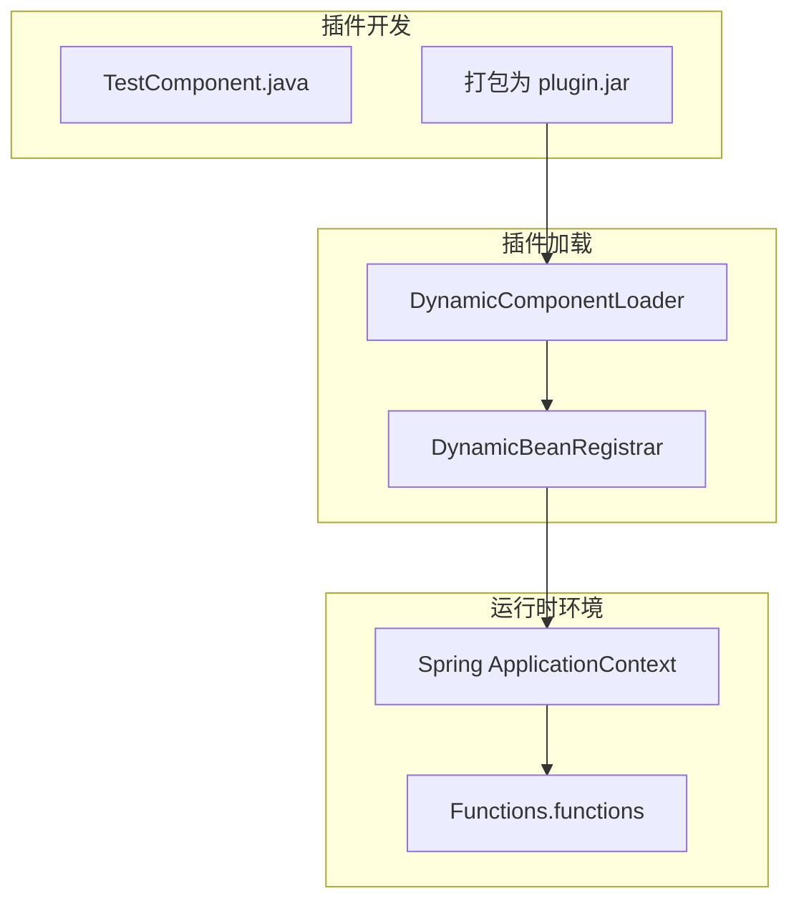
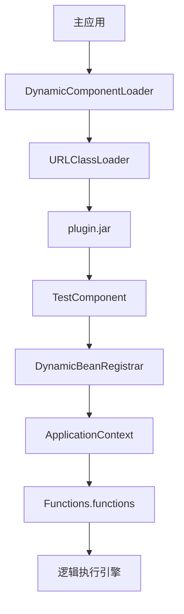
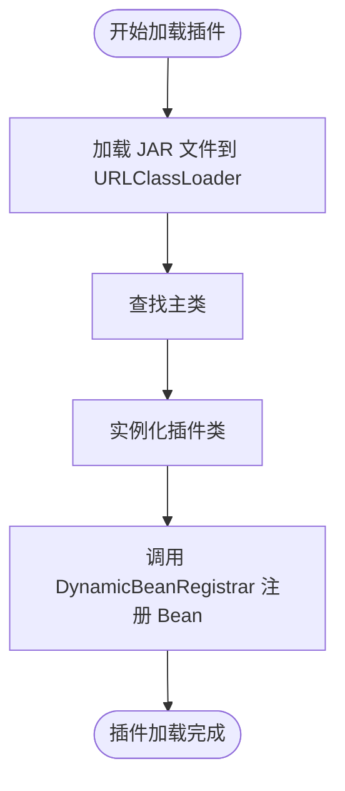
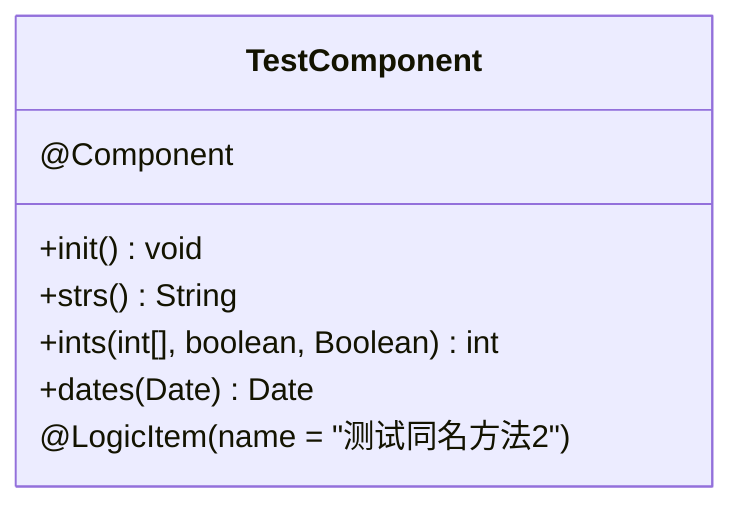
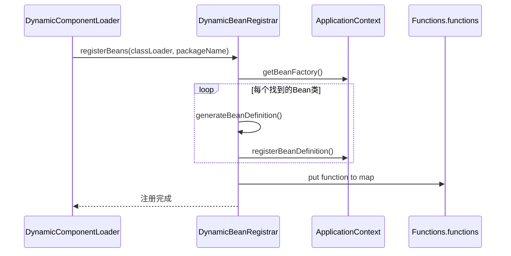
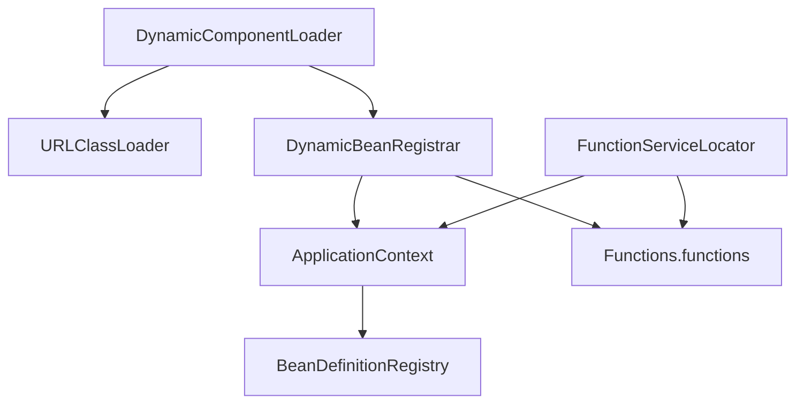

# 插件化开发

<cite>
**本文档引用文件**  
- [DynamicComponentLoader.java](file://logic-ide-service/src/main/java/com/aims/logic/service/classLoader/DynamicComponentLoader.java)
- [DynamicBeanRegistrar.java](file://logic-ide-service/src/main/java/com/aims/logic/service/classLoader/DynamicBeanRegistrar.java)
- [TestComponent.java](file://test-case/test-case/src/main/java/com/aims/plugin/demo/TestComponent.java)
- [ClassWrapper.java](file://logic-runtime/src/main/java/com/aims/logic/runtime/util/ClassWrapper.java)
- [SpringContextUtil.java](file://logic-runtime/src/main/java/com/aims/logic/runtime/util/SpringContextUtil.java)
- [FunctionServiceLocator.java](file://logic-runtime/src/main/java/com/aims/logic/runtime/runner/FunctionServiceLocator.java)
- [Functions.java](file://logic-runtime/src/main/java/com/aims/logic/runtime/runner/Functions.java)
- [beans.xml](file://logic-sdk/src/main/resources/beans.xml)
</cite>

## 目录
1. [引言](#引言)
2. [项目结构](#项目结构)
3. [核心组件](#核心组件)
4. [架构概览](#架构概览)
5. [详细组件分析](#详细组件分析)
6. [依赖分析](#依赖分析)
7. [性能考量](#性能考量)
8. [故障排查指南](#故障排查指南)
9. [结论](#结论)

## 引言
本文档旨在指导开发者通过 `DynamicComponentLoader` 实现外部 JAR 插件的动态加载与热部署。通过解析 `TestComponent` 示例，说明如何打包包含 Spring Bean 的 JAR 文件，并利用 `DynamicBeanRegistrar` 实现 Bean 的动态注册。涵盖类加载隔离机制、资源释放、版本冲突规避等关键技术点。同时提供 Maven 插件配置模板、JAR 结构规范及部署验证流程，确保插件在运行时环境中的稳定性与安全性。

## 项目结构
项目采用模块化设计，主要分为以下几个模块：
- `logic-ide`：前端逻辑开发环境
- `logic-ide-service`：插件加载与管理服务
- `logic-runtime`：运行时核心逻辑执行引擎
- `logic-sdk`：SDK 工具包与注解支持
- `test-case/test-case`：插件示例模块

插件开发以 `test-case/test-case` 模块为模板，打包为独立 JAR 文件后由 `logic-ide-service` 动态加载。

**Diagram sources**
- [TestComponent.java](file://test-case/test-case/src/main/java/com/aims/plugin/demo/TestComponent.java)
- [DynamicComponentLoader.java](file://logic-ide-service/src/main/java/com/aims/logic/service/classLoader/DynamicComponentLoader.java)
- [DynamicBeanRegistrar.java](file://logic-ide-service/src/main/java/com/aims/logic/service/classLoader/DynamicBeanRegistrar.java)

**Section sources**
- [test-case/test-case](file://test-case/test-case)
- [logic-ide-service](file://logic-ide-service)

## 核心组件

`DynamicComponentLoader` 负责从指定路径加载外部 JAR 文件，使用自定义类加载器实现类隔离。`DynamicBeanRegistrar` 则负责将加载的 Spring Bean 注册到主应用上下文中。`TestComponent` 作为示例插件，展示了如何通过 `@Component` 和 `@LogicItem` 注解暴露可调用方法。

**Section sources**
- [DynamicComponentLoader.java](file://logic-ide-service/src/main/java/com/aims/logic/service/classLoader/DynamicComponentLoader.java#L1-L50)
- [DynamicBeanRegistrar.java](file://logic-ide-service/src/main/java/com/aims/logic/service/classLoader/DynamicBeanRegistrar.java#L1-L40)
- [TestComponent.java](file://test-case/test-case/src/main/java/com/aims/plugin/demo/TestComponent.java#L1-L35)

## 架构概览

系统采用插件化架构，主应用通过动态类加载机制加载外部 JAR，实现功能扩展。插件中的 Spring Bean 被注册到主应用上下文，但类加载器隔离确保了依赖版本的独立性。

**Diagram sources**
- [DynamicComponentLoader.java](file://logic-ide-service/src/main/java/com/aims/logic/service/classLoader/DynamicComponentLoader.java#L1-L20)
- [DynamicBeanRegistrar.java](file://logic-ide-service/src/main/java/com/aims/logic/service/classLoader/DynamicBeanRegistrar.java#L1-L15)
- [FunctionServiceLocator.java](file://logic-runtime/src/main/java/com/aims/logic/runtime/runner/FunctionServiceLocator.java#L1-L10)

## 详细组件分析

### DynamicComponentLoader 分析
`DynamicComponentLoader` 使用 `URLClassLoader` 加载外部 JAR 文件，确保插件类与主应用类隔离。支持热部署，可重复加载同一插件的新版本。

**Diagram sources**
- [DynamicComponentLoader.java](file://logic-ide-service/src/main/java/com/aims/logic/service/classLoader/DynamicComponentLoader.java#L15-L60)

**Section sources**
- [DynamicComponentLoader.java](file://logic-ide-service/src/main/java/com/aims/logic/service/classLoader/DynamicComponentLoader.java#L1-L100)

### TestComponent 示例分析
`TestComponent` 是一个典型的插件实现，使用 `@Component` 注解声明为 Spring Bean，并通过 `@LogicItem` 暴露方法供逻辑引擎调用。

**Diagram sources**
- [TestComponent.java](file://test-case/test-case/src/main/java/com/aims/plugin/demo/TestComponent.java#L1-L35)

**Section sources**
- [TestComponent.java](file://test-case/test-case/src/main/java/com/aims/plugin/demo/TestComponent.java#L1-L35)

### 动态 Bean 注册机制
`DynamicBeanRegistrar` 利用 Spring 的 `BeanDefinitionRegistry` 接口，将插件中的 Bean 动态注册到主应用上下文中。

**Diagram sources**
- [DynamicBeanRegistrar.java](file://logic-ide-service/src/main/java/com/aims/logic/service/classLoader/DynamicBeanRegistrar.java#L20-L50)
- [Functions.java](file://logic-runtime/src/main/java/com/aims/logic/runtime/runner/Functions.java#L10-L15)

**Section sources**
- [DynamicBeanRegistrar.java](file://logic-ide-service/src/main/java/com/aims/logic/service/classLoader/DynamicBeanRegistrar.java#L1-L80)

## 依赖分析

插件系统依赖于 Spring 框架的扩展能力，特别是 `ApplicationContextAware` 和 `BeanDefinitionRegistry` 接口。`FunctionServiceLocator` 在应用启动时自动扫描所有 `ILogicItemFunctionRunner` 实现并注册到 `Functions.functions` 映射中。

**Diagram sources**
- [DynamicComponentLoader.java](file://logic-ide-service/src/main/java/com/aims/logic/service/classLoader/DynamicComponentLoader.java)
- [DynamicBeanRegistrar.java](file://logic-ide-service/src/main/java/com/aims/logic/service/classLoader/DynamicBeanRegistrar.java)
- [FunctionServiceLocator.java](file://logic-runtime/src/main/java/com/aims/logic/runtime/runner/FunctionServiceLocator.java)

**Section sources**
- [DynamicComponentLoader.java](file://logic-ide-service/src/main/java/com/aims/logic/service/classLoader/DynamicComponentLoader.java#L1-L30)
- [DynamicBeanRegistrar.java](file://logic-ide-service/src/main/java/com/aims/logic/service/classLoader/DynamicBeanRegistrar.java#L1-L30)
- [FunctionServiceLocator.java](file://logic-runtime/src/main/java/com/aims/logic/runtime/runner/FunctionServiceLocator.java#L1-L20)

## 性能考量

动态加载机制引入了额外的类加载开销，但通过缓存和懒加载策略可有效缓解。建议对频繁调用的插件进行预加载，并在插件卸载时及时释放类加载器资源，避免内存泄漏。

## 故障排查指南

插件加载失败常见原因包括：
- JAR 文件路径错误
- 主类未正确标注 `@Component`
- Spring 上下文未正确初始化
- 类型转换异常

可通过检查日志中 `DynamicComponentLoader` 的输出信息进行初步诊断。

**Section sources**
- [DynamicComponentLoader.java](file://logic-ide-service/src/main/java/com/aims/logic/service/classLoader/DynamicComponentLoader.java#L50-L80)
- [DynamicBeanRegistrar.java](file://logic-ide-service/src/main/java/com/aims/logic/service/classLoader/DynamicBeanRegistrar.java#L60-L75)

## 结论

通过 `DynamicComponentLoader` 和 `DynamicBeanRegistrar` 的协同工作，系统实现了安全、稳定的插件化架构。开发者可基于 `TestComponent` 模板快速开发功能插件，实现系统的动态扩展与热部署。