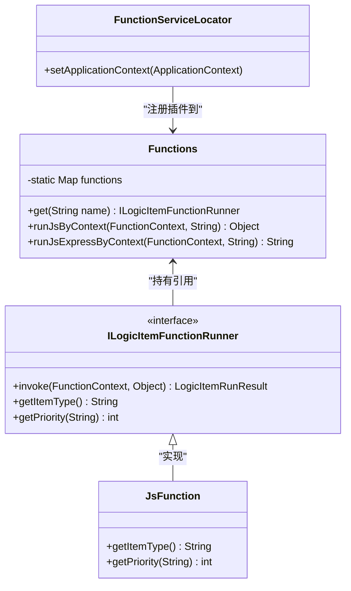
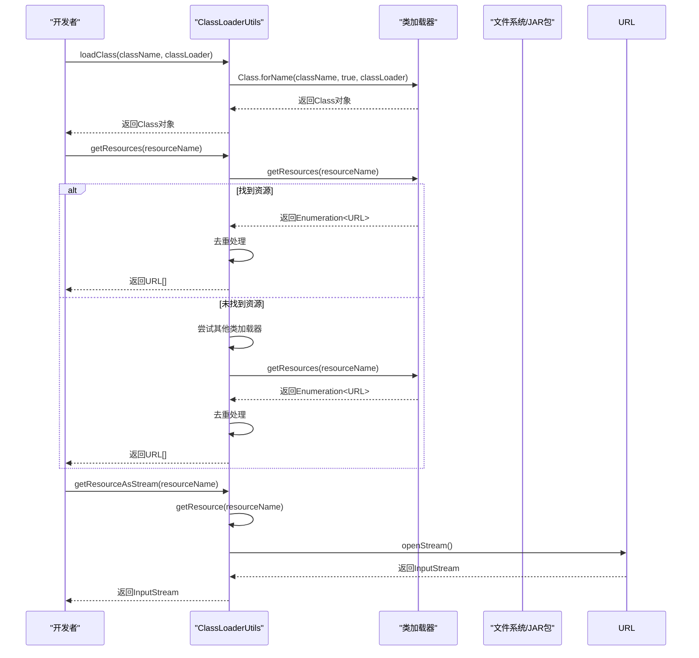
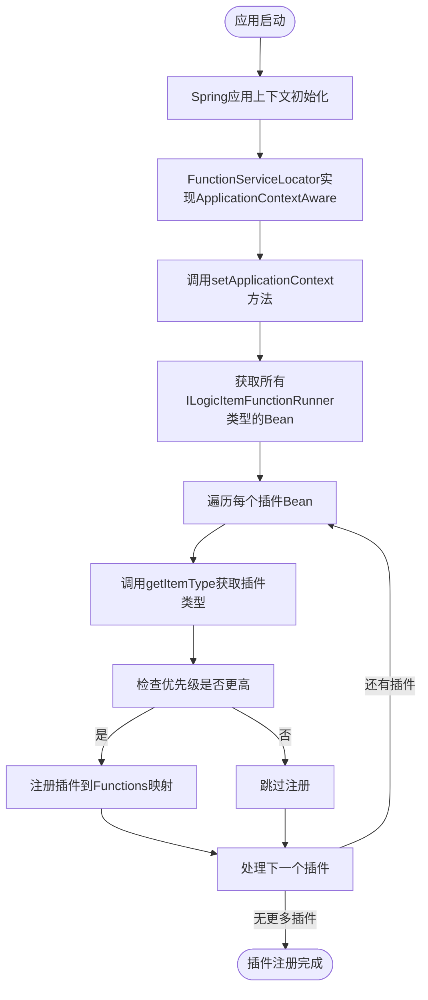
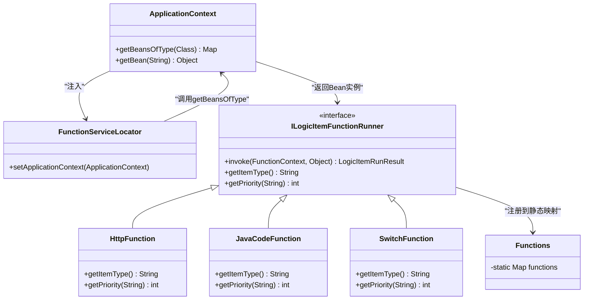
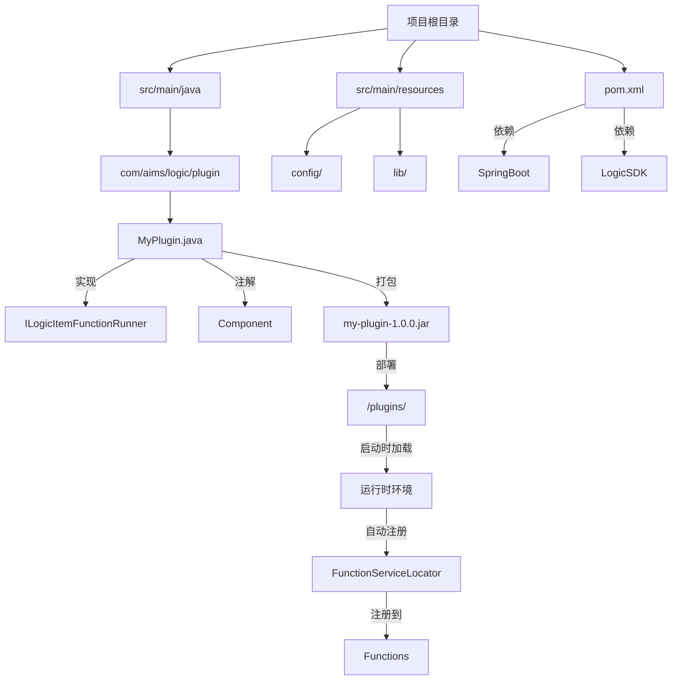
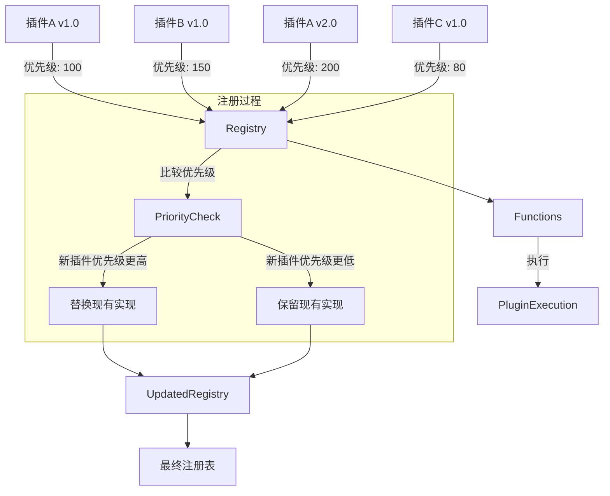
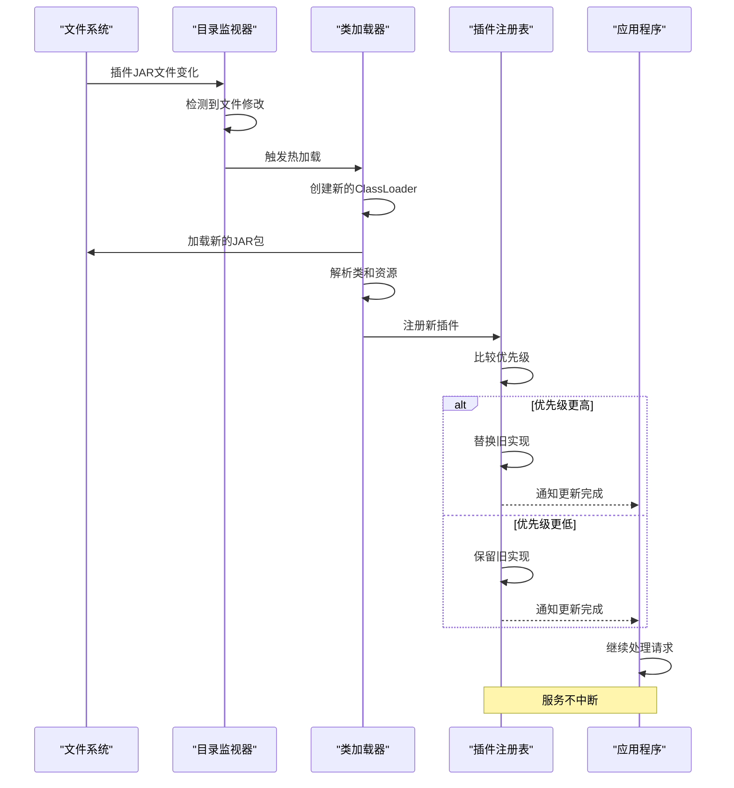

# 插件开发

<cite>
**本文档引用的文件**  
- [FunctionServiceLocator.java](file://logic-runtime/src/main/java/com/aims/logic/runtime/runner/FunctionServiceLocator.java)
- [ClassLoaderUtils.java](file://logic-runtime/src/main/java/com/aims/logic/runtime/util/ClassLoaderUtils.java)
- [ILogicItemFunctionRunner.java](file://logic-runtime/src/main/java/com/aims/logic/runtime/runner/functions/ILogicItemFunctionRunner.java)
- [Functions.java](file://logic-runtime/src/main/java/com/aims/logic/runtime/runner/Functions.java)
- [FunctionContext.java](file://logic-runtime/src/main/java/com/aims/logic/runtime/runner/FunctionContext.java)
- [JsFunction.java](file://logic-runtime/src/main/java/com/aims/logic/runtime/runner/functions/impl/JsFunction.java)
- [LogicRuntimeApplicationTests.java](file://logic-runtime/src/test/java/com/aims/logic/runtime/LogicRuntimeApplicationTests.java)
- [PublishController.java](file://logic-ide/src/main/java/com/aims/logic/ide/controller/PublishController.java)
</cite>

## 目录
1. [插件自动发现与注册](#插件自动发现与注册)
2. [类加载器使用方法](#类加载器使用方法)
3. [插件上下文初始化](#插件上下文初始化)
4. [Spring容器管理插件Bean](#spring容器管理插件bean)
5. [项目结构模板与打包部署](#项目结构模板与打包部署)
6. [插件依赖管理与版本控制](#插件依赖管理与版本控制)
7. [热加载最佳实践](#热加载最佳实践)
8. [插件生命周期管理](#插件生命周期管理)

## 插件自动发现与注册

插件的自动发现和注册通过`FunctionServiceLocator`机制实现。该机制利用Spring的`ApplicationContextAware`接口，在应用上下文初始化时自动扫描并注册所有实现`ILogicItemFunctionRunner`接口的插件类。

`FunctionServiceLocator`组件在`setApplicationContext`方法中获取Spring容器中所有`ILogicItemFunctionRunner`类型的Bean，并根据插件的类型标识和优先级进行注册。当存在相同类型的插件时，系统会根据优先级决定是否覆盖已注册的实现，优先级数值较大的插件可以覆盖优先级较小的插件。

插件通过实现`getItemType`方法返回其类型标识，该标识用于在运行时定位和调用特定的插件功能。同时，`getPriority`方法定义了插件的加载优先级，为插件的覆盖和扩展提供了机制。



**图示来源**
- [FunctionServiceLocator.java](file://logic-runtime/src/main/java/com/aims/logic/runtime/runner/FunctionServiceLocator.java)
- [Functions.java](file://logic-runtime/src/main/java/com/aims/logic/runtime/runner/Functions.java)
- [ILogicItemFunctionRunner.java](file://logic-runtime/src/main/java/com/aims/logic/runtime/runner/functions/ILogicItemFunctionRunner.java)
- [JsFunction.java](file://logic-runtime/src/main/java/com/aims/logic/runtime/runner/functions/impl/JsFunction.java)

**本节来源**
- [FunctionServiceLocator.java](file://logic-runtime/src/main/java/com/aims/logic/runtime/runner/FunctionServiceLocator.java#L1-L31)
- [Functions.java](file://logic-runtime/src/main/java/com/aims/logic/runtime/runner/Functions.java#L1-L52)
- [ILogicItemFunctionRunner.java](file://logic-runtime/src/main/java/com/aims/logic/runtime/runner/functions/ILogicItemFunctionRunner.java#L1-L26)

## 类加载器使用方法

`ClassLoaderUtils`类提供了动态加载外部JAR包中类和资源文件的功能。该工具类封装了类加载器的相关操作，简化了动态类加载的复杂性。

通过`loadClass`方法可以加载指定名称的类，支持从指定的类加载器或当前线程上下文类加载器中加载。`getResources`和`getResource`方法用于查找和获取资源文件的URL，支持从不同类加载器层次中搜索资源。

`ClassLoaderUtils`还提供了`getResourceAsStream`方法，可以直接获取资源文件的输入流，便于读取外部JAR包中的配置文件或其他资源。这些方法在处理插件的动态加载和资源访问时非常有用，特别是在需要从外部JAR包中加载类或读取配置文件的场景中。



**图示来源**
- [ClassLoaderUtils.java](file://logic-runtime/src/main/java/com/aims/logic/runtime/util/ClassLoaderUtils.java)

**本节来源**
- [ClassLoaderUtils.java](file://logic-runtime/src/main/java/com/aims/logic/runtime/util/ClassLoaderUtils.java#L1-L240)

## 插件上下文初始化

插件上下文的初始化通过实现`ApplicationContextAware`接口完成。`FunctionServiceLocator`作为Spring Bean，在应用上下文初始化时会自动调用其`setApplicationContext`方法，从而获得对Spring容器的引用。

在`setApplicationContext`方法中，系统通过`applicationContext.getBeansOfType(ILogicItemFunctionRunner.class)`获取所有实现`ILogicItemFunctionRunner`接口的Bean，然后遍历这些Bean并将其注册到`Functions`的静态映射中。这个过程实现了插件的自动发现和注册，无需手动配置。

`FunctionContext`类作为插件执行的上下文环境，包含了执行过程中所需的各种数据和状态信息，如参数、变量、环境配置等。每个插件在执行时都会接收一个`FunctionContext`实例，通过该实例与运行时环境进行交互。



**图示来源**
- [FunctionServiceLocator.java](file://logic-runtime/src/main/java/com/aims/logic/runtime/runner/FunctionServiceLocator.java)
- [FunctionContext.java](file://logic-runtime/src/main/java/com/aims/logic/runtime/runner/FunctionContext.java)

**本节来源**
- [FunctionServiceLocator.java](file://logic-runtime/src/main/java/com/aims/logic/runtime/runner/FunctionServiceLocator.java#L1-L31)
- [FunctionContext.java](file://logic-runtime/src/main/java/com/aims/logic/runtime/runner/FunctionContext.java#L14-L103)

## Spring容器管理插件Bean

插件作为Spring Bean由Spring容器进行管理。通过在插件类上添加`@Component`注解，Spring会在组件扫描时自动发现并注册这些插件Bean。

`FunctionServiceLocator`利用Spring的依赖注入机制，在应用启动时自动获取`ApplicationContext`实例，并从中检索所有`ILogicItemFunctionRunner`类型的Bean。这种方式实现了插件的自动发现和注册，同时享受Spring容器提供的依赖注入、生命周期管理等特性。

插件Bean的生命周期由Spring容器管理，包括实例化、初始化、依赖注入和销毁等阶段。当应用关闭时，Spring容器会负责清理和销毁这些Bean，确保资源的正确释放。



**图示来源**
- [FunctionServiceLocator.java](file://logic-runtime/src/main/java/com/aims/logic/runtime/runner/FunctionServiceLocator.java)
- [Functions.java](file://logic-runtime/src/main/java/com/aims/logic/runtime/runner/Functions.java)
- [ILogicItemFunctionRunner.java](file://logic-runtime/src/main/java/com/aims/logic/runtime/runner/functions/ILogicItemFunctionRunner.java)

**本节来源**
- [FunctionServiceLocator.java](file://logic-runtime/src/main/java/com/aims/logic/runtime/runner/FunctionServiceLocator.java#L1-L31)
- [Functions.java](file://logic-runtime/src/main/java/com/aims/logic/runtime/runner/Functions.java#L1-L52)

## 项目结构模板与打包部署

插件开发应遵循标准的Maven项目结构。核心插件类需要实现`ILogicItemFunctionRunner`接口，并通过`getItemType`方法返回唯一的类型标识。插件类应添加`@Component`注解，以便Spring容器能够自动发现和管理。

打包时，插件应构建成JAR包，并确保包含必要的依赖和资源文件。部署时，将JAR包放置在指定的插件目录中，系统在启动时会自动加载和注册其中的插件。

发布控制器`PublishController`提供了将配置发布到本地文件的功能，通过`publishConfigToLocalFile`方法可以将逻辑配置保存到本地文件系统，支持热更新选项。



**图示来源**
- [pom.xml](file://pom.xml)
- [PublishController.java](file://logic-ide/src/main/java/com/aims/logic/ide/controller/PublishController.java)

**本节来源**
- [pom.xml](file://pom.xml#L62-L96)
- [PublishController.java](file://logic-ide/src/main/java/com/aims/logic/ide/controller/PublishController.java#L1-L29)

## 插件依赖管理与版本控制

插件系统通过优先级机制实现版本控制和依赖管理。每个插件实现`getPriority`方法返回其优先级数值，当多个插件提供相同的功能时，优先级较高的插件会覆盖优先级较低的插件。

这种机制允许开发者创建插件的增强版本或修复版本，只需设置更高的优先级即可自动替换原有实现。同时，系统保留了低优先级插件的注册信息，便于在需要时进行回滚或比较。

插件的依赖关系通过Maven的依赖管理机制处理，在`pom.xml`文件中声明所需的依赖项。运行时环境会确保所有依赖项都已正确加载，否则插件将无法正常工作。



**图示来源**
- [FunctionServiceLocator.java](file://logic-runtime/src/main/java/com/aims/logic/runtime/runner/FunctionServiceLocator.java)
- [ILogicItemFunctionRunner.java](file://logic-runtime/src/main/java/com/aims/logic/runtime/runner/functions/ILogicItemFunctionRunner.java)

**本节来源**
- [FunctionServiceLocator.java](file://logic-runtime/src/main/java/com/aims/logic/runtime/runner/FunctionServiceLocator.java#L1-L31)
- [ILogicItemFunctionRunner.java](file://logic-runtime/src/main/java/com/aims/logic/runtime/runner/functions/ILogicItemFunctionRunner.java#L1-L26)

## 热加载最佳实践

热加载功能允许在不重启应用的情况下更新插件。系统通过监控插件目录的变化，当检测到新的或更新的JAR包时，自动加载并注册新版本的插件。

为了确保热加载的稳定性，建议遵循以下最佳实践：确保插件具有唯一的类型标识和适当的优先级；在更新插件前备份旧版本；测试新插件的兼容性；监控热加载过程中的日志输出。

热加载过程中，系统会先加载新插件，然后根据优先级决定是否替换现有实现。这种机制确保了服务的连续性，即使在更新过程中也能正常处理请求。



**图示来源**
- [FunctionServiceLocator.java](file://logic-runtime/src/main/java/com/aims/logic/runtime/runner/FunctionServiceLocator.java)
- [ClassLoaderUtils.java](file://logic-runtime/src/main/java/com/aims/logic/runtime/util/ClassLoaderUtils.java)

**本节来源**
- [FunctionServiceLocator.java](file://logic-runtime/src/main/java/com/aims/logic/runtime/runner/FunctionServiceLocator.java#L1-L31)
- [ClassLoaderUtils.java](file://logic-runtime/src/main/java/com/aims/logic/runtime/util/ClassLoaderUtils.java#L1-L240)

## 插件生命周期管理

插件的生命周期包括初始化、运行时交互和销毁三个阶段。在初始化阶段，Spring容器创建插件实例并完成依赖注入；在运行时交互阶段，插件通过`invoke`方法处理业务逻辑；在销毁阶段，Spring容器负责清理资源。

`FunctionContext`作为插件与运行时环境的交互桥梁，提供了访问参数、变量、环境配置等信息的能力。插件通过`FunctionContext`获取执行所需的上下文数据，并将执行结果返回给调用方。

插件的销毁通常在应用关闭时由Spring容器自动处理。如果插件持有需要显式释放的资源（如文件句柄、网络连接等），建议实现`DisposableBean`接口或使用`@PreDestroy`注解的方法来执行清理操作。

```mermaid
stateDiagram-v2
[*] --> 初始化
state 初始化 {
[*] --> 实例化
实例化 --> 依赖注入
依赖注入 --> 初始化完成
}
初始化完成 --> 运行时交互
state 运行时交互 {
[*] --> 接收调用
接收调用 --> 处理逻辑
处理逻辑 --> 返回结果
返回结果 --> 接收调用
}
运行时交互 --> 销毁
state 销毁 {
[*] --> 资源清理
资源清理 --> 实例销毁
实例销毁 --> [*]
}
note right of 初始化
Spring容器负责
实例创建和依赖注入
end
note right of 运行时交互
通过invoke方法
处理业务逻辑
end
note right of 销毁
Spring容器负责
资源清理和实例销毁
end
```

**图示来源**
- [FunctionServiceLocator.java](file://logic-runtime/src/main/java/com/aims/logic/runtime/runner/FunctionServiceLocator.java)
- [FunctionContext.java](file://logic-runtime/src/main/java/com/aims/logic/runtime/runner/FunctionContext.java)
- [ILogicItemFunctionRunner.java](file://logic-runtime/src/main/java/com/aims/logic/runtime/runner/functions/ILogicItemFunctionRunner.java)

**本节来源**
- [FunctionServiceLocator.java](file://logic-runtime/src/main/java/com/aims/logic/runtime/runner/FunctionServiceLocator.java#L1-L31)
- [FunctionContext.java](file://logic-runtime/src/main/java/com/aims/logic/runtime/runner/FunctionContext.java#L14-L103)
- [ILogicItemFunctionRunner.java](file://logic-runtime/src/main/java/com/aims/logic/runtime/runner/functions/ILogicItemFunctionRunner.java#L1-L26)