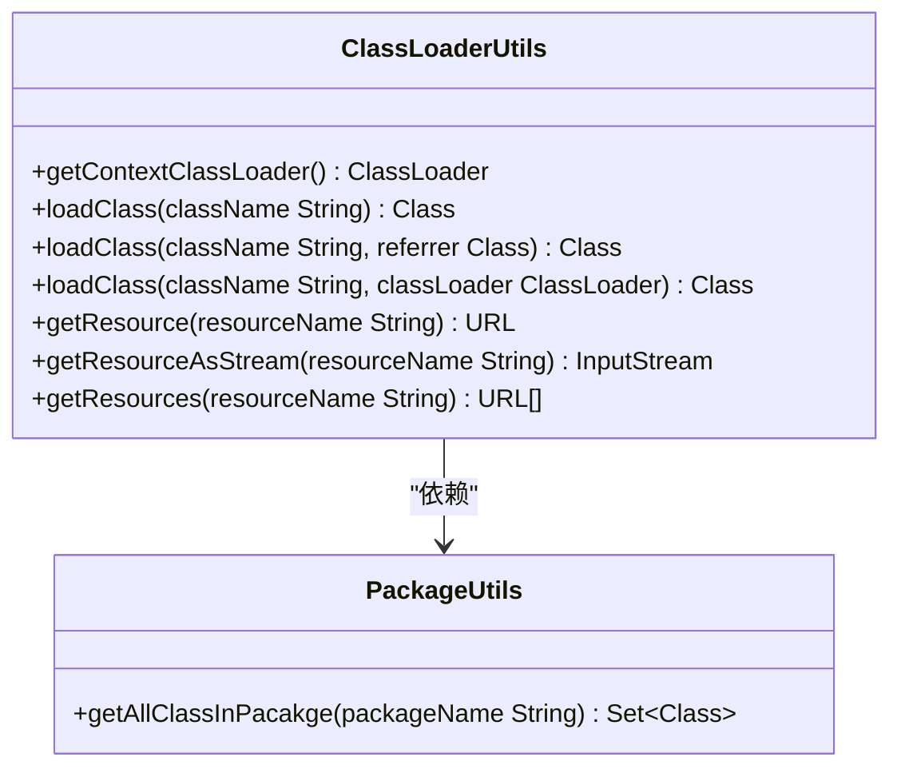
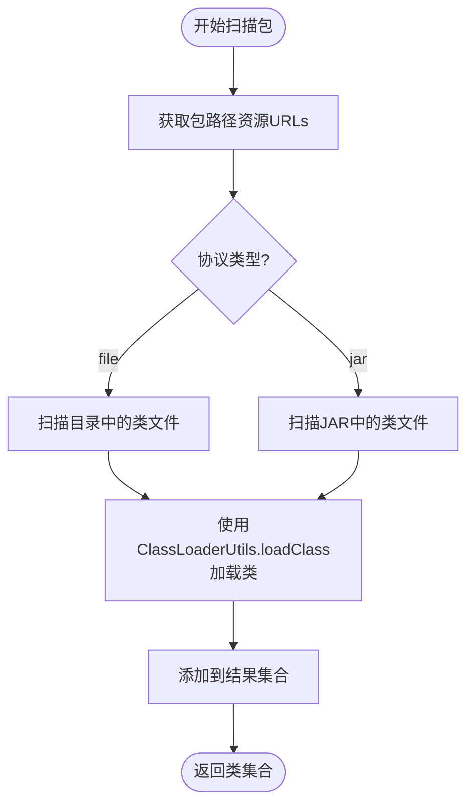
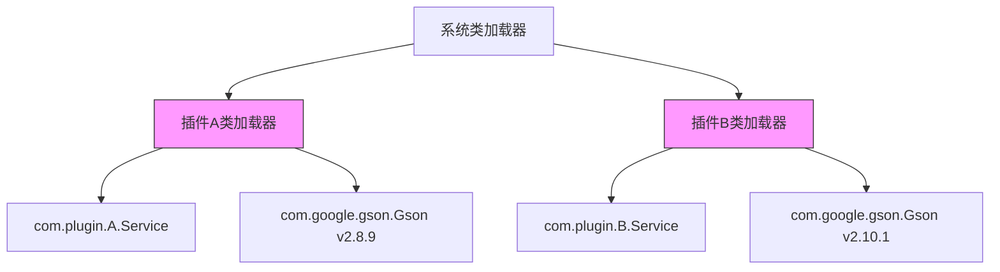
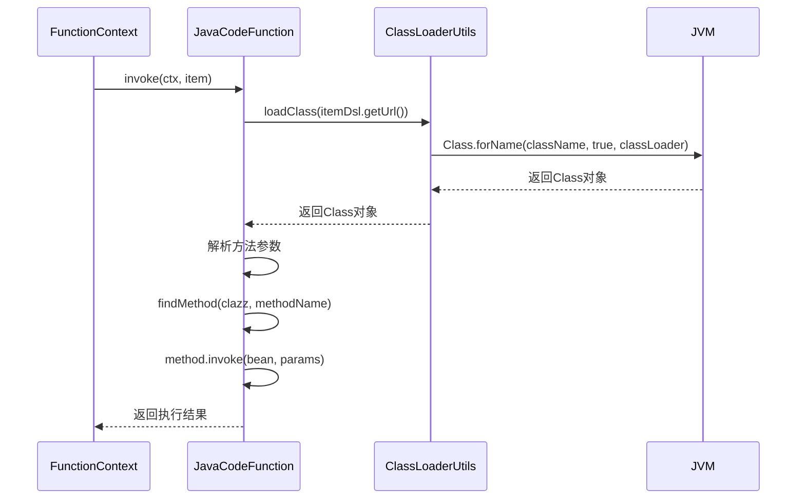

# 插件类加载机制

<cite>
**Referenced Files in This Document**  
- [ClassLoaderUtils.java](file://logic-runtime/src/main/java/com/aims/logic/runtime/util/ClassLoaderUtils.java)
- [PackageUtils.java](file://logic-runtime/src/main/java/com/aims/logic/runtime/util/PackageUtils.java)
- [ClassUtils.java](file://logic-ide/src/main/java/com/aims/logic/ide/util/ClassUtils.java)
- [JavaCodeFunction.java](file://logic-runtime/src/main/java/com/aims/logic/runtime/runner/functions/impl/JavaCodeFunction.java)
</cite>

## 目录
1. [引言](#引言)
2. [核心组件](#核心组件)
3. [类加载器隔离机制](#类加载器隔离机制)
4. [动态加载第三方库示例](#动态加载第三方库示例)
5. [异常处理与性能优化](#异常处理与性能优化)
6. [结论](#结论)

## 引言
本文档详细介绍了基于ClassLoaderUtils的插件类加载机制，重点阐述了在动态加载外部JAR包时的核心作用。通过分析上下文类加载器、类与资源加载方法的实现原理，说明了如何利用自定义类加载器实现插件热部署和类隔离，避免插件间的类冲突问题。

## 核心组件

### ClassLoaderUtils核心功能
`ClassLoaderUtils`作为核心工具类，提供了统一的类和资源加载接口，封装了Java类加载机制的复杂性。

**Diagram sources**  
- [ClassLoaderUtils.java](file://logic-runtime/src/main/java/com/aims/logic/runtime/util/ClassLoaderUtils.java#L30-L238)
- [PackageUtils.java](file://logic-runtime/src/main/java/com/aims/logic/runtime/util/PackageUtils.java#L38-L161)

#### 上下文类加载器获取
`getContextClassLoader()`方法通过`Thread.currentThread().getContextClassLoader()`获取当前线程的上下文类加载器，这是实现插件化架构的关键，允许在运行时动态改变类加载策略。

#### 类加载方法族
`loadClass`系列方法提供了多种类加载方式：
- `loadClass(String className)`：使用上下文类加载器加载类
- `loadClass(String className, Class referrer)`：根据引用类的类加载器加载
- `loadClass(String className, ClassLoader classLoader)`：指定类加载器加载

这些方法最终都委托给`Class.forName()`实现，确保了类加载的一致性和可控性。

#### 资源加载机制
`getResource`和`getResourceAsStream`方法提供了资源加载功能，支持从不同类加载器层次结构中查找资源，确保插件能够正确访问其依赖的配置文件和资源。

**Section sources**  
- [ClassLoaderUtils.java](file://logic-runtime/src/main/java/com/aims/logic/runtime/util/ClassLoaderUtils.java#L30-L238)

### 类扫描与发现
`PackageUtils`利用`ClassLoaderUtils`实现了包级别类扫描功能，能够自动发现指定包下的所有类。

**Diagram sources**  
- [PackageUtils.java](file://logic-runtime/src/main/java/com/aims/logic/runtime/util/PackageUtils.java#L38-L161)
- [ClassLoaderUtils.java](file://logic-runtime/src/main/java/com/aims/logic/runtime/util/ClassLoaderUtils.java#L30-L238)

**Section sources**  
- [PackageUtils.java](file://logic-runtime/src/main/java/com/aims/logic/runtime/util/PackageUtils.java#L38-L161)

## 类加载器隔离机制

### 插件热部署实现
通过自定义类加载器，系统实现了插件的热部署能力。每个插件使用独立的类加载器实例，当需要更新插件时，只需创建新的类加载器并重新加载类，旧的类加载器及其加载的类可以被垃圾回收。

### 类冲突避免
类加载器隔离机制有效避免了插件间的类冲突：
1. **命名空间隔离**：不同插件的类即使同名也不会冲突
2. **版本隔离**：不同插件可使用不同版本的相同依赖库
3. **依赖隔离**：插件的依赖不会影响主系统或其他插件

**Diagram sources**  
- [ClassLoaderUtils.java](file://logic-runtime/src/main/java/com/aims/logic/runtime/util/ClassLoaderUtils.java#L30-L238)

### 实际应用案例
`JavaCodeFunction`在执行Java代码节点时，使用`ClassLoaderUtils.loadClass`动态加载用户指定的类，实现了运行时代码执行能力。

**Diagram sources**  
- [JavaCodeFunction.java](file://logic-runtime/src/main/java/com/aims/logic/runtime/runner/functions/impl/JavaCodeFunction.java#L24-L164)
- [ClassLoaderUtils.java](file://logic-runtime/src/main/java/com/aims/logic/runtime/util/ClassLoaderUtils.java#L30-L238)

**Section sources**  
- [JavaCodeFunction.java](file://logic-runtime/src/main/java/com/aims/logic/runtime/runner/functions/impl/JavaCodeFunction.java#L24-L164)

## 动态加载第三方库示例

### 完整加载流程
从JAR文件加载类、读取资源到实例化的完整流程如下：

1. **创建URLClassLoader**：指定JAR文件路径
2. **加载类**：使用`ClassLoaderUtils.loadClass`加载目标类
3. **获取资源**：通过`getResourceAsStream`读取配置文件
4. **实例化对象**：反射创建类实例并调用方法

### 代码示例路径
- 类加载：`ClassLoaderUtils.loadClass(className, classLoader)`
- 资源读取：`ClassLoaderUtils.getResourceAsStream(resourceName, classLoader)` 
- 实例化：`Class.newInstance()`或通过构造函数反射创建

**Section sources**  
- [ClassLoaderUtils.java](file://logic-runtime/src/main/java/com/aims/logic/runtime/util/ClassLoaderUtils.java#L30-L238)
- [ClassUtils.java](file://logic-ide/src/main/java/com/aims/logic/ide/util/ClassUtils.java#L54-L64)

## 异常处理与性能优化

### 异常处理机制
系统实现了完善的异常处理：
- **ClassNotFoundException**：类不存在时的优雅处理
- **IOException**：资源读取失败的错误日志记录
- **重复URL过滤**：`getDistinctURLs`方法确保资源URL的唯一性

### 性能优化建议
1. **缓存类加载结果**：避免重复加载相同的类
2. **批量资源加载**：使用`getResources`一次性获取多个资源
3. **合理使用上下文类加载器**：减少类加载器查找开销
4. **及时释放类加载器**：防止内存泄漏

**Section sources**  
- [ClassLoaderUtils.java](file://logic-runtime/src/main/java/com/aims/logic/runtime/util/ClassLoaderUtils.java#L30-L238)

## 结论
`ClassLoaderUtils`为系统提供了强大的插件类加载能力，通过封装Java类加载机制，实现了插件的动态加载、热部署和类隔离。该机制不仅支持第三方库的灵活集成，还为系统的扩展性和维护性提供了坚实基础。建议在使用时注意类加载器生命周期管理，避免内存泄漏问题。