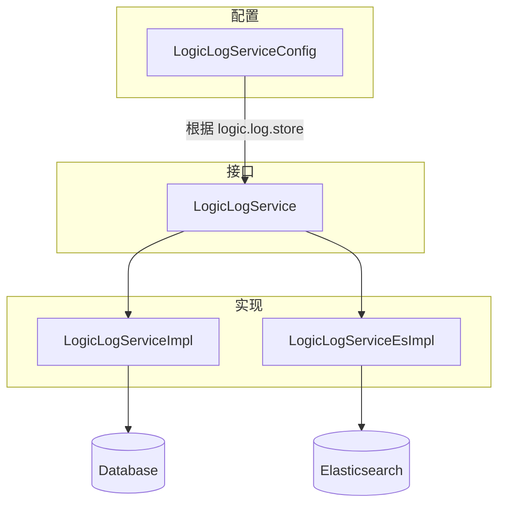
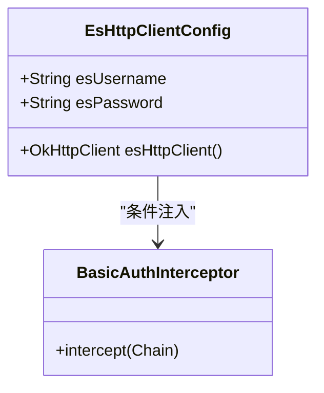
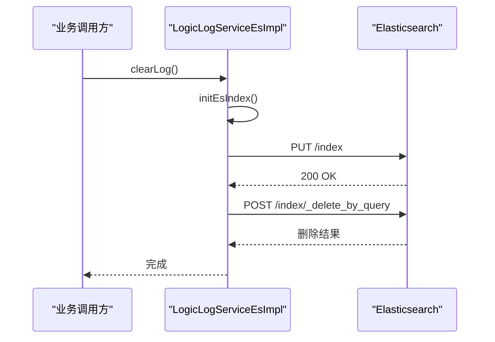
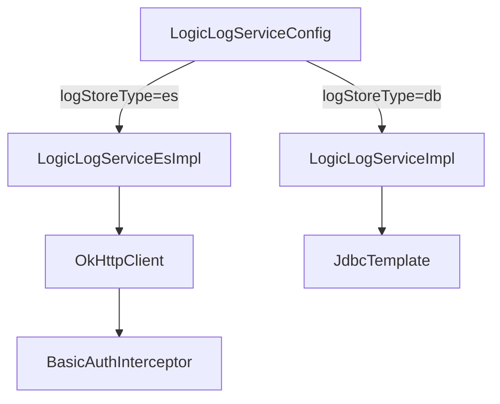

# 日志存储扩展

<cite>
**本文档引用文件**  
- [LogicLogService.java](file://logic-sdk/src/main/java/com/aims/logic/sdk/service/LogicLogService.java)
- [LogicLogServiceEsImpl.java](file://logic-sdk/src/main/java/com/aims/logic/sdk/service/impl/es/LogicLogServiceEsImpl.java)
- [LogicLogServiceImpl.java](file://logic-sdk/src/main/java/com/aims/logic/sdk/service/impl/LogicLogServiceImpl.java)
- [LogicLogServiceConfig.java](file://logic-sdk/src/main/java/com/aims/logic/sdk/config/LogicLogServiceConfig.java)
- [EsHttpClientConfig.java](file://logic-sdk/src/main/java/com/aims/logic/sdk/service/impl/es/EsHttpClientConfig.java)
</cite>

## 目录
1. [简介](#简介)
2. [核心组件](#核心组件)
3. [架构概述](#架构概述)
4. [详细组件分析](#详细组件分析)
5. [依赖分析](#依赖分析)
6. [性能调优建议](#性能调优建议)
7. [结论](#结论)

## 简介
本文档旨在说明如何扩展日志存储后端，支持 Database、Elasticsearch 和 Memory 三种存储模式。重点解析基于 `LogicLogService` 接口的实现机制，特别是 `LogicLogServiceEsImpl` 与 Elasticsearch 的集成方式，包括连接配置、索引策略、批量写入与错误重试机制。同时涵盖配置项 `logic.log.storage.type` 的使用方法、自定义存储实现的注册方式，以及性能优化建议。

## 核心组件

`LogicLogService` 是日志存储的核心接口，定义了日志清理和按时间删除日志的方法。系统通过配置动态选择具体实现类，支持多种后端存储。

**Section sources**
- [LogicLogService.java](file://logic-sdk/src/main/java/com/aims/logic/sdk/service/LogicLogService.java#L1-L15)

## 架构概述

系统采用策略模式实现日志存储的可扩展性。根据配置项 `logic.log.store` 的值，Spring 容器注入不同的 `LogicLogService` 实现。当前支持两种主要实现：基于数据库的 `LogicLogServiceImpl` 和基于 Elasticsearch 的 `LogicLogServiceEsImpl`。

**Diagram sources**
- [LogicLogServiceConfig.java](file://logic-sdk/src/main/java/com/aims/logic/sdk/config/LogicLogServiceConfig.java#L1-L32)
- [LogicLogServiceImpl.java](file://logic-sdk/src/main/java/com/aims/logic/sdk/service/impl/LogicLogServiceImpl.java#L1-L22)
- [LogicLogServiceEsImpl.java](file://logic-sdk/src/main/java/com/aims/logic/sdk/service/impl/es/LogicLogServiceEsImpl.java#L1-L243)

## 详细组件分析

### LogicLogService 接口分析

`LogicLogService` 接口继承自 `BaseService`，定义了两个核心方法：
- `clearLog()`：清空所有日志
- `deleteLogBeforeDays(int days)`：删除指定天数前的日志

该接口为所有日志存储实现提供了统一契约。

**Section sources**
- [LogicLogService.java](file://logic-sdk/src/main/java/com/aims/logic/sdk/service/LogicLogService.java#L1-L15)

### LogicLogServiceEsImpl 与 Elasticsearch 集成分析

`LogicLogServiceEsImpl` 是 Elasticsearch 存储的具体实现，继承自 `BaseEsServiceImpl`，并实现了 `LogicLogService` 接口。

#### 连接配置

Elasticsearch 客户端由 `EsHttpClientConfig` 类通过 Spring Bean 注入。支持基本认证配置：
- `logic.log.es.username`：ES 用户名
- `logic.log.es.password`：ES 密码

若配置了用户名和密码，则自动添加 `BasicAuthInterceptor` 拦截器。

**Diagram sources**
- [EsHttpClientConfig.java](file://logic-sdk/src/main/java/com/aims/logic/sdk/service/impl/es/EsHttpClientConfig.java#L1-L27)
- [BasicAuthInterceptor.java](file://logic-sdk/src/main/java/com/aims/logic/sdk/service/impl/es/BasicAuthInterceptor.java#L1-L20)

#### 索引策略

`initEsIndex()` 方法负责创建 Elasticsearch 索引，包含以下关键字段映射：
- 文本字段均配置 `keyword` 子字段用于精确匹配
- 时间字段 `serverTime` 支持多种格式解析
- 布尔字段 `success` 和 `isOver` 直接映射

索引在每次 `clearLog()` 调用时重建，确保结构一致性。

#### 批量写入与错误重试机制

当前实现通过 `_delete_by_query` API 实现批量删除：
- `clearLog()` 使用 `match_all` 查询删除所有文档
- `deleteLogBeforeDays()` 使用 `range` 查询删除指定时间前的日志

虽然未显式实现重试机制，但底层 `OkHttpClient` 具备连接超时（20秒）和读写超时控制。

**Diagram sources**
- [LogicLogServiceEsImpl.java](file://logic-sdk/src/main/java/com/aims/logic/sdk/service/impl/es/LogicLogServiceEsImpl.java#L1-L243)

### LogicLogServiceImpl 与数据库集成分析

`LogicLogServiceImpl` 提供基于 JDBC 的数据库存储实现：
- `clearLog()` 执行 `TRUNCATE TABLE logic_log`
- `deleteLogBeforeDays()` 执行带参数的 `DELETE` 语句

该实现通过 `@ConditionalOnLogicLogService("db")` 注解控制条件注入。

**Section sources**
- [LogicLogServiceImpl.java](file://logic-sdk/src/main/java/com/aims/logic/sdk/service/impl/LogicLogServiceImpl.java#L1-L22)

## 依赖分析

系统通过 Spring 配置类 `LogicLogServiceConfig` 实现依赖注入。根据 `logic.log.store` 配置值动态选择实现类。

**Diagram sources**
- [LogicLogServiceConfig.java](file://logic-sdk/src/main/java/com/aims/logic/sdk/config/LogicLogServiceConfig.java#L1-L32)
- [LogicLogServiceEsImpl.java](file://logic-sdk/src/main/java/com/aims/logic/sdk/service/impl/es/LogicLogServiceEsImpl.java#L1-L243)
- [LogicLogServiceImpl.java](file://logic-sdk/src/main/java/com/aims/logic/sdk/service/impl/LogicLogServiceImpl.java#L1-L22)

## 性能调优建议

1. **批量提交**：当前 `_delete_by_query` 已为批量操作，建议在写入端也实现批量索引（Bulk API）
2. **异步写入**：可引入消息队列（如 Kafka）解耦日志写入，提升主流程性能
3. **连接池优化**：`OkHttpClient` 可配置连接池大小和复用策略
4. **索引优化**：考虑为高频查询字段添加专用索引，如 `logicId`, `bizId`
5. **分片策略**：生产环境应根据数据量合理设置 Elasticsearch 分片数量
6. **TTL 策略**：可配置 Elasticsearch ILM（Index Lifecycle Management）自动管理日志索引生命周期

## 结论

本系统通过清晰的接口抽象和条件化配置，实现了日志存储的灵活扩展。`LogicLogServiceEsImpl` 提供了完整的 Elasticsearch 集成方案，包含连接认证、索引管理和批量操作。未来可通过引入异步写入和批量索引进一步提升性能，满足大规模日志存储需求。