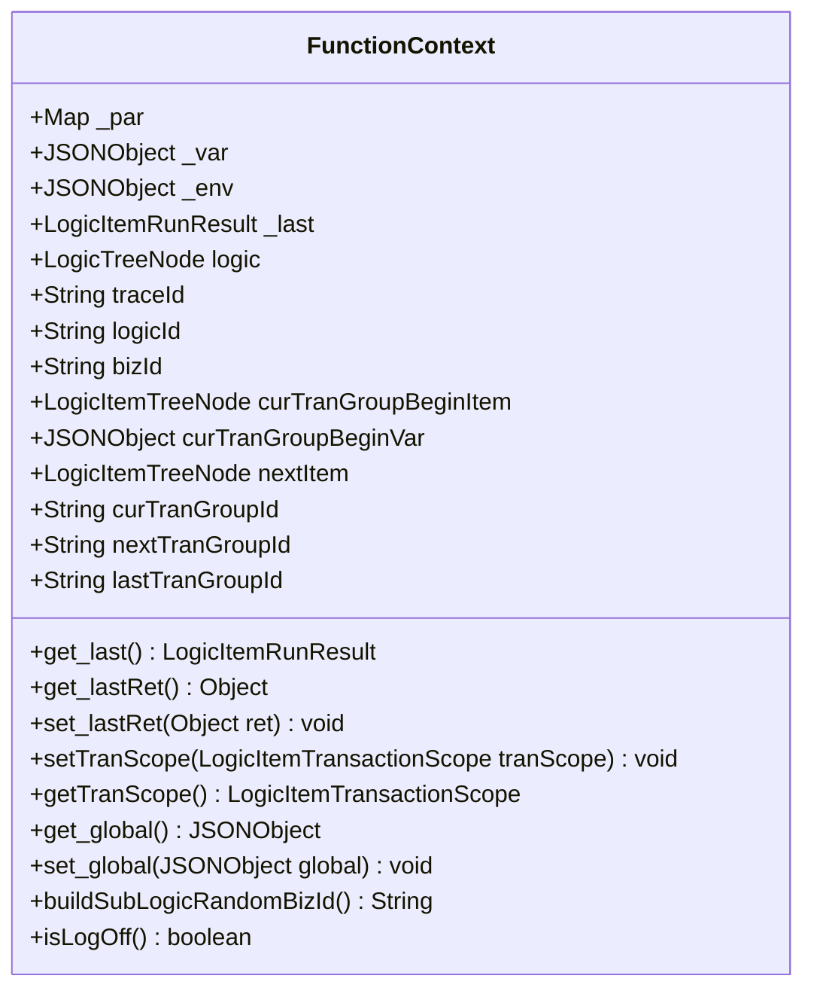
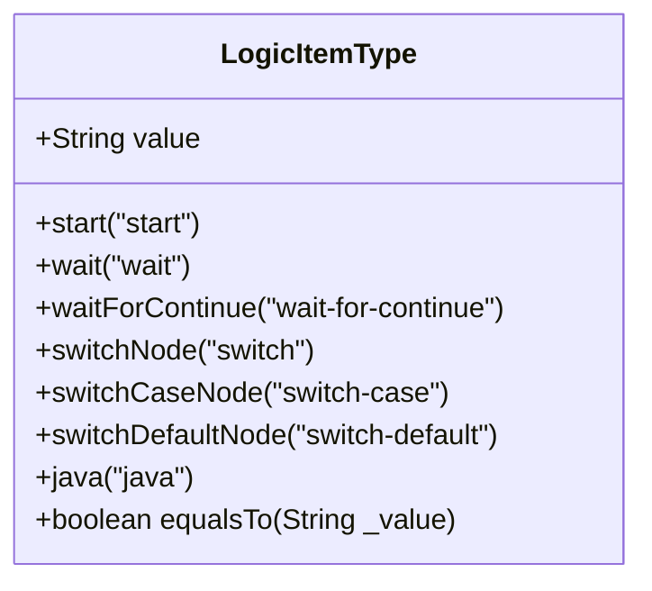
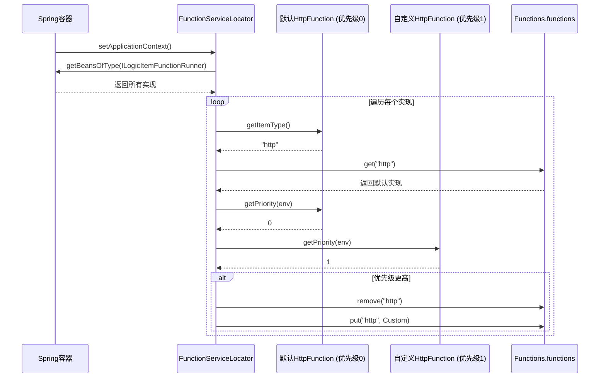
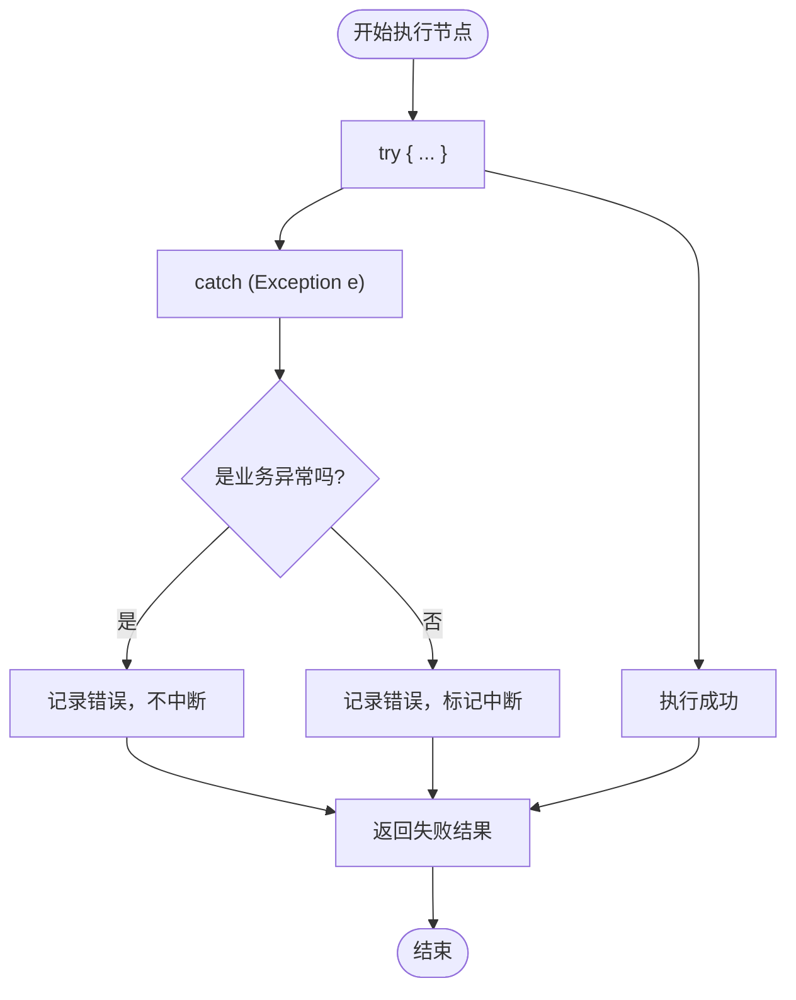

# 自定义节点开发

<cite>
**Referenced Files in This Document**   
- [ILogicItemFunctionRunner.java](file://logic-runtime/src/main/java/com/aims/logic/runtime/runner/functions/ILogicItemFunctionRunner.java)
- [FunctionContext.java](file://logic-runtime/src/main/java/com/aims/logic/runtime/runner/FunctionContext.java)
- [HttpFunction.java](file://logic-runtime/src/main/java/com/aims/logic/runtime/runner/functions/impl/HttpFunction.java)
- [JavaCodeFunction.java](file://logic-runtime/src/main/java/com/aims/logic/runtime/runner/functions/impl/JavaCodeFunction.java)
- [JsFunction.java](file://logic-runtime/src/main/java/com/aims/logic/runtime/runner/functions/impl/JsFunction.java)
- [SwitchFunction.java](file://logic-runtime/src/main/java/com/aims/logic/runtime/runner/functions/impl/SwitchFunction.java)
- [FunctionServiceLocator.java](file://logic-runtime/src/main/java/com/aims/logic/runtime/runner/FunctionServiceLocator.java)
- [Functions.java](file://logic-runtime/src/main/java/com/aims/logic/runtime/runner/Functions.java)
- [LogicItemType.java](file://logic-runtime/src/main/java/com/aims/logic/runtime/contract/enums/LogicItemType.java)
</cite>

## 目录
1. [简介](#简介)
2. [核心接口与执行上下文](#核心接口与执行上下文)
3. [节点类型标识与优先级机制](#节点类型标识与优先级机制)
4. [参考实现分析](#参考实现分析)
5. [异常处理与日志记录](#异常处理与日志记录)
6. [性能优化与最佳实践](#性能优化与最佳实践)
7. [注册与使用流程](#注册与使用流程)
8. [总结](#总结)

## 简介

本文档旨在为开发者提供创建自定义逻辑节点的完整指导。通过实现 `ILogicItemFunctionRunner` 接口，开发者可以扩展系统功能，创建新的节点类型以满足特定业务需求。文档详细阐述了接口的核心方法、执行上下文 `FunctionContext` 的使用、节点DSL对象的交互方式，以及如何通过Spring Bean机制实现节点的自动注册。同时，通过分析HTTP、Java、JS和Switch节点的实现，为开发者提供不同业务逻辑处理模式的参考。

## 核心接口与执行上下文

### ILogicItemFunctionRunner 接口

`ILogicItemFunctionRunner` 是所有自定义节点实现的核心接口，定义了节点执行的基本契约。该接口位于 `logic-runtime` 模块中，是创建任何新节点类型的起点。

**Section sources**
- [ILogicItemFunctionRunner.java](file://logic-runtime/src/main/java/com/aims/logic/runtime/runner/functions/ILogicItemFunctionRunner.java#L8-L25)

### FunctionContext 执行上下文

`FunctionContext` 类是节点执行时的核心上下文对象，封装了执行过程中所需的所有环境信息和共享数据。它为节点提供了访问全局状态、环境变量、逻辑配置和执行结果的能力。

**Diagram sources**
- [FunctionContext.java](file://logic-runtime/src/main/java/com/aims/logic/runtime/runner/FunctionContext.java#L14-L103)

**Section sources**
- [FunctionContext.java](file://logic-runtime/src/main/java/com/aims/logic/runtime/runner/FunctionContext.java#L0-L104)

## 节点类型标识与优先级机制

### getItemType 方法

`getItemType()` 方法用于返回当前节点实现所对应的节点类型标识符。这个字符串值是节点在系统中的唯一标识，用于在运行时匹配和调用正确的节点处理器。

在系统中，节点类型标识符与 `LogicItemType` 枚举中的值相对应。例如，`"http"` 对应 `LogicItemType.http`，`"java"` 对应 `LogicItemType.java`。开发者在创建新节点时，应确保返回的类型标识符是唯一的，并遵循系统的命名规范。

**Diagram sources**
- [LogicItemType.java](file://logic-runtime/src/main/java/com/aims/logic/runtime/contract/enums/LogicItemType.java#L0-L25)

**Section sources**
- [LogicItemType.java](file://logic-runtime/src/main/java/com/aims/logic/runtime/contract/enums/LogicItemType.java#L0-L25)

### getPriority 方法

`getPriority(String env)` 方法定义了节点实现的加载优先级。当存在多个实现同一节点类型的 `ILogicItemFunctionRunner` 时，系统会根据此优先级值来决定使用哪一个实现。

优先级机制允许开发者覆盖系统默认的节点实现。例如，如果系统内置了一个 `HttpFunction`，其优先级为 `0`，开发者可以创建一个自定义的 `CustomHttpFunction`，并将其优先级设置为 `1`。在Spring容器初始化时，`FunctionServiceLocator` 会检测到优先级更高的实现，并用它替换掉默认实现。

**Diagram sources**
- [FunctionServiceLocator.java](file://logic-runtime/src/main/java/com/aims/logic/runtime/runner/FunctionServiceLocator.java#L0-L31)
- [ILogicItemFunctionRunner.java](file://logic-runtime/src/main/java/com/aims/logic/runtime/runner/functions/ILogicItemFunctionRunner.java#L8-L25)

**Section sources**
- [FunctionServiceLocator.java](file://logic-runtime/src/main/java/com/aims/logic/runtime/runner/FunctionServiceLocator.java#L0-L31)

## 参考实现分析

### HTTP 节点实现

`HttpFunction` 是一个典型的外部服务调用节点。它利用 `FunctionContext` 中的 `runJsByContext` 方法动态解析URL、请求体和请求头，然后使用OkHttp客户端发起HTTP请求。该实现展示了如何处理网络I/O、超时配置和响应解析。

**Section sources**
- [HttpFunction.java](file://logic-runtime/src/main/java/com/aims/logic/runtime/runner/functions/impl/HttpFunction.java#L0-L118)

### Java 节点实现

`JavaCodeFunction` 实现了对Java方法的动态调用。它通过反射机制加载指定的类，解析方法签名，并将DSL中定义的参数映射到实际的Java类型。该实现复杂地处理了泛型、原始类型和枚举类型，展示了如何在动态环境中安全地进行类型转换。

**Section sources**
- [JavaCodeFunction.java](file://logic-runtime/src/main/java/com/aims/logic/runtime/runner/functions/impl/JavaCodeFunction.java#L0-L181)

### JS 节点实现

`JsFunction` 使用GraalVM引擎来执行JavaScript脚本。它将 `FunctionContext` 中的变量（如 `_var`, `_env`, `_par`）注入到JavaScript的执行上下文中，使得脚本可以直接访问和修改这些共享状态。该实现是系统中脚本执行能力的核心。

**Section sources**
- [JsFunction.java](file://logic-runtime/src/main/java/com/aims/logic/runtime/runner/functions/impl/JsFunction.java#L0-L147)

### Switch 节点实现

`SwitchFunction` 实现了条件分支逻辑。它通过执行一个JavaScript表达式来获取条件值，然后遍历分支列表，寻找匹配的 `when` 条件。如果未找到匹配项，则执行 `default` 分支。该实现展示了如何将脚本执行与业务逻辑相结合。

**Section sources**
- [SwitchFunction.java](file://logic-runtime/src/main/java/com/aims/logic/runtime/runner/functions/impl/SwitchFunction.java#L0-L65)

## 异常处理与日志记录

### 异常处理策略

系统采用分层的异常处理策略。在节点的 `invoke` 方法内部，通常会使用 `try-catch` 块捕获所有异常。对于业务异常（如 `LogicBizException`），系统会将其视为可预期的错误，记录错误信息但不中断流程。对于系统异常或代码错误，则会标记为需要中断（`setNeedInterrupt(true)`），并记录详细的堆栈信息。

**Section sources**
- [JavaCodeFunction.java](file://logic-runtime/src/main/java/com/aims/logic/runtime/runner/functions/impl/JavaCodeFunction.java#L21-L180)
- [HttpFunction.java](file://logic-runtime/src/main/java/com/aims/logic/runtime/runner/functions/impl/HttpFunction.java#L22-L117)

### 日志记录

所有节点实现都通过SLF4J的 `@Slf4j` 注解获取日志记录器。日志信息包含了 `logicId` 和 `bizId`，便于在分布式环境中追踪请求。日志级别通常使用 `info` 记录关键流程，使用 `debug` 记录详细数据，使用 `error` 记录异常。

**Section sources**
- [HttpFunction.java](file://logic-runtime/src/main/java/com/aims/logic/runtime/runner/functions/impl/HttpFunction.java#L22-L117)
- [JavaCodeFunction.java](file://logic-runtime/src/main/java/com/aims/logic/runtime/runner/functions/impl/JavaCodeFunction.java#L21-L180)

## 性能优化与最佳实践

### 函数调用优化

`Functions` 类提供了 `runJsByContext` 和 `runJsExpressByContext` 等静态方法，作为调用JS节点的便捷入口。这些方法封装了获取节点实例和处理结果的逻辑，避免了在业务代码中重复这些操作。

**Section sources**
- [Functions.java](file://logic-runtime/src/main/java/com/aims/logic/runtime/runner/Functions.java#L0-L52)

### 最佳实践

1.  **幂等性**：节点的 `invoke` 方法应尽可能设计为幂等的，以支持重试机制。
2.  **资源管理**：对于需要创建连接或资源的节点（如HTTP、数据库），应在 `try-with-resources` 或 `finally` 块中确保资源被正确释放。
3.  **错误信息**：返回的错误信息应清晰、具体，便于用户理解和排查问题。
4.  **避免阻塞**：长时间运行的操作应考虑异步执行，避免阻塞主线程。

## 注册与使用流程

自定义节点的注册完全依赖于Spring框架。开发者只需将实现类标注为 `@Service` 或 `@Component`，Spring容器在启动时会自动将其作为Bean管理。`FunctionServiceLocator` 实现了 `ApplicationContextAware` 接口，能够在应用上下文初始化完成后，自动扫描所有 `ILogicItemFunctionRunner` 类型的Bean，并根据 `getItemType` 和 `getPriority` 将它们注册到 `Functions.functions` 映射中。

完整的开发和使用流程如下：
1.  创建一个新类，实现 `ILogicItemFunctionRunner` 接口。
2.  使用 `@Service` 注解将该类声明为Spring Bean。
3.  实现 `invoke` 方法，编写核心业务逻辑。
4.  实现 `getItemType` 方法，返回唯一的节点类型标识符。
5.  实现 `getPriority` 方法，根据需要设置优先级以覆盖默认实现。
6.  编译并部署应用，新节点将自动注册并可供使用。

**Section sources**
- [FunctionServiceLocator.java](file://logic-runtime/src/main/java/com/aims/logic/runtime/runner/FunctionServiceLocator.java#L0-L31)

## 总结

通过实现 `ILogicItemFunctionRunner` 接口，开发者可以灵活地扩展系统的节点能力。`FunctionContext` 提供了丰富的上下文信息，使得节点能够与系统其他部分进行深度交互。优先级机制为覆盖和扩展默认行为提供了可能。通过分析现有的HTTP、Java、JS和Switch节点，开发者可以学习到处理不同业务场景的最佳模式。结合Spring的自动注册机制，整个开发流程简洁高效，使开发者能够专注于业务逻辑的实现。