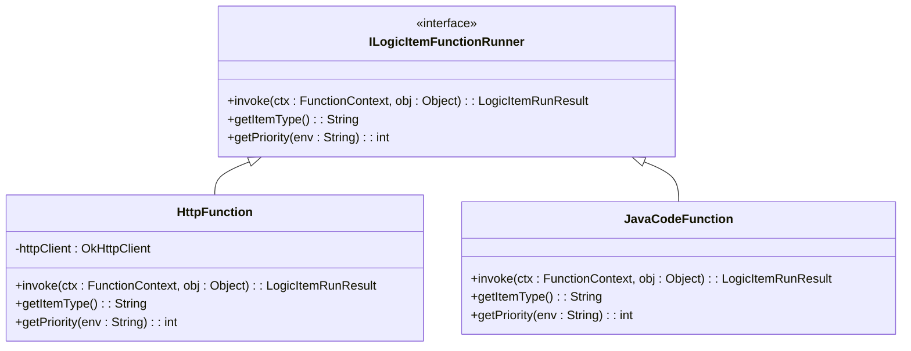
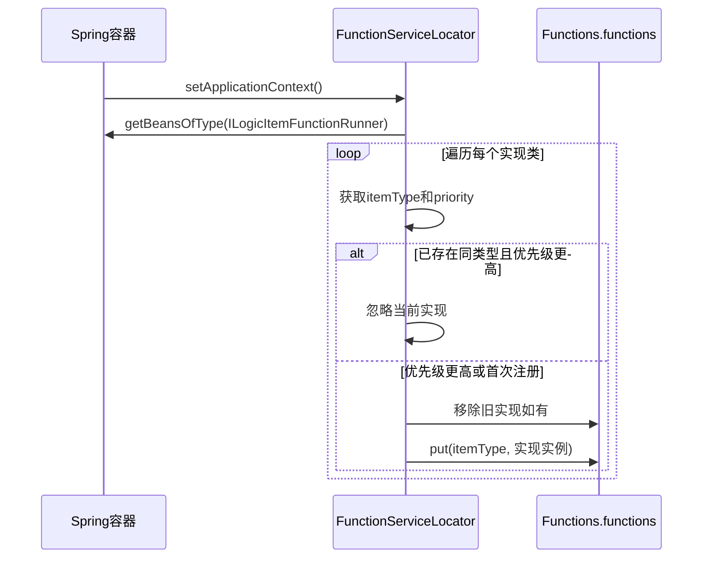
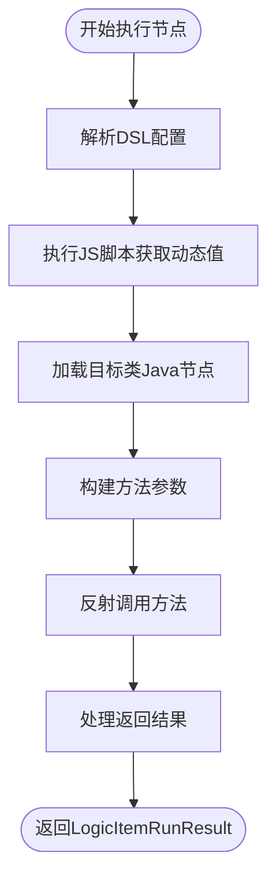
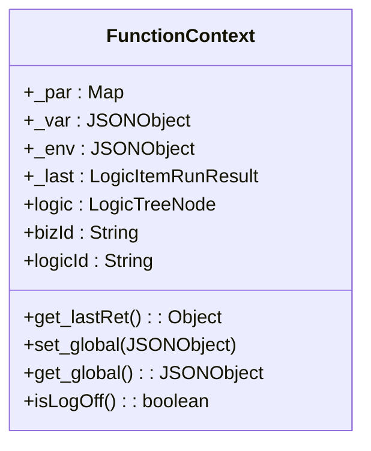

# 自定义节点开发

<cite>
**本文档引用的文件**  
- [ILogicItemFunctionRunner.java](file://logic-runtime/src/main/java/com/aims/logic/runtime/runner/functions/ILogicItemFunctionRunner.java)
- [HttpFunction.java](file://logic-runtime/src/main/java/com/aims/logic/runtime/runner/functions/impl/HttpFunction.java)
- [JavaCodeFunction.java](file://logic-runtime/src/main/java/com/aims/logic/runtime/runner/functions/impl/JavaCodeFunction.java)
- [FunctionServiceLocator.java](file://logic-runtime/src/main/java/com/aims/logic/runtime/runner/FunctionServiceLocator.java)
- [Functions.java](file://logic-runtime/src/main/java/com/aims/logic/runtime/runner/Functions.java)
- [FunctionContext.java](file://logic-runtime/src/main/java/com/aims/logic/runtime/runner/FunctionContext.java)
- [http.json](file://logic-ide/src/main/resources/public/setting/forms/http.json)
- [java.json](file://logic-ide/src/main/resources/public/setting/forms/java.json)
</cite>

## 目录
1. [简介](#简介)
2. [核心接口与实现](#核心接口与实现)
3. [节点类型注册机制](#节点类型注册机制)
4. [DSL解析流程](#dsl解析流程)
5. [上下文传递机制（FunctionContext）](#上下文传递机制functioncontext)
6. [异常处理规范](#异常处理规范)
7. [完整代码示例](#完整代码示例)
8. [最佳实践](#最佳实践)

## 简介
本文档详细说明如何在Xuanwu逻辑引擎中开发自定义逻辑节点。通过实现`ILogicItemFunctionRunner`接口并注册到`FunctionServiceLocator`，开发者可扩展系统功能。文档涵盖接口方法`invoke`、`getItemType`、`getPriority`的实现逻辑，结合`HttpFunction`、`JavaCodeFunction`等内置实现示例，深入解析输入参数处理、业务逻辑执行及结果返回机制。同时介绍节点类型注册、DSL解析、上下文传递与异常处理等关键机制。

## 核心接口与实现

### ILogicItemFunctionRunner 接口定义
该接口是所有逻辑节点执行器的基础契约，定义了节点执行的核心行为。



**Diagram sources**  
- [ILogicItemFunctionRunner.java](file://logic-runtime/src/main/java/com/aims/logic/runtime/runner/functions/ILogicItemFunctionRunner.java#L8-L25)
- [HttpFunction.java](file://logic-runtime/src/main/java/com/aims/logic/runtime/runner/functions/impl/HttpFunction.java#L22-L117)
- [JavaCodeFunction.java](file://logic-runtime/src/main/java/com/aims/logic/runtime/runner/functions/impl/JavaCodeFunction.java#L21-L180)

**Section sources**  
- [ILogicItemFunctionRunner.java](file://logic-runtime/src/main/java/com/aims/logic/runtime/runner/functions/ILogicItemFunctionRunner.java#L8-L25)

### invoke 方法实现逻辑
`invoke`方法是节点执行的核心入口，接收`FunctionContext`上下文和DSL节点对象，返回执行结果。

- **HttpFunction 实现逻辑**：解析URL、方法、头信息和请求体，使用OkHttpClient发起HTTP请求，处理响应并封装结果。
- **JavaCodeFunction 实现逻辑**：通过类加载器加载指定类，解析方法参数类型，动态调用Spring管理的Bean方法，处理返回值或异常。

### getItemType 与 getPriority 方法
- `getItemType()` 返回节点类型标识符（如"java"、"http"），用于DSL中匹配节点。
- `getPriority(String env)` 返回加载优先级，相同类型下高优先级实现可覆盖低优先级实现，支持环境差异化配置。

## 节点类型注册机制

### FunctionServiceLocator 自动注册
`FunctionServiceLocator`实现`ApplicationContextAware`接口，在Spring容器初始化完成后自动扫描所有`ILogicItemFunctionRunner`类型的Bean，并根据优先级注册到全局`Functions.functions`映射中。



**Diagram sources**  
- [FunctionServiceLocator.java](file://logic-runtime/src/main/java/com/aims/logic/runtime/runner/FunctionServiceLocator.java#L12-L30)
- [Functions.java](file://logic-runtime/src/main/java/com/aims/logic/runtime/runner/Functions.java#L12-L52)

**Section sources**  
- [FunctionServiceLocator.java](file://logic-runtime/src/main/java/com/aims/logic/runtime/runner/FunctionServiceLocator.java#L12-L30)

## DSL解析流程

### 前端表单配置到DSL转换
前端通过JSON表单定义节点参数（如`http.json`、`java.json`），在保存时序列化为DSL结构，包含`url`、`method`、`body`、`params`等字段。

### 运行时DSL解析
执行时，`invoke`方法从`LogicItemTreeNode`中提取DSL字段，结合`FunctionContext`中的变量进行脚本解析（如`Functions.runJsByContext`），动态生成实际请求参数或方法调用参数。



**Diagram sources**  
- [JavaCodeFunction.java](file://logic-runtime/src/main/java/com/aims/logic/runtime/runner/functions/impl/JavaCodeFunction.java#L21-L180)
- [http.json](file://logic-ide/src/main/resources/public/setting/forms/http.json)
- [java.json](file://logic-ide/src/main/resources/public/setting/forms/java.json)

**Section sources**  
- [JavaCodeFunction.java](file://logic-runtime/src/main/java/com/aims/logic/runtime/runner/functions/impl/JavaCodeFunction.java#L21-L180)

## 上下文传递机制（FunctionContext）

### FunctionContext 结构
`FunctionContext`封装了执行过程中的共享状态，包括：
- `_par`: 参数映射
- `_var`: 变量存储（含`__global`全局变量）
- `_env`: 环境变量
- `logic`: 当前逻辑定义
- `bizId`, `logicId`: 业务与逻辑ID
- `_last`: 上一个节点执行结果

### 上下文使用示例
节点可通过`ctx.get_var()`获取变量，通过`ctx.set_global()`更新全局状态，通过`ctx.get_lastRet()`获取前序节点输出，实现数据流转。



**Diagram sources**  
- [FunctionContext.java](file://logic-runtime/src/main/java/com/aims/logic/runtime/runner/FunctionContext.java#L1-L104)

**Section sources**  
- [FunctionContext.java](file://logic-runtime/src/main/java/com/aims/logic/runtime/runner/FunctionContext.java#L1-L104)

## 异常处理规范

### 分层异常处理策略
1. **业务异常（LogicBizException）**：不中断流程，设置`success=false`，`needInterrupt=false`
2. **系统异常**：中断执行流程，设置`needInterrupt=true`
3. **网络异常（IOException）**：捕获后封装为执行失败，不中断
4. **反射调用异常（InvocationTargetException）**：区分业务异常与代码错误

### 异常处理代码结构
```java
try {
    // 执行业务逻辑
} catch (InvocationTargetException e) {
    if (e.getTargetException() instanceof LogicBizException) {
        return res.setSuccess(false).setMsg(...).setNeedInterrupt(false);
    } else {
        return res.setSuccess(false).setNeedInterrupt(true).setMsg(...);
    }
} catch (Exception e) {
    return res.setSuccess(false).setNeedInterrupt(true).setMsg(...);
}
```

**Section sources**  
- [JavaCodeFunction.java](file://logic-runtime/src/main/java/com/aims/logic/runtime/runner/functions/impl/JavaCodeFunction.java#L21-L180)
- [HttpFunction.java](file://logic-runtime/src/main/java/com/aims/logic/runtime/runner/functions/impl/HttpFunction.java#L22-L117)

## 完整代码示例

### 自定义节点实现模板
```java
@Service
public class CustomFunction implements ILogicItemFunctionRunner {
    
    @Override
    public LogicItemRunResult invoke(FunctionContext ctx, Object item) {
        LogicItemRunResult result = new LogicItemRunResult();
        LogicItemTreeNode node = (LogicItemTreeNode) item;
        
        try {
            // 1. 参数解析
            Object input = Functions.runJsByContext(ctx, node.getBody());
            
            // 2. 业务逻辑执行
            Object output = executeBusinessLogic(input);
            
            // 3. 设置成功结果
            return result.setSuccess(true)
                        .setData(output)
                        .setItemInstance(node);
        } catch (CustomBizException e) {
            return result.setSuccess(false)
                        .setMsg(e.getMessage())
                        .setNeedInterrupt(false)
                        .setItemInstance(node);
        } catch (Exception e) {
            log.error("自定义节点执行异常", e);
            return result.setSuccess(false)
                        .setNeedInterrupt(true)
                        .setMsg("系统异常：" + e.getMessage())
                        .setItemInstance(node);
        }
    }

    @Override
    public String getItemType() {
        return "custom";
    }

    @Override
    public int getPriority(String env) {
        return 10; // 高于默认实现
    }
}
```

**Section sources**  
- [ILogicItemFunctionRunner.java](file://logic-runtime/src/main/java/com/aims/logic/runtime/runner/functions/ILogicItemFunctionRunner.java#L8-L25)

## 最佳实践

### 基础校验
- 在`invoke`开头校验输入参数合法性
- 使用`Objects.requireNonNull`确保关键字段非空
- 对DSL配置进行完整性检查

### 性能监控
- 使用`StopWatch`记录关键方法执行时间
- 在日志中输出耗时信息，便于性能分析
- 避免在循环中进行重复的类加载或反射操作

### 日志输出
- 使用SLF4J结构化日志，包含`logicId`、`bizId`上下文
- 区分`debug`、`info`、`error`日志级别
- 敏感信息脱敏处理，避免日志泄露

### 可维护性建议
- 将复杂逻辑拆分为私有方法
- 添加详细JavaDoc注释
- 单元测试覆盖核心路径与异常场景

**Section sources**  
- [HttpFunction.java](file://logic-runtime/src/main/java/com/aims/logic/runtime/runner/functions/impl/HttpFunction.java#L22-L117)
- [JavaCodeFunction.java](file://logic-runtime/src/main/java/com/aims/logic/runtime/runner/functions/impl/JavaCodeFunction.java#L21-L180)