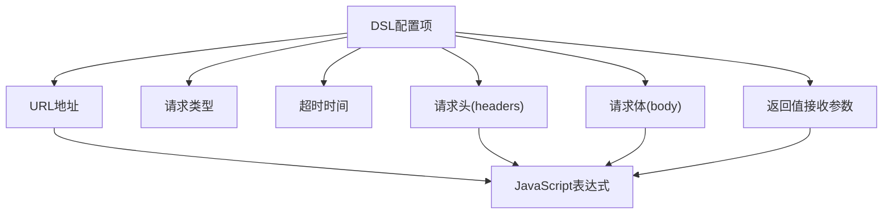
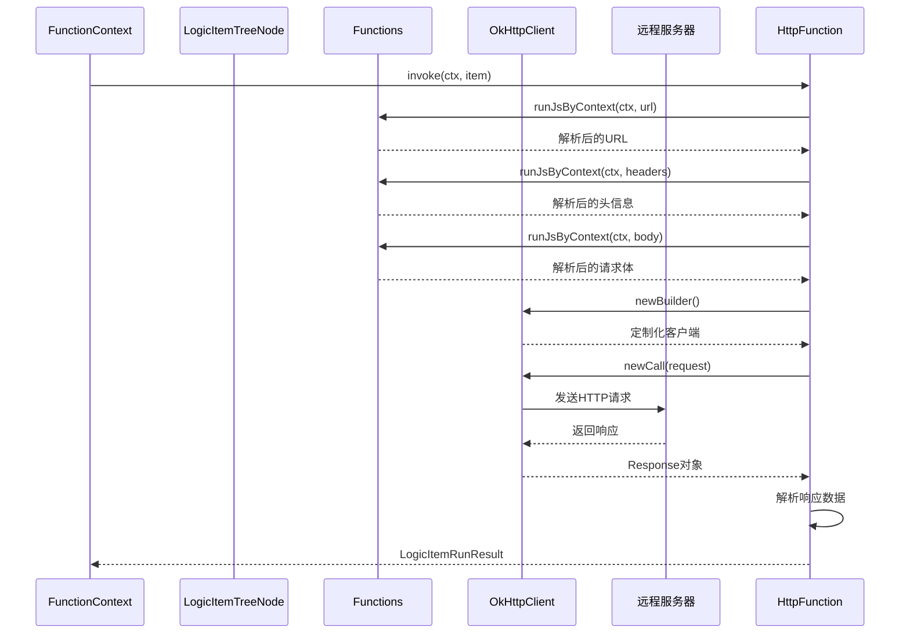
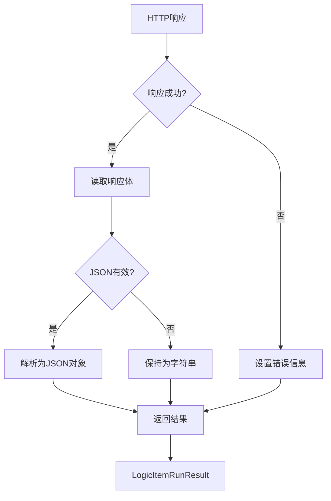
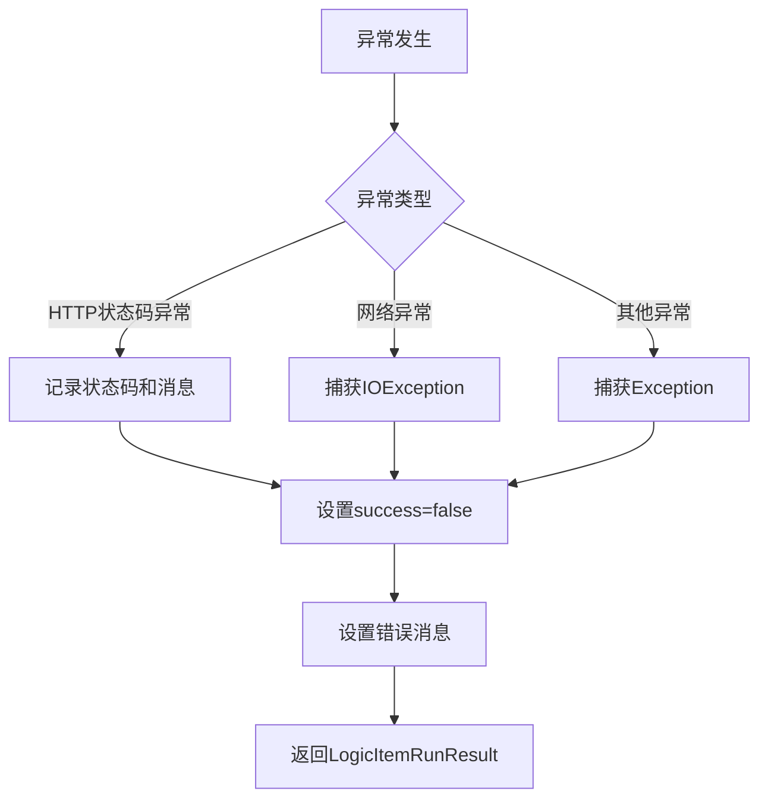

# HTTP服务集成

<cite>
**Referenced Files in This Document**   
- [HttpFunction.java](file://logic-runtime/src/main/java/com/aims/logic/runtime/runner/functions/impl/HttpFunction.java)
- [http.json](file://logic-ide/src/main/resources/public/setting/forms/http.json)
- [http.json](file://logic-ide/src/main/resources/public/setting/node-form/http.json)
- [FunctionContext.java](file://logic-runtime/src/main/java/com/aims/logic/runtime/runner/FunctionContext.java)
- [Functions.java](file://logic-runtime/src/main/java/com/aims/logic/runtime/runner/Functions.java)
- [ILogicItemFunctionRunner.java](file://logic-runtime/src/main/java/com/aims/logic/runtime/runner/functions/ILogicItemFunctionRunner.java)
- [LogicItemRunResult.java](file://logic-runtime/src/main/java/com/aims/logic/runtime/contract/dto/LogicItemRunResult.java)
- [LogicItemTreeNode.java](file://logic-runtime/src/main/java/com/aims/logic/runtime/contract/dsl/LogicItemTreeNode.java)
</cite>

## 目录
1. [简介](#简介)
2. [核心组件](#核心组件)
3. [DSL配置机制](#dsl配置机制)
4. [请求执行流程](#请求执行流程)
5. [响应处理机制](#响应处理机制)
6. [错误处理与重试](#错误处理与重试)
7. [性能优化策略](#性能优化策略)
8. [集成示例](#集成示例)

## 简介
本文档详细介绍了逻辑运行时系统中HTTP服务集成的实现机制。重点阐述了`HttpFunction`类如何通过DSL配置实现HTTP请求的灵活调用，包括URL、方法、头信息和请求体的配置方式。文档还涵盖了请求参数解析、超时控制、连接池管理以及OkHttpClient的定制化设置等关键特性。

## 核心组件

`HttpFunction`是系统中负责执行HTTP请求的核心组件，实现了`ILogicItemFunctionRunner`接口。该组件通过`FunctionContext`上下文对象获取运行时信息，并利用`Functions`工具类执行JavaScript表达式解析。请求的配置信息存储在`LogicItemTreeNode`对象中，执行结果通过`LogicItemRunResult`对象返回。

**Section sources**
- [HttpFunction.java](file://logic-runtime/src/main/java/com/aims/logic/runtime/runner/functions/impl/HttpFunction.java#L22-L117)
- [FunctionContext.java](file://logic-runtime/src/main/java/com/aims/logic/runtime/runner/FunctionContext.java#L14-L103)
- [Functions.java](file://logic-runtime/src/main/java/com/aims/logic/runtime/runner/Functions.java#L12-L51)

## DSL配置机制

HTTP请求的配置通过DSL（领域特定语言）实现，支持在运行时动态解析。配置项包括URL、HTTP方法、请求头、请求体和超时时间等。

### 配置项说明


**Diagram sources**
- [http.json](file://logic-ide/src/main/resources/public/setting/node-form/http.json)
- [HttpFunction.java](file://logic-runtime/src/main/java/com/aims/logic/runtime/runner/functions/impl/HttpFunction.java#L28-L53)

#### URL配置
URL配置支持相对路径和绝对路径。相对路径会自动拼接运行时基础URL。配置值为JavaScript表达式，通过`FunctionContext`上下文进行解析。

#### 请求方法
支持POST、GET、PUT、DELETE等HTTP方法，默认为POST。方法类型在运行时通过`itemDsl.getMethod()`获取。

#### 请求头
请求头配置为JavaScript表达式，返回一个包含键值对的对象。系统会自动添加`content-type`头，默认值为`application/json`。

#### 请求体
请求体配置为JavaScript表达式，返回一个对象。系统会自动将其序列化为JSON字符串。

#### 超时配置
超时时间以毫秒为单位，默认值为5000ms。超时设置应用于连接、读取和写入操作。

**Section sources**
- [http.json](file://logic-ide/src/main/resources/public/setting/forms/http.json#L0-L85)
- [LogicItemTreeNode.java](file://logic-runtime/src/main/java/com/aims/logic/runtime/contract/dsl/LogicItemTreeNode.java#L0-L175)

## 请求执行流程

HTTP请求的执行流程包括参数解析、客户端配置、请求构建和执行等步骤。



**Diagram sources**
- [HttpFunction.java](file://logic-runtime/src/main/java/com/aims/logic/runtime/runner/functions/impl/HttpFunction.java#L28-L79)
- [FunctionContext.java](file://logic-runtime/src/main/java/com/aims/logic/runtime/runner/FunctionContext.java#L14-L103)

### 参数解析流程
请求参数通过`FunctionContext`进行JavaScript表达式解析。系统调用`Functions.runJsByContext()`方法，将上下文和脚本作为参数，执行并返回解析结果。

### 客户端定制化
系统使用OkHttpClient.Builder创建定制化的HTTP客户端，根据配置的超时时间设置连接、读取和写入超时。

### 请求构建
根据HTTP方法类型构建请求。GET请求使用`.get()`方法，其他方法使用`.method()`方法，并将JSON格式的请求体封装为`RequestBody`。

**Section sources**
- [HttpFunction.java](file://logic-runtime/src/main/java/com/aims/logic/runtime/runner/functions/impl/HttpFunction.java#L28-L79)
- [Functions.java](file://logic-runtime/src/main/java/com/aims/logic/runtime/runner/Functions.java#L22-L33)

## 响应处理机制

系统对HTTP响应进行自动解析和处理，支持JSON数据和原始字符串两种格式。



**Diagram sources**
- [HttpFunction.java](file://logic-runtime/src/main/java/com/aims/logic/runtime/runner/functions/impl/HttpFunction.java#L79-L117)
- [LogicItemRunResult.java](file://logic-runtime/src/main/java/com/aims/logic/runtime/contract/dto/LogicItemRunResult.java#L0-L48)

当响应成功时，系统读取响应体并判断是否为有效的JSON格式。如果是，则解析为JSON对象；否则，保持为原始字符串。响应数据存储在`LogicItemRunResult`对象的`data`字段中。

**Section sources**
- [HttpFunction.java](file://logic-runtime/src/main/java/com/aims/logic/runtime/runner/functions/impl/HttpFunction.java#L79-L117)
- [LogicItemRunResult.java](file://logic-runtime/src/main/java/com/aims/logic/runtime/contract/dto/LogicItemRunResult.java#L0-L48)

## 错误处理与重试

系统实现了完善的错误处理机制，能够捕获和处理各种异常情况。

### 错误类型
- **HTTP状态码异常**：当响应状态码表示请求失败时，系统会记录错误信息
- **网络异常**：捕获IOException等网络相关异常
- **解析异常**：处理JavaScript表达式解析失败的情况

### 错误处理流程


系统在捕获到异常后，会设置`LogicItemRunResult`对象的`success`字段为`false`，并记录详细的错误消息。错误消息包含逻辑ID、业务ID和异常信息，便于问题排查。

**Section sources**
- [HttpFunction.java](file://logic-runtime/src/main/java/com/aims/logic/runtime/runner/functions/impl/HttpFunction.java#L79-L117)
- [LogicItemRunResult.java](file://logic-runtime/src/main/java/com/aims/logic/runtime/contract/dto/LogicItemRunResult.java#L0-L48)

## 性能优化策略

系统通过多种方式优化HTTP请求的性能。

### 连接复用
系统使用OkHttpClient的连接池机制，实现TCP连接的复用，减少连接建立的开销。

### 批量请求优化
虽然当前实现为单个请求处理，但可以通过异步模式实现批量请求的并发执行。

### 同步与异步模式对比
| 特性 | 同步模式 | 异步模式 |
|------|---------|---------|
| 执行方式 | 阻塞等待 | 非阻塞执行 |
| 响应处理 | 立即获取结果 | 需要回调或轮询 |
| 资源占用 | 较高 | 较低 |
| 适用场景 | 需要立即结果的场景 | 高并发、低延迟要求的场景 |

**Section sources**
- [HttpFunction.java](file://logic-runtime/src/main/java/com/aims/logic/runtime/runner/functions/impl/HttpFunction.java#L28-L117)
- [LogicItemTreeNode.java](file://logic-runtime/src/main/java/com/aims/logic/runtime/contract/dsl/LogicItemTreeNode.java#L0-L175)

## 集成示例

以下示例展示了如何在逻辑流程中集成外部RESTful API。

### GET请求示例
配置URL为`https://api.example.com/users/${_par.userId}`，方法为GET，无需请求体。

### POST请求示例
配置URL为`https://api.example.com/orders`，方法为POST，请求体为：
```javascript
{
    userId: _par.userId,
    items: _var.cartItems,
    total: _var.totalAmount
}
```

### 错误处理示例
在调用外部API后，检查`LogicItemRunResult`的`success`字段，根据结果执行不同的业务逻辑分支。

**Section sources**
- [HttpFunction.java](file://logic-runtime/src/main/java/com/aims/logic/runtime/runner/functions/impl/HttpFunction.java#L28-L117)
- [http.json](file://logic-ide/src/main/resources/public/setting/forms/http.json#L0-L85)