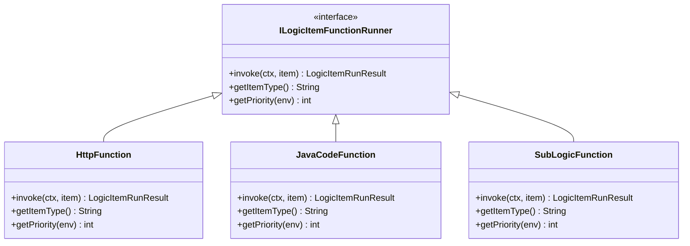
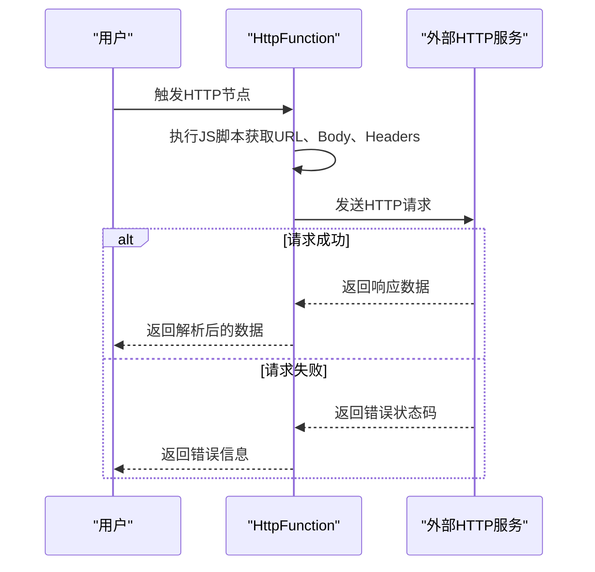
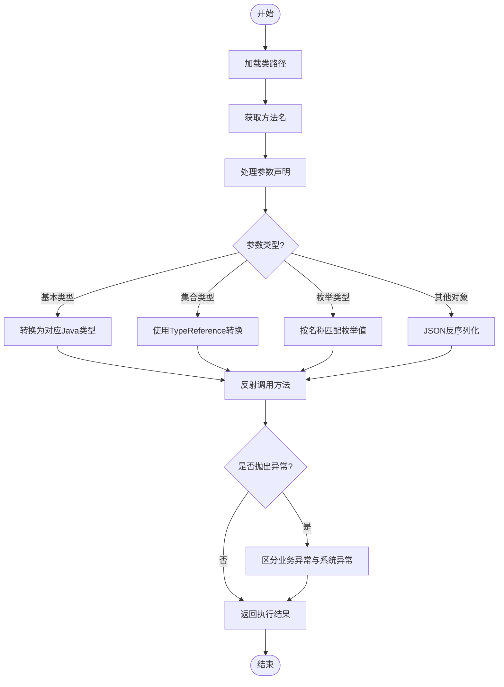
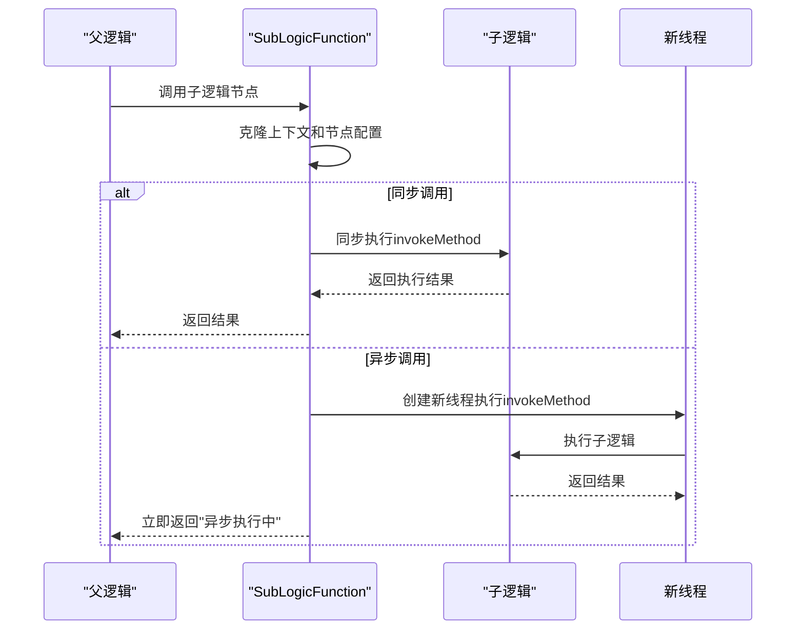

# 集成指南

<cite>
**本文档中引用的文件**  
- [HttpFunction.java](file://logic-runtime/src/main/java/com/aims/logic/runtime/runner/functions/impl/HttpFunction.java)
- [JavaCodeFunction.java](file://logic-runtime/src/main/java/com/aims/logic/runtime/runner/functions/impl/JavaCodeFunction.java)
- [SubLogicFunction.java](file://logic-sdk/src/main/java/com/aims/logic/sdk/functions/SubLogicFunction.java)
- [ILogicItemFunctionRunner.java](file://logic-runtime/src/main/java/com/aims/logic/runtime/runner/functions/ILogicItemFunctionRunner.java)
- [FunctionContext.java](file://logic-runtime/src/main/java/com/aims/logic/runtime/runner/FunctionContext.java)
- [LogicItemTreeNode.java](file://logic-runtime/src/main/java/com/aims/logic/runtime/contract/dsl/LogicItemTreeNode.java)
- [LogicRunnerService.java](file://logic-runtime/src/main/java/com/aims/logic/runtime/service/LogicRunnerService.java)
- [http.json](file://logic-ide/src/main/resources/public/setting/forms/http.json)
- [java.json](file://logic-ide/src/main/resources/public/setting/forms/java.json)
- [sub-logic.json](file://logic-ide/src/main/resources/public/setting/forms/sub-logic.json)
</cite>

## 目录
1. [简介](#简介)
2. [项目结构](#项目结构)
3. [核心集成机制](#核心集成机制)
4. [HTTP服务集成](#http服务集成)
5. [Java服务集成](#java服务集成)
6. [子逻辑编排集成](#子逻辑编排集成)
7. [中间件集成示例](#中间件集成示例)
8. [安全与性能实践](#安全与性能实践)
9. [结论](#结论)

## 简介
本集成指南旨在为开发者提供一个端到端的解决方案，用于将logic-solution系统与其他外部系统进行集成。文档详细阐述了通过HttpFunction调用外部HTTP服务、通过JavaCodeFunction集成内部Java服务以及通过SubLogicFunction实现复合业务流程编排的核心机制。同时，文档还涵盖了与数据库、缓存、消息队列等常见中间件的集成方法，并提供了安全认证、数据格式转换和性能调优的最佳实践建议。

## 项目结构
logic-solution项目由多个模块组成，主要包括`logic-ide`、`logic-runtime`、`logic-sdk`和`test-suite`。其中，`logic-runtime`模块是运行时核心，包含了所有功能函数的实现；`logic-sdk`提供了开发工具包，支持子逻辑调用等高级功能；`logic-ide`则提供了用户界面和配置管理。

**Diagram sources**
- [logic-runtime](file://logic-runtime)
- [logic-sdk](file://logic-sdk)
- [logic-ide](file://logic-ide)

## 核心集成机制
系统集成的核心在于`ILogicItemFunctionRunner`接口的实现。该接口定义了所有可执行节点的行为规范，包括`invoke`方法用于执行逻辑、`getItemType`用于标识节点类型以及`getPriority`用于确定加载优先级。通过实现此接口，可以扩展系统以支持各种类型的集成。

**Diagram sources**
- [ILogicItemFunctionRunner.java](file://logic-runtime/src/main/java/com/aims/logic/runtime/runner/functions/ILogicItemFunctionRunner.java#L8-L25)

**Section sources**
- [ILogicItemFunctionRunner.java](file://logic-runtime/src/main/java/com/aims/logic/runtime/runner/functions/ILogicItemFunctionRunner.java#L8-L25)

## HTTP服务集成
通过`HttpFunction`类实现外部HTTP服务的调用。该功能支持配置请求URL、方法、超时时间和自定义请求头，并能处理JSON格式的请求体和响应。

### 请求配置
在配置界面中，可以通过JavaScript表达式动态生成URL、请求体和请求头。例如，`url`字段支持返回完整URL字符串的JS代码块。

### 超时设置
超时时间（timeout）以毫秒为单位进行配置，默认值为5000ms。该值会同时应用于连接、读取和写入操作。

### 错误处理
系统会捕获所有网络异常和HTTP非成功状态码（非2xx），并记录详细的错误日志。对于IO异常，会返回包含具体错误信息的结果对象。

**Diagram sources**
- [HttpFunction.java](file://logic-runtime/src/main/java/com/aims/logic/runtime/runner/functions/impl/HttpFunction.java#L22-L117)
- [http.json](file://logic-ide/src/main/resources/public/setting/forms/http.json)

**Section sources**
- [HttpFunction.java](file://logic-runtime/src/main/java/com/aims/logic/runtime/runner/functions/impl/HttpFunction.java#L22-L117)
- [http.json](file://logic-ide/src/main/resources/public/setting/forms/http.json)

## Java服务集成
`JavaCodeFunction`类负责集成内部Java服务，通过反射机制调用指定类的方法，并处理复杂的参数类型转换。

### 类加载
使用`ClassLoaderUtils.loadClass`方法根据提供的类路径加载目标类。该机制支持从当前线程上下文类加载器或系统类加载器中查找类。

### 方法反射调用
通过`findMethod`方法查找匹配的方法签名，并使用`Method.invoke`执行反射调用。调用时会从Spring容器中获取目标类的Bean实例。

### 参数类型转换
系统支持多种参数类型，包括基本类型、集合类型和泛型。对于复杂类型，会使用`JSONObject`和`TypeReference`进行反序列化转换。

**Diagram sources**
- [JavaCodeFunction.java](file://logic-runtime/src/main/java/com/aims/logic/runtime/runner/functions/impl/JavaCodeFunction.java#L21-L180)
- [java.json](file://logic-ide/src/main/resources/public/setting/forms/java.json)

**Section sources**
- [JavaCodeFunction.java](file://logic-runtime/src/main/java/com/aims/logic/runtime/runner/functions/impl/JavaCodeFunction.java#L21-L180)
- [java.json](file://logic-ide/src/main/resources/public/setting/forms/java.json)

## 子逻辑编排集成
`SubLogicFunction`用于在复合业务流程中调用子逻辑，实现业务逻辑的复用和编排。

### 应用模式
支持同步和异步两种调用模式。同步调用会等待子逻辑执行完成并返回结果；异步调用则立即返回"异步执行中"状态，子逻辑在后台线程中执行。

### 上下文传递
父逻辑的上下文（`FunctionContext`）会被克隆并传递给子逻辑，确保数据隔离。子逻辑的执行结果会更新父逻辑的全局变量（`_global`）。

### 事务传播
支持多种事务传播模式，包括"加入或开启"、"新事务"和"不传递事务"，允许灵活控制事务边界。

**Diagram sources**
- [SubLogicFunction.java](file://logic-sdk/src/main/java/com/aims/logic/sdk/functions/SubLogicFunction.java#L17-L132)
- [sub-logic.json](file://logic-ide/src/main/resources/public/setting/forms/sub-logic.json)

**Section sources**
- [SubLogicFunction.java](file://logic-sdk/src/main/java/com/aims/logic/sdk/functions/SubLogicFunction.java#L17-L132)
- [sub-logic.json](file://logic-ide/src/main/resources/public/setting/forms/sub-logic.json)

## 中间件集成示例
虽然具体实现未在当前代码中直接展示，但基于现有架构，可以轻松集成数据库、缓存和消息队列等中间件。

### 数据库集成
可通过自定义`ILogicItemFunctionRunner`实现，封装JDBC或ORM框架操作，支持SQL执行和结果映射。

### 缓存集成
利用`CaffeineCacheConfig`配置的本地缓存，或通过扩展支持Redis等分布式缓存，实现数据的快速读取和写入。

### 消息队列集成
可创建专门的消息发送和接收节点，支持与Kafka、RabbitMQ等消息中间件的对接，实现异步通信和解耦。

## 安全与性能实践
### 安全认证
建议在HTTP调用中集成OAuth2、JWT等认证机制，通过请求头传递认证信息。对于内部Java调用，可利用Spring Security进行权限控制。

### 数据格式转换
统一使用JSON作为数据交换格式，利用`JsonUtil`工具类进行高效的数据序列化和反序列化。对于复杂类型，确保提供完整的类型声明。

### 性能调优
- **连接池**：为HTTP客户端配置合理的连接池大小和超时时间。
- **缓存**：对频繁访问且不常变更的数据使用本地或分布式缓存。
- **异步处理**：对于耗时操作，优先考虑使用异步调用模式，避免阻塞主线程。
- **批处理**：对于大量数据操作，采用批处理方式减少网络往返次数。

## 结论
logic-solution提供了一套完整且灵活的系统集成方案。通过`HttpFunction`、`JavaCodeFunction`和`SubLogicFunction`三大核心组件，开发者可以轻松实现与外部服务、内部系统和复杂业务流程的集成。结合合理的安全认证和性能优化策略，能够构建出高效、稳定的企业级应用集成解决方案。