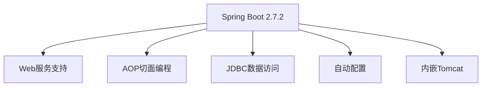
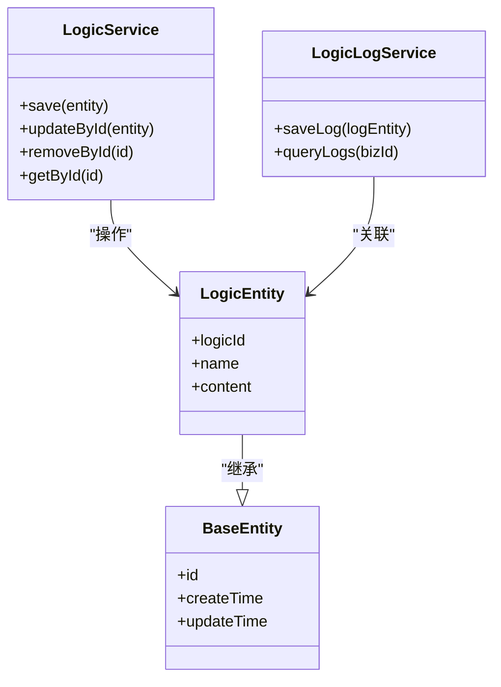
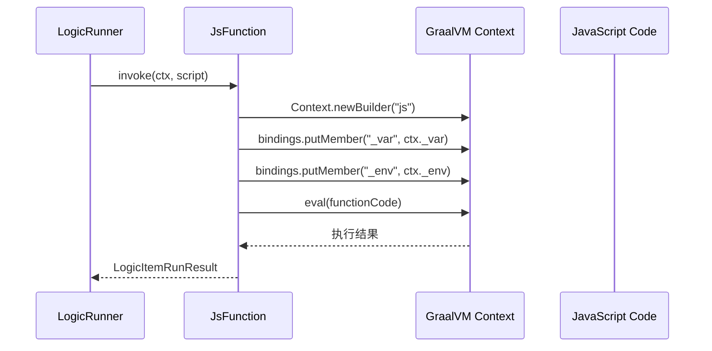
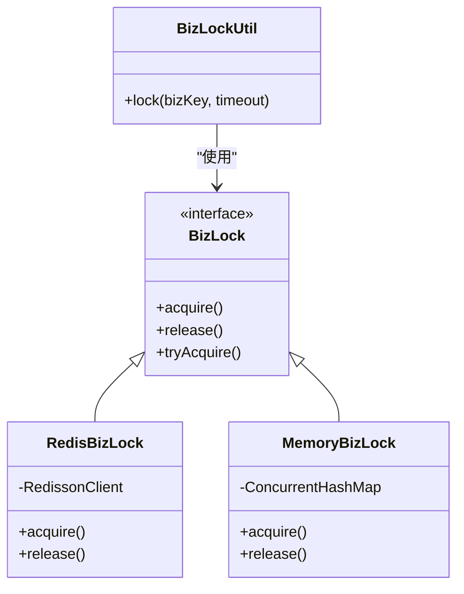
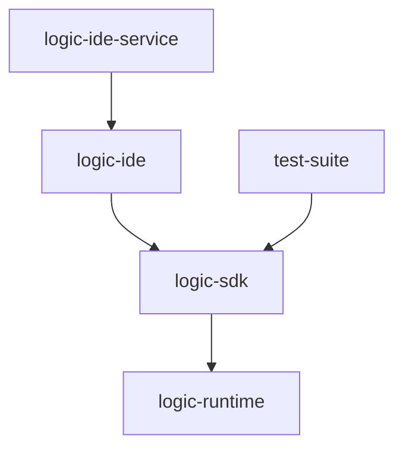

# 技术栈与依赖

<cite>
**本文档引用的文件**  
- [logic-ide/pom.xml](file://logic-ide/pom.xml)
- [logic-runtime/pom.xml](file://logic-runtime/pom.xml)
- [logic-sdk/pom.xml](file://logic-sdk/pom.xml)
- [pom.xml](file://pom.xml)
- [GraalvmEngineConfig.java](file://logic-runtime/src/main/java/com/aims/logic/runtime/configuration/GraalvmEngineConfig.java)
- [JsFunction.java](file://logic-runtime/src/main/java/com/aims/logic/runtime/runner/functions/impl/JsFunction.java)
- [CaffeineCacheConfig.java](file://logic-runtime/src/main/java/com/aims/logic/runtime/configuration/CaffeineCacheConfig.java)
</cite>

## 目录
1. [技术栈概览](#技术栈概览)
2. [核心框架：Spring Boot 2.7.2](#核心框架spring-boot-272)
3. [数据持久化：MyBatis-Plus 与 logic-sdk](#数据持久化mybatis-plus-与-logic-sdk)
4. [高性能脚本执行：GraalVM JS 引擎](#高性能脚本执行graalvm-js-引擎)
5. [缓存与分布式锁：Caffeine 与 Redis](#缓存与分布式锁caffeine-与-redis)
6. [模块依赖关系分析](#模块依赖关系分析)
7. [外部依赖管理策略](#外部依赖管理策略)
8. [技术选型合理性分析](#技术选型合理性分析)

## 技术栈概览

本项目构建于现代化Java技术栈之上，采用Spring Boot作为核心框架，结合GraalVM实现高性能JavaScript节点执行，利用Caffeine与Redis实现多级缓存和分布式锁机制。系统采用模块化设计，包含`logic-ide`、`logic-runtime`、`logic-sdk`等核心模块，支持高并发、可扩展的逻辑执行环境。

**Section sources**  
- [pom.xml](file://pom.xml#L1-L120)
- [logic-ide/pom.xml](file://logic-ide/pom.xml#L1-L104)
- [logic-runtime/pom.xml](file://logic-runtime/pom.xml#L1-L66)
- [logic-sdk/pom.xml](file://logic-sdk/pom.xml#L1-L85)

## 核心框架：Spring Boot 2.7.2

Spring Boot 2.7.2作为本项目的核心框架，提供了自动配置、起步依赖、内嵌服务器等关键能力，极大简化了微服务的开发与部署。项目通过`spring-boot-starter-web`、`spring-boot-starter-aop`等模块实现Web服务与切面编程，确保系统具备良好的可维护性与扩展性。

在`pom.xml`中，`spring-boot-dependencies`被声明为依赖管理，统一管理所有Spring Boot相关组件的版本，确保版本一致性。

**Diagram sources**  
- [pom.xml](file://pom.xml#L50-L55)
- [logic-ide/pom.xml](file://logic-ide/pom.xml#L15-L20)
- [logic-sdk/pom.xml](file://logic-sdk/pom.xml#L25-L35)

**Section sources**  
- [pom.xml](file://pom.xml#L50-L55)
- [logic-ide/pom.xml](file://logic-ide/pom.xml#L15-L20)
- [logic-sdk/pom.xml](file://logic-sdk/pom.xml#L25-L35)

## 数据持久化：MyBatis-Plus 与 logic-sdk

尽管项目未直接引入MyBatis-Plus依赖，但`logic-sdk`模块通过集成`spring-boot-starter-jdbc`与自定义注解（如`@TableName`、`@TableId`），实现了类似MyBatis-Plus的简化数据访问能力。`logic-sdk`作为数据访问层，封装了`LogicService`、`LogicLogService`等核心接口，提供实体管理、日志记录、事务控制等功能。

`logic-sdk`被`logic-ide`和`test-suite`等模块引用，形成统一的数据访问标准。

**Diagram sources**  
- [logic-sdk/src/main/java/com/aims/logic/sdk/service/LogicService.java](file://logic-sdk/src/main/java/com/aims/logic/sdk/service/LogicService.java)
- [logic-sdk/src/main/java/com/aims/logic/sdk/entity/LogicEntity.java](file://logic-sdk/src/main/java/com/aims/logic/sdk/entity/LogicEntity.java)
- [logic-sdk/src/main/java/com/aims/logic/sdk/entity/BaseEntity.java](file://logic-sdk/src/main/java/com/aims/logic/sdk/entity/BaseEntity.java)

**Section sources**  
- [logic-sdk/pom.xml](file://logic-sdk/pom.xml#L30-L35)
- [logic-sdk/src/main/java/com/aims/logic/sdk/annotation/TableName.java](file://logic-sdk/src/main/java/com/aims/logic/sdk/annotation/TableName.java)
- [logic-sdk/src/main/java/com/aims/logic/sdk/service/impl/LogicServiceImpl.java](file://logic-sdk/src/main/java/com/aims/logic/sdk/service/impl/LogicServiceImpl.java)

## 高性能脚本执行：GraalVM JS 引擎

为实现JavaScript节点的高性能执行，项目采用GraalVM JS引擎替代传统的Nashorn引擎。`logic-runtime`模块引入`org.graalvm.js:js`依赖，并通过`GraalvmEngineConfig`配置共享的`Engine`实例，提升脚本执行效率。

`JsFunction`类作为JavaScript节点的执行器，利用`Context.newBuilder("js")`创建隔离的执行环境，通过`bindings.putMember`将上下文变量注入JS运行时，并使用`context.eval`执行脚本代码，确保安全与性能。

**Diagram sources**  
- [GraalvmEngineConfig.java](file://logic-runtime/src/main/java/com/aims/logic/runtime/configuration/GraalvmEngineConfig.java#L1-L15)
- [JsFunction.java](file://logic-runtime/src/main/java/com/aims/logic/runtime/runner/functions/impl/JsFunction.java#L1-L147)

**Section sources**  
- [logic-runtime/pom.xml](file://logic-runtime/pom.xml#L20-L25)
- [GraalvmEngineConfig.java](file://logic-runtime/src/main/java/com/aims/logic/runtime/configuration/GraalvmEngineConfig.java#L1-L15)
- [JsFunction.java](file://logic-runtime/src/main/java/com/aims/logic/runtime/runner/functions/impl/JsFunction.java#L1-L147)

## 缓存与分布式锁：Caffeine 与 Redis

项目采用Caffeine作为本地缓存，通过`CaffeineCacheConfig`配置缓存策略，提升高频数据访问性能。同时，利用Redisson实现分布式锁，支持跨节点的业务锁控制。

`logic-sdk`中`RedisBizLock`与`MemoryBizLock`实现`BizLock`接口，根据部署环境自动选择锁实现策略，确保在单机与集群环境下均能正确控制并发。

**Diagram sources**  
- [logic-sdk/src/main/java/com/aims/logic/sdk/util/lock/RedisBizLock.java](file://logic-sdk/src/main/java/com/aims/logic/sdk/util/lock/RedisBizLock.java)
- [logic-sdk/src/main/java/com/aims/logic/sdk/util/lock/MemoryBizLock.java](file://logic-sdk/src/main/java/com/aims/logic/sdk/util/lock/MemoryBizLock.java)
- [logic-sdk/src/main/java/com/aims/logic/sdk/util/lock/BizLock.java](file://logic-sdk/src/main/java/com/aims/logic/sdk/util/lock/BizLock.java)

**Section sources**  
- [logic-runtime/pom.xml](file://logic-runtime/pom.xml#L35-L40)
- [logic-sdk/pom.xml](file://logic-sdk/pom.xml#L40-L45)
- [logic-sdk/src/main/java/com/aims/logic/sdk/util/lock/](file://logic-sdk/src/main/java/com/aims/logic/sdk/util/lock/)

## 模块依赖关系分析

项目采用Maven多模块结构，模块间依赖清晰：
- `logic-ide` 依赖 `logic-sdk`，用于调用逻辑配置与日志服务
- `logic-sdk` 依赖 `logic-runtime`，复用运行时核心功能
- `logic-runtime` 无内部依赖，作为最底层执行引擎

该设计确保了高内聚、低耦合，支持独立部署与扩展。

**Diagram sources**  
- [pom.xml](file://pom.xml#L10-L15)
- [logic-ide/pom.xml](file://logic-ide/pom.xml#L25-L30)
- [logic-sdk/pom.xml](file://logic-sdk/pom.xml#L20-L25)

**Section sources**  
- [pom.xml](file://pom.xml#L10-L15)
- [logic-ide/pom.xml](file://logic-ide/pom.xml#L25-L30)
- [logic-sdk/pom.xml](file://logic-sdk/pom.xml#L20-L25)

## 外部依赖管理策略

项目通过根`pom.xml`统一管理版本号，使用`${revision}`变量实现多模块版本同步。依赖管理集中在父POM中，子模块仅声明依赖项，不指定版本，确保一致性。

外部仓库配置包括公司私有Nexus与GraalVM官方仓库，支持私有组件与前沿技术的集成。

**Section sources**  
- [pom.xml](file://pom.xml#L20-L35)
- [logic-ide/pom.xml](file://logic-ide/pom.xml#L60-L75)
- [logic-sdk/pom.xml](file://logic-sdk/pom.xml#L60-L75)

## 技术选型合理性分析

本技术组合具备以下优势：
- **高并发支持**：Spring Boot + GraalVM 提供高性能执行能力
- **可扩展性**：模块化设计支持功能独立演进
- **执行效率**：GraalVM替代Nashorn，显著提升JS执行速度
- **缓存优化**：Caffeine + Redis 实现多级缓存，降低数据库压力
- **分布式协调**：Redisson提供可靠的分布式锁，保障数据一致性

该架构适用于需要动态逻辑编排、高并发执行、跨节点协调的复杂业务场景，具备良好的兼容性与扩展潜力。

**Section sources**  
- [pom.xml](file://pom.xml#L1-L120)
- [logic-runtime/pom.xml](file://logic-runtime/pom.xml#L1-L66)
- [GraalvmEngineConfig.java](file://logic-runtime/src/main/java/com/aims/logic/runtime/configuration/GraalvmEngineConfig.java#L1-L15)
- [JsFunction.java](file://logic-runtime/src/main/java/com/aims/logic/runtime/runner/functions/impl/JsFunction.java#L1-L147)