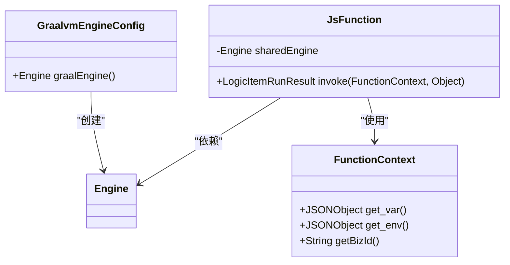
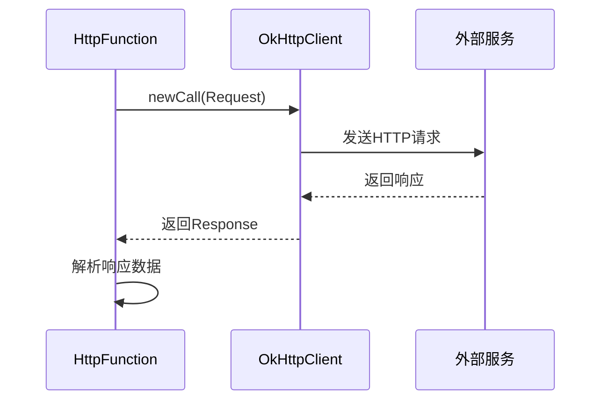
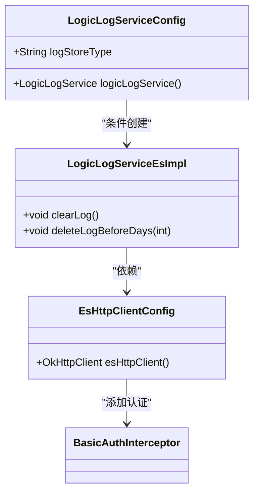
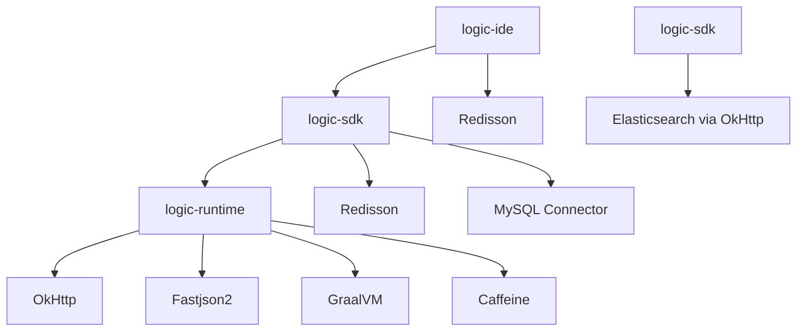

# 技术栈与依赖

<cite>
**本文档引用的文件**  
- [pom.xml](file://pom.xml)
- [logic-runtime/pom.xml](file://logic-runtime/pom.xml)
- [logic-sdk/pom.xml](file://logic-sdk/pom.xml)
- [logic-ide/pom.xml](file://logic-ide/pom.xml)
- [test-suite/pom.xml](file://test-suite/pom.xml)
- [logic-runtime/src/main/java/com/aims/logic/runtime/configuration/GraalvmEngineConfig.java](file://logic-runtime/src/main/java/com/aims/logic/runtime/configuration/GraalvmEngineConfig.java)
- [logic-runtime/src/main/java/com/aims/logic/runtime/runner/functions/impl/JsFunction.java](file://logic-runtime/src/main/java/com/aims/logic/runtime/runner/functions/impl/JsFunction.java)
- [logic-runtime/src/main/java/com/aims/logic/runtime/runner/functions/impl/HttpFunction.java](file://logic-runtime/src/main/java/com/aims/logic/runtime/runner/functions/impl/HttpFunction.java)
- [logic-runtime/src/main/java/com/aims/logic/runtime/util/JsonUtil.java](file://logic-runtime/src/main/java/com/aims/logic/runtime/util/JsonUtil.java)
- [logic-sdk/src/main/java/com/aims/logic/sdk/service/impl/es/LogicLogServiceEsImpl.java](file://logic-sdk/src/main/java/com/aims/logic/sdk/service/impl/es/LogicLogServiceEsImpl.java)
- [logic-sdk/src/main/java/com/aims/logic/sdk/config/LogicLogServiceConfig.java](file://logic-sdk/src/main/java/com/aims/logic/sdk/config/LogicLogServiceConfig.java)
- [logic-runtime/src/main/java/com/aims/logic/runtime/configuration/CaffeineCacheConfig.java](file://logic-runtime/src/main/java/com/aims/logic/runtime/configuration/CaffeineCacheConfig.java)
</cite>

## 目录
1. [引言](#引言)
2. [核心框架与技术选型](#核心框架与技术选型)
3. [模块依赖分析](#模块依赖分析)
4. [架构设计与权衡考量](#架构设计与权衡考量)
5. [Java 17语言特性使用](#java-17语言特性使用)
6. [依赖管理与版本兼容性](#依赖管理与版本兼容性)
7. [性能影响分析](#性能影响分析)
8. [安全考虑](#安全考虑)
9. [潜在升级路径](#潜在升级路径)
10. [结论](#结论)

## 引言
本技术栈文档旨在全面阐述logic-solution项目所依赖的核心技术与框架。文档详细分析了Spring Boot作为基础框架的作用、GraalVM在JavaScript执行中的关键角色、Fastjson2用于JSON处理、OkHttp用于HTTP请求、Caffeine用于缓存以及Elasticsearch用于日志存储的技术实现。通过对各模块pom.xml文件的分析，列出了主要依赖及其版本，并解释了选择这些技术的架构原因和权衡考虑。文档还为开发者提供了关于依赖管理、版本兼容性和潜在升级路径的指导，同时讨论了性能影响和安全考虑。

## 核心框架与技术选型

### Spring Boot基础框架
Spring Boot作为项目的统一基础框架，为logic-solution提供了自动配置、起步依赖和生产就绪功能。项目中多个模块（如logic-ide）依赖于Spring Boot 2.7.2版本，利用其Web和WebFlux模块构建RESTful API服务。Spring Boot的依赖管理机制确保了各模块间版本的一致性，简化了配置复杂度。

**Section sources**
- [pom.xml](file://pom.xml#L62-L96)
- [logic-ide/pom.xml](file://logic-ide/pom.xml#L45-L50)

### GraalVM JavaScript执行引擎
GraalVM被选为JavaScript执行的核心技术，替代了已废弃的Nashorn引擎。在logic-runtime模块中，通过`GraalvmEngineConfig`配置类创建共享的`Engine`实例，为JavaScript函数执行提供高性能的运行时环境。`JsFunction`类利用GraalVM的Polyglot API，在隔离的`Context`中执行脚本，确保线程安全和资源隔离。

**Diagram sources**
- [logic-runtime/src/main/java/com/aims/logic/runtime/configuration/GraalvmEngineConfig.java](file://logic-runtime/src/main/java/com/aims/logic/runtime/configuration/GraalvmEngineConfig.java#L0-L15)
- [logic-runtime/src/main/java/com/aims/logic/runtime/runner/functions/impl/JsFunction.java](file://logic-runtime/src/main/java/com/aims/logic/runtime/runner/functions/impl/JsFunction.java#L0-L147)

**Section sources**
- [logic-runtime/pom.xml](file://logic-runtime/pom.xml#L20-L24)
- [logic-runtime/src/main/java/com/aims/logic/runtime/configuration/GraalvmEngineConfig.java](file://logic-runtime/src/main/java/com/aims/logic/runtime/configuration/GraalvmEngineConfig.java#L0-L15)

### Fastjson2 JSON处理
Fastjson2作为JSON序列化和反序列化的首选库，在项目中被广泛使用。`JsonUtil`工具类封装了JSON合并和克隆功能，利用Fastjson2的高性能解析能力处理运行时数据。在`JsFunction`和`HttpFunction`中，Fastjson2用于将Java对象转换为JSON格式，以便在JavaScript上下文中安全传递。

**Section sources**
- [logic-runtime/pom.xml](file://logic-runtime/pom.xml#L15-L19)
- [logic-runtime/src/main/java/com/aims/logic/runtime/util/JsonUtil.java](file://logic-runtime/src/main/java/com/aims/logic/runtime/util/JsonUtil.java#L0-L78)

### OkHttp HTTP请求客户端
OkHttp被用作HTTP请求的底层客户端，主要在`HttpFunction`中实现对外部服务的调用。该实现支持动态URL、自定义头部和请求体，能够处理GET和POST等方法。通过`OkHttpClient`的构建器模式，可以灵活配置连接、读取和写入超时，确保网络请求的稳定性和可靠性。

**Diagram sources**
- [logic-runtime/src/main/java/com/aims/logic/runtime/runner/functions/impl/HttpFunction.java](file://logic-runtime/src/main/java/com/aims/logic/runtime/runner/functions/impl/HttpFunction.java#L0-L118)

**Section sources**
- [logic-runtime/pom.xml](file://logic-runtime/pom.xml#L10-L14)
- [logic-runtime/src/main/java/com/aims/logic/runtime/runner/functions/impl/HttpFunction.java](file://logic-runtime/src/main/java/com/aims/logic/runtime/runner/functions/impl/HttpFunction.java#L0-L118)

### Caffeine缓存机制
Caffeine被选为本地缓存解决方案，尽管其配置类`CaffeineCacheConfig`当前被注释，但依赖已明确引入。Caffeine提供了高性能的内存缓存，支持基于访问时间的过期策略和容量限制，可有效减少重复计算和数据库访问，提升系统响应速度。

**Section sources**
- [logic-runtime/pom.xml](file://logic-runtime/pom.xml#L35-L39)
- [logic-runtime/src/main/java/com/aims/logic/runtime/configuration/CaffeineCacheConfig.java](file://logic-runtime/src/main/java/com/aims/logic/runtime/configuration/CaffeineCacheConfig.java#L0-L21)

### Elasticsearch日志存储
Elasticsearch作为可选的日志存储后端，通过`LogicLogServiceEsImpl`实现。当配置`logic.log.store=es`时，系统将日志数据存储到Elasticsearch中。该实现使用OkHttp客户端直接与ES REST API交互，支持索引的创建、删除和按天删除历史日志，提供了灵活的日志管理能力。

**Diagram sources**
- [logic-sdk/src/main/java/com/aims/logic/sdk/config/LogicLogServiceConfig.java](file://logic-sdk/src/main/java/com/aims/logic/sdk/config/LogicLogServiceConfig.java#L0-L31)
- [logic-sdk/src/main/java/com/aims/logic/sdk/service/impl/es/LogicLogServiceEsImpl.java](file://logic-sdk/src/main/java/com/aims/logic/sdk/service/impl/es/LogicLogServiceEsImpl.java#L0-L242)

**Section sources**
- [logic-sdk/pom.xml](file://logic-sdk/pom.xml#L25-L30)
- [logic-sdk/src/main/java/com/aims/logic/sdk/config/LogicLogServiceConfig.java](file://logic-sdk/src/main/java/com/aims/logic/sdk/config/LogicLogServiceConfig.java#L0-L31)

## 模块依赖分析

### 核心依赖版本
通过对各模块pom.xml文件的分析，整理出以下核心依赖及其版本：

| 模块 | 依赖项 | 版本 |
|------|--------|------|
| 全局 | Java | 17 |
| 全局 | Spring Boot | 2.7.2 |
| logic-runtime | OkHttp | 4.10.0 |
| logic-runtime | Fastjson2 | 2.0.37 |
| logic-runtime | GraalVM JS | 22.3.5 |
| logic-runtime | Caffeine | 2.9.2 |
| logic-sdk | Redisson | 3.15.2 |
| logic-ide | Redisson | 3.23.5 |

### 依赖关系图

**Diagram sources**
- [pom.xml](file://pom.xml#L0-L120)
- [logic-runtime/pom.xml](file://logic-runtime/pom.xml#L0-L65)
- [logic-sdk/pom.xml](file://logic-sdk/pom.xml#L0-L84)
- [logic-ide/pom.xml](file://logic-ide/pom.xml#L0-L103)

## 架构设计与权衡考量

### 技术选型权衡
项目在技术选型上进行了多项关键权衡：
- **GraalVM vs Nashorn**：选择GraalVM是因为Nashorn已在JDK 15中被标记为废弃，GraalVM提供了更好的性能和长期支持。
- **OkHttp vs HttpClient**：选用OkHttp因其简洁的API、优秀的性能和对HTTP/2的支持，更适合微服务间的通信。
- **Elasticsearch可选存储**：通过配置`logic.log.store`实现日志存储的灵活性，允许在数据库和Elasticsearch之间切换，满足不同部署环境的需求。

### 分层架构
项目采用典型的分层架构：
- **logic-ide**：提供IDE功能和API接口
- **logic-sdk**：封装业务逻辑和数据访问
- **logic-runtime**：核心运行时，处理逻辑执行和脚本解释
- **test-suite**：集成测试套件

这种分层设计实现了关注点分离，提高了代码的可维护性和可测试性。

**Section sources**
- [pom.xml](file://pom.xml#L45-L53)
- [logic-runtime/pom.xml](file://logic-runtime/pom.xml#L0-L65)

## Java 17语言特性使用
项目明确指定使用Java 17，利用了以下现代Java特性：
- **语言特性**：虽然代码中未直接展示，但Java 17的密封类、模式匹配等特性为未来代码演进提供了基础。
- **性能改进**：Java 17包含多项JVM性能优化，如ZGC和Shenandoah垃圾收集器的改进，有助于提升应用性能。
- **安全性**：Java 17增强了加密算法和安全协议支持，提高了应用的安全性。

**Section sources**
- [pom.xml](file://pom.xml#L55-L57)
- [logic-runtime/pom.xml](file://logic-runtime/pom.xml#L7-L9)

## 依赖管理与版本兼容性
项目采用Maven的多模块结构和属性占位符`${revision}`进行统一版本管理。父POM定义了所有模块的版本策略，确保了依赖的一致性。Spring Boot 2.7.2版本与Java 17兼容，所有第三方库（如GraalVM 22.3.5）也经过验证，能够在Java 17环境下稳定运行。

**Section sources**
- [pom.xml](file://pom.xml#L54-L61)
- [logic-runtime/pom.xml](file://logic-runtime/pom.xml#L3-L6)

## 性能影响分析
各技术选型对性能的影响如下：
- **GraalVM**：提供接近原生代码的执行速度，显著优于解释型脚本引擎。
- **Fastjson2**：高性能JSON处理，减少序列化/反序列化开销。
- **Caffeine**：高效的内存缓存，降低数据库负载。
- **OkHttp**：连接池和响应缓存机制，提高网络请求效率。
- **Elasticsearch**：分布式搜索和分析能力，适合大规模日志查询。

**Section sources**
- [logic-runtime/src/main/java/com/aims/logic/runtime/runner/functions/impl/JsFunction.java](file://logic-runtime/src/main/java/com/aims/logic/runtime/runner/functions/impl/JsFunction.java#L0-L147)
- [logic-runtime/src/main/java/com/aims/logic/runtime/runner/functions/impl/HttpFunction.java](file://logic-runtime/src/main/java/com/aims/logic/runtime/runner/functions/impl/HttpFunction.java#L0-L118)

## 安全考虑
项目在安全方面采取了以下措施：
- **Elasticsearch认证**：通过`BasicAuthInterceptor`实现ES访问的HTTP Basic认证。
- **输入验证**：在脚本执行前进行必要的输入验证，防止恶意代码注入。
- **依赖安全**：使用公司内部镜像仓库，确保依赖包的来源可信。
- **配置安全**：敏感配置（如ES用户名密码）通过环境变量注入，避免硬编码。

**Section sources**
- [logic-sdk/src/main/java/com/aims/logic/sdk/service/impl/es/BasicAuthInterceptor.java](file://logic-sdk/src/main/java/com/aims/logic/sdk/service/impl/es/BasicAuthInterceptor.java#L0-L19)
- [logic-sdk/src/main/java/com/aims/logic/sdk/config/LogicLogServiceConfig.java](file://logic-sdk/src/main/java/com/aims/logic/sdk/config/LogicLogServiceConfig.java#L0-L31)

## 潜在升级路径
建议的升级路径包括：
- **Spring Boot升级**：从2.7.2升级到3.x版本，需注意Java版本要求提升至17+和包名变更。
- **GraalVM升级**：跟踪最新稳定版本，获取性能和安全更新。
- **Fastjson2升级**：保持最新版本以修复潜在的安全漏洞。
- **Elasticsearch客户端**：考虑使用官方Java客户端替代直接的HTTP调用，提高类型安全和易用性。

**Section sources**
- [pom.xml](file://pom.xml#L62-L96)
- [logic-runtime/pom.xml](file://logic-runtime/pom.xml#L10-L39)

## 结论
logic-solution项目构建了一个现代化、高性能的技术栈，通过Spring Boot提供基础框架，GraalVM实现灵活的脚本执行，Fastjson2和OkHttp处理数据序列化和网络通信，Caffeine优化本地缓存，Elasticsearch支持可扩展的日志存储。合理的依赖管理和架构设计确保了系统的稳定性、安全性和可维护性。未来应持续关注各组件的版本更新，及时进行安全补丁和性能优化。