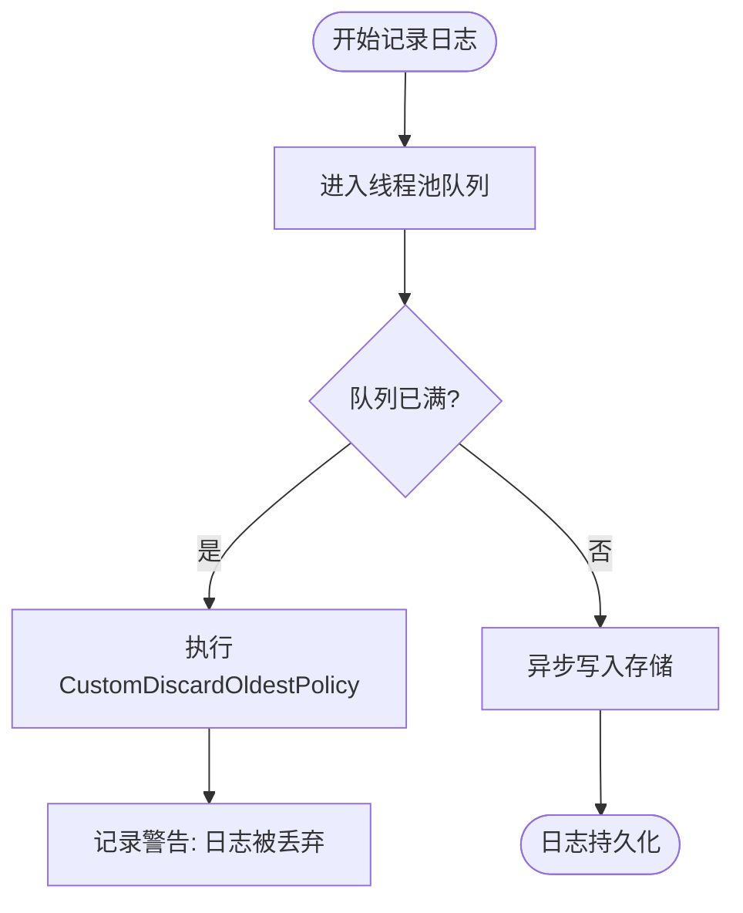
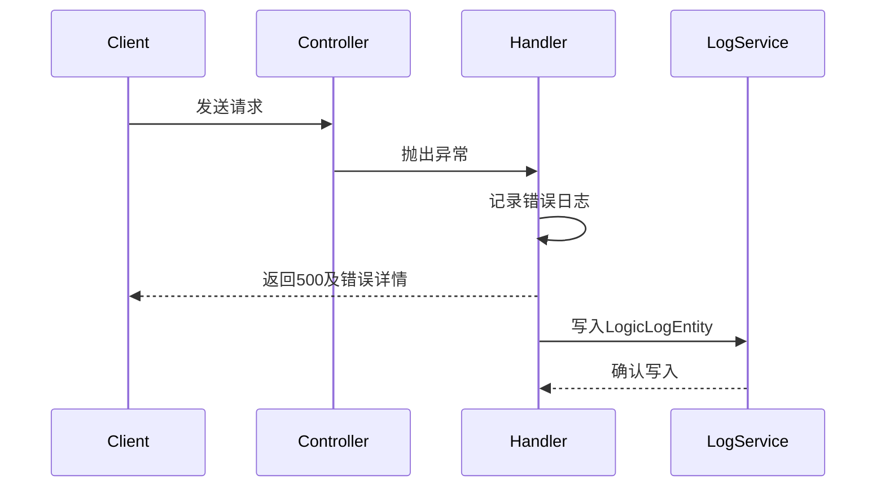
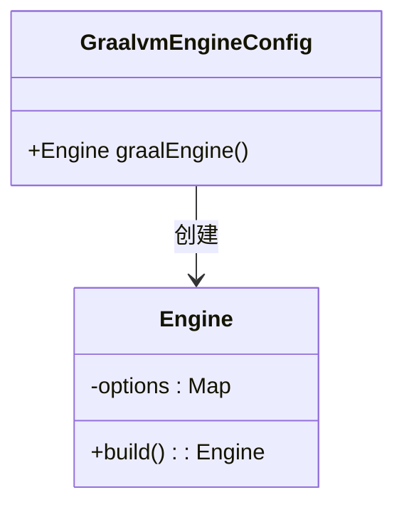

# 故障排除

<cite>
**本文档引用文件**  
- [ControllerExceptionHandler.java](file://logic-ide/src/main/java/com/aims/logic/ide/exception/ControllerExceptionHandler.java)
- [ControllerExceptionHandler.java](file://logic-ide-service/src/main/java/com/aims/logic/service/exception/ControllerExceptionHandler.java)
- [LogicLogEntity.java](file://logic-sdk/src/main/java/com/aims/logic/sdk/entity/LogicLogEntity.java)
- [GraalvmEngineConfig.java](file://logic-runtime/src/main/java/com/aims/logic/runtime/configuration/GraalvmEngineConfig.java)
- [CustomDiscardOldestPolicy.java](file://logic-runtime/src/main/java/com/aims/logic/runtime/custom/CustomDiscardOldestPolicy.java)
- [application.yaml](file://logic-ide-service/src/main/resources/application.yaml)
- [application.yaml](file://test-suite/src/main/resources/application.yaml)
</cite>

## 目录
1. [启动失败](#启动失败)
2. [流程执行异常](#流程执行异常)
3. [节点调用超时](#节点调用超时)
4. [日志丢失](#日志丢失)
5. [ES连接错误](#es连接错误)
6. [异常捕获与日志分析](#异常捕获与日志分析)
7. [GraalVM引擎与线程池状态检查](#graalvm引擎与线程池状态检查)
8. [关键日志关键字搜索建议](#关键日志关键字搜索建议)
9. [监控指标参考](#监控指标参考)

## 启动失败

系统启动失败可能由配置错误、依赖服务不可用或类路径问题引起。常见症状包括应用无法绑定端口、数据库连接失败、配置文件加载异常等。

**解决方案**：
- 检查 `application.yaml` 中的 `server.port` 是否被占用。
- 验证 `spring.datasource` 配置项中的数据库地址、用户名和密码是否正确。
- 确认 `logic.config-dir` 指定的配置目录存在且可读。
- 查看启动日志中是否有 `ClassNotFoundException` 或 `BeanCreationException`。

**Section sources**
- [application.yaml](file://logic-ide-service/src/main/resources/application.yaml#L1-L10)

## 流程执行异常

流程执行过程中抛出异常，通常表现为业务逻辑中断、返回500错误或流程卡死。

**根本原因**：
- 业务代码中抛出未捕获异常。
- 自定义异常类未在 `logic.biz-error-classes` 中注册。
- 数据结构不匹配导致序列化失败。

**解决方案**：
- 使用 `ControllerExceptionHandler` 统一捕获异常并输出详细堆栈。
- 确保所有业务异常类被正确配置在 `biz-error-classes` 中。
- 检查输入输出参数的 JSON 序列化兼容性。

**Section sources**
- [ControllerExceptionHandler.java](file://logic-ide-service/src/main/java/com/aims/logic/service/exception/ControllerExceptionHandler.java#L14-L30)

## 节点调用超时

节点调用超时通常发生在 HTTP、MQTT 或子逻辑调用场景中，表现为响应延迟或连接中断。

**根本原因**：
- 外部服务响应缓慢。
- 网络延迟或防火墙限制。
- GraalVM 脚本执行时间过长。

**解决方案**：
- 增加调用超时配置（如 RestTemplate 超时设置）。
- 优化脚本逻辑，避免复杂循环或阻塞操作。
- 启用异步执行模式以隔离耗时操作。

## 日志丢失

日志未写入数据库或 Elasticsearch，导致无法追踪执行链路。

**根本原因**：
- 日志线程池队列满，任务被丢弃。
- ES 连接失败且无本地缓存机制。
- `CustomDiscardOldestPolicy` 触发日志丢弃策略。

**解决方案**：
- 检查日志线程池配置，适当增大 `item-queue-size`。
- 确保 `logic.log.store` 配置正确，支持降级存储。
- 监控日志丢弃日志，关键词 `"日志被丢弃"`。

**Diagram sources**
- [CustomDiscardOldestPolicy.java](file://logic-runtime/src/main/java/com/aims/logic/runtime/custom/CustomDiscardOldestPolicy.java#L9-L33)

**Section sources**
- [CustomDiscardOldestPolicy.java](file://logic-runtime/src/main/java/com/aims/logic/runtime/custom/CustomDiscardOldestPolicy.java#L9-L33)

## ES连接错误

系统无法连接到 Elasticsearch，导致日志和实例数据无法查询。

**根本原因**：
- ES 主机地址配置错误。
- 网络不通或防火墙阻止。
- 认证信息缺失或过期。

**解决方案**：
- 检查 `application.yaml` 中 `logic.log.es.host` 配置。
- 使用 `curl` 或 Postman 测试 ES 连通性。
- 确认是否需要认证，并配置 `username` 和 `password`。

**Section sources**
- [application.yaml](file://test-suite/src/main/resources/application.yaml#L15-L18)

## 异常捕获与日志分析

通过 `ControllerExceptionHandler` 捕获全局异常，结合 `LogicLogEntity` 分析执行链路。

**异常定位步骤**：
1. 查看 HTTP 响应体中的 `error.detail` 字段获取堆栈。
2. 根据 `logicId` 和 `bizId` 查询 `LogicLogEntity` 获取上下文。
3. 分析 `itemLogs` 字段中的节点级日志。

**Diagram sources**
- [ControllerExceptionHandler.java](file://logic-ide-service/src/main/java/com/aims/logic/service/exception/ControllerExceptionHandler.java#L14-L30)
- [LogicLogEntity.java](file://logic-sdk/src/main/java/com/aims/logic/sdk/entity/LogicLogEntity.java#L12-L51)

**Section sources**
- [ControllerExceptionHandler.java](file://logic-ide-service/src/main/java/com/aims/logic/service/exception/ControllerExceptionHandler.java#L14-L30)
- [LogicLogEntity.java](file://logic-sdk/src/main/java/com/aims/logic/sdk/entity/LogicLogEntity.java#L12-L51)

## GraalVM引擎与线程池状态检查

GraalVM 引擎初始化失败或线程池饱和会影响脚本执行。

**检查项**：
- 确认 `GraalvmEngineConfig` 正确创建 `Engine` Bean。
- 检查 JVM 参数是否支持 GraalVM。
- 监控线程池活跃度和队列长度。

**Diagram sources**
- [GraalvmEngineConfig.java](file://logic-runtime/src/main/java/com/aims/logic/runtime/configuration/GraalvmEngineConfig.java#L6-L14)

**Section sources**
- [GraalvmEngineConfig.java](file://logic-runtime/src/main/java/com/aims/logic/runtime/configuration/GraalvmEngineConfig.java#L6-L14)

## 关键日志关键字搜索建议

为快速定位问题，建议在日志中搜索以下关键词：

| 关键词 | 含义 | 可能问题 |
|-------|------|--------|
| "服务错误:" | 全局异常处理器捕获异常 | 系统级错误 |
| "日志被丢弃" | 日志线程池溢出 | 性能瓶颈或配置不足 |
| "Task ... is rejected" | 线程池拒绝任务 | 线程池满或关闭 |
| "Connection refused" | 网络连接失败 | 服务未启动或网络不通 |
| "Failed to initialize Graal" | GraalVM 初始化失败 | 缺少依赖或配置错误 |

## 监控指标参考

建议监控以下关键指标以提前预警：

| 指标名称 | 采集方式 | 告警阈值 | 说明 |
|--------|--------|---------|------|
| 日志线程池队列使用率 | JMX 或 Micrometer | >80% | 高于阈值可能丢日志 |
| GraalVM 脚本执行时间 | AOP 拦截 | 平均 >5s | 表示脚本性能下降 |
| ES 请求失败率 | HTTP 客户端监控 | >5% | 表示日志存储异常 |
| 数据库连接池使用数 | HikariCP 指标 | >90% | 可能导致请求阻塞 |
| JVM 堆内存使用率 | GC 日志或 JMX | >85% | 存在内存溢出风险 |