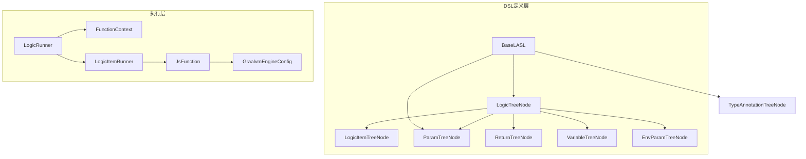
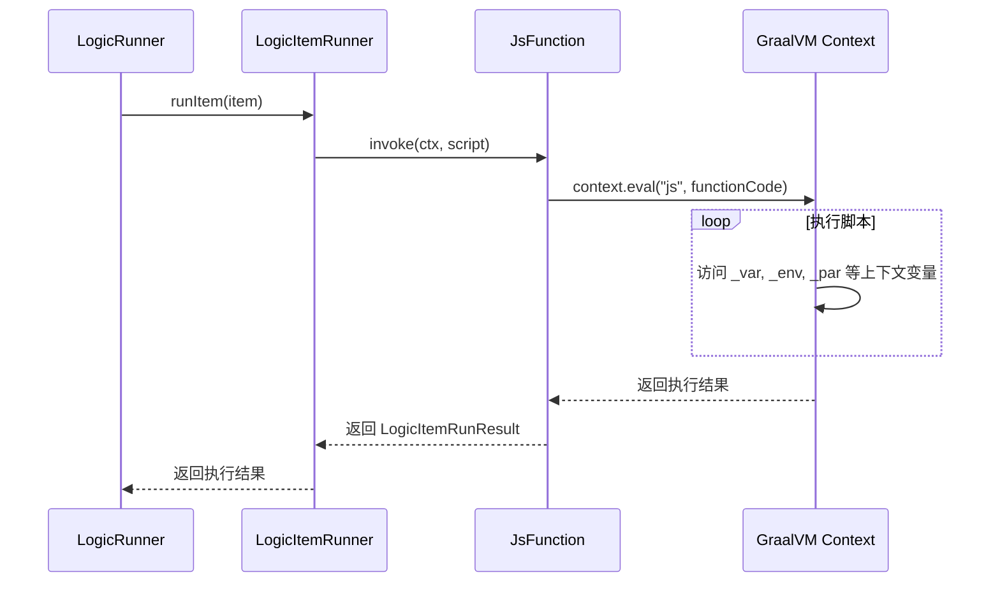
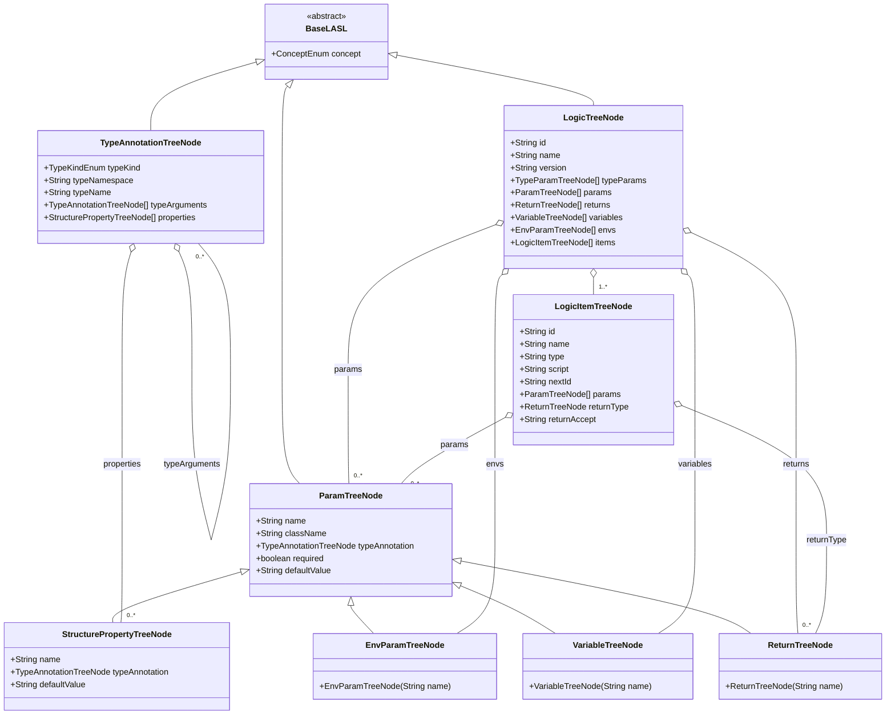
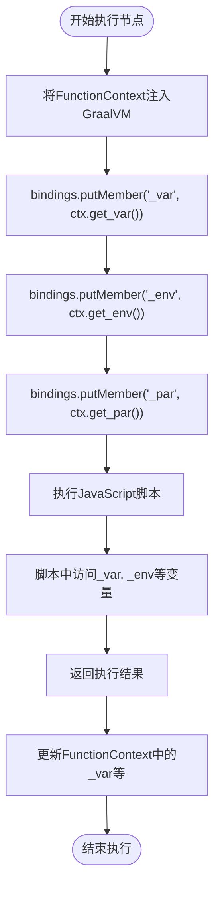

# DSL与内存结构

<cite>
**本文档引用的文件**  
- [LogicTreeNode.java](file://logic-runtime/src/main/java/com/aims/logic/runtime/contract/dsl/LogicTreeNode.java)
- [LogicItemTreeNode.java](file://logic-runtime/src/main/java/com/aims/logic/runtime/contract/dsl/LogicItemTreeNode.java)
- [ParamTreeNode.java](file://logic-runtime/src/main/java/com/aims/logic/runtime/contract/dsl/ParamTreeNode.java)
- [ReturnTreeNode.java](file://logic-runtime/src/main/java/com/aims/logic/runtime/contract/dsl/ReturnTreeNode.java)
- [VariableTreeNode.java](file://logic-runtime/src/main/java/com/aims/logic/runtime/contract/dsl/VariableTreeNode.java)
- [EnvParamTreeNode.java](file://logic-runtime/src/main/java/com/aims/logic/runtime/contract/dsl/EnvParamTreeNode.java)
- [BaseLASL.java](file://logic-runtime/src/main/java/com/aims/logic/runtime/contract/dsl/basic/BaseLASL.java)
- [TypeAnnotationTreeNode.java](file://logic-runtime/src/main/java/com/aims/logic/runtime/contract/dsl/basic/TypeAnnotationTreeNode.java)
- [StructurePropertyTreeNode.java](file://logic-runtime/src/main/java/com/aims/logic/runtime/contract/dsl/basic/StructurePropertyTreeNode.java)
- [FunctionContext.java](file://logic-runtime/src/main/java/com/aims/logic/runtime/runner/FunctionContext.java)
- [JsFunction.java](file://logic-runtime/src/main/java/com/aims/logic/runtime/runner/functions/impl/JsFunction.java)
- [GraalvmEngineConfig.java](file://logic-runtime/src/main/java/com/aims/logic/runtime/configuration/GraalvmEngineConfig.java)
- [LogicRunner.java](file://logic-runtime/src/main/java/com/aims/logic/runtime/runner/LogicRunner.java)
</cite>

## 目录
1. [简介](#简介)
2. [项目结构](#项目结构)
3. [核心组件](#核心组件)
4. [架构概览](#架构概览)
5. [详细组件分析](#详细组件分析)
6. [依赖分析](#依赖分析)
7. [性能考虑](#性能考虑)
8. [故障排除指南](#故障排除指南)
9. [结论](#结论)

## 简介
本文档深入解析`logic-runtime`模块中DSL树节点的内存数据结构设计。重点阐述`LogicTreeNode`作为根节点如何组织整个逻辑流程，以及`LogicItemTreeNode`如何表示具体执行节点（如HTTP、JS、Java等）。同时解释`ParamTreeNode`、`ReturnTreeNode`、`VariableTreeNode`在参数传递与上下文管理中的作用机制。文档还将说明JSON配置如何被解析为这些内存对象树，并支持动态修改与运行时访问。通过对象结构图展示节点继承关系与组合模式，并结合GraalVM脚本执行上下文说明变量作用域的实现原理。

## 项目结构
`logic-runtime`模块是逻辑执行的核心，其结构围绕DSL解析与运行时执行展开。主要目录包括`contract/dsl`（定义DSL节点结构）、`runner`（执行逻辑）、`configuration`（配置管理）和`util`（工具类）。DSL节点类集中于`contract/dsl`包下，通过继承`BaseLASL`形成统一的领域模型基础。



**Diagram sources**
- [LogicTreeNode.java](file://logic-runtime/src/main/java/com/aims/logic/runtime/contract/dsl/LogicTreeNode.java)
- [LogicItemTreeNode.java](file://logic-runtime/src/main/java/com/aims/logic/runtime/contract/dsl/LogicItemTreeNode.java)
- [ParamTreeNode.java](file://logic-runtime/src/main/java/com/aims/logic/runtime/contract/dsl/ParamTreeNode.java)
- [ReturnTreeNode.java](file://logic-runtime/src/main/java/com/aims/logic/runtime/contract/dsl/ReturnTreeNode.java)
- [VariableTreeNode.java](file://logic-runtime/src/main/java/com/aims/logic/runtime/contract/dsl/VariableTreeNode.java)
- [EnvParamTreeNode.java](file://logic-runtime/src/main/java/com/aims/logic/runtime/contract/dsl/EnvParamTreeNode.java)
- [BaseLASL.java](file://logic-runtime/src/main/java/com/aims/logic/runtime/contract/dsl/basic/BaseLASL.java)
- [FunctionContext.java](file://logic-runtime/src/main/java/com/aims/logic/runtime/runner/FunctionContext.java)
- [LogicRunner.java](file://logic-runtime/src/main/java/com/aims/logic/runtime/runner/LogicRunner.java)
- [LogicItemRunner.java](file://logic-runtime/src/main/java/com/aims/logic/runtime/runner/LogicItemRunner.java)
- [JsFunction.java](file://logic-runtime/src/main/java/com/aims/logic/runtime/runner/functions/impl/JsFunction.java)
- [GraalvmEngineConfig.java](file://logic-runtime/src/main/java/com/aims/logic/runtime/configuration/GraalvmEngineConfig.java)

**Section sources**
- [LogicTreeNode.java](file://logic-runtime/src/main/java/com/aims/logic/runtime/contract/dsl/LogicTreeNode.java)
- [LogicItemTreeNode.java](file://logic-runtime/src/main/java/com/aims/logic/runtime/contract/dsl/LogicItemTreeNode.java)
- [ParamTreeNode.java](file://logic-runtime/src/main/java/com/aims/logic/runtime/contract/dsl/ParamTreeNode.java)
- [ReturnTreeNode.java](file://logic-runtime/src/main/java/com/aims/logic/runtime/contract/dsl/ReturnTreeNode.java)
- [VariableTreeNode.java](file://logic-runtime/src/main/java/com/aims/logic/runtime/contract/dsl/VariableTreeNode.java)
- [EnvParamTreeNode.java](file://logic-runtime/src/main/java/com/aims/logic/runtime/contract/dsl/EnvParamTreeNode.java)
- [BaseLASL.java](file://logic-runtime/src/main/java/com/aims/logic/runtime/contract/dsl/basic/BaseLASL.java)
- [FunctionContext.java](file://logic-runtime/src/main/java/com/aims/logic/runtime/runner/FunctionContext.java)
- [LogicRunner.java](file://logic-runtime/src/main/java/com/aims/logic/runtime/runner/LogicRunner.java)
- [LogicItemRunner.java](file://logic-runtime/src/main/java/com/aims/logic/runtime/runner/LogicItemRunner.java)
- [JsFunction.java](file://logic-runtime/src/main/java/com/aims/logic/runtime/runner/functions/impl/JsFunction.java)
- [GraalvmEngineConfig.java](file://logic-runtime/src/main/java/com/aims/logic/runtime/configuration/GraalvmEngineConfig.java)

## 核心组件

`LogicTreeNode`作为DSL树的根节点，组织整个逻辑流程。它包含逻辑ID、名称、版本、参数、返回值、变量、环境参数和逻辑项列表。`LogicItemTreeNode`表示具体的执行节点，如HTTP调用、JavaScript执行、Java代码等，每个节点包含ID、名称、类型、脚本、参数、返回值声明等信息。`ParamTreeNode`及其子类`ReturnTreeNode`、`VariableTreeNode`、`EnvParamTreeNode`用于定义参数、返回值、局部变量和环境变量，统一继承自`ParamTreeNode`并设置不同的`concept`值。`TypeAnnotationTreeNode`用于描述类型信息，支持泛型和复杂数据结构。

**Section sources**
- [LogicTreeNode.java](file://logic-runtime/src/main/java/com/aims/logic/runtime/contract/dsl/LogicTreeNode.java)
- [LogicItemTreeNode.java](file://logic-runtime/src/main/java/com/aims/logic/runtime/contract/dsl/LogicItemTreeNode.java)
- [ParamTreeNode.java](file://logic-runtime/src/main/java/com/aims/logic/runtime/contract/dsl/ParamTreeNode.java)
- [ReturnTreeNode.java](file://logic-runtime/src/main/java/com/aims/logic/runtime/contract/dsl/ReturnTreeNode.java)
- [VariableTreeNode.java](file://logic-runtime/src/main/java/com/aims/logic/runtime/contract/dsl/VariableTreeNode.java)
- [EnvParamTreeNode.java](file://logic-runtime/src/main/java/com/aims/logic/runtime/contract/dsl/EnvParamTreeNode.java)
- [TypeAnnotationTreeNode.java](file://logic-runtime/src/main/java/com/aims/logic/runtime/contract/dsl/basic/TypeAnnotationTreeNode.java)

## 架构概览

系统采用分层架构，上层为DSL定义，中层为执行引擎，底层为GraalVM脚本执行。`LogicRunner`作为主控制器，解析`LogicTreeNode`并驱动执行流程。`FunctionContext`封装执行上下文，包含参数、变量、环境等。`LogicItemRunner`负责单个节点的执行，通过`Functions`工厂获取具体执行器（如`JsFunction`）。`JsFunction`利用GraalVM的Polyglot API执行JavaScript脚本，并将上下文变量注入脚本环境。



**Diagram sources**
- [LogicRunner.java](file://logic-runtime/src/main/java/com/aims/logic/runtime/runner/LogicRunner.java)
- [LogicItemRunner.java](file://logic-runtime/src/main/java/com/aims/logic/runtime/runner/LogicItemRunner.java)
- [JsFunction.java](file://logic-runtime/src/main/java/com/aims/logic/runtime/runner/functions/impl/JsFunction.java)
- [FunctionContext.java](file://logic-runtime/src/main/java/com/aims/logic/runtime/runner/FunctionContext.java)

## 详细组件分析

### DSL节点类分析

#### 类图：DSL节点继承关系


**Diagram sources**
- [LogicTreeNode.java](file://logic-runtime/src/main/java/com/aims/logic/runtime/contract/dsl/LogicTreeNode.java)
- [LogicItemTreeNode.java](file://logic-runtime/src/main/java/com/aims/logic/runtime/contract/dsl/LogicItemTreeNode.java)
- [ParamTreeNode.java](file://logic-runtime/src/main/java/com/aims/logic/runtime/contract/dsl/ParamTreeNode.java)
- [ReturnTreeNode.java](file://logic-runtime/src/main/java/com/aims/logic/runtime/contract/dsl/ReturnTreeNode.java)
- [VariableTreeNode.java](file://logic-runtime/src/main/java/com/aims/logic/runtime/contract/dsl/VariableTreeNode.java)
- [EnvParamTreeNode.java](file://logic-runtime/src/main/java/com/aims/logic/runtime/contract/dsl/EnvParamTreeNode.java)
- [TypeAnnotationTreeNode.java](file://logic-runtime/src/main/java/com/aims/logic/runtime/contract/dsl/basic/TypeAnnotationTreeNode.java)
- [StructurePropertyTreeNode.java](file://logic-runtime/src/main/java/com/aims/logic/runtime/contract/dsl/basic/StructurePropertyTreeNode.java)
- [BaseLASL.java](file://logic-runtime/src/main/java/com/aims/logic/runtime/contract/dsl/basic/BaseLASL.java)

### 执行上下文与变量作用域

`FunctionContext`是执行的核心上下文，封装了所有运行时数据。它包含`_par`（输入参数）、`_var`（局部变量）、`_env`（环境变量）、`_last`（上一个节点结果）等。在执行JavaScript时，`JsFunction`会将这些上下文对象注入GraalVM的JavaScript绑定中，使得脚本可以直接访问`_var.ways`或`_env.NODE_ENV`等变量。

#### 变量作用域实现流程


**Diagram sources**
- [JsFunction.java](file://logic-runtime/src/main/java/com/aims/logic/runtime/runner/functions/impl/JsFunction.java)
- [FunctionContext.java](file://logic-runtime/src/main/java/com/aims/logic/runtime/runner/FunctionContext.java)

**Section sources**
- [JsFunction.java](file://logic-runtime/src/main/java/com/aims/logic/runtime/runner/functions/impl/JsFunction.java)
- [FunctionContext.java](file://logic-runtime/src/main/java/com/aims/logic/runtime/runner/FunctionContext.java)

## 依赖分析

DSL节点类之间通过组合关系形成树状结构。`LogicTreeNode`聚合了多个`LogicItemTreeNode`，每个`LogicItemTreeNode`又可能包含`ParamTreeNode`和`ReturnTreeNode`。类型系统通过`TypeAnnotationTreeNode`和`StructurePropertyTreeNode`支持复杂类型描述。执行层依赖GraalVM进行脚本执行，并通过Spring管理`Engine`单例。`LogicRunner`依赖`FunctionContext`和`LogicItemRunner`，形成清晰的执行链。

```mermaid
graph TD
LogicTreeNode --> |包含| LogicItemTreeNode
LogicTreeNode --> |包含| ParamTreeNode
LogicTreeNode --> |包含| ReturnTreeNode
LogicTreeNode --> |包含| VariableTreeNode
LogicTreeNode --> |包含| EnvParamTreeNode
LogicItemTreeNode --> |包含| ParamTreeNode
LogicItemTreeNode --> |包含| ReturnTreeNode
ParamTreeNode --> |引用| TypeAnnotationTreeNode
TypeAnnotationTreeNode --> |包含| StructurePropertyTreeNode
TypeAnnotationTreeNode --> |包含| TypeAnnotationTreeNode : typeArguments
LogicRunner --> |使用| FunctionContext
LogicRunner --> |创建| LogicItemRunner
LogicItemRunner --> |调用| JsFunction
JsFunction --> |使用| GraalvmEngineConfig
GraalvmEngineConfig --> |提供| Engine
```

**Diagram sources**
- [LogicTreeNode.java](file://logic-runtime/src/main/java/com/aims/logic/runtime/contract/dsl/LogicTreeNode.java)
- [LogicItemTreeNode.java](file://logic-runtime/src/main/java/com/aims/logic/runtime/contract/dsl/LogicItemTreeNode.java)
- [ParamTreeNode.java](file://logic-runtime/src/main/java/com/aims/logic/runtime/contract/dsl/ParamTreeNode.java)
- [ReturnTreeNode.java](file://logic-runtime/src/main/java/com/aims/logic/runtime/contract/dsl/ReturnTreeNode.java)
- [VariableTreeNode.java](file://logic-runtime/src/main/java/com/aims/logic/runtime/contract/dsl/VariableTreeNode.java)
- [EnvParamTreeNode.java](file://logic-runtime/src/main/java/com/aims/logic/runtime/contract/dsl/EnvParamTreeNode.java)
- [TypeAnnotationTreeNode.java](file://logic-runtime/src/main/java/com/aims/logic/runtime/contract/dsl/basic/TypeAnnotationTreeNode.java)
- [StructurePropertyTreeNode.java](file://logic-runtime/src/main/java/com/aims/logic/runtime/contract/dsl/basic/StructurePropertyTreeNode.java)
- [FunctionContext.java](file://logic-runtime/src/main/java/com/aims/logic/runtime/runner/FunctionContext.java)
- [LogicRunner.java](file://logic-runtime/src/main/java/com/aims/logic/runtime/runner/LogicRunner.java)
- [LogicItemRunner.java](file://logic-runtime/src/main/java/com/aims/logic/runtime/runner/LogicItemRunner.java)
- [JsFunction.java](file://logic-runtime/src/main/java/com/aims/logic/runtime/runner/functions/impl/JsFunction.java)
- [GraalvmEngineConfig.java](file://logic-runtime/src/main/java/com/aims/logic/runtime/configuration/GraalvmEngineConfig.java)

**Section sources**
- [LogicTreeNode.java](file://logic-runtime/src/main/java/com/aims/logic/runtime/contract/dsl/LogicTreeNode.java)
- [LogicItemTreeNode.java](file://logic-runtime/src/main/java/com/aims/logic/runtime/contract/dsl/LogicItemTreeNode.java)
- [ParamTreeNode.java](file://logic-runtime/src/main/java/com/aims/logic/runtime/contract/dsl/ParamTreeNode.java)
- [ReturnTreeNode.java](file://logic-runtime/src/main/java/com/aims/logic/runtime/contract/dsl/ReturnTreeNode.java)
- [VariableTreeNode.java](file://logic-runtime/src/main/java/com/aims/logic/runtime/contract/dsl/VariableTreeNode.java)
- [EnvParamTreeNode.java](file://logic-runtime/src/main/java/com/aims/logic/runtime/contract/dsl/EnvParamTreeNode.java)
- [TypeAnnotationTreeNode.java](file://logic-runtime/src/main/java/com/aims/logic/runtime/contract/dsl/basic/TypeAnnotationTreeNode.java)
- [StructurePropertyTreeNode.java](file://logic-runtime/src/main/java/com/aims/logic/runtime/contract/dsl/basic/StructurePropertyTreeNode.java)
- [FunctionContext.java](file://logic-runtime/src/main/java/com/aims/logic/runtime/runner/FunctionContext.java)
- [LogicRunner.java](file://logic-runtime/src/main/java/com/aims/logic/runtime/runner/LogicRunner.java)
- [LogicItemRunner.java](file://logic-runtime/src/main/java/com/aims/logic/runtime/runner/LogicItemRunner.java)
- [JsFunction.java](file://logic-runtime/src/main/java/com/aims/logic/runtime/runner/functions/impl/JsFunction.java)
- [GraalvmEngineConfig.java](file://logic-runtime/src/main/java/com/aims/logic/runtime/configuration/GraalvmEngineConfig.java)

## 性能考虑
系统通过Caffeine缓存逻辑配置（`LogicConfigStoreServiceImpl`），避免重复解析JSON。GraalVM的`Engine`被设计为单例，多个`Context`共享，提升脚本执行性能。`FunctionContext`中的变量使用`JSONObject`和`HashMap`，保证了高效的读写性能。对于大数据量的逻辑，建议关闭日志记录以避免内存溢出。

## 故障排除指南
当脚本执行失败时，首先检查`FunctionContext`中的`_var`、`_env`是否正确注入。确认GraalVM的`Context`配置允许`HostAccess.ALL`。检查`LogicItemTreeNode`的`script`字段是否正确。若涉及类型转换，验证`TypeAnnotationTreeNode`的`typeKind`和`typeName`是否匹配。对于异步执行问题，确保`async`标志和`nextId`正确设置。

**Section sources**
- [FunctionContext.java](file://logic-runtime/src/main/java/com/aims/logic/runtime/runner/FunctionContext.java)
- [JsFunction.java](file://logic-runtime/src/main/java/com/aims/logic/runtime/runner/functions/impl/JsFunction.java)
- [LogicItemTreeNode.java](file://logic-runtime/src/main/java/com/aims/logic/runtime/contract/dsl/LogicItemTreeNode.java)
- [TypeAnnotationTreeNode.java](file://logic-runtime/src/main/java/com/aims/logic/runtime/contract/dsl/basic/TypeAnnotationTreeNode.java)

## 结论
`logic-runtime`模块通过精心设计的DSL内存结构，实现了灵活的逻辑编排能力。`LogicTreeNode`作为根节点，通过组合模式组织`LogicItemTreeNode`形成执行流程。`ParamTreeNode`及其子类统一管理参数、返回值、变量和环境，确保了数据的一致性。结合GraalVM的脚本执行能力，系统实现了高性能、高灵活性的运行时环境。变量作用域通过`FunctionContext`注入GraalVM绑定实现，简洁而高效。