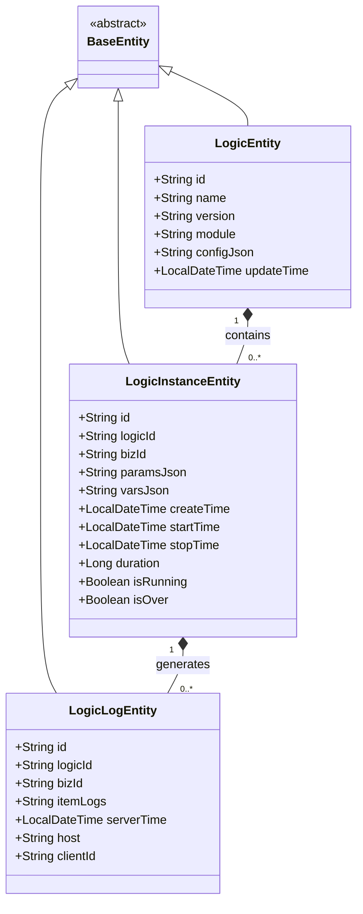

# 实体定义

<cite>
**本文档引用的文件**
- [LogicEntity.java](file://logic-sdk/src/main/java/com/aims/logic/sdk/entity/LogicEntity.java)
- [LogicInstanceEntity.java](file://logic-sdk/src/main/java/com/aims/logic/sdk/entity/LogicInstanceEntity.java)
- [LogicLogEntity.java](file://logic-sdk/src/main/java/com/aims/logic/sdk/entity/LogicLogEntity.java)
- [BaseEntity.java](file://logic-sdk/src/main/java/com/aims/logic/sdk/entity/BaseEntity.java)
- [TableName.java](file://logic-sdk/src/main/java/com/aims/logic/sdk/annotation/TableName.java)
- [TableId.java](file://logic-sdk/src/main/java/com/aims/logic/sdk/annotation/TableId.java)
- [TableField.java](file://logic-sdk/src/main/java/com/aims/logic/sdk/annotation/TableField.java)
- [LogicSdkMybatisPlusConfig.java](file://logic-ide/src/main/java/com/aims/logic/ide/configuration/LogicSdkMybatisPlusConfig.java)
</cite>

## 目录
1. [引言](#引言)
2. [核心实体类设计](#核心实体类设计)
3. [实体字段与注解详解](#实体字段与注解详解)
4. [实体间关联关系](#实体间关联关系)
5. [数据持久化机制](#数据持久化机制)
6. [UML类图展示](#uml类图展示)
7. [自定义扩展开发示例](#自定义扩展开发示例)
8. [总结](#总结)

## 引言
本文档旨在全面解析`logic-sdk`模块中的核心实体类设计与用途，重点阐述`LogicEntity`（逻辑定义实体）、`LogicInstanceEntity`（业务实例实体）和`LogicLogEntity`（执行日志实体）的字段含义、注解配置及其在运行时的作用。通过分析实体间的关联关系，并结合Spring Data JPA和MyBatis-Plus的数据持久化机制，为开发者提供清晰的开发指导。

## 核心实体类设计

`logic-sdk`中的实体类基于MyBatis-Plus框架构建，继承自`BaseEntity`，并通过自定义注解实现数据库映射。主要实体包括：

- **LogicEntity**：表示一个逻辑定义，存储逻辑的元信息如名称、版本、配置等。
- **LogicInstanceEntity**：表示一次逻辑执行的实例，记录运行时状态、参数、耗时等。
- **LogicLogEntity**：记录逻辑执行过程中的详细日志，用于追踪和调试。

这些实体共同构成了逻辑执行的核心数据模型。

**Section sources**
- [LogicEntity.java](file://logic-sdk/src/main/java/com/aims/logic/sdk/entity/LogicEntity.java#L1-L28)
- [LogicInstanceEntity.java](file://logic-sdk/src/main/java/com/aims/logic/sdk/entity/LogicInstanceEntity.java#L1-L83)
- [LogicLogEntity.java](file://logic-sdk/src/main/java/com/aims/logic/sdk/entity/LogicLogEntity.java#L1-L53)

## 实体字段与注解详解

### 注解说明

#### @TableName
用于指定实体类对应的数据库表名。该注解作用于类级别，其`value`属性定义表名。

```java
@TableName("logic")
public class LogicEntity extends BaseEntity
```

**Section sources**
- [TableName.java](file://logic-sdk/src/main/java/com/aims/logic/sdk/annotation/TableName.java#L1-L13)

#### @TableId
标识主键字段，支持多种ID生成策略。`type`属性指定ID类型，如`ASSIGN_ID`（自动分配）或`UUID`。

```java
@TableId(type = IdType.ASSIGN_ID)
String id;
```

**Section sources**
- [TableId.java](file://logic-sdk/src/main/java/com/aims/logic/sdk/annotation/TableId.java#L1-L13)

#### @TableField
用于映射字段与数据库列名，当字段名与列名不一致时使用。`value`属性指定数据库列名。

```java
@TableField("configJson")
String configJson;
```

**Section sources**
- [TableField.java](file://logic-sdk/src/main/java/com/aims/logic/sdk/annotation/TableField.java#L1-L10)

### 字段解析

#### LogicEntity 字段
- `id`：逻辑定义唯一标识，由系统自动分配。
- `name`：逻辑名称，用于标识逻辑功能。
- `version`：逻辑版本号，支持多版本管理。
- `module`：所属模块，便于分类管理。
- `configJson`：逻辑配置的JSON字符串，包含节点定义、流程结构等。
- `updateTime`：最后更新时间，格式化为东八区时间。

#### LogicInstanceEntity 字段
- `logicId`：关联的逻辑定义ID。
- `bizId`：业务标识，用于追踪同一业务的不同执行。
- `paramsJson` / `varsJson`：输入参数与运行时变量的JSON表示。
- `createTime` / `startTime` / `stopTime`：创建、开始、结束时间戳。
- `duration`：执行耗时（毫秒）。
- `isRunning` / `isOver`：运行状态标记。

#### LogicLogEntity 字段
- `itemLogs`：子节点执行日志的聚合JSON。
- `serverTime`：日志记录时间，精确到毫秒。
- `host` / `clientId`：执行主机与客户端标识，用于分布式追踪。

**Section sources**
- [LogicEntity.java](file://logic-sdk/src/main/java/com/aims/logic/sdk/entity/LogicEntity.java#L1-L28)
- [LogicInstanceEntity.java](file://logic-sdk/src/main/java/com/aims/logic/sdk/entity/LogicInstanceEntity.java#L1-L83)
- [LogicLogEntity.java](file://logic-sdk/src/main/java/com/aims/logic/sdk/entity/LogicLogEntity.java#L1-L53)

## 实体间关联关系

实体之间存在明确的层级与引用关系：

- **LogicEntity 与 LogicInstanceEntity**：一对多关系。一个逻辑定义可触发多个执行实例。
- **LogicInstanceEntity 与 LogicLogEntity**：一对多关系。每个实例的执行过程生成多条日志记录。
- **LogicLogEntity 与 LogicEntity**：通过`logicId`建立直接关联，支持按逻辑定义查询所有执行日志。

这种设计支持高效的查询与追溯能力，例如通过`logicId`和`bizId`组合可精准定位某次业务执行的完整轨迹。

**Section sources**
- [LogicEntity.java](file://logic-sdk/src/main/java/com/aims/logic/sdk/entity/LogicEntity.java#L1-L28)
- [LogicInstanceEntity.java](file://logic-sdk/src/main/java/com/aims/logic/sdk/entity/LogicInstanceEntity.java#L1-L83)
- [LogicLogEntity.java](file://logic-sdk/src/main/java/com/aims/logic/sdk/entity/LogicLogEntity.java#L1-L53)

## 数据持久化机制

系统采用MyBatis-Plus作为ORM框架，结合Spring Boot实现自动配置。`LogicSdkMybatisPlusConfig`类中定义了分页插件等核心配置，确保SQL执行效率与功能完整性。

实体类通过`@TableName`、`@TableId`、`@TableField`等注解完成与数据库表的映射，无需编写XML映射文件。MyBatis-Plus提供的`IService`和`BaseMapper`接口支持CRUD操作的开箱即用。

此外，`@JsonFormat`注解确保时间字段在序列化时统一格式化为“yyyy-MM-dd HH:mm:ss”并使用GMT+8时区，避免时区混乱问题。

**Section sources**
- [LogicSdkMybatisPlusConfig.java](file://logic-ide/src/main/java/com/aims/logic/ide/configuration/LogicSdkMybatisPlusConfig.java#L1-L22)
- [LogicEntity.java](file://logic-sdk/src/main/java/com/aims/logic/sdk/entity/LogicEntity.java#L1-L28)
- [LogicInstanceEntity.java](file://logic-sdk/src/main/java/com/aims/logic/sdk/entity/LogicInstanceEntity.java#L1-L83)
- [LogicLogEntity.java](file://logic-sdk/src/main/java/com/aims/logic/sdk/entity/LogicLogEntity.java#L1-L53)

## UML类图展示



**Diagram sources**
- [BaseEntity.java](file://logic-sdk/src/main/java/com/aims/logic/sdk/entity/BaseEntity.java#L1-L5)
- [LogicEntity.java](file://logic-sdk/src/main/java/com/aims/logic/sdk/entity/LogicEntity.java#L1-L28)
- [LogicInstanceEntity.java](file://logic-sdk/src/main/java/com/aims/logic/sdk/entity/LogicInstanceEntity.java#L1-L83)
- [LogicLogEntity.java](file://logic-sdk/src/main/java/com/aims/logic/sdk/entity/LogicLogEntity.java#L1-L53)

## 自定义扩展开发示例

开发者可通过继承`BaseEntity`创建新的实体类，并结合注解进行数据库映射。例如：

```java
@TableName("custom_logic_data")
public class CustomLogicDataEntity extends BaseEntity {
    @TableId(type = IdType.ASSIGN_ID)
    private String id;
    
    @TableField("logicId")
    private String logicId;
    
    @TableField("dataJson")
    private String dataJson;
    
    @TableField("createTime")
    @JsonFormat(pattern = "yyyy-MM-dd HH:mm:ss", timezone = "GMT+8")
    private LocalDateTime createTime;
    
    // getter and setter
}
```

此方式可无缝集成至现有持久化体系，支持使用`BaseServiceImpl`等通用服务进行操作。

**Section sources**
- [BaseEntity.java](file://logic-sdk/src/main/java/com/aims/logic/sdk/entity/BaseEntity.java#L1-L5)

## 总结

本文档详细解析了`logic-sdk`中三大核心实体的设计原理与使用方式，阐明了其字段含义、注解配置、关联关系及持久化机制。通过UML类图直观展示了实体结构，并提供了自定义扩展的开发范例，为后续功能开发与系统维护提供了坚实基础。