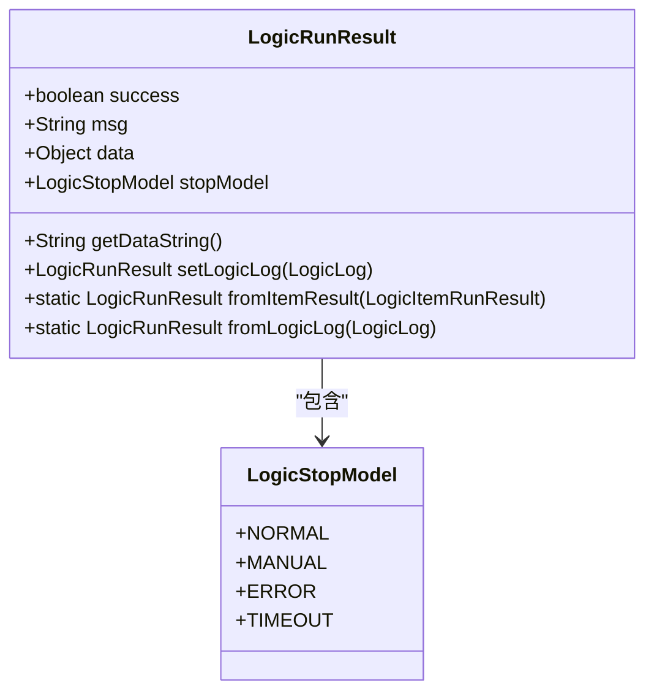
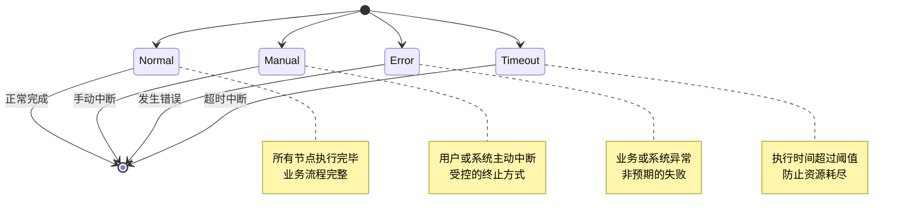
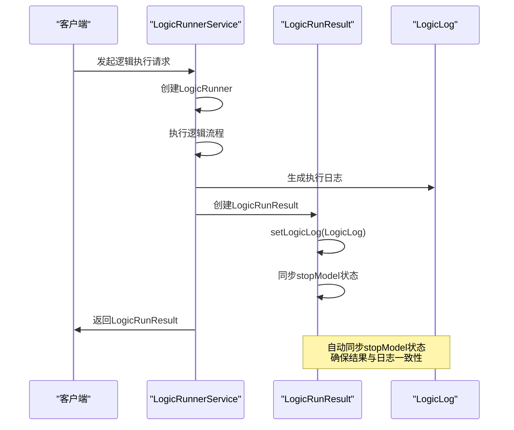
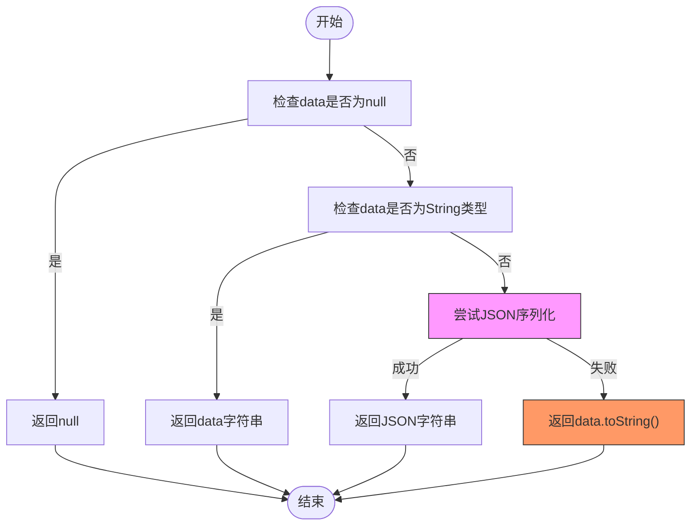
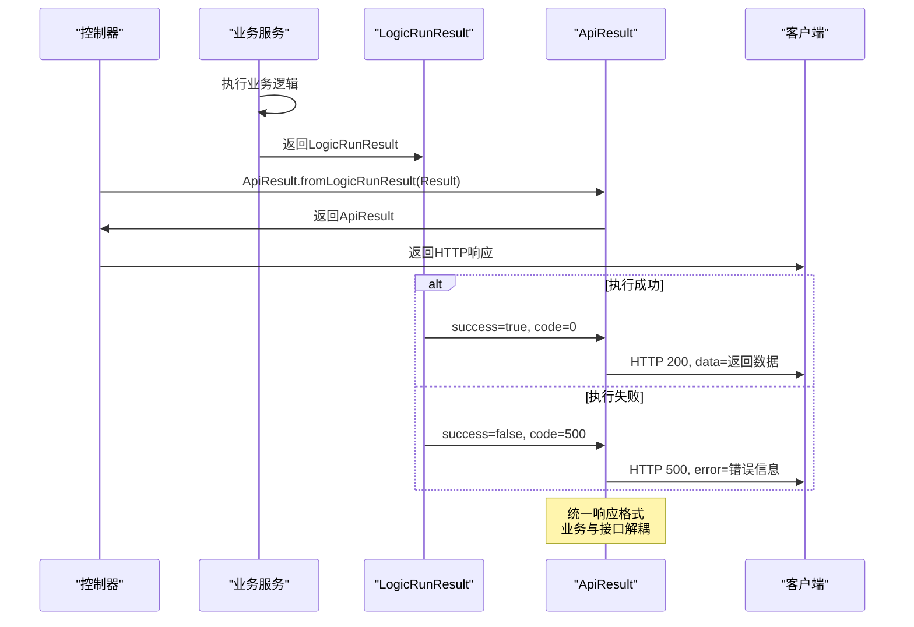

# LogicRunResult整体执行结果

<cite>
**Referenced Files in This Document**   
- [LogicRunResult.java](file://logic-runtime/src/main/java/com/aims/logic/runtime/contract/dto/LogicRunResult.java)
- [LogicStopModel.java](file://logic-runtime/src/main/java/com/aims/logic/runtime/contract/enums/LogicStopModel.java)
- [LogicLog.java](file://logic-runtime/src/main/java/com/aims/logic/runtime/contract/logger/LogicLog.java)
- [LogicRunnerServiceImpl.java](file://logic-sdk/src/main/java/com/aims/logic/sdk/LogicRunnerServiceImpl.java)
- [LogicRunnerService.java](file://logic-runtime/src/main/java/com/aims/logic/runtime/service/LogicRunnerService.java)
- [ApiResult.java](file://logic-ide/src/main/java/com/aims/logic/ide/controller/dto/ApiResult.java)
</cite>

## 目录
1. [简介](#简介)
2. [核心字段设计](#核心字段设计)
3. [流程终止模式](#流程终止模式)
4. [执行日志关联](#执行日志关联)
5. [数据序列化机制](#数据序列化机制)
6. [静态工厂方法](#静态工厂方法)
7. [API响应应用](#api响应应用)
8. [结论](#结论)

## 简介
`LogicRunResult`是逻辑执行框架中的核心结果容器类，用于封装一次逻辑执行的完整结果信息。该类设计为链式调用风格，提供了丰富的字段和方法来描述执行状态、消息、数据以及执行过程中的关键信息。作为系统中逻辑执行的统一返回格式，`LogicRunResult`在业务逻辑层与API接口层之间起到了重要的桥梁作用，确保了执行结果信息的完整性和一致性。

**Section sources**
- [LogicRunResult.java](file://logic-runtime/src/main/java/com/aims/logic/runtime/contract/dto/LogicRunResult.java#L10-L74)

## 核心字段设计
`LogicRunResult`类包含四个核心字段，共同构成了执行结果的基本信息框架。

### success字段
`success`字段是一个布尔类型，用于表示本次逻辑执行是否成功。默认值为`true`，表示执行成功。当执行过程中发生任何异常或错误时，该字段会被设置为`false`。此字段是判断执行结果最直接的依据，通常用于快速判断执行状态。

### msg字段
`msg`字段是一个字符串类型，用于存储执行过程中的消息信息。该消息可以是成功提示、错误描述或任何与执行相关的文本信息。在异常情况下，`msg`字段通常会包含详细的错误描述，帮助开发者快速定位问题。

### data字段
`data`字段是一个对象类型，用于存储执行的主要返回数据。该字段可以容纳任意类型的对象，提供了极大的灵活性。无论是简单的字符串、数字，还是复杂的对象结构，都可以通过`data`字段返回。此字段是获取执行结果数据的主要途径。

### stopModel字段
`stopModel`字段是`LogicStopModel`枚举类型，用于表示逻辑执行的终止模式。该字段与`success`字段相辅相成，不仅说明了执行是否成功，还说明了执行是如何结束的。不同的终止模式对应不同的业务场景和处理逻辑。



**Diagram sources**
- [LogicRunResult.java](file://logic-runtime/src/main/java/com/aims/logic/runtime/contract/dto/LogicRunResult.java#L10-L74)
- [LogicStopModel.java](file://logic-runtime/src/main/java/com/aims/logic/runtime/contract/enums/LogicStopModel.java#L2-L7)

**Section sources**
- [LogicRunResult.java](file://logic-runtime/src/main/java/com/aims/logic/runtime/contract/dto/LogicRunResult.java#L10-L25)

## 流程终止模式
`LogicStopModel`枚举定义了逻辑执行可能的终止模式，为执行结果提供了更丰富的上下文信息。

### NORMAL（正常终止）
`NORMAL`模式表示逻辑执行正常完成，所有节点都已按预期执行完毕。这是最理想的执行结果，表明业务流程完整且成功。

### MANUAL（手动终止）
`MANUAL`模式表示逻辑执行被手动中断。这种模式通常发生在用户主动停止执行或系统根据特定条件（如业务锁）中断执行时。与错误终止不同，手动终止是一种受控的中断方式。

### ERROR（错误终止）
`ERROR`模式表示逻辑执行因发生错误而终止。这可能是由于业务逻辑异常、系统错误或外部服务调用失败等原因导致。此模式帮助区分计划内的中断和意外的失败。

### TIMEOUT（超时终止）
`TIMEOUT`模式表示逻辑执行因超时而终止。当执行时间超过预设阈值时，系统会自动中断执行以防止资源耗尽。这种模式对于长时间运行的业务流程尤为重要。



**Diagram sources**
- [LogicStopModel.java](file://logic-runtime/src/main/java/com/aims/logic/runtime/contract/enums/LogicStopModel.java#L2-L7)

**Section sources**
- [LogicStopModel.java](file://logic-runtime/src/main/java/com/aims/logic/runtime/contract/enums/LogicStopModel.java#L2-L7)

## 执行日志关联
`LogicRunResult`通过`setLogicLog`方法与完整的执行日志建立关联，实现了结果与过程的统一。

### setLogicLog方法
`setLogicLog`方法不仅将`LogicLog`对象关联到结果中，还自动同步`stopModel`状态。这种方法确保了结果对象中的终止模式与实际执行日志保持一致，避免了状态不一致的问题。

### 自动状态同步
当调用`setLogicLog`方法时，`LogicRunResult`会从传入的`LogicLog`对象中获取`stopModel`值并更新自身状态。这种设计模式实现了"单一数据源"原则，确保了执行结果的`stopModel`始终反映实际的执行状态。

### 日志完整性
通过关联`LogicLog`，`LogicRunResult`能够访问完整的执行上下文，包括入参、变量状态、节点执行记录等。这对于调试、审计和问题排查至关重要。



**Diagram sources**
- [LogicRunResult.java](file://logic-runtime/src/main/java/com/aims/logic/runtime/contract/dto/LogicRunResult.java#L64-L72)
- [LogicLog.java](file://logic-runtime/src/main/java/com/aims/logic/runtime/contract/logger/LogicLog.java#L19-L170)

**Section sources**
- [LogicRunResult.java](file://logic-runtime/src/main/java/com/aims/logic/runtime/contract/dto/LogicRunResult.java#L64-L72)
- [LogicLog.java](file://logic-runtime/src/main/java/com/aims/logic/runtime/contract/logger/LogicLog.java#L19-L170)

## 数据序列化机制
`getDataString`方法提供了安全可靠的数据序列化机制，确保在各种情况下都能获取数据的字符串表示。

### 容错处理流程
该方法首先检查`data`是否为`null`，如果是则直接返回`null`。然后检查`data`是否已经是`String`类型，如果是则直接返回。最后尝试将`data`序列化为JSON字符串。

### JSON序列化
使用`JSONObject.toJSONString`方法进行JSON序列化，支持`WriteNulls`特性，确保`null`值也能正确序列化。这保证了序列化结果的完整性和一致性。

### 降级策略
当JSON序列化失败时（如遇到不支持的类型或序列化异常），方法会捕获异常并返回`data.toString()`作为降级方案。这种设计确保了方法永远不会抛出异常，提高了系统的健壮性。



**Diagram sources**
- [LogicRunResult.java](file://logic-runtime/src/main/java/com/aims/logic/runtime/contract/dto/LogicRunResult.java#L34-L47)

**Section sources**
- [LogicRunResult.java](file://logic-runtime/src/main/java/com/aims/logic/runtime/contract/dto/LogicRunResult.java#L34-L47)

## 静态工厂方法
`LogicRunResult`提供了两个静态工厂方法，用于从不同来源创建结果对象。

### fromItemResult方法
`fromItemResult`方法用于从`LogicItemRunResult`创建`LogicRunResult`。该方法复制了`data`、`msg`和`success`字段，实现了从节点执行结果到整体执行结果的转换。此方法常用于无状态执行场景。

### fromLogicLog方法
`fromLogicLog`方法用于从`LogicLog`创建`LogicRunResult`。该方法不仅复制了基本结果信息，还通过`setLogicLog`方法关联了完整的执行日志。此方法是创建完整执行结果的主要方式，广泛应用于有状态执行场景。

### 工厂方法优势
使用静态工厂方法而非构造函数，提供了更清晰的语义和更灵活的创建方式。调用者可以根据输入数据的类型选择合适的工厂方法，代码更具可读性和可维护性。

```mermaid
classDiagram
class LogicRunResult {
+static LogicRunResult fromItemResult(LogicItemRunResult)
+static LogicRunResult fromLogicLog(LogicLog)
}
class LogicItemRunResult {
+Object data
+String msg
+boolean success
}
class LogicLog {
+Object returnData
+String msg
+boolean success
+LogicStopModel stopModel
}
LogicRunResult --> LogicItemRunResult : "转换来源"
LogicRunResult --> LogicLog : "转换来源"
note right of LogicRunResult : : fromItemResult
复制data、msg、success字段<br/>
用于无状态执行结果转换
end note
note right of LogicRunResult : : fromLogicLog
复制结果信息并关联完整日志<br/>
用于有状态执行结果转换
end note
```

**Diagram sources**
- [LogicRunResult.java](file://logic-runtime/src/main/java/com/aims/logic/runtime/contract/dto/LogicRunResult.java#L49-L62)

**Section sources**
- [LogicRunResult.java](file://logic-runtime/src/main/java/com/aims/logic/runtime/contract/dto/LogicRunResult.java#L49-L62)

## API响应应用
`LogicRunResult`在API响应中作为标准返回值，通过`ApiResult`类进行封装和转换。

### 成功响应构建
当逻辑执行成功时，`LogicRunResult`的`success`为`true`，`code`为0，`data`包含返回数据。`ApiResult.fromLogicRunResult`方法会正确转换这些字段，生成标准的成功响应。

### 失败响应构建
当逻辑执行失败时，`LogicRunResult`的`success`为`false`，`code`为500，`msg`包含错误信息。`ApiResult`会将这些信息映射到标准错误响应格式中，确保客户端能够正确处理错误。

### 响应转换流程
从`LogicRunResult`到API响应的转换是自动的，通过`fromLogicRunResult`静态方法完成。这种设计模式实现了业务逻辑与API接口的解耦，使业务代码无需关心具体的响应格式。



**Diagram sources**
- [LogicRunResult.java](file://logic-runtime/src/main/java/com/aims/logic/runtime/contract/dto/LogicRunResult.java#L10-L74)
- [ApiResult.java](file://logic-ide/src/main/java/com/aims/logic/ide/controller/dto/ApiResult.java#L20-L25)

**Section sources**
- [LogicRunResult.java](file://logic-runtime/src/main/java/com/aims/logic/runtime/contract/dto/LogicRunResult.java#L10-L74)
- [ApiResult.java](file://logic-ide/src/main/java/com/aims/logic/ide/controller/dto/ApiResult.java#L20-L25)

## 结论
`LogicRunResult`作为逻辑执行框架的核心结果容器，通过精心设计的字段和方法，实现了执行结果的完整封装。其`success`、`msg`、`data`字段提供了基本的执行状态信息，而`stopModel`字段则增加了执行终止模式的丰富上下文。通过`setLogicLog`方法与执行日志的关联，实现了结果与过程的统一。`getDataString`方法的容错序列化机制确保了数据获取的可靠性。静态工厂方法提供了灵活的结果创建方式，而与`ApiResult`的集成则实现了业务逻辑与API接口的无缝对接。整体设计体现了高内聚、低耦合的原则，为系统的稳定运行提供了坚实的基础。