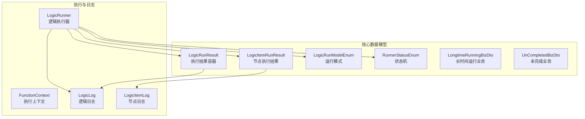
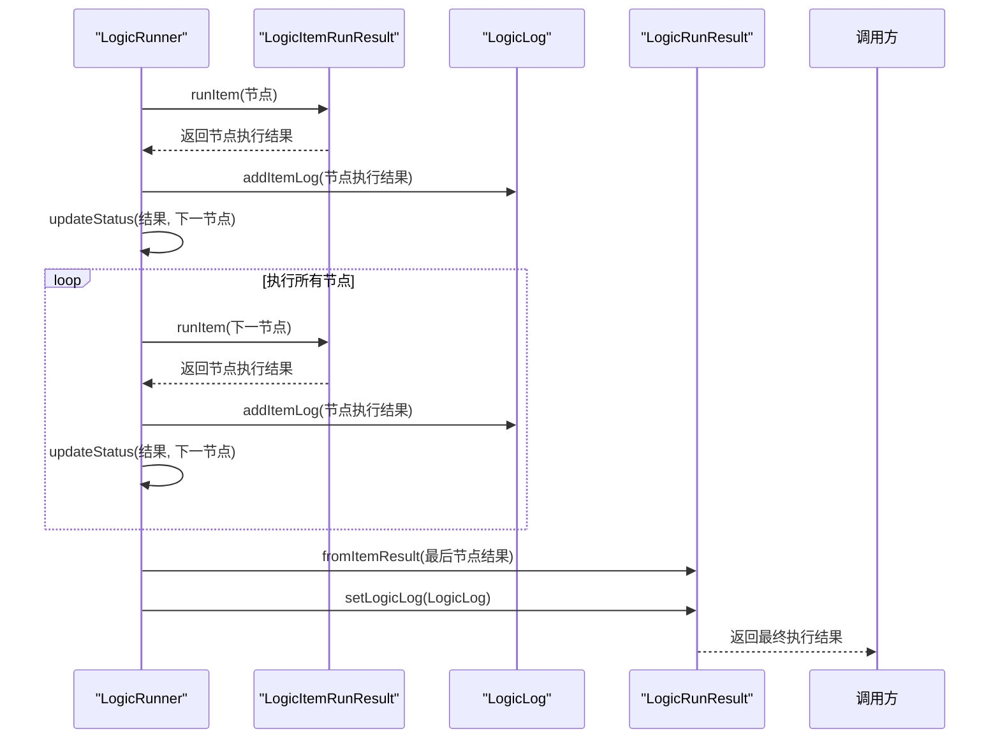
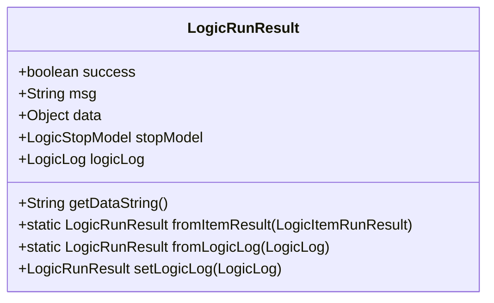
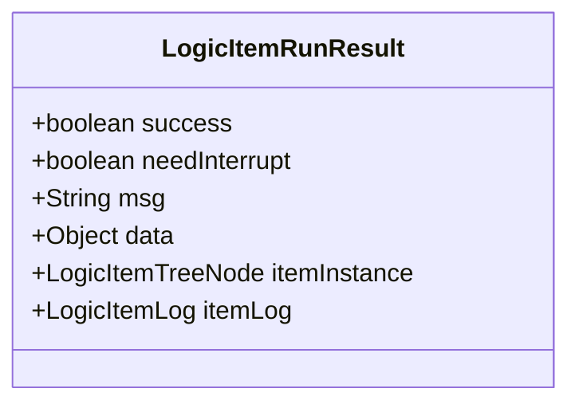
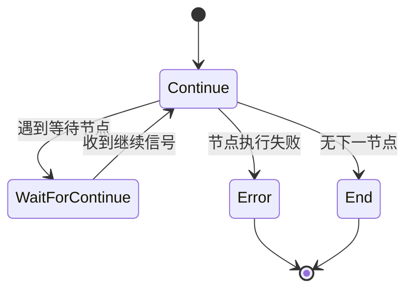
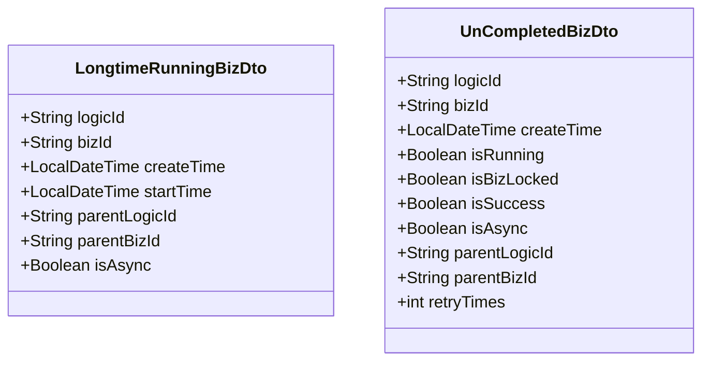
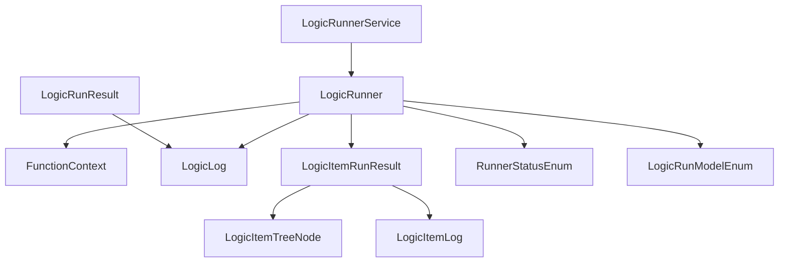

# 执行结果模型

<cite>
**本文档引用的文件**  
- [LogicRunResult.java](file://logic-runtime/src/main/java/com/aims/logic/runtime/contract/dto/LogicRunResult.java)
- [LogicItemRunResult.java](file://logic-runtime/src/main/java/com/aims/logic/runtime/contract/dto/LogicItemRunResult.java)
- [LogicRunModelEnum.java](file://logic-runtime/src/main/java/com/aims/logic/runtime/contract/dto/LogicRunModelEnum.java)
- [RunnerStatusEnum.java](file://logic-runtime/src/main/java/com/aims/logic/runtime/contract/dto/RunnerStatusEnum.java)
- [LongtimeRunningBizDto.java](file://logic-runtime/src/main/java/com/aims/logic/runtime/contract/dto/LongtimeRunningBizDto.java)
- [UnCompletedBizDto.java](file://logic-runtime/src/main/java/com/aims/logic/runtime/contract/dto/UnCompletedBizDto.java)
- [LogicRunner.java](file://logic-runtime/src/main/java/com/aims/logic/runtime/runner/LogicRunner.java)
- [LogicLog.java](file://logic-runtime/src/main/java/com/aims/logic/runtime/contract/logger/LogicLog.java)
</cite>

## 目录
1. [简介](#简介)
2. [项目结构](#项目结构)
3. [核心组件](#核心组件)
4. [架构概述](#架构概述)
5. [详细组件分析](#详细组件分析)
6. [依赖分析](#依赖分析)
7. [性能考虑](#性能考虑)
8. [故障排除指南](#故障排除指南)
9. [结论](#结论)

## 简介
本文档深入解析逻辑执行系统中的执行结果模型，重点阐述 `LogicRunResult` 和 `LogicItemRunResult` 的数据结构设计。`LogicRunResult` 作为整体执行结果的顶层容器，封装了执行状态、耗时、输出数据及子节点执行摘要等关键信息。`LogicItemRunResult` 则详细记录每个逻辑节点的执行详情，包括开始时间、结束时间、输入输出快照和错误信息。文档还解释了 `LogicRunModelEnum` 定义的运行模式（如同步/异步）和 `RunnerStatusEnum` 状态机的转换逻辑，并阐述了 `LongtimeRunningBizDto` 和 `UnCompletedBizDto` 在长时间运行业务场景下的应用模式。通过实际执行结果的 JSON 示例，说明前端如何基于此模型构建可视化调试界面。

## 项目结构
逻辑执行结果模型的核心组件位于 `logic-runtime` 模块的 `contract.dto` 包中，主要包括 `LogicRunResult`、`LogicItemRunResult`、`LogicRunModelEnum` 和 `RunnerStatusEnum` 等类。这些类与 `runner` 包中的 `LogicRunner` 和 `FunctionContext` 类紧密协作，共同完成逻辑的执行和结果的生成。`LogicLog` 和 `LogicItemLog` 类则负责记录详细的执行日志。

**图示来源**
- [LogicRunResult.java](file://logic-runtime/src/main/java/com/aims/logic/runtime/contract/dto/LogicRunResult.java)
- [LogicItemRunResult.java](file://logic-runtime/src/main/java/com/aims/logic/runtime/contract/dto/LogicItemRunResult.java)
- [LogicRunner.java](file://logic-runtime/src/main/java/com/aims/logic/runtime/runner/LogicRunner.java)
- [LogicLog.java](file://logic-runtime/src/main/java/com/aims/logic/runtime/contract/logger/LogicLog.java)

**本节来源**
- [logic-runtime/src/main/java/com/aims/logic/runtime/contract/dto](file://logic-runtime/src/main/java/com/aims/logic/runtime/contract/dto)
- [logic-runtime/src/main/java/com/aims/logic/runtime/runner](file://logic-runtime/src/main/java/com/aims/logic/runtime/runner)

## 核心组件
`LogicRunResult` 是整个逻辑执行流程的最终输出，它不仅包含最终的执行状态和返回数据，还通过 `LogicLog` 字段关联了完整的执行日志。`LogicItemRunResult` 是构成 `LogicLog` 的基本单元，记录了每个逻辑节点的执行快照。`LogicRunModelEnum` 和 `RunnerStatusEnum` 定义了系统的运行模式和状态转换规则，是控制执行流程的核心枚举。

**本节来源**
- [LogicRunResult.java](file://logic-runtime/src/main/java/com/aims/logic/runtime/contract/dto/LogicRunResult.java#L10-L74)
- [LogicItemRunResult.java](file://logic-runtime/src/main/java/com/aims/logic/runtime/contract/dto/LogicItemRunResult.java#L8-L47)
- [LogicRunModelEnum.java](file://logic-runtime/src/main/java/com/aims/logic/runtime/contract/dto/LogicRunModelEnum.java#L2-L13)
- [RunnerStatusEnum.java](file://logic-runtime/src/main/java/com/aims/logic/runtime/contract/dto/RunnerStatusEnum.java#L2-L7)

## 架构概述
整个执行结果模型的架构围绕 `LogicRunner` 展开。`LogicRunner` 在执行过程中，会为每个执行的节点创建一个 `LogicItemRunResult` 实例，该实例包含了节点的执行结果、输入输出和日志。所有节点的执行结果被收集到 `LogicLog` 中。当整个逻辑执行完毕后，`LogicRunner` 将最后一个节点的 `LogicItemRunResult` 转换为顶层的 `LogicRunResult`，并将其 `LogicLog` 关联起来，形成一个完整的执行报告。

**图示来源**
- [LogicRunner.java](file://logic-runtime/src/main/java/com/aims/logic/runtime/runner/LogicRunner.java#L210-L234)
- [LogicLog.java](file://logic-runtime/src/main/java/com/aims/logic/runtime/contract/logger/LogicLog.java#L160-L169)
- [LogicRunResult.java](file://logic-runtime/src/main/java/com/aims/logic/runtime/contract/dto/LogicRunResult.java#L49-L54)

## 详细组件分析

### LogicRunResult 分析
`LogicRunResult` 是执行结果的顶层容器，其主要字段如下：
- **success**: 布尔值，表示整个逻辑执行是否成功。
- **msg**: 字符串，包含执行过程中的消息或错误信息。
- **data**: 对象，存储最终的返回数据。
- **stopModel**: `LogicStopModel` 枚举，表示逻辑停止的模式（正常、手动、错误、超时）。
- **logicLog**: `LogicLog` 对象，包含完整的执行日志。

**图示来源**
- [LogicRunResult.java](file://logic-runtime/src/main/java/com/aims/logic/runtime/contract/dto/LogicRunResult.java#L10-L74)

### LogicItemRunResult 分析
`LogicItemRunResult` 记录单个逻辑节点的执行详情，其主要字段如下：
- **success**: 布尔值，表示该节点执行是否成功。
- **needInterrupt**: 布尔值，表示是否需要中断执行。
- **msg**: 字符串，包含该节点执行过程中的消息或错误信息。
- **data**: 对象，存储该节点的返回数据。
- **itemInstance**: `LogicItemTreeNode` 对象，表示该节点的配置实例。
- **itemLog**: `LogicItemLog` 对象，包含该节点的详细执行日志。

**图示来源**
- [LogicItemRunResult.java](file://logic-runtime/src/main/java/com/aims/logic/runtime/contract/dto/LogicItemRunResult.java#L8-L47)

### 运行模式与状态机分析
`LogicRunModelEnum` 定义了两种运行模式：
- **Fn**: 函数模式，无状态，执行一次后结束。
- **BizWithTransaction**: Java事务模式，确保节点状态与业务数据的一致性。

`RunnerStatusEnum` 定义了执行器的状态：
- **End**: 执行结束。
- **WaitForContinue**: 等待继续（如遇到等待节点）。
- **Error**: 执行出错。
- **Continue**: 继续执行。

**图示来源**
- [LogicRunModelEnum.java](file://logic-runtime/src/main/java/com/aims/logic/runtime/contract/dto/LogicRunModelEnum.java#L2-L13)
- [RunnerStatusEnum.java](file://logic-runtime/src/main/java/com/aims/logic/runtime/contract/dto/RunnerStatusEnum.java#L2-L7)

### 长时间运行与未完成业务分析
`LongtimeRunningBizDto` 用于表示长时间运行的业务，包含创建时间、开始时间、父子业务ID和异步标志等信息。`UnCompletedBizDto` 用于查询未完成的业务实例，包含业务ID、运行状态、锁状态、成功状态、重试次数等信息，是实现业务重试机制的关键。

**图示来源**
- [LongtimeRunningBizDto.java](file://logic-runtime/src/main/java/com/aims/logic/runtime/contract/dto/LongtimeRunningBizDto.java#L8-L20)
- [UnCompletedBizDto.java](file://logic-runtime/src/main/java/com/aims/logic/runtime/contract/dto/UnCompletedBizDto.java#L8-L25)

## 依赖分析
执行结果模型依赖于 `logic-runtime` 模块的多个组件。`LogicRunner` 是核心执行引擎，它依赖 `FunctionContext` 来管理执行上下文，并依赖 `LogicLog` 来记录日志。`LogicItemRunResult` 依赖 `LogicItemTreeNode` 来获取节点配置，并依赖 `LogicItemLog` 来记录节点级别的详细日志。外部服务通过 `LogicRunnerService` 调用 `LogicRunner`，并将结果封装为 `LogicRunResult` 返回。

**图示来源**
- [LogicRunnerService.java](file://logic-runtime/src/main/java/com/aims/logic/runtime/service/LogicRunnerService.java)
- [LogicRunner.java](file://logic-runtime/src/main/java/com/aims/logic/runtime/runner/LogicRunner.java)
- [LogicLog.java](file://logic-runtime/src/main/java/com/aims/logic/runtime/contract/logger/LogicLog.java)

**本节来源**
- [logic-runtime/src/main/java/com/aims/logic/runtime/service/LogicRunnerService.java](file://logic-runtime/src/main/java/com/aims/logic/runtime/service/LogicRunnerService.java)
- [logic-runtime/src/main/java/com/aims/logic/runtime/runner/LogicRunner.java](file://logic-runtime/src/main/java/com/aims/logic/runtime/runner/LogicRunner.java)

## 性能考虑
在设计执行结果模型时，性能是一个重要考量。`LogicLog` 使用 `ArrayDeque` 作为内部队列，并通过 `RuntimeUtil.AppConfig.itemQueueSize` 限制日志条目的最大数量，防止内存溢出。`getDataString()` 方法在序列化数据时使用了 `JSONWriter.Feature.WriteNulls` 特性，确保了数据的完整性。对于长时间运行的业务，系统提供了异步执行模式，避免阻塞主线程。

## 故障排除指南
当遇到执行结果异常时，应首先检查 `LogicRunResult` 的 `success` 字段和 `msg` 字段。如果 `success` 为 `false`，则需深入 `logicLog` 查看详细的 `itemLogs`，定位是哪个节点执行失败。对于长时间未完成的业务，可以查询 `UnCompletedBizDto` 来检查其运行状态和重试次数。如果业务被手动停止，`stopModel` 将为 `MANUAL`。

**本节来源**
- [LogicRunResult.java](file://logic-runtime/src/main/java/com/aims/logic/runtime/contract/dto/LogicRunResult.java#L10-L74)
- [LogicLog.java](file://logic-runtime/src/main/java/com/aims/logic/runtime/contract/logger/LogicLog.java#L160-L169)
- [UnCompletedBizDto.java](file://logic-runtime/src/main/java/com/aims/logic/runtime/contract/dto/UnCompletedBizDto.java#L8-L25)

## 结论
本文档详细解析了逻辑执行系统的执行结果模型。`LogicRunResult` 和 `LogicItemRunResult` 构成了一个层次化的结果报告体系，能够全面反映逻辑执行的全过程。`LogicRunModelEnum` 和 `RunnerStatusEnum` 提供了灵活的运行模式和清晰的状态机，支持复杂的业务流程。`LongtimeRunningBizDto` 和 `UnCompletedBizDto` 为长时间运行和可重试业务提供了数据支持。该模型设计合理，既保证了信息的完整性，又兼顾了性能和可扩展性，为构建可视化调试界面和实现高级业务功能奠定了坚实的基础。