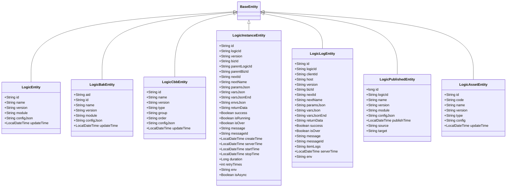

# 持久化实体模型

<cite>
**本文档引用文件**  
- [LogicEntity.java](file://logic-sdk/src/main/java/com/aims/logic/sdk/entity/LogicEntity.java)
- [LogicBakEntity.java](file://logic-sdk/src/main/java/com/aims/logic/sdk/entity/LogicBakEntity.java)
- [LogicCbbEntity.java](file://logic-sdk/src/main/java/com/aims/logic/sdk/entity/LogicCbbEntity.java)
- [LogicInstanceEntity.java](file://logic-sdk/src/main/java/com/aims/logic/sdk/entity/LogicInstanceEntity.java)
- [LogicLogEntity.java](file://logic-sdk/src/main/java/com/aims/logic/sdk/entity/LogicLogEntity.java)
- [LogicPublishedEntity.java](file://logic-sdk/src/main/java/com/aims/logic/sdk/entity/LogicPublishedEntity.java)
- [LogicAssetEntity.java](file://logic-sdk/src/main/java/com/aims/logic/sdk/entity/LogicAssetEntity.java)
- [BaseEntity.java](file://logic-sdk/src/main/java/com/aims/logic/sdk/entity/BaseEntity.java)
- [v0.8.sql](file://doc/sql-scripts/full/v0.8.sql)
</cite>

## 目录
1. [引言](#引言)
2. [基础实体设计](#基础实体设计)
3. [核心逻辑实体 LogicEntity](#核心逻辑实体-logicentity)
4. [版本备份实体 LogicBakEntity](#版本备份实体-logicbakentity)
5. [公共逻辑块实体 LogicCbbEntity](#公共逻辑块实体-logiccbbentity)
6. [执行实例实体 LogicInstanceEntity](#执行实例实体-logicinstanceentity)
7. [执行日志实体 LogicLogEntity](#执行日志实体-logiclogentity)
8. [发布状态实体 LogicPublishedEntity](#发布状态实体-logicpublishedentity)
9. [静态资源实体 LogicAssetEntity](#静态资源实体-logicassetentity)
10. [数据库表结构与索引优化](#数据库表结构与索引优化)

## 引言
本文档系统阐述基于 MyBatis-Plus 的持久化实体模型设计体系，围绕逻辑编排系统的核心数据结构展开。重点说明以 `LogicEntity` 为主实体的 ORM 设计，涵盖逻辑配置、版本管理、实例追踪、日志记录、发布流程及资源引用等关键场景。所有实体均继承自统一的 `BaseEntity`，实现通用字段的集中管理，并通过 MyBatis-Plus 注解实现与数据库的高效映射。

## 基础实体设计
`BaseEntity` 作为所有持久化实体的抽象基类，定义了通用的元数据字段处理机制。尽管其本身不包含具体字段，但为所有子类提供了统一的扩展基础，确保创建时间、更新时间等通用属性的处理一致性。



**图示来源**
- [BaseEntity.java](file://logic-sdk/src/main/java/com/aims/logic/sdk/entity/BaseEntity.java)
- [LogicEntity.java](file://logic-sdk/src/main/java/com/aims/logic/sdk/entity/LogicEntity.java)
- [LogicBakEntity.java](file://logic-sdk/src/main/java/com/aims/logic/sdk/entity/LogicBakEntity.java)
- [LogicCbbEntity.java](file://logic-sdk/src/main/java/com/aims/logic/sdk/entity/LogicCbbEntity.java)
- [LogicInstanceEntity.java](file://logic-sdk/src/main/java/com/aims/logic/sdk/entity/LogicInstanceEntity.java)
- [LogicLogEntity.java](file://logic-sdk/src/main/java/com/aims/logic/sdk/entity/LogicLogEntity.java)
- [LogicPublishedEntity.java](file://logic-sdk/src/main/java/com/aims/logic/sdk/entity/LogicPublishedEntity.java)
- [LogicAssetEntity.java](file://logic-sdk/src/main/java/com/aims/logic/sdk/entity/LogicAssetEntity.java)

**本节来源**
- [BaseEntity.java](file://logic-sdk/src/main/java/com/aims/logic/sdk/entity/BaseEntity.java)

## 核心逻辑实体 LogicEntity
`LogicEntity` 是系统的核心主实体，代表一个可执行的逻辑单元。它存储了逻辑的唯一标识、名称、当前版本、所属模块、完整的 DSL 配置以及最后更新时间。

- **id**: 逻辑的唯一标识符，使用 `ASSIGN_ID` 策略生成，确保分布式环境下的唯一性。
- **name**: 逻辑的可读名称，用于用户识别。
- **version**: 当前逻辑的版本号，是实现版本控制的基础。
- **module**: 逻辑所属的业务模块，用于分类管理。
- **configJson**: 存储逻辑完整配置的 JSON 字符串，包含节点、连线、参数等所有 DSL 信息。
- **updateTime**: 记录逻辑最后一次被修改的时间，用于排序和审计。

该实体是用户在 IDE 中创建、编辑和查看逻辑的主要数据载体。

**本节来源**
- [LogicEntity.java](file://logic-sdk/src/main/java/com/aims/logic/sdk/entity/LogicEntity.java)

## 版本备份实体 LogicBakEntity
`LogicBakEntity` 用于实现逻辑的版本备份机制。每当主逻辑 `LogicEntity` 被修改时，系统会自动将修改前的完整状态保存到 `logic_bak` 表中，形成一个历史快照。

- **aid**: 备份记录的唯一标识。
- **id**: 关联的主逻辑 ID，用于追溯。
- **version**: 备份时的逻辑版本号，与主逻辑版本对应。
- 其余字段（name, module, configJson, updateTime）与 `LogicEntity` 保持一致，完整保存了历史状态。

此设计支持逻辑的版本回滚和历史版本对比，是保障系统安全性和可恢复性的关键。

**本节来源**
- [LogicBakEntity.java](file://logic-sdk/src/main/java/com/aims/logic/sdk/entity/LogicBakEntity.java)

## 公共逻辑块实体 LogicCbbEntity
`LogicCbbEntity` 支持公共逻辑块（Common Building Block）的复用架构。公共逻辑块是可被多个主逻辑引用的独立功能单元，实现代码的模块化和复用。

- **id**: 公共逻辑块的唯一标识。
- **name**: 块的名称。
- **version**: 块的版本，支持版本化引用。
- **type**: 块的类型（如函数、组件等）。
- **group**: 所属分组，便于管理。
- **order**: 在分组内的排序。
- **configJson**: 块的配置信息。

通过 `LogicCbbEntity`，开发者可以构建可复用的“积木”，在不同业务逻辑中直接引用，提高开发效率。

**本节来源**
- [LogicCbbEntity.java](file://logic-sdk/src/main/java/com/aims/logic/sdk/entity/LogicCbbEntity.java)

## 执行实例实体 LogicInstanceEntity
`LogicInstanceEntity` 记录每次逻辑执行的完整上下文信息，是运行时状态的持久化载体。

- **id**: 执行实例的唯一标识。
- **logicId**: 关联的逻辑 ID。
- **version**: 执行时使用的逻辑版本。
- **bizId**: 业务实例标识，由调用方传入，用于关联同一业务的不同执行。
- **parentLogicId/bizId**: 支持子逻辑调用，记录父级上下文。
- **paramsJson/varsJson/envsJson**: 分别存储执行时的输入参数、局部变量和环境变量。
- **varsJsonEnd**: 执行结束后的变量状态，用于恢复中断的流程。
- **returnData**: 最终返回结果。
- **isRunning/isOver**: 标记实例的运行状态。
- **createTime/startTime/stopTime/duration**: 精确记录执行的时间线。
- **retryTimes**: 记录重试次数。

该实体是实现长流程、异步执行和状态恢复的核心。

**本节来源**
- [LogicInstanceEntity.java](file://logic-sdk/src/main/java/com/aims/logic/sdk/entity/LogicInstanceEntity.java)

## 执行日志实体 LogicLogEntity
`LogicLogEntity` 专门用于存储逻辑执行过程中的详细日志，其数据被持久化到 Elasticsearch 中，以支持高效的全文检索和分析。

- **id**: 日志记录的唯一标识。
- **logicId/bizId**: 关联逻辑和业务实例。
- **version**: 执行的逻辑版本。
- **serverTime**: 服务器时间戳，精确到毫秒。
- **paramsJson/varsJson/varsJsonEnd**: 记录每次交互的变量快照。
- **itemLogs**: 存储详细的节点执行日志，是诊断问题的主要依据。
- **env**: 运行环境标识。

在 Elasticsearch 中，建议按 `logicId` 或 `bizId` 进行分片，并创建以 `version` 为后缀的索引（如 `logic_log_v1.0.0`），实现数据的高效分区和生命周期管理。

**本节来源**
- [LogicLogEntity.java](file://logic-sdk/src/main/java/com/aims/logic/sdk/entity/LogicLogEntity.java)

## 发布状态实体 LogicPublishedEntity
`LogicPublishedEntity` 管理逻辑的发布生命周期，记录每一次发布的详细信息。

- **id**: 发布记录的自增主键。
- **logicId**: 被发布的逻辑 ID。
- **version**: 发布的版本。
- **publishTime**: 发布时间。
- **source**: 发布来源（如 IDE、API）。
- **target**: 发布目标（如本地文件、远程主机）。

该实体用于审计发布行为，追踪逻辑从开发环境到生产环境的流转过程。

**本节来源**
- [LogicPublishedEntity.java](file://logic-sdk/src/main/java/com/aims/logic/sdk/entity/LogicPublishedEntity.java)

## 静态资源实体 LogicAssetEntity
`LogicAssetEntity` 用于管理逻辑中引用的静态资源。

- **id**: 资源的唯一标识。
- **code**: 资源代码，用于程序化引用。
- **name**: 资源名称。
- **version**: 资源版本。
- **type**: 资源类型（如图片、脚本、配置文件）。
- **config**: 资源的配置信息。
- **updateTime**: 更新时间。

此实体实现了对静态资源的统一管理和版本控制。

**本节来源**
- [LogicAssetEntity.java](file://logic-sdk/src/main/java/com/aims/logic/sdk/entity/LogicAssetEntity.java)

## 数据库表结构与索引优化
根据 `v0.8.sql` 脚本，各实体对应的数据库表结构及索引设计如下：

```mermaid
erDiagram
LOGIC ||--o{ LOGIC_BAK : "版本备份"
LOGIC ||--o{ LOGIC_INSTANCE : "执行实例"
LOGIC ||--o{ LOGIC_LOG : "执行日志"
LOGIC ||--o{ LOGIC_PUBLISHED : "发布记录"
LOGIC_CBB ||--o{ LOGIC_INSTANCE : "引用"
LOGIC_ASSET ||--o{ LOGIC_INSTANCE : "引用"
LOGIC {
varchar id PK
varchar name
varchar version
varchar module
longtext configJson
datetime updateTime
}
LOGIC_BAK {
varchar aid PK
varchar id FK
varchar version
varchar name
varchar module
longtext configJson
datetime updateTime
index logicid_version_idx (id, version)
}
LOGIC_INSTANCE {
varchar id PK
varchar logicId FK
varchar version
varchar bizId
varchar parentLogicId
varchar parentBizId
varchar nextId
varchar message
varchar messageId
text paramsJson
text varsJson
text envsJson
text varsJsonEnd
longtext returnData
varchar env
tinyint success
tinyint isOver
tinyint isRunning
datetime createTime
datetime serverTime
datetime startTime
datetime stopTime
bigint duration
int retryTimes
tinyint isAsync
index idx_logicId_bizId (logicId, bizId)
index idx_bizId_parBizId_serverTime (bizId DESC, parentBizId DESC, serverTime DESC)
}
LOGIC_LOG {
varchar id PK
varchar env
varchar logicId FK
varchar version
varchar bizId
varchar clientId
varchar host
tinyint success
varchar message
varchar nextId
varchar nextName
datetime serverTime
text paramsJson
text varsJson
text varsJsonEnd
text returnData
tinyint isOver
longtext itemLogs
varchar messageId
primary key (id, version)
index logicId_bizId (logicId, bizId)
}
LOGIC_PUBLISHED {
bigint id PK
varchar logicId FK
varchar name
varchar version
varchar module
longtext configJson
datetime publishTime
varchar source
varchar target
}
LOGIC_CBB {
varchar id PK
varchar name
varchar version
varchar type
varchar group
varchar order
longtext configJson
datetime updateTime
}
LOGIC_ASSET {
varchar id PK
varchar code
varchar name
varchar version
varchar type
text config
datetime updateTime
}
```

**图示来源**
- [v0.8.sql](file://doc/sql-scripts/full/v0.8.sql)

**本节来源**
- [v0.8.sql](file://doc/sql-scripts/full/v0.8.sql)

### 索引优化策略
1. **logic_bak**: 建立 `(id, version)` 复合索引，支持根据逻辑 ID 和版本号快速查询历史备份。
2. **logic_instance**: 建立 `(logicId, bizId)` 索引，支持根据逻辑和业务 ID 快速定位实例；建立 `(bizId, parentBizId, serverTime DESC)` 索引，支持按业务实例及其父实例进行高效的时间倒序查询。
3. **logic_log**: 主键为 `(id, version)`，实现按版本分片；建立 `(logicId, bizId)` 索引，支持快速关联查询。
4. **Elasticsearch**: `logic_log` 表的数据同步至 ES 后，应根据 `logicId` 和 `bizId` 设置分片策略，并创建以 `version` 为后缀的索引模板，便于按版本进行数据管理和清理。