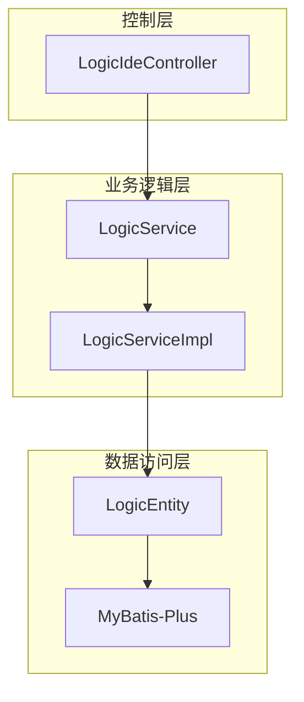
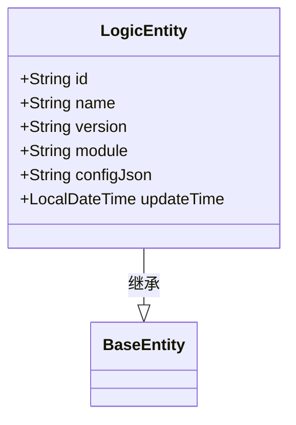
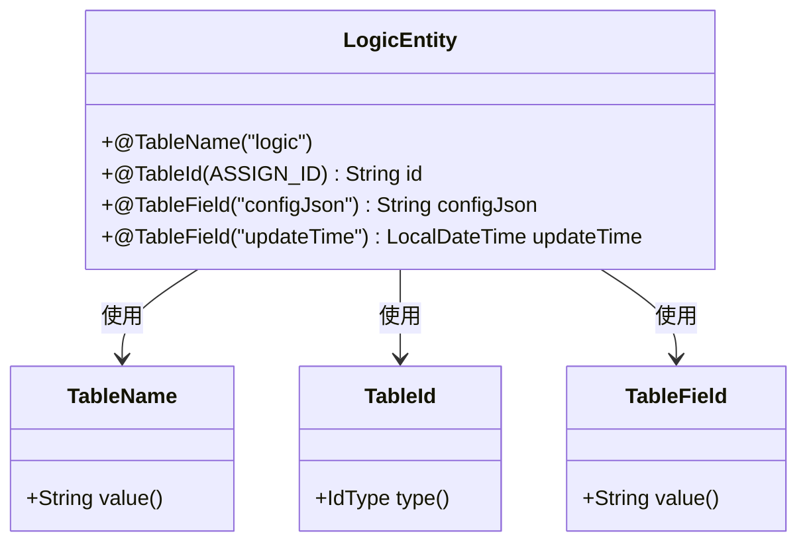

# 逻辑配置实体（LogicEntity）

<cite>
**Referenced Files in This Document**  
- [LogicEntity.java](file://logic-sdk/src/main/java/com/aims/logic/sdk/entity/LogicEntity.java)
- [BaseEntity.java](file://logic-sdk/src/main/java/com/aims/logic/sdk/entity/BaseEntity.java)
- [v0.8.sql](file://doc/sql-scripts/full/v0.8.sql)
- [LogicIdeController.java](file://logic-ide/src/main/java/com/aims/logic/ide/controller/LogicIdeController.java)
- [LogicServiceImpl.java](file://logic-sdk/src/main/java/com/aims/logic/sdk/service/impl/LogicServiceImpl.java)
- [TableField.java](file://logic-sdk/src/main/java/com/aims/logic/sdk/annotation/TableField.java)
- [TableId.java](file://logic-sdk/src/main/java/com/aims/logic/sdk/annotation/TableId.java)
- [LogicService.java](file://logic-sdk/src/main/java/com/aims/logic/sdk/service/LogicService.java)
- [TableName.java](file://logic-sdk/src/main/java/com/aims/logic/sdk/annotation/TableName.java)
</cite>

## 目录
1. [简介](#简介)
2. [核心组件](#核心组件)
3. [架构概述](#架构概述)
4. [详细组件分析](#详细组件分析)
5. [依赖分析](#依赖分析)
6. [性能考量](#性能考量)
7. [故障排除指南](#故障排除指南)
8. [结论](#结论)

## 简介
`LogicEntity` 是可视化逻辑编排系统的核心配置存储模型，作为系统中逻辑配置的持久化载体。该实体通过 MyBatis-Plus 框架实现 ORM 映射，承载了逻辑编排的核心元数据与配置信息。它不仅定义了逻辑的唯一标识、名称、版本等业务属性，还通过 `configJson` 字段存储了完整的逻辑编排结构，是系统实现逻辑创建、编辑、查询、发布和版本管理等功能的基础。本文档将深入剖析其设计与实现，涵盖 ORM 映射机制、字段语义、继承结构及数据库优化策略。

## 核心组件

`LogicEntity` 实体是整个逻辑编排系统数据模型的核心，其设计体现了高内聚、可扩展和易维护的原则。该实体通过继承 `BaseEntity` 获得通用字段，并利用自定义注解与 MyBatis-Plus 框架协同工作，实现了与数据库表 `logic` 的精确映射。其 `configJson` 字段采用 JSON 格式存储复杂的逻辑树结构，提供了极大的灵活性。实体的增删改查操作通过 `LogicService` 接口暴露，并在 `LogicServiceImpl` 中实现了包含备份机制的业务逻辑，确保了数据的安全性。

**Section sources**
- [LogicEntity.java](file://logic-sdk/src/main/java/com/aims/logic/sdk/entity/LogicEntity.java#L1-L27)
- [LogicServiceImpl.java](file://logic-sdk/src/main/java/com/aims/logic/sdk/service/impl/LogicServiceImpl.java#L1-L220)

## 架构概述

`LogicEntity` 的架构设计遵循了典型的分层模式，清晰地分离了数据访问、业务逻辑和控制层。数据访问层由 `LogicEntity` 实体和 MyBatis-Plus 框架构成，负责与数据库交互。业务逻辑层由 `LogicService` 接口及其 `LogicServiceImpl` 实现类组成，封装了包括编辑备份、发布等核心业务规则。控制层则由 `LogicIdeController` 提供 RESTful API，接收前端请求并调用相应的服务。这种分层架构确保了系统的可维护性和可测试性。



**Diagram sources**
- [LogicEntity.java](file://logic-sdk/src/main/java/com/aims/logic/sdk/entity/LogicEntity.java#L1-L27)
- [LogicServiceImpl.java](file://logic-sdk/src/main/java/com/aims/logic/sdk/service/impl/LogicServiceImpl.java#L1-L220)
- [LogicIdeController.java](file://logic-ide/src/main/java/com/aims/logic/ide/controller/LogicIdeController.java#L1-L320)

## 详细组件分析

### LogicEntity 实体分析

#### 类结构与继承
`LogicEntity` 类通过继承 `BaseEntity` 基类，实现了代码复用和通用字段的统一管理。`BaseEntity` 作为所有实体的基类，虽然在当前代码中为空，但为未来添加如 `createTime`、`creator` 等通用字段预留了扩展点。`LogicEntity` 自身通过 Lombok 注解 `@Data` 和 `@Accessors(chain = true)` 自动生成了所有字段的 getter/setter 方法，并启用了链式调用，极大地简化了代码。



**Diagram sources**
- [LogicEntity.java](file://logic-sdk/src/main/java/com/aims/logic/sdk/entity/LogicEntity.java#L1-L27)
- [BaseEntity.java](file://logic-sdk/src/main/java/com/aims/logic/sdk/entity/BaseEntity.java#L1-L5)

#### ORM 映射机制
`LogicEntity` 与数据库表 `logic` 的映射由一系列自定义注解驱动，这些注解模拟了 MyBatis-Plus 的标准行为。

- **表名映射**: `@TableName("logic")` 注解明确指定了该实体对应的数据库表名为 `logic`。
- **主键映射**: `@TableId(type = IdType.ASSIGN_ID)` 注解应用于 `id` 字段，指示框架使用 `ASSIGN_ID` 策略生成分布式唯一 ID。该策略通常依赖于雪花算法（Snowflake Algorithm），结合时间戳、机器ID和序列号来生成全局唯一的长整型ID，确保在高并发和分布式环境下ID的唯一性。
- **字段映射**: `@TableField("configJson")` 和 `@TableField("updateTime")` 注解用于将 Java 字段 `configJson` 和 `updateTime` 映射到数据库列 `configJson` 和 `updateTime`。这解决了 Java 驼峰命名与数据库下划线命名的转换问题。



**Diagram sources**
- [LogicEntity.java](file://logic-sdk/src/main/java/com/aims/logic/sdk/entity/LogicEntity.java#L1-L27)
- [TableName.java](file://logic-sdk/src/main/java/com/aims/logic/sdk/annotation/TableName.java#L1-L13)
- [TableId.java](file://logic-sdk/src/main/java/com/aims/logic/sdk/annotation/TableId.java#L1-L13)
- [TableField.java](file://logic-sdk/src/main/java/com/aims/logic/sdk/annotation/TableField.java#L1-L10)

#### 业务字段语义
- **`name`**: 逻辑的名称，用于在用户界面中标识和搜索逻辑。它是用户友好的描述性字段。
- **`version`**: 逻辑的版本号，是实现逻辑版本控制的关键。通过版本号，系统可以管理同一逻辑的不同迭代，并支持回滚到历史版本。
- **`module`**: 逻辑所属的模块，用于对逻辑进行分类和组织。它有助于在大型系统中按业务领域或功能模块对逻辑进行分组管理。

#### 时间字段格式化
`updateTime` 字段使用 `@JsonFormat(pattern = "yyyy-MM-dd HH:mm:ss", timezone = "GMT+8")` 注解。此注解在实体序列化为 JSON（如通过 REST API 返回给前端）时生效，确保 `updateTime` 字段以指定的日期时间格式（年-月-日 时:分:秒）和 GMT+8 时区进行输出，保证了前后端时间显示的一致性。

## 依赖分析

`LogicEntity` 实体在系统中处于核心地位，与多个组件存在紧密的依赖关系。

```mermaid
graph TD
LogicEntity --> BaseEntity : 继承
LogicEntity --> TableId : 依赖
LogicEntity --> TableField : 依赖
LogicEntity --> TableName : 依赖
LogicService --> LogicEntity : 参数/返回值
LogicServiceImpl --> LogicEntity : 操作
LogicIdeController --> LogicEntity : 参数/返回值
```

**Diagram sources**
- [LogicEntity.java](file://logic-sdk/src/main/java/com/aims/logic/sdk/entity/LogicEntity.java#L1-L27)
- [BaseEntity.java](file://logic-sdk/src/main/java/com/aims/logic/sdk/entity/BaseEntity.java#L1-L5)
- [LogicService.java](file://logic-sdk/src/main/java/com/aims/logic/sdk/service/LogicService.java#L1-L45)
- [LogicServiceImpl.java](file://logic-sdk/src/main/java/com/aims/logic/sdk/service/impl/LogicServiceImpl.java#L1-L220)
- [LogicIdeController.java](file://logic-ide/src/main/java/com/aims/logic/ide/controller/LogicIdeController.java#L1-L320)

## 性能考量

### 数据库表结构与索引优化
根据 `v0.8.sql` 脚本，`logic` 表的结构设计合理。主键 `id` 已建立 PRIMARY KEY 索引，这是查询单个逻辑记录的最高效方式。为了优化性能，建议考虑以下索引策略：
- **复合索引**: 在 `(module, version)` 或 `(name, version)` 上创建复合索引，可以显著加速按模块或名称以及版本号进行查询的场景。
- **全文索引**: 如果需要对 `configJson` 字段进行内容搜索，可以考虑使用 MySQL 的 JSON 函数或创建虚拟列并建立索引。

### 高并发写入场景
在高并发写入场景下，`LogicEntity` 的性能主要受以下因素影响：
1. **主键生成**: `ASSIGN_ID` 策略基于雪花算法，其性能极高，几乎不会成为瓶颈。
2. **备份机制**: `editAndBak` 方法在更新 `logic` 表后，会立即向 `logic_bak` 表插入一条备份记录。这个额外的写入操作会增加事务的延迟。在极端高并发场景下，可以考虑将备份操作异步化，以提高主表的写入吞吐量。
3. **数据库锁**: 对同一 `id` 的并发更新会触发行级锁，确保数据一致性。但对 `module` 等字段的频繁更新可能影响性能。

## 故障排除指南

当遇到与 `LogicEntity` 相关的问题时，可参考以下排查步骤：
1. **检查数据库连接**: 确保应用能正常连接到数据库。
2. **验证实体映射**: 检查 `@TableName` 和 `@TableField` 注解的值是否与数据库表的实际名称和列名完全匹配。
3. **审查日志**: 查看 `LogicServiceImpl` 中的日志输出，特别是 `pubToLocalFromEntityJson` 等方法的错误日志，以定位 `logicEntity` 为 null 或 JSON 格式错误等问题。
4. **检查 ID 生成**: 如果出现主键冲突，需检查 `IdWorker` 或雪花算法的配置是否正确，确保机器ID的唯一性。

**Section sources**
- [LogicServiceImpl.java](file://logic-sdk/src/main/java/com/aims/logic/sdk/service/impl/LogicServiceImpl.java#L1-L220)
- [v0.8.sql](file://doc/sql-scripts/full/v0.8.sql#L1-L132)

## 结论

`LogicEntity` 实体是可视化逻辑编排系统的核心数据模型，其设计精巧，通过继承、注解和分层架构实现了功能的完整性和代码的简洁性。它利用自定义的 ORM 注解与 MyBatis-Plus 框架集成，实现了灵活的数据库映射。`ASSIGN_ID` 策略确保了分布式环境下的 ID 唯一性，而 `configJson` 字段则为存储复杂的逻辑结构提供了便利。结合 `BaseEntity` 的继承机制，该设计为系统的扩展和维护奠定了坚实的基础。通过合理的数据库索引优化和对高并发场景的考量，`LogicEntity` 能够支撑起整个逻辑编排系统的稳定运行。