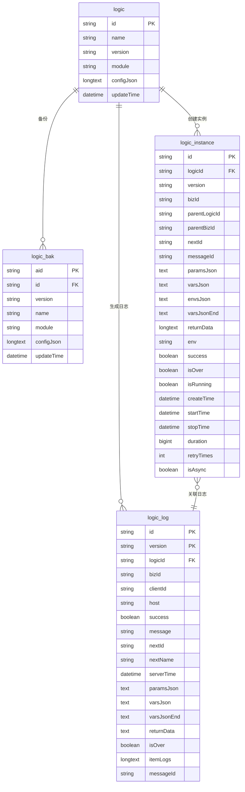

# 数据库设计

<cite>
**本文档中引用的文件**  
- [v0.6.2.sql](file://doc/sql-scripts/full/v0.6.2.sql)
- [v0.7.4.sql](file://doc/sql-scripts/full/v0.7.4.sql)
- [v0.7.7.sql](file://doc/sql-scripts/full/v0.7.7.sql)
- [v0.8.sql](file://doc/sql-scripts/full/v0.8.sql)
- [0.5升级0.6.2.sql](file://doc/sql-scripts/merge/0.5升级0.6.2.sql)
- [v0.6.2升级0.7.4.sql](file://doc/sql-scripts/merge/v0.6.2升级0.7.4.sql)
- [0.7.4升级0.7.7.sql](file://doc/sql-scripts/merge/0.7.4升级0.7.7.sql)
- [version-relations.md](file://doc/version/version-relations.md)
</cite>

## 目录
1. [引言](#引言)
2. [核心表结构详解](#核心表结构详解)
3. [版本演进与数据迁移](#版本演进与数据迁移)
4. [实体关系图（ER图）](#实体关系图er图)
5. [架构设计：配置与运行时分离](#架构设计配置与运行时分离)
6. [索引策略与查询优化](#索引策略与查询优化)
7. [分库分表与大数据量处理建议](#分库分表与大数据量处理建议)
8. [结论](#结论)

## 引言
本文档基于 `doc/sql-scripts` 目录下的全量与增量 SQL 脚本，全面描述系统数据库的模式设计。重点分析 `logic_config`（逻辑配置）、`logic_instance`（逻辑实例）、`logic_log`（执行日志）、`logic_bak`（备份配置）等核心表的字段定义、约束条件、索引策略及版本演进路径。通过对比 v0.6.2 至 v0.8 的变更，阐明各版本间的数据迁移逻辑，并绘制 ER 图展示表间关系，突出配置数据（设计时）与运行时数据的分离架构。

**本节不涉及具体源码文件分析，因此无节来源**

## 核心表结构详解

### logic_config 表（即 `logic` 表）
该表存储逻辑配置的主版本信息，属于设计时数据。

- **字段说明**：
  - `id`: 主键，36位字符串，唯一标识一个逻辑配置。
  - `name`: 逻辑名称，最大长度50字符。
  - `version`: 版本号，最大长度50字符。
  - `module`: 所属模块，最大长度50字符。
  - `configJson`: 配置内容，使用 `longtext` 类型存储 JSON 格式的完整逻辑定义。
  - `updateTime`: 更新时间，自动维护为当前时间戳，记录每次修改时间。

- **约束与索引**：
  - 主键：`PRIMARY KEY (id)`
  - 字符集：`utf8mb4`，支持完整 Unicode 字符（如表情符号）。
  - 存储引擎：`InnoDB`

**节来源**  
- [v0.6.2.sql](file://doc/sql-scripts/full/v0.6.2.sql#L20-L28)

### logic_bak 表（逻辑配置备份）
该表用于存储逻辑配置的历史版本，支持版本回滚。

- **字段说明**：
  - `aid`: 主键，36位字符串，唯一标识一条备份记录。
  - `id`: 对应 `logic` 表的 `id`，标识被备份的逻辑。
  - 其余字段（`name`, `version`, `module`, `configJson`, `updateTime`）与 `logic` 表一致。

- **约束与索引**：
  - 主键：`PRIMARY KEY (aid)`
  - 新增复合索引：`KEY logicid_version_idx (id, version)`（自 v0.7.7 起引入），用于高效查询某逻辑的特定版本备份。

**节来源**  
- [v0.6.2.sql](file://doc/sql-scripts/full/v0.6.2.sql#L32-L40)
- [0.7.4升级0.7.7.sql](file://doc/sql-scripts/merge/0.7.4升级0.7.7.sql#L2-L3)

### logic_instance 表（逻辑实例）
该表记录每次逻辑执行的运行时状态，属于运行时数据。

- **字段说明**：
  - `id`: 主键，36位字符串，唯一标识一个实例。
  - `logicId`: 关联的逻辑配置ID。
  - `version`: 执行时的逻辑版本。
  - `bizId`: 业务实例标识，用于关联同一业务流程的多次交互。
  - `parentLogicId`, `parentBizId`: 支持子逻辑调用，记录父逻辑上下文。
  - `paramsJson`, `varsJson`, `envsJson`: 存储执行所需的参数、变量和环境。
  - `varsJsonEnd`: 执行结束后的变量快照，用于恢复状态。
  - `returnData`: 最近一次返回结果。
  - `isOver`, `isRunning`: 标识实例的生命周期状态。
  - `createTime`: 实例创建时间（v0.7.4 引入）。
  - `startTime`, `stopTime`: 执行的开始和结束时间，精度为毫秒。
  - `duration`: 执行持续时间（毫秒）。
  - `retryTimes`: 重试次数。
  - `isAsync`: 是否为异步调用（v0.7.7 引入）。

- **约束与索引**：
  - 主键：`PRIMARY KEY (id)`
  - 复合索引：`KEY idx_logicId_bizId (logicId, bizId)`，用于快速定位某逻辑下某业务的所有实例。
  - 新增复合索引（v0.8）：`KEY idx_bizId_parBizId_serverTime (bizId DESC, parentBizId DESC, serverTime DESC)`，优化按业务标识和时间倒序查询的性能。

**节来源**  
- [v0.6.2.sql](file://doc/sql-scripts/full/v0.6.2.sql#L44-L76)
- [v0.7.4.sql](file://doc/sql-scripts/full/v0.7.4.sql#L44-L80)
- [v0.7.7.sql](file://doc/sql-scripts/full/v0.7.7.sql#L44-L84)
- [v0.8.sql](file://doc/sql-scripts/full/v0.8.sql#L44-L86)

### logic_log 表（执行日志）
该表记录每次逻辑执行的详细日志，属于运行时数据。

- **字段说明**：
  - `id`: 主键，36位字符串。
  - `version`: 分区键，与 `id` 组成联合主键，支持按版本分区。
  - `logicId`, `bizId`: 关联逻辑和业务实例。
  - `clientId`, `host`: 记录调用来源。
  - `success`, `message`: 执行结果摘要。
  - `paramsJson`, `varsJson`, `varsJsonEnd`: 执行上下文快照。
  - `itemLogs`: 详细执行过程日志，`longtext` 类型。
  - `messageId`: 消息唯一标识，用于链路追踪。
  - `serverTime`: 服务器时间，精度为毫秒。

- **约束与索引**：
  - 联合主键：`PRIMARY KEY (id, version)`
  - 复合索引：`KEY logicId_bizId (logicId, bizId)`，用于按逻辑和业务查询日志。

**节来源**  
- [v0.6.2.sql](file://doc/sql-scripts/full/v0.6.2.sql#L80-L111)

## 版本演进与数据迁移

### v0.5 → v0.6.2
此版本引入了父子逻辑调用和更精确的执行时间追踪。

- **新增字段**：
  - `logic_instance` 表：`parentLogicId`, `parentBizId`, `isRunning`, `startTime`, `stopTime`, `duration`
  - `logic_log` 表：`serverTime` 精度提升至毫秒（`datetime(3)`）

**节来源**  
- [0.5升级0.6.2.sql](file://doc/sql-scripts/merge/0.5升级0.6.2.sql#L1-L16)

### v0.6.2 → v0.7.4
此版本增加了实例创建时间和重试次数统计。

- **新增字段**：
  - `logic_instance` 表：`createTime`, `retryTimes`

**节来源**  
- [v0.6.2升级0.7.4.sql](file://doc/sql-scripts/merge/v0.6.2升级0.7.4.sql#L1-L3)

### v0.7.4 → v0.7.7
此版本支持异步调用标识，并为备份表添加索引以提升查询效率。

- **新增字段**：
  - `logic_instance` 表：`isAsync`
- **新增索引**：
  - `logic_bak` 表：`logicid_version_idx (id, version)`

**节来源**  
- [0.7.4升级0.7.7.sql](file://doc/sql-scripts/merge/0.7.4升级0.7.7.sql#L1-L4)

### v0.7.7 → v0.8
此版本为 `logic_instance` 表添加了针对业务场景的复合索引，优化了按 `bizId` 和时间倒序查询的性能。

- **新增索引**：
  - `logic_instance` 表：`idx_bizId_parBizId_serverTime (bizId DESC, parentBizId DESC, serverTime DESC)`

**节来源**  
- [v0.8.sql](file://doc/sql-scripts/full/v0.8.sql#L75)

## 实体关系图（ER图）

**图来源**  
- [v0.6.2.sql](file://doc/sql-scripts/full/v0.6.2.sql)
- [v0.7.4.sql](file://doc/sql-scripts/full/v0.7.4.sql)
- [v0.7.7.sql](file://doc/sql-scripts/full/v0.7.7.sql)
- [v0.8.sql](file://doc/sql-scripts/full/v0.8.sql)

## 架构设计：配置与运行时分离

系统采用清晰的架构分离设计时配置数据与运行时执行数据：

- **配置数据（设计时）**：
  - `logic` 表：存储当前生效的逻辑配置。
  - `logic_bak` 表：存储历史版本，支持版本管理和回滚。
  - 特点：数据量相对稳定，读写频率中等，强调数据一致性。

- **运行时数据（执行时）**：
  - `logic_instance` 表：存储实例的生命周期状态。
  - `logic_log` 表：存储详细的执行日志。
  - 特点：数据量巨大且持续增长，写入频繁，查询模式多样（按实例、业务、时间等）。

这种分离使得配置管理与执行追踪互不影响，便于独立优化和维护。

**节来源**  
- [v0.6.2.sql](file://doc/sql-scripts/full/v0.6.2.sql)
- [v0.8.sql](file://doc/sql-scripts/full/v0.8.sql)

## 索引策略与查询优化

### 当前索引策略
- `logic_instance`：
  - `idx_logicId_bizId`：优化按逻辑和业务查询实例。
  - `idx_bizId_parBizId_serverTime`（v0.8）：优化按业务标识和时间倒序查询，适用于监控和审计场景。
- `logic_bak`：
  - `logicid_version_idx`（v0.7.7）：优化按逻辑ID和版本号查询备份。
- `logic_log`：
  - `logicId_bizId`：优化按逻辑和业务查询日志。

### 查询优化建议
1. **时间范围查询**：利用 `startTime`, `stopTime`, `serverTime` 字段结合索引进行高效过滤。
2. **业务链路追踪**：通过 `bizId` 和 `messageId` 关联 `logic_instance` 和 `logic_log`，实现完整执行链路的追踪。
3. **状态监控**：使用 `isRunning`, `isOver`, `success` 字段快速筛选出运行中、失败或已完成的实例。

## 分库分表与大数据量处理建议

### 分库分表策略
当前 SQL 脚本未显式定义分库分表规则，但可通过以下方式实现：
- **按 `bizId` 分片**：将不同业务的数据分散到不同数据库或表中，避免单表过大。
- **按时间分区**：对 `logic_log` 和 `logic_instance` 表按 `createTime` 或 `serverTime` 进行范围分区（RANGE Partitioning），例如按月或按周分区，提升查询和维护效率。

### 大数据量处理建议
1. **归档机制**：
   - 定期将超过一定时间（如6个月）的 `logic_log` 和 `logic_instance` 数据归档至历史库或冷存储。
   - 可编写定时任务，将旧数据迁移至 `logic_log_archive` 和 `logic_instance_archive` 表。
2. **读写分离**：
   - 配置主从数据库，将复杂的日志查询请求路由到从库，减轻主库压力。
3. **异步写入**：
   - 对于非关键日志，可考虑通过消息队列异步写入数据库，提高主流程响应速度。

**节来源**  
- [v0.8.sql](file://doc/sql-scripts/full/v0.8.sql)
- [v0.7.7.sql](file://doc/sql-scripts/full/v0.7.7.sql)

## 结论
本文档详细分析了从 v0.6.2 到 v0.8 的数据库模式演进，明确了核心表的结构、约束、索引及版本变更。系统通过 `logic` 和 `logic_bak` 管理配置，通过 `logic_instance` 和 `logic_log` 追踪运行时，实现了清晰的架构分离。建议在数据量增长后，实施按 `bizId` 分片和按时间分区的策略，并建立数据归档机制，以保障系统长期稳定高效运行。

**本节为总结性内容，不涉及具体源码文件分析，因此无节来源**