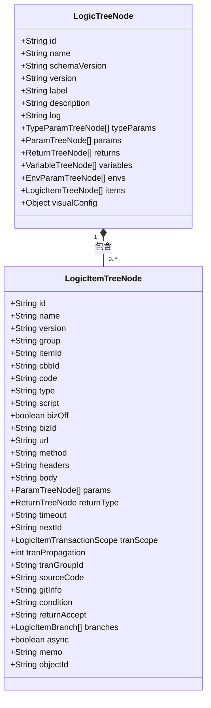
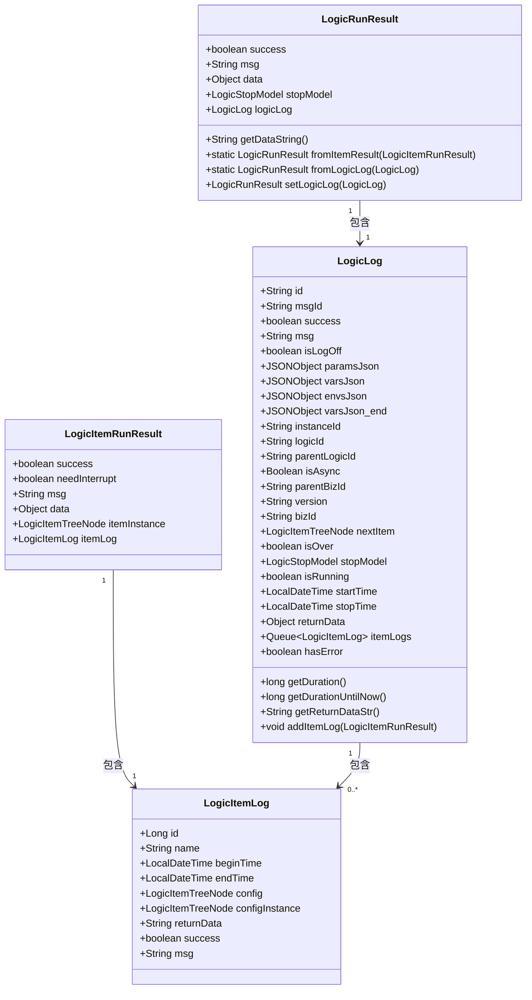
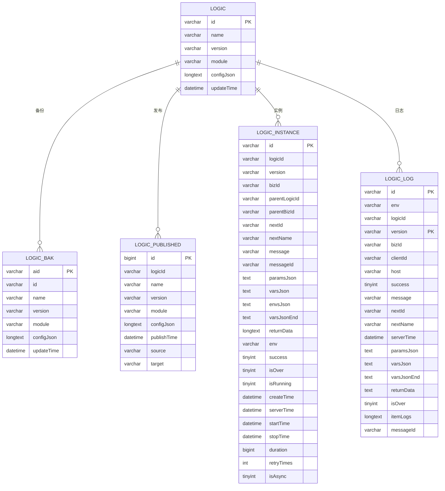

# 数据模型

<cite>
**本文档引用的文件**
- [LogicTreeNode.java](file://logic-runtime/src/main/java/com/aims/logic/runtime/contract/dsl/LogicTreeNode.java)
- [LogicItemTreeNode.java](file://logic-runtime/src/main/java/com/aims/logic/runtime/contract/dsl/LogicItemTreeNode.java)
- [LogicRunResult.java](file://logic-runtime/src/main/java/com/aims/logic/runtime/contract/dto/LogicRunResult.java)
- [LogicItemRunResult.java](file://logic-runtime/src/main/java/com/aims/logic/runtime/contract/dto/LogicItemRunResult.java)
- [LogicLog.java](file://logic-runtime/src/main/java/com/aims/logic/runtime/contract/logger/LogicLog.java)
- [LogicItemLog.java](file://logic-runtime/src/main/java/com/aims/logic/runtime/contract/logger/LogicItemLog.java)
- [v0.8.sql](file://doc/sql-scripts/full/v0.8.sql)
</cite>

## 目录
1. [引言](#引言)
2. [核心数据结构](#核心数据结构)
3. [实体关系与字段定义](#实体关系与字段定义)
4. [执行结果模式](#执行结果模式)
5. [数据库模式](#数据库模式)
6. [JSON模式定义](#json模式定义)
7. [数据验证规则与业务约束](#数据验证规则与业务约束)
8. [数据访问模式与缓存策略](#数据访问模式与缓存策略)
9. [数据生命周期与保留策略](#数据生命周期与保留策略)
10. [数据迁移路径与版本管理](#数据迁移路径与版本管理)
11. [数据安全与访问控制](#数据安全与访问控制)

## 引言
本数据模型文档详细描述了`logic-solution`系统中的核心数据结构，重点分析`LogicTreeNode`和`LogicItemTreeNode`的实体关系、字段定义及数据类型。同时，深入解析`LogicRunResult`和`LogicItemRunResult`中的执行结果模式，提供数据库模式图和JSON模式定义。文档还涵盖数据验证规则、业务约束、数据访问模式、缓存策略、性能考虑、数据生命周期、保留策略、归档规则、数据迁移路径、版本管理策略、数据安全、隐私要求和访问控制机制。

## 核心数据结构
`logic-solution`系统的核心数据结构围绕逻辑编排和执行展开，主要包括`LogicTreeNode`、`LogicItemTreeNode`、`LogicRunResult`和`LogicItemRunResult`四个核心类。这些类定义了逻辑配置、节点信息、执行结果和日志记录的完整数据模型。

**Section sources**
- [LogicTreeNode.java](file://logic-runtime/src/main/java/com/aims/logic/runtime/contract/dsl/LogicTreeNode.java)
- [LogicItemTreeNode.java](file://logic-runtime/src/main/java/com/aims/logic/runtime/contract/dsl/LogicItemTreeNode.java)
- [LogicRunResult.java](file://logic-runtime/src/main/java/com/aims/logic/runtime/contract/dto/LogicRunResult.java)
- [LogicItemRunResult.java](file://logic-runtime/src/main/java/com/aims/logic/runtime/contract/dto/LogicItemRunResult.java)

## 实体关系与字段定义
### LogicTreeNode 与 LogicItemTreeNode 实体关系
`LogicTreeNode`代表一个完整的逻辑编排，包含多个`LogicItemTreeNode`节点。`LogicItemTreeNode`是逻辑编排中的具体执行单元，两者构成树形结构。



**Diagram sources**
- [LogicTreeNode.java](file://logic-runtime/src/main/java/com/aims/logic/runtime/contract/dsl/LogicTreeNode.java)
- [LogicItemTreeNode.java](file://logic-runtime/src/main/java/com/aims/logic/runtime/contract/dsl/LogicItemTreeNode.java)

### LogicTreeNode 字段定义
`LogicTreeNode`类定义了逻辑编排的顶层结构，包含以下字段：

| 字段名 | 数据类型 | 描述 |
|-------|--------|------|
| id | String | 逻辑唯一标识 |
| name | String | 逻辑名称 |
| schemaVersion | String | schema格式版本号 |
| version | String | 配置版本号 |
| label | String | 标签 |
| description | String | 描述 |
| log | String | 日志配置 |
| typeParams | List~TypeParamTreeNode~ | 类型参数列表 |
| params | List~ParamTreeNode~ | 参数列表 |
| returns | List~ReturnTreeNode~ | 返回值列表 |
| variables | List~VariableTreeNode~ | 变量列表 |
| envs | List~EnvParamTreeNode~ | 环境参数列表 |
| items | List~LogicItemTreeNode~ | 逻辑项列表 |
| visualConfig | Object | 可视化配置 |

**Section sources**
- [LogicTreeNode.java](file://logic-runtime/src/main/java/com/aims/logic/runtime/contract/dsl/LogicTreeNode.java)

### LogicItemTreeNode 字段定义
`LogicItemTreeNode`类定义了逻辑编排中的具体执行节点，包含以下字段：

| 字段名 | 数据类型 | 描述 |
|-------|--------|------|
| id | String | 节点唯一标识 |
| name | String | 节点名称 |
| version | String | 节点版本 |
| group | String | 节点分组 |
| itemId | String | 组件唯一标识（基于name+group） |
| cbbId | String | 组件版本控制唯一标识 |
| code | String | 节点代码 |
| type | String | 节点类型 |
| script | String | 脚本 |
| bizOff | boolean | 是否关闭业务实例调用 |
| bizId | String | 业务标识（当bizOff=false时） |
| url | String | URL |
| method | String | 方法（格式：方法名(参数1,参数2)） |
| headers | String | HTTP头 |
| body | String | HTTP请求体 |
| params | List~ParamTreeNode~ | 强类型参数声明 |
| returnType | ReturnTreeNode | 强类型返回值声明 |
| timeout | String | 超时时间（默认5000ms） |
| nextId | String | 下一个节点ID |
| tranScope | LogicItemTransactionScope | 事务范围 |
| tranPropagation | int | 事务传播属性 |
| tranGroupId | String | 事务组ID |
| sourceCode | String | 源代码 |
| gitInfo | String | Git信息 |
| condition | String | 条件分支表达式 |
| returnAccept | String | 返回值接收参数 |
| branches | List~LogicItemBranch~ | switch分支 |
| async | boolean | 是否异步执行 |
| memo | String | 备注 |
| objectId | String | 节点执行时实例化对象唯一编号 |

**Section sources**
- [LogicItemTreeNode.java](file://logic-runtime/src/main/java/com/aims/logic/runtime/contract/dsl/LogicItemTreeNode.java)

## 执行结果模式
### LogicRunResult 与 LogicItemRunResult 模式
`LogicRunResult`和`LogicItemRunResult`定义了逻辑执行的结果模式，包含执行状态、消息、返回数据和日志信息。



**Diagram sources**
- [LogicRunResult.java](file://logic-runtime/src/main/java/com/aims/logic/runtime/contract/dto/LogicRunResult.java)
- [LogicItemRunResult.java](file://logic-runtime/src/main/java/com/aims/logic/runtime/contract/dto/LogicItemRunResult.java)
- [LogicLog.java](file://logic-runtime/src/main/java/com/aims/logic/runtime/contract/logger/LogicLog.java)
- [LogicItemLog.java](file://logic-runtime/src/main/java/com/aims/logic/runtime/contract/logger/LogicItemLog.java)

### LogicRunResult 字段定义
`LogicRunResult`类定义了逻辑执行的总体结果：

| 字段名 | 数据类型 | 描述 |
|-------|--------|------|
| success | boolean | 执行是否成功 |
| msg | String | 消息 |
| data | Object | 返回数据 |
| stopModel | LogicStopModel | 停止模式 |
| logicLog | LogicLog | 执行日志 |

**Section sources**
- [LogicRunResult.java](file://logic-runtime/src/main/java/com/aims/logic/runtime/contract/dto/LogicRunResult.java)

### LogicItemRunResult 字段定义
`LogicItemRunResult`类定义了单个逻辑项执行的结果：

| 字段名 | 数据类型 | 描述 |
|-------|--------|------|
| success | boolean | 执行是否成功 |
| needInterrupt | boolean | 是否需要中断 |
| msg | String | 消息 |
| data | Object | 返回数据 |
| itemInstance | LogicItemTreeNode | 逻辑项实例 |
| itemLog | LogicItemLog | 逻辑项日志 |

**Section sources**
- [LogicItemRunResult.java](file://logic-runtime/src/main/java/com/aims/logic/runtime/contract/dto/LogicItemRunResult.java)

## 数据库模式
### 数据库表结构
根据v0.8.sql文件，系统包含以下核心数据表：



**Diagram sources**
- [v0.8.sql](file://doc/sql-scripts/full/v0.8.sql)

## JSON模式定义
### LogicTreeNode JSON模式
```json
{
  "id": "string",
  "name": "string",
  "schemaVersion": "string",
  "version": "string",
  "label": "string",
  "description": "string",
  "log": "string",
  "typeParams": [
    {
      "name": "string",
      "className": "string",
      "typeAnnotation": {
        "typeName": "string",
        "genericTypes": []
      },
      "required": "boolean",
      "defaultValue": "string"
    }
  ],
  "params": [
    {
      "name": "string",
      "className": "string",
      "typeAnnotation": {
        "typeName": "string",
        "genericTypes": []
      },
      "required": "boolean",
      "defaultValue": "string"
    }
  ],
  "returns": [
    {
      "name": "string",
      "className": "string",
      "typeAnnotation": {
        "typeName": "string",
        "genericTypes": []
      },
      "required": "boolean",
      "defaultValue": "string"
    }
  ],
  "variables": [
    {
      "name": "string",
      "className": "string",
      "typeAnnotation": {
        "typeName": "string",
        "genericTypes": []
      },
      "required": "boolean",
      "defaultValue": "string"
    }
  ],
  "envs": [
    {
      "name": "string",
      "className": "string",
      "typeAnnotation": {
        "typeName": "string",
        "genericTypes": []
      },
      "required": "boolean",
      "defaultValue": "string"
    }
  ],
  "items": [
    {
      "id": "string",
      "name": "string",
      "version": "string",
      "group": "string",
      "itemId": "string",
      "cbbId": "string",
      "code": "string",
      "type": "string",
      "script": "string",
      "bizOff": "boolean",
      "bizId": "string",
      "url": "string",
      "method": "string",
      "headers": "string",
      "body": "string",
      "params": [],
      "returnType": {
        "name": "string",
        "className": "string",
        "typeAnnotation": {
          "typeName": "string",
          "genericTypes": []
        },
        "required": "boolean",
        "defaultValue": "string"
      },
      "timeout": "string",
      "nextId": "string",
      "tranScope": "string",
      "tranPropagation": "number",
      "tranGroupId": "string",
      "sourceCode": "string",
      "gitInfo": "string",
      "condition": "string",
      "returnAccept": "string",
      "branches": [
        {
          "when": "string",
          "nextId": "string"
        }
      ],
      "async": "boolean",
      "memo": "string",
      "objectId": "string"
    }
  ],
  "visualConfig": {}
}
```

**Section sources**
- [LogicTreeNode.java](file://logic-runtime/src/main/java/com/aims/logic/runtime/contract/dsl/LogicTreeNode.java)

## 数据验证规则与业务约束
### 核心验证规则
1. **ID生成规则**：`LogicItemTreeNode`的`itemId`和`cbbId`通过`generateId`方法生成，基于SHA-256哈希算法，确保唯一性。
2. **事务范围约束**：`tranScope`字段必须为预定义的枚举值（off, def, everyNode2, everyNode, everyRequest）。
3. **超时时间默认值**：`timeout`字段若为空，默认值为"5000"毫秒。
4. **必填字段约束**：`id`、`name`、`version`等核心字段不能为空。
5. **数据类型约束**：所有参数和返回值必须符合`TypeAnnotationTreeNode`定义的类型规范。

### 业务约束
1. **逻辑复用约束**：复用逻辑时，`id`由父逻辑传入进行串联，确保调用链路追踪。
2. **异步执行约束**：异步执行节点不等待返回结果，默认成功。
3. **事务传播约束**：事务传播属性必须符合业务需求，避免事务边界错误。
4. **版本控制约束**：组件版本变更时，`cbbId`必须随之变化，确保版本唯一性。
5. **日志记录约束**：日志队列大小受`RuntimeUtil.AppConfig.itemQueueSize`限制，超出时自动移除最旧日志。

**Section sources**
- [LogicItemTreeNode.java](file://logic-runtime/src/main/java/com/aims/logic/runtime/contract/dsl/LogicItemTreeNode.java)
- [LogicLog.java](file://logic-runtime/src/main/java/com/aims/logic/runtime/contract/logger/LogicLog.java)

## 数据访问模式与缓存策略
### 数据访问模式
1. **逻辑配置访问**：通过`LogicDataService.tryGetLogicConfigByAllWays`方法获取逻辑配置，支持多途径查询。
2. **实例状态访问**：通过`logic_instance`表查询业务实例状态，支持按`logicId`和`bizId`索引。
3. **执行日志访问**：通过`logic_log`表查询执行日志，支持按`logicId`和`bizId`索引。
4. **备份配置访问**：通过`logic_bak`表查询历史配置，支持按`id`和`version`索引。

### 缓存策略
1. **Caffeine缓存**：系统使用`CaffeineCacheConfig`配置本地缓存，提高频繁访问数据的性能。
2. **日志队列缓存**：`LogicLog`中的`itemLogs`使用`ArrayDeque`作为内存队列，限制大小为`RuntimeUtil.AppConfig.itemQueueSize`。
3. **配置缓存**：逻辑配置在加载后可能被缓存，避免重复解析。
4. **结果缓存**：执行结果可能根据业务需求进行缓存，减少重复计算。

**Section sources**
- [LogicItemTreeNode.java](file://logic-runtime/src/main/java/com/aims/logic/runtime/contract/dsl/LogicItemTreeNode.java)
- [LogicLog.java](file://logic-runtime/src/main/java/com/aims/logic/runtime/contract/logger/LogicLog.java)
- [CaffeineCacheConfig.java](file://logic-runtime/src/main/java/com/aims/logic/runtime/configuration/CaffeineCacheConfig.java)

## 数据生命周期与保留策略
### 数据生命周期
1. **创建阶段**：逻辑配置创建时生成`LogicTreeNode`，保存到`logic`表。
2. **发布阶段**：逻辑发布时生成`LogicPublishedEntity`，保存到`logic_published`表。
3. **执行阶段**：逻辑执行时生成`LogicInstanceEntity`和`LogicLogEntity`，分别保存到`logic_instance`和`logic_log`表。
4. **备份阶段**：逻辑变更时生成`LogicBakEntity`，保存到`logic_bak`表。
5. **归档阶段**：历史数据根据保留策略进行归档或清理。

### 保留策略
1. **实例数据保留**：`logic_instance`表数据根据业务需求保留，可能按时间或业务标识清理。
2. **日志数据保留**：`logic_log`表数据保留一定时间（如30天），之后归档或删除。
3. **备份数据保留**：`logic_bak`表数据保留多个版本，支持回滚到任意历史版本。
4. **发布数据保留**：`logic_published`表数据永久保留，记录所有发布历史。

**Section sources**
- [LogicTreeNode.java](file://logic-runtime/src/main/java/com/aims/logic/runtime/contract/dsl/LogicTreeNode.java)
- [LogicLog.java](file://logic-runtime/src/main/java/com/aims/logic/runtime/contract/logger/LogicLog.java)

## 数据迁移路径与版本管理
### 数据迁移路径
1. **版本升级**：从v0.6.2升级到v0.8.0，通过`0.5升级0.6.2.sql`、`v0.6.2升级0.7.4.sql`、`0.7.4升级0.7.7.sql`等脚本逐步迁移。
2. **结构变更**：表结构变更通过SQL脚本执行，确保数据兼容性。
3. **数据转换**：配置数据可能需要转换格式，确保新版本兼容旧配置。

### 版本管理策略
1. **逻辑版本**：`LogicTreeNode`的`version`字段标识配置版本。
2. **组件版本**：`LogicItemTreeNode`的`version`字段标识组件版本，`cbbId`确保版本唯一性。
3. **Schema版本**：`LogicTreeNode`的`schemaVersion`字段标识schema格式版本。
4. **发布版本**：`logic_published`表记录每次发布的版本信息。

**Section sources**
- [LogicTreeNode.java](file://logic-runtime/src/main/java/com/aims/logic/runtime/contract/dsl/LogicTreeNode.java)
- [LogicItemTreeNode.java](file://logic-runtime/src/main/java/com/aims/logic/runtime/contract/dsl/LogicItemTreeNode.java)
- [doc/sql-scripts](file://doc/sql-scripts)

## 数据安全与访问控制
### 数据安全机制
1. **ID生成安全**：使用SHA-256哈希算法生成唯一ID，确保ID不可预测。
2. **数据加密**：敏感数据可能需要加密存储，确保数据安全。
3. **日志脱敏**：日志中可能包含敏感信息，需要进行脱敏处理。
4. **访问审计**：关键操作需要记录审计日志，确保可追溯性。

### 访问控制机制
1. **业务标识控制**：通过`bizId`字段控制业务实例的访问权限。
2. **环境隔离**：通过`env`字段区分不同环境（开发、测试、生产）。
3. **权限验证**：API调用需要验证权限，确保只有授权用户可访问。
4. **事务控制**：通过`tranScope`和`tranGroupId`控制事务边界，确保数据一致性。

**Section sources**
- [LogicItemTreeNode.java](file://logic-runtime/src/main/java/com/aims/logic/runtime/contract/dsl/LogicItemTreeNode.java)
- [LogicLog.java](file://logic-runtime/src/main/java/com/aims/logic/runtime/contract/logger/LogicLog.java)