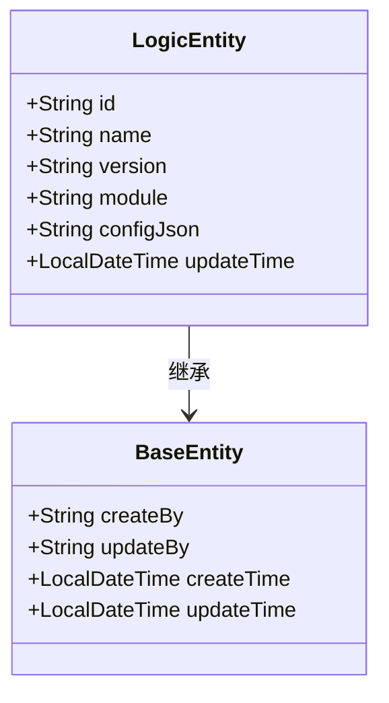
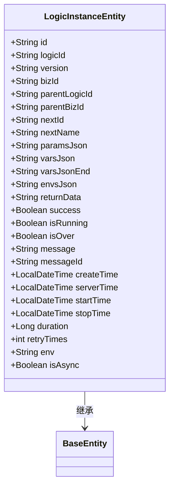
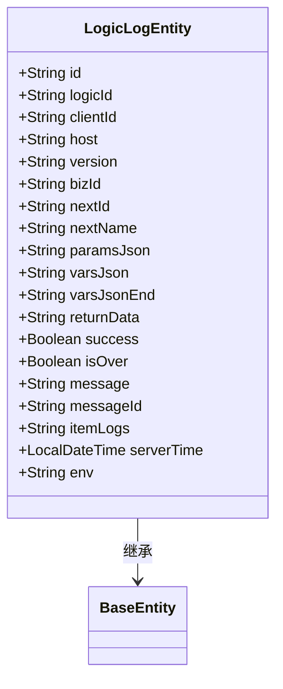
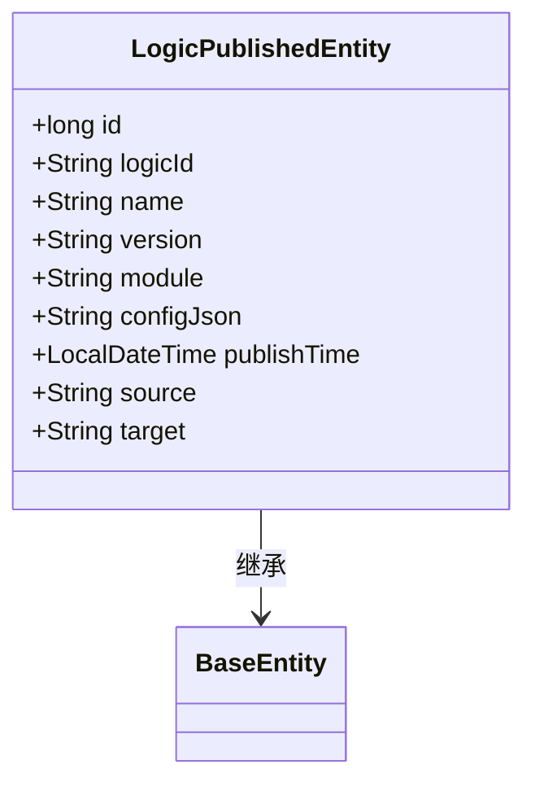
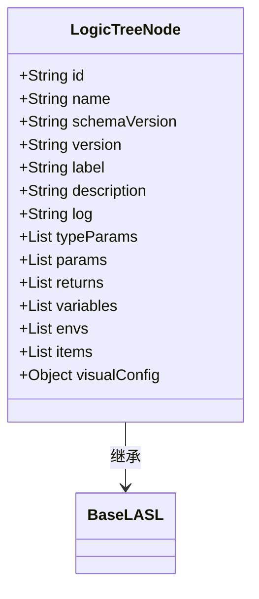
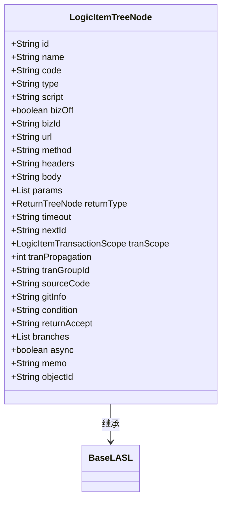
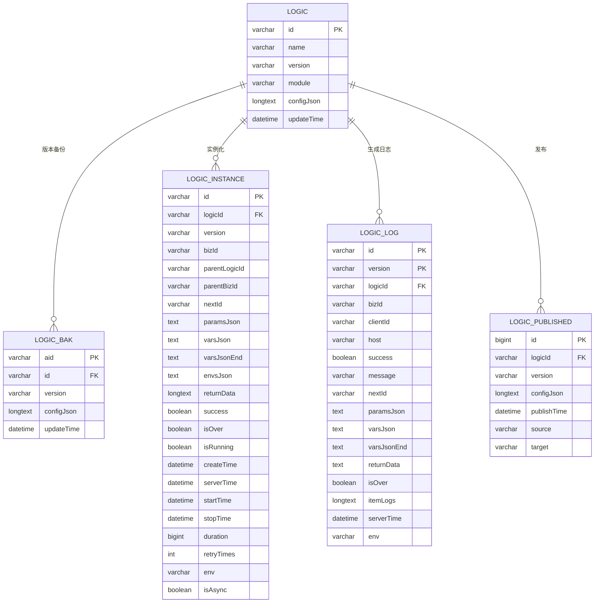
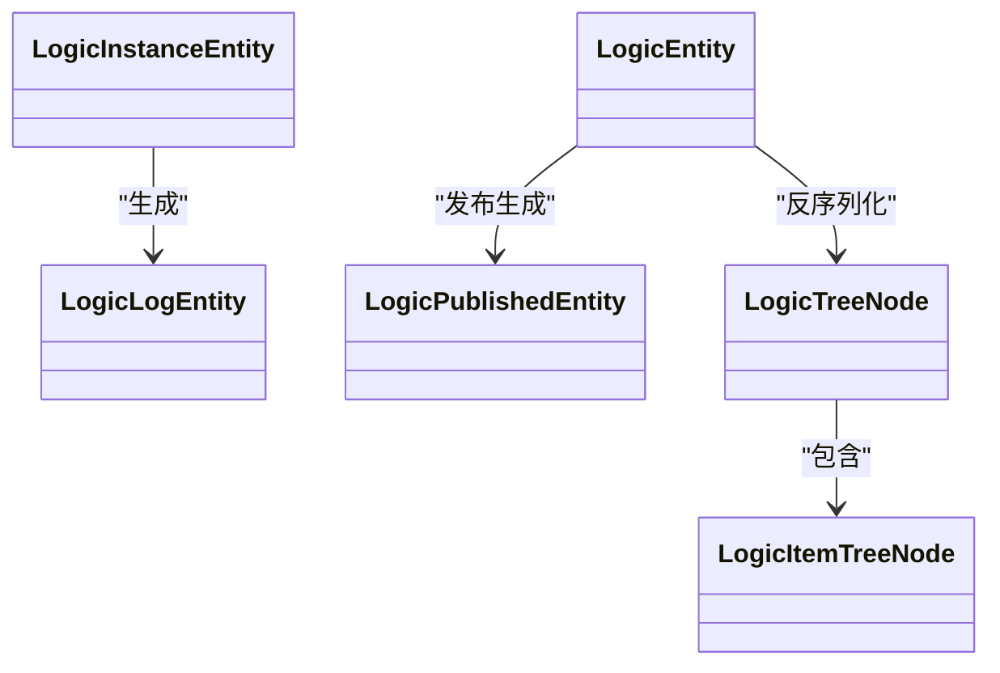

# 数据模型

<cite>
**本文档引用文件**  
- [v0.8.sql](file://doc/sql-scripts/full/v0.8.sql)
- [LogicEntity.java](file://logic-sdk/src/main/java/com/aims/logic/sdk/entity/LogicEntity.java)
- [LogicInstanceEntity.java](file://logic-sdk/src/main/java/com/aims/logic/sdk/entity/LogicInstanceEntity.java)
- [LogicLogEntity.java](file://logic-sdk/src/main/java/com/aims/logic/sdk/entity/LogicLogEntity.java)
- [LogicPublishedEntity.java](file://logic-sdk/src/main/java/com/aims/logic/sdk/entity/LogicPublishedEntity.java)
- [LogicTreeNode.java](file://logic-runtime/src/main/java/com/aims/logic/runtime/contract/dsl/LogicTreeNode.java)
- [LogicItemTreeNode.java](file://logic-runtime/src/main/java/com/aims/logic/runtime/contract/dsl/LogicItemTreeNode.java)
</cite>

## 目录
1. [引言](#引言)
2. [数据库表结构](#数据库表结构)
3. [核心实体类与表映射](#核心实体类与表映射)
4. [运行时DSL树结构](#运行时dsl树结构)
5. [配置数据与运行时数据分离设计](#配置数据与运行时数据分离设计)
6. [ER图与对象结构图](#er图与对象结构图)

## 引言
本文档旨在构建完整的数据模型文档，涵盖数据库表结构与内存数据结构两部分。基于 `doc/sql-scripts` 中的 SQL 脚本，详细描述逻辑配置、实例、日志等核心表的字段定义、主外键关系及索引策略。同时解析 `logic-sdk` 中实体类（如 `LogicEntity`、`LogicInstanceEntity`）与 `logic-runtime` 中 DSL 树节点（`LogicTreeNode`、`LogicItemTreeNode`）的映射关系。说明配置数据与运行时数据的分离设计，并提供 ER 图和对象结构图辅助理解。

## 数据库表结构

### logic 表（逻辑配置）
存储逻辑流程的元数据与配置信息。

| 字段名 | 类型 | 允许空 | 默认值 | 描述 |
|--------|------|--------|--------|------|
| id | varchar(36) | 否 | 无 | 主键，逻辑唯一标识 |
| name | varchar(50) | 是 | NULL | 逻辑名称 |
| version | varchar(50) | 是 | NULL | 逻辑版本号 |
| module | varchar(50) | 是 | NULL | 所属模块 |
| configJson | longtext | 是 | NULL | 逻辑完整配置（JSON 格式） |
| updateTime | datetime | 是 | CURRENT_TIMESTAMP ON UPDATE CURRENT_TIMESTAMP | 更新时间 |

**主键**：`id`  
**索引**：无额外索引

**Section sources**
- [v0.8.sql](file://doc/sql-scripts/full/v0.8.sql#L15-L23)

### logic_bak 表（逻辑备份）
存储逻辑配置的历史版本备份。

| 字段名 | 类型 | 允许空 | 默认值 | 描述 |
|--------|------|--------|--------|------|
| aid | varchar(36) | 否 | 无 | 主键，唯一标识 |
| id | varchar(36) | 是 | NULL | 对应逻辑 ID |
| name | varchar(50) | 是 | NULL | 逻辑名称 |
| version | varchar(50) | 是 | NULL | 版本号 |
| module | varchar(50) | 是 | NULL | 所属模块 |
| configJson | longtext | 是 | NULL | 配置 JSON |
| updateTime | datetime | 是 | CURRENT_TIMESTAMP ON UPDATE CURRENT_TIMESTAMP | 更新时间 |

**主键**：`aid`  
**索引**：`idx_logicid_version_idx` (`id`, `version`)，用于按逻辑 ID 和版本查询

**Section sources**
- [v0.8.sql](file://doc/sql-scripts/full/v0.8.sql#L25-L35)

### logic_instance 表（逻辑实例）
记录每次逻辑执行的运行时状态与上下文。

| 字段名 | 类型 | 允许空 | 默认值 | 描述 |
|--------|------|--------|--------|------|
| id | varchar(36) | 否 | 无 | 主键，实例唯一标识 |
| logicId | varchar(36) | 是 | NULL | 逻辑 ID |
| version | varchar(50) | 是 | NULL | 逻辑版本 |
| bizId | varchar(36) | 是 | NULL | 业务实例标识 |
| parentLogicId | varchar(36) | 是 | NULL | 父逻辑 ID |
| parentBizId | varchar(36) | 是 | NULL | 父业务标识 |
| nextId | varchar(36) | 是 | NULL | 下一待执行节点 ID |
| nextName | varchar(255) | 是 | NULL | 下一节点名称 |
| message | varchar(255) | 是 | NULL | 消息内容 |
| messageId | varchar(255) | 是 | NULL | 消息唯一标识 |
| paramsJson | text | 是 | NULL | 前序参数缓存 |
| varsJson | text | 是 | NULL | 初始局部变量 |
| envsJson | text | 是 | NULL | 初始环境变量 |
| varsJsonEnd | text | 是 | NULL | 执行结束时局部变量 |
| returnData | longtext | 是 | NULL | 最近返回数据 |
| env | varchar(10) | 是 | NULL | 执行环境 |
| success | tinyint(1) | 是 | NULL | 是否成功 |
| isOver | tinyint(1) | 是 | 0 | 是否结束 |
| isRunning | tinyint(1) | 是 | 0 | 是否运行中 |
| createTime | datetime | 是 | CURRENT_TIMESTAMP | 实例创建时间 |
| serverTime | datetime | 是 | CURRENT_TIMESTAMP ON UPDATE CURRENT_TIMESTAMP | 服务器时间 |
| startTime | datetime(3) | 是 | CURRENT_TIMESTAMP(3) | 开始时间 |
| stopTime | datetime(3) | 是 | NULL | 结束时间 |
| duration | bigint | 是 | NULL | 持续时间（毫秒） |
| retryTimes | int | 是 | 0 | 重试次数 |
| isAsync | tinyint(1) | 是 | 0 | 是否异步调用 |

**主键**：`id`  
**索引**：
- `idx_logicId_bizId` (`logicId`, `bizId`)：按逻辑和业务 ID 查询
- `idx_bizId_parBizId_serverTime` (`bizId DESC`, `parentBizId DESC`, `serverTime DESC`)：高效查询业务链路日志

**Section sources**
- [v0.8.sql](file://doc/sql-scripts/full/v0.8.sql#L37-L81)

### logic_log 表（逻辑日志）
记录每次逻辑执行的详细日志，支持按版本分区。

| 字段名 | 类型 | 允许空 | 默认值 | 描述 |
|--------|------|--------|--------|------|
| id | varchar(36) | 否 | 无 | 主键 |
| env | varchar(10) | 是 | NULL | 执行环境 |
| logicId | varchar(36) | 是 | NULL | 逻辑 ID |
| version | varchar(50) | 否 | 无 | 逻辑版本（联合主键） |
| bizId | varchar(36) | 是 | NULL | 业务实例标识 |
| clientId | varchar(50) | 是 | NULL | 客户端标识 |
| host | varchar(50) | 是 | NULL | 执行主机 |
| success | tinyint(1) | 是 | NULL | 是否成功 |
| message | varchar(255) | 是 | NULL | 返回消息 |
| nextId | varchar(36) | 是 | NULL | 下一节点 ID |
| nextName | varchar(50) | 是 | NULL | 下一节点名称 |
| serverTime | datetime(3) | 是 | CURRENT_TIMESTAMP(3) | 服务器时间 |
| paramsJson | text | 是 | NULL | 请求参数 |
| varsJson | text | 是 | NULL | 开始时局部变量 |
| varsJsonEnd | text | 是 | NULL | 结束时局部变量 |
| returnData | text | 是 | NULL | 返回数据 |
| isOver | tinyint(1) | 是 | 0 | 是否执行完毕 |
| itemLogs | longtext | 是 | NULL | 节点执行日志（JSON 数组） |
| messageId | varchar(255) | 是 | NULL | 消息唯一标识 |

**主键**：(`id`, `version`)  
**索引**：`logicId_bizId` (`logicId`, `bizId`)，用于按逻辑和业务查询日志

**Section sources**
- [v0.8.sql](file://doc/sql-scripts/full/v0.8.sql#L83-L117)

### logic_published 表（发布记录）
记录逻辑的发布历史。

| 字段名 | 类型 | 允许空 | 默认值 | 描述 |
|--------|------|--------|--------|------|
| id | bigint | 否 | 自增 | 主键 |
| logicId | varchar(36) | 是 | NULL | 逻辑 ID |
| name | varchar(50) | 是 | NULL | 名称 |
| version | varchar(50) | 是 | NULL | 版本 |
| module | varchar(50) | 是 | NULL | 模块 |
| configJson | longtext | 是 | NULL | 发布时配置 |
| publishTime | datetime | 是 | CURRENT_TIMESTAMP ON UPDATE CURRENT_TIMESTAMP | 发布时间 |
| source | varchar(100) | 是 | NULL | 发布来源 |
| target | varchar(100) | 是 | NULL | 发布目标 |

**主键**：`id`  
**索引**：无额外索引

**Section sources**
- [v0.8.sql](file://doc/sql-scripts/full/v0.8.sql#L119-L131)

## 核心实体类与表映射

### LogicEntity 与 logic 表
`LogicEntity` 是 `logic` 表的 JPA 实体类，通过 MyBatis Plus 注解映射。

**Diagram sources**
- [LogicEntity.java](file://logic-sdk/src/main/java/com/aims/logic/sdk/entity/LogicEntity.java#L12-L26)

### LogicInstanceEntity 与 logic_instance 表
`LogicInstanceEntity` 映射 `logic_instance` 表，包含完整执行上下文。

**Diagram sources**
- [LogicInstanceEntity.java](file://logic-sdk/src/main/java/com/aims/logic/sdk/entity/LogicInstanceEntity.java#L12-L81)

### LogicLogEntity 与 logic_log 表
`LogicLogEntity` 映射 `logic_log` 表，用于持久化执行日志。

**Diagram sources**
- [LogicLogEntity.java](file://logic-sdk/src/main/java/com/aims/logic/sdk/entity/LogicLogEntity.java#L12-L51)

### LogicPublishedEntity 与 logic_published 表
`LogicPublishedEntity` 映射 `logic_published` 表，记录发布事件。

**Diagram sources**
- [LogicPublishedEntity.java](file://logic-sdk/src/main/java/com/aims/logic/sdk/entity/LogicPublishedEntity.java#L11-L31)

## 运行时DSL树结构

### LogicTreeNode（逻辑根节点）
表示一个完整逻辑流程的 DSL 根节点，包含所有配置项。

**Diagram sources**
- [LogicTreeNode.java](file://logic-runtime/src/main/java/com/aims/logic/runtime/contract/dsl/LogicTreeNode.java#L13-L55)

### LogicItemTreeNode（逻辑项节点）
表示逻辑流程中的具体执行节点（如 HTTP、Java、JS 节点）。

**Diagram sources**
- [LogicItemTreeNode.java](file://logic-runtime/src/main/java/com/aims/logic/runtime/contract/dsl/LogicItemTreeNode.java#L12-L114)

## 配置数据与运行时数据分离设计

系统采用清晰的分层设计，将**配置数据**与**运行时数据**分离：

- **配置数据**：存储于 `logic` 表，由 `LogicEntity` 表示，通过 `LogicTreeNode` 在内存中解析为可执行 DSL 树。该数据静态、可版本化、可发布。
- **运行时数据**：包括 `logic_instance` 和 `logic_log` 表，分别记录实例状态与执行日志。这些数据动态生成，反映每次执行的上下文与结果。

这种设计实现了：
1. **配置与执行解耦**：逻辑定义独立于执行过程。
2. **高效查询**：实例与日志表通过 `bizId`、`logicId` 等字段建立索引，支持快速追踪业务链路。
3. **版本控制**：通过 `version` 字段支持多版本共存与回滚。
4. **发布审计**：`logic_published` 表记录发布行为，便于追溯。

## ER图与对象结构图

**Diagram sources**
- [v0.8.sql](file://doc/sql-scripts/full/v0.8.sql#L15-L131)

**Diagram sources**
- [LogicEntity.java](file://logic-sdk/src/main/java/com/aims/logic/sdk/entity/LogicEntity.java)
- [LogicTreeNode.java](file://logic-runtime/src/main/java/com/aims/logic/runtime/contract/dsl/LogicTreeNode.java)
- [LogicInstanceEntity.java](file://logic-sdk/src/main/java/com/aims/logic/sdk/entity/LogicInstanceEntity.java)
- [LogicLogEntity.java](file://logic-sdk/src/main/java/com/aims/logic/sdk/entity/LogicLogEntity.java)
- [LogicPublishedEntity.java](file://logic-sdk/src/main/java/com/aims/logic/sdk/entity/LogicPublishedEntity.java)